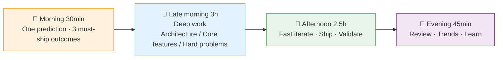

> Before I leave this world, everything is the journey.

Hi, I'm Wu Qingbao — a full-stack developer.

---

##### In one line

**Full-stack code, AI as leverage, judgment as the fulcrum, action as the force.**

---

##### A few things I believe

> The future isn't waited for — it's written, shipped, and iterated into existence.

> Code is the means; the product is the end. If you can't take something from 0 to 1 end-to-end, you don't really own it.

> Ownership isn't a title, it's an attitude: don't wait for assignment, don't pass the blame, see a problem and just fix it.

> Most people die from "tactically hardworking, strategically lazy" — code flying fast, direction all wrong.

> Don't chase the trend. Create it. Others see what's already established; I look for what's about to happen.

> Speed is a startup's lifeline: a working MVP in one week beats six months of polishing a "perfect" thing nobody wants.

---

##### My day

---

##### Personal OS in the AI era

| Dimension | What I do | What AI does |
|:---:|------|------|
| 🧠 **Judgment** | Set direction, make tradeoffs, validate predictions | Scan information, propose alternatives |
| ⚡ **Speed** | Key architecture, core logic, taste | Boilerplate, tests, docs, drafts |
| 🔍 **Insight** | Causal analysis, trend reading, strategy | Data cleaning, anomaly detection, visualization |
| 📚 **Growth** | Deep thinking, connecting knowledge, choosing direction | Learning paths, breaking down hard parts, generating drills |

---

##### Ten daily self-checks

| Ask myself | Standard |
|------|------|
| Am I making judgments today, or just consuming information? | Judgment > Information |
| Did I have a "let me handle it" moment today? | Act > Wait |
| Did I balance speed and quality in today's delivery? | Fast *with* quality |
| Does today's output have a distinct edge? | Reject "good enough" |
| What real problem did I solve today? | Results > Hustle |
| Did I think something today that distances me from consensus? | Be the rare right one |
| Did I make the system faster or more stable today? | Tech is the engine |
| Does today's output deserve the user's trust? | User is trust |
| What new possibility did I create today? | Everyone creates the next wave |
| Am I closer to being a "wind-maker" today? | The few create the future |

---

##### What I'm building

A long-term personal brand driven by **Content · Judgment · Tech · Data**.

| Output | What it actually means |
|:---:|------|
| 📝 Content | Turning thinking and judgment into reusable things |
| 🔭 Judgment | Seeing trends half a step early — then validating them |
| 🛠 Tech | Turning ideas into running systems with code |
| 📊 Data | Calibrating direction with feedback, not guessing |

No trend-chasing. No info-reselling. No "good enough" shipped.

---

> The road ahead is long and has no ending — yet high and low I'll search, with my will unbending.
