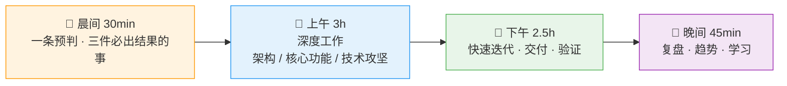

> 离开世界之前，一切都是过程。

Hi，我是吴庆宝，一名全栈开发者。

---

##### 一句话介绍

**全栈写代码：借 AI 为杠杆，凭判断定支点，以行动施全力**

---

##### 我相信的几件事

> 未来不是等来的，是被写出来、跑起来、迭代出来的人做出来的。

> 代码是手段，产品才是目的。能从 0 到 1 把一件事完整跑通，才算真正拥有它。

> 主人翁不是职位，是态度：不等安排，不推责任，看到问题直接动手。

> 大多数人死在"战术勤奋，战略懒惰"——代码写得飞快，方向全是错的。

> 不追热点，造风口。别人看到趋势已经成立，我看到趋势将要发生。

> 速度是创业公司的命脉：一周跑通一个 MVP，胜过半年憋一个没人要的"完美"。

---

##### 我的一天

---

##### AI 时代的个人操作系统

| 维度 | 我做什么 | AI 做什么 |
|:---:|------|------|
| 🧠 **判断** | 定方向、做取舍、验证预判 | 扫描信息、提供备选方案 |
| ⚡ **速度** | 关键架构、核心逻辑、品味把控 | 模板代码、测试、文档、初稿 |
| 🔍 **洞察** | 因果分析、趋势解读、策略决策 | 数据清洗、异常检测、可视化 |
| 📚 **成长** | 深度思考、知识连接、方向选择 | 学习路径、难点拆解、练习生成 |

---

##### 十条自我检验

| 问自己 | 标准 |
|------|------|
| 今天在做判断，还是在消费信息？ | 判断 > 信息 |
| 今天有没有"我来做"的时刻？ | 主动 > 等待 |
| 今天的交付，速度和质量兼顾了吗？ | 有质量的快 |
| 今天的东西，有辨识度吗？ | 拒绝差不多 |
| 今天解决了什么问题？ | 结果 > 辛苦 |
| 今天有没有和共识拉开距离的思考？ | 做少数正确的人 |
| 今天让系统更快更稳了吗？ | 技术是发动机 |
| 今天的产出对得起用户信任吗？ | 用户是信任 |
| 今天创造了什么新可能？ | 人人造风口 |
| 今天离"造风者"更近了吗？ | 少数人创造未来 |

---

##### 在做的事

一个由 **内容 · 判断 · 技术 · 数据** 驱动的长期个人品牌。

| 输出 | 具体做什么 |
|:---:|------|
| 📝 内容 | 把思考和判断写成能复用的东西 |
| 🔭 判断 | 提前半步看见趋势，验证它 |
| 🛠 技术 | 用代码把想法变成能跑的系统 |
| 📊 数据 | 用反馈校准方向，不靠猜 |

---

> 路漫漫其修远兮，吾将上下而求索。
