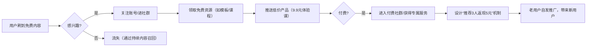

以下是基于“极简、公开渠道、社区与搜索引擎优化、持续输出有趣激励内容”的创业策略，结合“先教后激励、娱乐化、免费吸引-付费转化-自发推广”闭环的落地方案，附具体操作步骤和案例参考：

### **一、核心策略：打造“教育+娱乐+裂变”三角模型**
#### **1. 内容定位：用“有用+有趣”占领用户心智**
- **公式**：  
  **干货（解决问题）+ 娱乐元素（轻松表达）+ 情绪价值（激励感）**  
- **案例**：  
  - **职场类**：用“办公室短剧”形式教Excel技巧（如“用快捷键秒杀同事的10个场景”），结尾加一句激励语“每天进步1%，年底涨薪20%”；  
  - **健身类**：发布“懒人跟练挑战”（每天5分钟+搞笑翻车片段），搭配金句“胖不是你的错，是食物太会诱惑”。

#### **2. 渠道组合：聚焦高流量公开平台**
| **平台类型**   | **内容形式**                | **优化重点**                          | **工具推荐**          |  
|----------------|-----------------------------|---------------------------------------|-----------------------|  
| **搜索引擎**   | 知乎专栏、B站专栏、博客      | 标题含“关键词+痛点”（如“怎么剪视频不卡顿？新手必看”） | 知乎SEO工具、B站标签分析 |  
| **短视频社区** | 抖音、快手、视频号           | 前3秒抓眼球（痛点提问/夸张场景），结尾引导关注 | 剪映（热门BGM库）、轻抖（去水印） |  
| **图文社区**   | 小红书、豆瓣、公众号         | 封面含关键词+情绪词（如“爆肝整理！50个搞钱副业”） | 醒图（封面设计）、135编辑器 |  
| **问答社区**   | 知乎、Quora、百度知道        | 用“案例+步骤”结构化回答，植入产品钩子 | 优采云（批量抓取问题） |  

#### **3. 转化路径：免费→付费→裂变的极简闭环**

### **二、内容生产：极简高效的创作流程**
#### **1. 用“内容模板”批量产出**
- **模板1：痛点解决方案**  
  **结构**：问题描述（+搞笑吐槽）+ 3步解决方案 + 激励金句  
  *例*：“每天加班到10点，颈椎疼到想辞职？教你3个办公室拉伸动作，5分钟缓解酸痛！打工人，别让身体先垮了！”  
- **模板2：挑战型内容**  
  **结构**：发起挑战（如“30天瘦10斤”）+ 每日打卡片段（含失败花絮）+ 阶段性成果  
  *例*：“普通人挑战做自媒体第1天：剪辑3小时，播放量23……但我偏要看看1个月后能做成啥样！”  

#### **2. 借助AI工具提升效率**
- **选题**：用ChatGPT生成“100个用户最关心的问题”（如“输入‘职场新人焦虑’，生成相关痛点”）；  
- **文案**：用Jasper续写脚本，用剪映“图文成片”功能自动生成视频；  
- **数据**：用新榜、飞瓜数据监控热门话题，快速跟进热点（如结合“王心凌男孩”热度，出“中年男人副业指南”）。  

#### **3. 搜索引擎优化（SEO）关键点**
- **标题公式**：**痛点词+解决方案+情绪词**  
  *例*：“不会做PPT？10分钟学会高颜值模板套用，老板看了直呼专业！”  
- **关键词布局**：  
  - 正文前100字重复2次核心关键词（如“副业”“搞钱”）；  
  - 评论区用小号提问：“哪里能领PPT模板？”，大号回复带关键词链接。  

### **三、用户运营：从免费到付费的分层策略**
#### **1. 免费用户：用“轻量互动”建立信任**
- **动作**：  
  - 每天回复50条评论，用“具体建议+表情包”增加亲切感；  
  - 每周在社群发“互动红包”（如“晒出你的学习笔记，抽3人送会员”）。  
- **案例**：某Excel教学账号，在评论区用“=VLOOKUP($A$2,Sheet2!$A:$B,2,0)”直接解决用户问题，转化率比普通内容高3倍。  

#### **2. 付费用户：用“超预期服务”刺激复购**
- **低价产品（9.9-49元）**：  
  - 卖点：“一杯奶茶钱，换一个技能”  
  - 形式：极简课程（3节短视频）+ 专属打卡群 + 每日1条提醒消息  
- **高价产品（199-499元）**：  
  - 卖点：“系统学习+人脉资源”  
  - 形式：月度训练营（直播答疑+1对1作业批改）+ 线下meetup资格  

#### **3. 裂变设计：让用户主动当“分销员”**
- **机制**：  
  - **物质激励**：推荐1人购买返现20%，累计推荐5人升级“合伙人”（额外拿团队分红）；  
  - **荣誉激励**：每周公布“推广排行榜”，榜首送定制化周边（如印logo的笔记本）；  
- **案例**：某英语学习账号推出“邀请3个朋友免费学，你得永久会员”活动，3天新增10万用户，付费转化率达15%。  

### **四、极简工具清单：500元内启动**
| **场景**       | **免费工具**                          | **低价付费工具（月费≤50元）**        |  
|----------------|---------------------------------------|---------------------------------------|  
| 内容创作       | 剪映、Canva、ChatGPT                 | 稿定设计（商用字体，39元/月）         |  
| 社群管理       | 企业微信、腾讯文档                    | 微伴助手（自动回复，49元/月）         |  
| 数据分析       | 新榜、飞瓜数据（基础版免费）          | 蝉妈妈（选品分析，88元/月，可共享账号）|  
| 付费转化       | 微信小商店、淘宝特价版                | 小鹅通（知识付费，480元/年，可试用）  |  

### **五、避坑指南：3个常见误区与解法**
1. **误区1：追求“全平台覆盖”，导致精力分散**  
   - **解法**：先集中运营1-2个平台（如抖音+小红书），摸透规则后再扩展。  
2. **误区2：内容太“正经”，用户看完就走**  
   - **解法**：每5分钟内容加1个“娱乐梗”（如讲副业时穿插“被割韭菜”的翻车经历）。  
3. **误区3：裂变活动设计复杂，用户懒得参与**  
   - **解法**：只用“1步操作”完成裂变（如“转发海报到朋友圈，截图发群里领资源”）。  

### **六、案例参考：1人团队3个月冷启动路径**
- **账号：职场搞钱研究所**  
- **启动步骤**：  
  1. **内容测试**：在小红书发“办公室摸鱼式搞钱”系列（如“用午休时间做PPT代改，月入3000+”），单篇爆文涨粉5000；  
  2. **免费引流**：评论区回复“私信领《搞钱副业清单》”，3天引流2000人到微信；  
  3. **付费转化**：推出9.9元《PPT代改接单指南》，转化率8%，收入1.6万元；  
  4. **裂变爆发**：设计“推荐5人关注，免费得指南”活动，用户自发转发，1周新增1万粉丝，带动二次付费。  

**核心逻辑**：创业无需复杂体系，用“极简内容+精准渠道+人性裂变”即可撬动流量。关键是先开始输出，在与用户的互动中不断调整——哪怕内容粗糙，只要能提供“有用+有趣+激励”的价值，就能吸引第一批种子用户，进而滚雪球式增长。