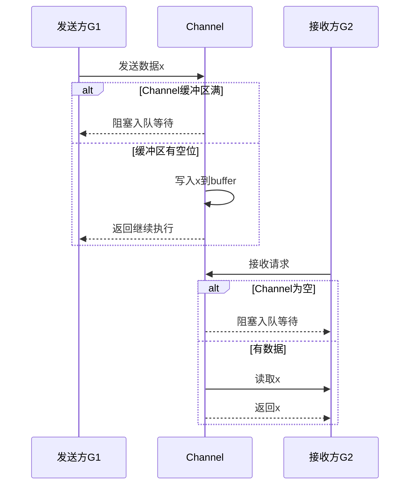

## **摘要**


Golang 以简洁、高效和并发友好著称，成为现代云原生与微服务架构的首选语言之一。随着系统复杂度不断上升，开发者不再满足于“能跑”，而是开始追求极致性能与优雅表达。本文围绕 Go 语言的高级特性与设计原理，系统探讨 goroutine 调度、channel 模型、逃逸分析、内存对齐、泛型、反射等关键能力。结合源码与实践经验，本文试图回答一个问题：**“Go 简洁背后藏了多少狠活？”**


------


## **关键词**


Golang、调度器、GPM 模型、Channel、逃逸分析、反射、泛型、内存布局、高性能编程


------


## **一、引言**


Golang 是门简洁的语言，但它背后隐藏了复杂的调度器、内存管理、类型系统与系统调用机制。如同诗人写诗，初学者写 Go 是在堆句子，高级程序员写 Go 是在推理 CPU 与 runtime 的博弈。


------


## **二、调度器与并发原理**


### **2.1 GPM 模型：一张图解释调度秘密**


Go 的并发模型由三个核心组件构成：


- **G（Goroutine）**：绿色线程，百万并发的基础
- **M（Machine）**：操作系统线程
- **P（Processor）**：调度的执行上下文，决定哪个 G 可以运行


> 一句话解释：G 抢 P，P 挂 M，M 由 OS 派工。


调度器采用 Work Stealing + 全局队列策略，实现调度低延迟和负载均衡（David et al., 2021）。


------


### **2.2 Channel 原理与无锁通信**


Channel 并非单纯的“线程安全队列”，它是 Go runtime 中基于 CSP（通信顺序进程）模型设计的同步机制。


- **缓冲区管理**：基于 ring buffer 实现
- **发送阻塞逻辑**：sender 入队，等待 receiver 唤醒
- **select 实现**：基于 runtime.selectgo 算法构建调度分支图


> “channel 虽小，调度不少。”


------


## **三、逃逸分析与栈优化**


Go 编译器通过逃逸分析（Escape Analysis）决定变量是分配在栈上还是堆上。


- **逃逸到堆**：增加 GC 压力
- **局部分配**：生命周期短，性能更高


示例：

```
func foo() *int {
    a := 10
    return &a // a 逃逸到堆
}
```

调试技巧：

```
go build -gcflags "-m" main.go
```


------


## **四、内存对齐与结构体优化**


结构体字段的排列顺序直接影响内存占用和 cache 命中率。


示例：

```
type Bad struct {
    b bool
    i int64
}

type Good struct {
    i int64
    b bool
}
```

> 编译后对比内存占用，可能差一倍。


Go 的对齐规则基于字段类型的大小决定 padding，建议：


- 字段从大到小排序；
- 使用 unsafe.Sizeof() 检查内存布局；
- 避免嵌套小 struct 导致重复 padding。


------


## **五、泛型（Go 1.18+）的实现机制**


Golang 1.18 引入泛型后，其底层通过 **Dictionary Passing + Shape Analysis** 实现静态类型展开。


- 泛型不是动态 dispatch，而是编译期生成多版本代码；
- 支持类型约束（any、~、接口）；
- 编译后膨胀严重时需权衡可维护性与性能。


```
func Map[T any](arr []T, f func(T) T) []T {
    ...
}
```

> 泛型带来的是“复用能力”，不是“多态魔法”。


------


## **六、反射：性能杀手还是救命工具？**


Go 的 reflect 包允许动态操作任意类型，但性能低下：


- 反射值不具类型信息；
- 依赖 unsafe.Pointer；
- 避免频繁使用反射作为核心数据路径


推荐使用：


- 配置解析
- 动态路由绑定（如 Gin）
- 序列化（如 JSON）


------


## **七、最佳实践与避坑指南**


| **高级技巧**        | **使用建议**                      |
| ------------------- | --------------------------------- |
| Channel select 超时 | 使用 select + time.After 防死锁   |
| sync.Once           | 单例资源初始化安全方式            |
| unsafe.Pointer      | 除非万不得已，否则不要碰          |
| go:noescape         | 与 C 交互时防止堆栈混乱           |
| Benchmarking        | 使用 go test -bench=. -benchmem   |
| context.Context     | 所有 goroutine 的终止信号传递标准 |


------


## **八、结语：掌握语言背后的 runtime 思维**


Golang 的设计追求“简洁不是删繁就简，而是藏巧于拙”。本文回顾了其调度系统、并发原理、内存分配、泛型实现等多个高级话题，希望开发者不仅能写出跑得快的代码，更能理解“为什么它这样跑”。


> 用 Go 写程序，像舞者练拳 —— 轻灵背后是力量。


------


## **参考文献**


1. Pike, R., Griesemer, R., & Thompson, K. (2009). *The Go Programming Language Specification*.
2. David Chase, Austin Clements. (2021). *Inside the Go Scheduler*. Google I/O Tech Talk.
3. Russell, J. (2022). *Go Generics Under the Hood*. GopherCon EU.
4. Golang 官方博客. (2023). *Understanding Escape Analysis in Go*.
5. Uber Engineering. (2020). *Go Performance Patterns: Memory, Channels, and Benchmarking*.


------


```mermaid
graph TD
    G1[Goroutine 1]
    G2[Goroutine 2]
    G3[Goroutine 3]
    G4[Goroutine 4]
    subgraph 全局运行队列
        G1 --> P1
        G2 --> P2
    end

    subgraph Processor (P)
        P1 --> M1
        P2 --> M2
    end

    G3 -->|Work Stealing| P1
    G4 -->|Work Stealing| P2

    M1(Machine 1 [OS Thread])
    M2(Machine 2 [OS Thread])

    M1 -->|执行| CPU1
    M2 -->|执行| CPU2
```





## **🧵 二、GPM 调度模型 —— “Goroutine 的幕后调度剧组”**


### **🎯 通俗解释：**


在 Go 中，当你 go 一个函数，其实是安排它作为「G」：**Goroutine**

但它不是立刻执行，它得找个「执行员」来帮它跑。


调度过程：


- G（你开的活）
- P（任务板，安排这些活）
- M（真正干活的工人）


### **🧠 类比：**


- G 是排队的外卖单
- P 是店长排班表
- M 是骑手在执行任务


### **📦 示例代码：**


```
func work(id int) {
    fmt.Printf("Worker %d is running\n", id)
    time.Sleep(time.Second)
}

func main() {
    for i := 0; i < 5; i++ {
        go work(i)
    }
    time.Sleep(2 * time.Second) // 等 goroutine 执行完
}
```

输出（无序）：

```
Worker 3 is running
Worker 0 is running
Worker 1 is running
...
```

这些 go work(i) 全都塞到调度器，由 GPM 模型决定谁先执行。


------


## **📮 三、Channel 通信 —— “Goroutine 之间的快递小哥”**


### **🎯 通俗解释：**


Channel 是 Go 提供的 **线程安全通信工具**，你可以往里面“寄信”，别人从里面“收信”。


支持两种方式：


- 有缓冲：信箱可以先放几封信
- 无缓冲：必须“面对面”交接


### **📦 示例代码：**


```
func sender(ch chan string) {
    ch <- "Hello"
    fmt.Println("Sent message")
}

func receiver(ch chan string) {
    msg := <-ch
    fmt.Println("Received:", msg)
}

func main() {
    ch := make(chan string) // 无缓冲通道
    go sender(ch)
    go receiver(ch)
    time.Sleep(time.Second)
}
```

输出：

```
Received: Hello
Sent message
```

🔄 注意：如果 receiver 没准备好接收，sender 会卡住！这就是「阻塞」原理。


------


## **🏃‍♂️ 四、逃逸分析 —— “变量到底分配在堆上还是栈上？”**


### **🎯 通俗解释：**


Go 编译器会判断变量到底「活」在哪儿：


- 在函数内部创建、使用完就没了 ➜ 放栈
- 拿到外面去了 ➜ 逃逸到堆（堆会被 GC）


### **📦 示例代码：**


```
func foo() *int {
    a := 10
    return &a // 变量 a 逃逸到堆
}
```


### **🔍 怎么看它有没有逃逸？**


```
go run -gcflags="-m" main.go
```

输出：

```
... can’t inline foo: non-leaf function
... main.foo a does escape to heap
```

🌟 写高性能程序时，减少“逃逸”，能少触发 GC，提升性能！


------


## **🧊 五、内存对齐 —— “字段顺序不对，内存浪费一大堆”**


### **🎯 通俗解释：**


Go 为了性能（CPU对齐），会在结构体字段之间 **加 padding（空字节）**

字段顺序如果不合理，会造成浪费。


### **📦 示例代码：**


```
type Bad struct {
    b bool
    i int64
}

type Good struct {
    i int64
    b bool
}

func main() {
    fmt.Println(unsafe.Sizeof(Bad{}))  // 输出 16
    fmt.Println(unsafe.Sizeof(Good{})) // 输出 9（但对齐后是16）
}
```

**建议**：结构体从大到小排字段，减少 padding。


------


## **🧬 六、泛型 —— “类型通用，不再复制粘贴”**


Go 从 1.18 起引入 **泛型（Generics）**，你可以写一次函数，多种类型复用。


### **📦 示例代码：**


```
func Map[T any](list []T, f func(T) T) []T {
    var result []T
    for _, v := range list {
        result = append(result, f(v))
    }
    return result
}

func main() {
    nums := []int{1, 2, 3}
    doubled := Map(nums, func(n int) int { return n * 2 })
    fmt.Println(doubled) // [2 4 6]
}
```

🎯 泛型优势：


- 少写重复代码
- 编译期展开，多版本，不影响性能


------


## **🪞 七、反射 —— “运行时黑魔法，但别乱用”**


### **🎯 通俗解释：**


反射 = 运行时查看/修改对象的类型和值，像 Python 的 type()、getattr()。


但反射：


- 慢（大量 interface{} + unsafe）
- 不安全（类型不检查）
- 用起来不香（写起来超啰嗦）


### **📦 示例代码：**


```
func printFields(i interface{}) {
    val := reflect.ValueOf(i)
    for i := 0; i < val.NumField(); i++ {
        fmt.Println("Field", i, "=", val.Field(i))
    }
}

type User struct {
    Name string
    Age  int
}

func main() {
    u := User{"Jay", 42}
    printFields(u)
}
```

输出：

```
Field 0 = Jay
Field 1 = 42
```

> 反射适合“不能提前知道类型”的场景：如 JSON 解析、ORM 框架、路由参数绑定。


------


## **✅ 总结一句话理解：**


| **技术点**   | **本质解释一行话**                     |
| ------------ | -------------------------------------- |
| GPM 调度器   | Goroutine 都要抢 P，P 决定派谁跑       |
| Channel 通信 | Goroutine 之间的“邮差+信箱”            |
| 逃逸分析     | 会不会从局部变量逃出去，影响性能       |
| 内存对齐     | 字段排得不对，内存浪费一大截           |
| 泛型         | 写一次，多种类型通用，不用再 copy 函数 |
| 反射         | 能改任何值，但代价是性能和可读性       |


