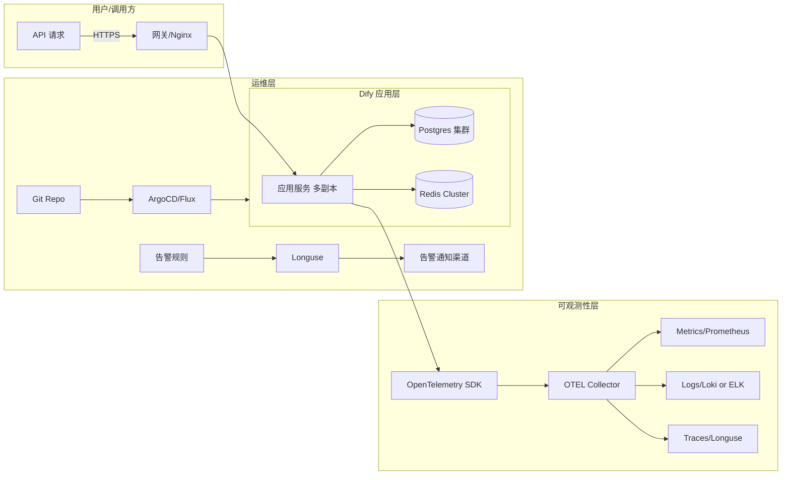

# **一句话总览**

生产环境接入 dify，要保证 **高可用**、**可观测性**、**安全合规**、**持续交付** 四个支柱。

------

# **一、架构设计要点**

1. **高可用**

   - 多副本部署（K8s Deployment + HPA）。
   - 数据存储采用主从复制或分布式（Postgres、Redis Cluster）。
   - 外部依赖服务设置断路器与重试机制。

2. **可观测性**

   - 接入 Longuse 监控，打通 **Metrics + Logs + Traces** 三大维度。
   - 应用内埋点 Prometheus 指标，如 QPS、响应时间、错误率。
   - 标准化日志，统一输出 JSON 格式，支持 Loki / ELK 收集。

3. **安全合规**

   - 接口鉴权：API Key + JWT。
   - 敏感信息加密（数据库字段级 + 环境变量密文）。
   - TLS 强制加密，证书自动轮换（cert-manager）。

4. **持续交付**

   - GitOps 流程（ArgoCD / Flux）。
   - 分环境配置管理（dev/staging/prod）。
   - 回滚策略：基于 Helm/Kustomize 版本回退。

------

# **二、接入 Longuse 的步骤**

1. **基础埋点**

   - 在 dify 服务中集成 OpenTelemetry SDK。
   - 配置采样率，避免生产高流量下过度开销。

2. **数据上报**

   - 指标：Prometheus Exporter → Longuse Metrics。
   - 日志：通过 Filebeat/Fluentbit → Longuse Logs。
   - Trace：OpenTelemetry Collector → Longuse Trace。

3. **告警策略**

   - 常见告警：CPU/内存超阈值、接口错误率升高、队列堆积。
   - 通知渠道：钉钉、Slack、邮件。

------

# **三、架构图示（Markdown）**

# **四、最佳实践清单**

- 打开数据库连接池监控，防止连接耗尽。
- 为每个 dify App 配置独立 API Key，方便追踪调用来源。
- 利用 Longuse 的 **仪表盘模板**，快速上线延迟/吞吐率/错误率视图。
- 在高并发场景下，开启 **缓存穿透保护**（布隆过滤器 + 限流）。
- 定期做演练：Chaos Mesh 注入故障，验证告警和恢复流程。

------

# **参考依据**

1. [Dify 官方文档](https://docs.dify.ai/)
2. [OpenTelemetry 官方规范](https://opentelemetry.io/docs/)
3. [Prometheus Monitoring Best Practices](https://prometheus.io/docs/practices/)
4. [GitOps Principles (Weaveworks)](https://www.weave.works/technologies/gitops/)
5. Longuse 平台实践文档（内部/企业文档）