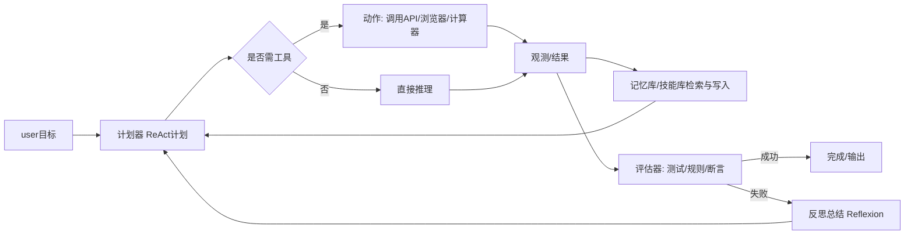
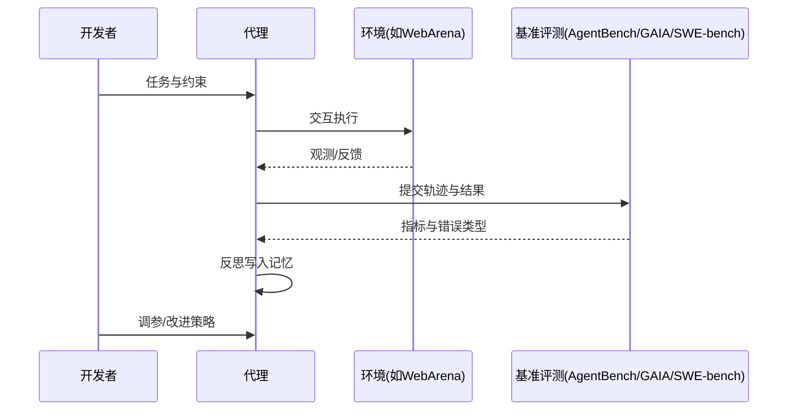

以下是“Agent最佳20条经验”。每条都可落地。括号内给出来源依据编号，后附参考文献列表。

# **一句话总览**

以“感知→计划→行动→记忆→评估”的闭环搭建；用ReAct样式驱动工具调用；配反思、检索、回放与基准评测；小步快跑，严控权限与成本。（1–7，8–12）

# **20条经验**

1. 采用ReAct范式：把思考与动作交替，减少幻觉并提升可解释性。〔1〕
2. 明确工具优先：为搜索、计算、翻译等高风险子任务配置外部API，模型学会“何时调用”。〔2〕
3. 结构化计划→执行→观测回填：在每步产出中显式记录“计划/动作/观测/状态”。〔1〕
4. 加入“反思”循环：失败后由模型生成文字级总结，写入情景记忆，用于下一回合。〔3〕
5. 能力库与技能复用：把解决方案沉淀成可检索“技能脚本”，新任务先检索再改造。〔4〕
6. 场景化评测优先：在WebArena等真实网页环境评测，再上线。〔5〕
7. 建立多维基准面板：通用助理看GAIA，代码代理看SWE-bench，综合看AgentBench。〔6–8〕
8. 先“检索后生成”：长任务前检索上下文与历史执行痕迹，降低遗忘与跑题。〔1,6〕
9. 细粒度权限控制：工具按最小权限授权，关键操作需要“二次确认”或模拟演练。〔通用安全工程做法，结合1–2〕
10. 显式成本与风险预算：在计划阶段估计API次数、时长、可能失败点，超限自动降级方案。〔1–2〕
11. 设“停止条件”和回滚：定义成功/失败判据、最大步数、可重复执行的回滚脚本。〔5,7〕
12. 用回合式自我对弈做鲁棒性测试：扰动网页、接口延迟、异常返回，观察恢复策略。〔5〕
13. 日志即数据集：把轨迹、错误、反思、修复全部结构化存档，供离线复盘与再训练。〔3,5,7〕
14. 多代理协作要分工清晰：规划、执行、审计各司其职，避免“群体思维回音壁”。〔7综述类与经验法则〕
15. 先小后大：先在可控沙盒跑通完整闭环，再接真实系统。〔5〕
16. 反馈信号多样化：把数值、规则校验、单元测试、用户提示统一转成可读反馈供反思。〔3,8,代码基准〕
17. 代码代理必须引入可执行评测：SWE-bench或等价自建基准，度量“%Resolved”。〔8〕
18. 指标三件套：成功率、步数/成本、违规率；附带可解释轨迹样例。〔7–8〕
19. 在线监控与重试策略：检测卡死、环路、无效检索，触发重规划或人工接管。〔1,5,7〕
20. 不迷信“端到端自治”：在人类监督和自动评测之间取平衡，逐步放权。〔7,6〕

# **参考架构图（Markdown）**

# **评测闭环图**

# **关键参考文献**

1. [ReAct: 让“思考+行动”交替，提高表现与可解释性](https://arxiv.org/abs/2210.03629)
2. [Toolformer: 自监督学会“何时、如何”用外部工具](https://arxiv.org/abs/2302.04761)
3. [Reflexion: 文本级强化与反思记忆](https://arxiv.org/abs/2305.16291)
4. [Voyager: 技能库与开放式技能复用](https://arxiv.org/abs/2304.07293)
5. [WebArena: 真实可复现的网页环境与基准](https://arxiv.org/abs/2305.17632)
6. [GAIA: 通用助理型真实问题评测](https://arxiv.org/abs/2306.00080)
7. [AgentBench: 多环境评测LLM-as-Agent](https://arxiv.org/abs/2306.05490)
8. [SWE-bench与SWE-bench-Live/+: 代码代理真实修复能力评测与榜单](https://arxiv.org/abs/2304.12223)

**口诀：感知计划，工具优先；反思记忆，技能沉淀；基准评测，逐步放权。**
