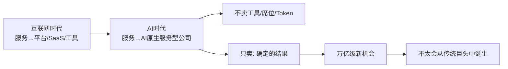
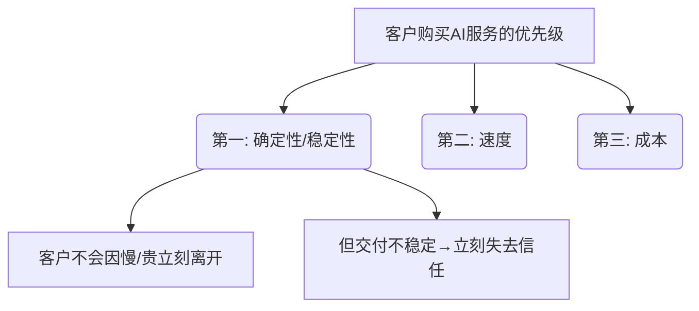
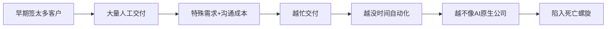

# YC合伙人：AI原生服务型公司是万亿级机会

> YC合伙人Charlie Warren的11分钟分享核心观点：AI创业的下一波，不一定是软件型公司。**服务业可能会重新长出一批超级公司**，他们不卖工具、不卖席位、不卖Token，只卖一个东西——**确定的结果**。

## 一、核心趋势判断

**核心论断**：未来十年将诞生一个全新的万亿级美元机会，且不太会从传统巨头中诞生。

## 二、五大核心观点

| # | 观点 | 关键词 | 核心逻辑 |
|---|------|--------|----------|
| 1 | AI下一波是**服务型公司**，而非软件型公司 | 服务规模化 | 不卖报税系统→交付报税结果；不卖法律工具→交付法律流程和合规结果 |
| 2 | AI服务公司最大敌人是**交付不稳定** | 确定性 | 客户买的不是模型能力，而是**可预测、可复用**的确定性结果 |
| 3 | 必须通过**Sam Altman测试** | 顺势 vs 被套壳 | 模型升级→你更强？还是客户直接绕过你？ |
| 4 | 早期客户太多反而会**死掉** | 需求陷阱 | 越有客户→越忙交付→越没时间自动化→越不像AI原生公司 |
| 5 | 产品不是交互系统，而是**运营系统** | AI服务工厂 | 管理交付周期、吞吐量、任务分配、人机协同、质量控制 |

## 三、观点深度拆解

### 观点1：从"工具化"到"服务规模化"

| 维度 | 传统SaaS模式 | AI服务型公司 |
|------|-------------|-------------|
| 交付物 | 工具/软件/系统 | 完整的结果/流程 |
| 商业模式 | 卖席位、卖订阅 | 卖结果、卖确定性 |
| 客户角色 | 客户自己使用工具 | 客户直接接收结果 |
| 典型案例 | 报税系统 | 直接交付完整报税结果 |
| 典型案例 | 法律SaaS | 直接交付法律文件+合规流程 |
| 典型案例 | 保险系统 | 直接处理保险理赔全流程 |

### 观点2：确定性 > 速度 > 成本

> **关键洞察**：很多人以为AI创业比的是模型能力、速度和成本，但在真实服务场景里，客户首先买的是**确定性**。

### 观点3：Sam Altman测试

| 测试结果 | 判断 | 结局 |
|----------|------|------|
| 模型升级 → 你更强、更便宜、更高毛利 | ✅ 顺势而为 | 真正的AI原生服务公司 |
| 模型升级 → 客户直接绕过你 | ❌ 暂时吃红利 | 套壳AI工具公司 |

### 观点4：早期需求陷阱

> **正确做法**：把早期客户当做**打磨验证规模化服务能力的样本**，而非追求数量。

### 观点5：产品 = 运营系统

在AI原生服务公司中，产品不再是传统的 App 或 API，而是一整套运营系统，需要管理：

- 📋 **交付周期管理** — 从接单到交付的全流程
- 📊 **吞吐量控制** — 系统能处理的最大并发量
- 👥 **任务分配** — 人机协同的任务路由
- 🤝 **人机协同** — AI与人的边界与协作机制
- ✅ **质量控制** — 确保每次交付的一致性

## 四、总结

**一句话总结**：AI时代最大的机会不是做一个工具，而是**用AI重做一门生意**。过去互联网让服务变成了平台、SaaS或工具，而AI时代，**服务业将重新长出一批超级公司**。
