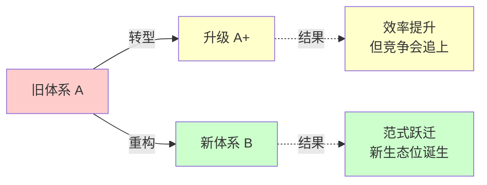
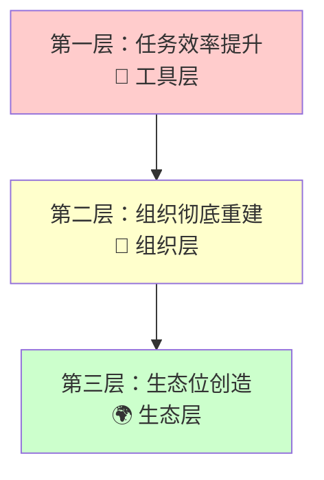

# 企业AI转型的误区：为何需要"重构"而非"升级"？

> 核心观点：企业所谓的"AI转型"大多是伪命题。真正的变革不是在原有基础上升级（转型），而是从零开始的彻底重构。通过"集装箱改变世界"的历史案例，揭示了企业面对颠覆性技术时必须跨越的**三个认知层次**。

---

## 核心概念辨析：转型 vs 重构

| 概念 | 本质 | 比喻 |
|------|------|------|
| **转型** (Transformation) | 在原有基础上升级，A → A+ | 🏚️ 改造旧房子 |
| **重构** (Reconstruction) | 从零开始创造，A 消失，B 诞生 | 🏗️ 在空地盖新房子 |

---

## 历史的启示：集装箱的三层变革

视频以"集装箱"这一颠覆性发明为例，剖析了技术变革如何从**工具层面**逐步深入到**组织层面**和**生态层面**，最终重塑整个行业格局。

### 第一层：任务效率提升 🔧

> 最表层的应用——用新技术直接提升**现有任务**的效率。

- **集装箱类比**：在原有散货码头旁，简单地增加几个集装箱装卸位
- **AI 应用**：员工用 AI 写邮件、做 PPT，效率确实提高了

> 陷阱：这只是"提效"，而非"增收"。竞争对手会迅速跟进，客户会将你省下的成本视为新的价格基准，**最终利润空间并未扩大**。

### 第二层：组织彻底重建 🏢

> 技术的真正威力在于它要求一套**全新的组织方式**，而这往往与旧体系的"历史包袱"格格不入。

- **集装箱类比**：
  - 需要全新的堆场、铁路、公路、电子追踪系统
  - 工人合同和工会结构需要重签
- **历史教训**：旧港口（如纽约港）因利益集团和历史包袱太重而无法变革，最终被新建的、没有历史包袱的港口（如伊丽莎白港）取代

> 关键洞察：真正的升级不是在原地改造，而是在旁边的"沼泽地"里**盖一个全新的**。

### 第三层：生态位的创造 🌍

> 当技术将某个领域的摩擦成本降至极低时，会催生出以前**根本不存在**的全新商业位置。

- **集装箱类比**：货物转运的摩擦成本从"极高"降至"极低"→ 新角色出现：**纯做转运的枢纽港**
- **新加坡港案例**：放弃传统货物装卸，转而成为全球集装箱的"调度中心"
  - 如今 **85%** 的集装箱只是在此换船
  - 却为新加坡带来了巨大的财富

> 总结：这才是技术变革最深层、**最具颠覆性**的影响。

---

## 三层变革对比总览

| 层次 | 关注点 | 集装箱案例 | AI 对应场景 | 结果 |
|:---:|:---:|---|---|---|
| **① 效率** | 工具 | 码头加几个集装箱位 | AI 写邮件、做 PPT | 提效 ≠ 增收 ⚠️ |
| **② 组织** | 结构 | 新建伊丽莎白港 | 重建流程/团队/考核 | 跨越历史包袱 💡 |
| **③ 生态** | 定位 | 新加坡枢纽港 | 发现 AI 催生的新角色 | 范式跃迁 🌍 |

---

## AI时代的终极拷问

回到 AI，我们不应只停留在用它提升现有任务的效率。**真正的问题是：**

1. ❓ **AI 把什么摩擦降到了 0？**
2. ❓ **降到 0 之后，会涌现出什么以前不存在的位置？**

这才是企业在 AI 时代，真正应该思考的问题。

---

## 一句话带走

> 企业面对 AI，不应只满足于"改房子"式的效率提升。真正的机会在于进行"盖新房子"式的彻底重构。

这不仅是技术问题，更是**认知问题**。只有跳出原有框架，思考 AI 能创造哪些全新的商业生态位，才能在未来的竞争中占据先机。
