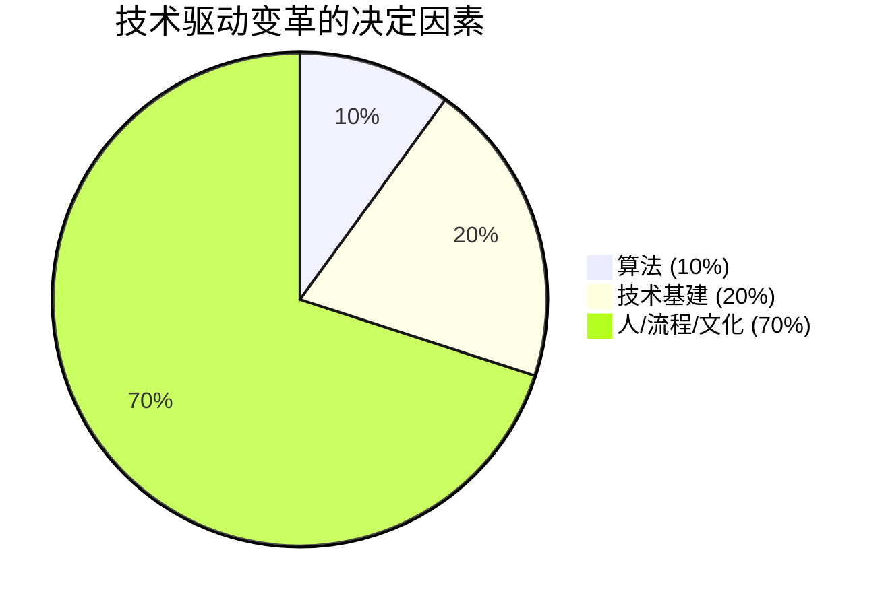
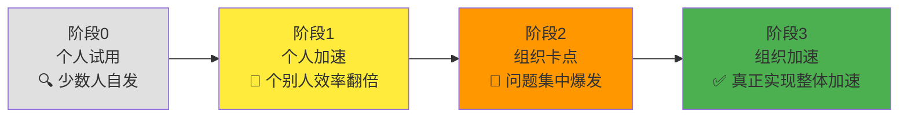
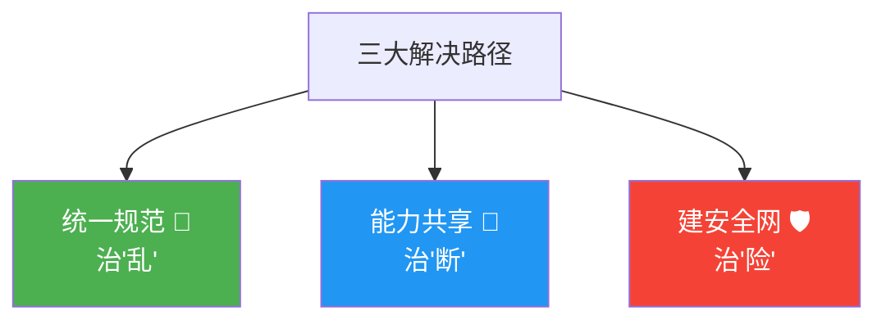
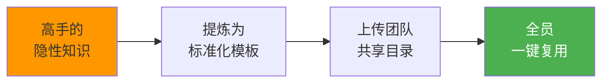
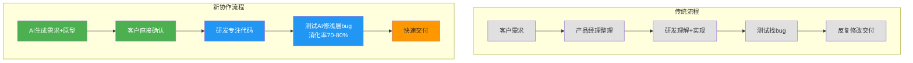

# Qoder 在中小团队中的 AI Coding 实践

> 一句话总结：会用工具 ≠ 个人提效，个人提效 ≠ 组织提效。真正的团队 AI 落地需要**统一规范** + **能力共享** + **安全网**三管齐下，最终实现**协作链路重构**。

---

## 一、背景与认知：个人提效 → 组织进化的鸿沟

### 生产力悖论

团队引入 AI Coding 工具后，发现了一个矛盾现象：

> **AI 降低了编码编辑成本**，但**理解、审查、测试协同的成本未降**。
> 研发瓶颈从"编码"转移到了"协同"。

**常见症状：**

| 症状 | 表现 |
|:---:|---|
| 🔥 维护成本激增 | AI 生成风格迥异，代码难以统一 |
| 👤 关键人才依赖 | 会用的人很强，不会用的人跟不上 |
| 🎲 上线开盲盒 | 代码质量波动，风险不可控 |
| 🐢 上线速度变慢 | 审查堆积，反而比不用还慢 |

### BCG 1270 法则



> 结论：组织层面的调整才是关键，工具只是 10%。

---

## 二、团队 AI 使用的四阶段模型



| 阶段 | 名称 | 特征 | 关键信号 |
|:---:|:---:|---|---|
| 0 | 🔍 **个人试用** | 少数好奇同事自发使用，公司无动作 | "有人在用，但没感觉" |
| 1 | 🚀 **个人加速** | 个别使用者效率翻倍，团队速度/质量参差 | "快的人更快，慢的人更慢" |
| 2 | 🚧 **组织卡点** | 代码审查堆积、质量波动、关键人才依赖 | "代码不敢合，不敢上" |
| 3 | ✅ **组织加速** | 规范/能力共享/安全网搭建完成 | "人人可复用，整体提速" |

> 关键洞察：大多数团队卡在**阶段 2**——不是工具不够好，而是**组织能力没跟上**。

---

## 三、三大解决路径：治乱·治断·治险



### 1. 统一规范 🔧 —— 治"乱"

> AI 本身"很单纯"，若不明确团队规矩，会生成风格迥异的代码。

**核心思路**：将团队规矩 → 转化为 AI 可读懂的配置文件（`rules` 文件）→ 随 Git 提交生效。

**实操步骤：**

```
Qoder 分析项目规范并按模块拆分
    ↓
自动归类生成 rules 文件
    ↓
设置为模型决策触发形式 + 编写触发场景
    ↓
随 Git 提交生效
```

| 问题场景 | 解决方案 |
|:---:|---|
| 多套数据请求封装方案并存 | 拆分模块，让成员梳理技术规范 |
| 规范停留在口头 | 转为 AI 可读取的配置文件 |
| AI 生成的代码不统一 | rules 文件与代码一同上传 Git |

### 2. 能力共享 🔄 —— 治"断"

> 高手请假，项目停摆——隐性知识没有沉淀。

**拆解"用得好"的本质：**

| 能力维度 | 含义 | 沉淀方式 |
|:---:|---|---|
| 📝 **描述能力** | 将需求拆解为 AI 可理解的指令 | 提炼为模板 |
| 🔁 **工作流能力** | 标准化操作流程 | 规范化后放入团队目录 |

**案例：** H5 新项目搭建 → 用 Qoder 提炼成熟项目基础架构 → 生成技能/智能体 → 上传仓库 → 全员一键复用。



### 3. 建安全网 🛡️ —— 治"险"

> AI 可能忽视安全合规（明文写 API KEY、接口无参数校验）。

**三层防护网：**

| 阶段 | 措施 | 目标 |
|:---:|:---:|---|
| **开发前** | 规范中明确高风险操作 | 限制 AI 操作边界 |
| **开发中** | 自动化安全扫描 | 实时检测生成的代码 |
| **开发后** | 自动化质量门禁 | 高风险变更需人工确认 |

> 效果：解放审查精力，让团队**聚焦业务逻辑审查**，提升整体效率。

---

## 四、组织变革：协作链路重构

AI 的价值不仅是让现有流程更快，更是**重构产、研、测协作链路**的机会。

### 传统流程 vs 新协作流程



### 新流程角色变化

| 角色 | 传统做法 | AI 赋能后 |
|:---:|:---:|---|
| 👨‍💼 **产品经理** | 写 PRD → 反复沟通 | AI 生成结构化需求 + 可交互原型，直接与客户确认 |
| 👨‍💻 **研发** | 理解需求 → 写代码 → 改需求 | 专注代码实现 + 完善规范 + 制作通用技能 |
| 🧪 **测试** | 找 bug → 提单 → 等修复 | AI 辅助修 bug，浅层 UI/交互 bug **当场消化** |

> 效果：整体效率提升 **3-5 倍**，从需求到交付的链路被大幅压缩。Bug 消化率 **70%-80%**，测试环节即可闭环浅层问题。

---

## 五、核心感悟与行动建议

> **工具只是起点**——围绕工具建立的**规范**、**共享机制**、**安全底线**，才是让 AI 在团队落地的关键。

**行动建议：** 主动承接公司 AI 化诉求，在**核心业务场景**中跑通 AI 应用，助力企业完成 AI 转型——这才是真实价值。
