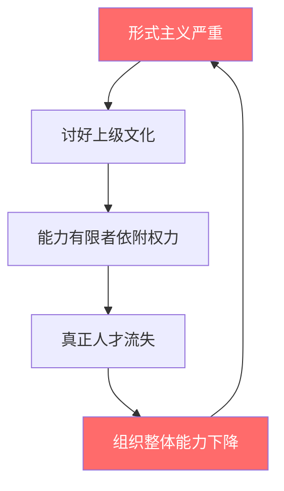
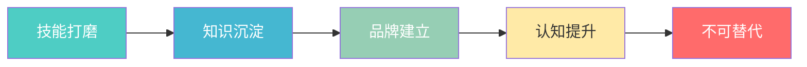

# 人才 vs 官僚：如何判断一家公司的真实面貌

## 核心结论

> **观察员工是追逐「能力价值」还是「权力地位」，即可判断一家公司的真实面貌。**

---

## 两种文化对比

| 维度 | 人才驱动型公司 | 官僚主义型公司 |
|------|:---:|:---:|
| **核心追求** | 能力价值 | 权力地位 |
| **行为特征** | 主动创新、敢于挑战 | 唯唯诺诺、讨好上级 |
| **成长路径** | 技能提升 → 不可替代 | 依附领导 → 获得关照 |
| **员工状态** | 独立、自信、有底气 | 焦虑、依赖、缺乏安全感 |
| **决策依据** | 数据与逻辑 | 层级与关系 |
| **最终结果** | 个人品牌 × 不可替代 | 权力游戏 × 形式主义 |

---

## 官僚主义的典型症状

**恶性循环：** 形式主义 → 讨好文化 → 依附权力 → 人才流失 → 能力下降 → 更严重的形式主义

---

## 破局之道：打造不可替代的自己

### 行动指南

| 序号 | 行动 | 具体做法 | 预期成果 |
|:---:|------|----------|----------|
| 1 | **打磨不可替代的技能** | 深耕专业领域，成为某方面的专家 | 核心竞争力 |
| 2 | **沉淀知识资产** | 整理输出、建立知识体系 | 可复用的方法论 |
| 3 | **建立个人品牌** | 公开分享、写作、演讲 | 行业影响力 |
| 4 | **提升认知维度** | 跨领域学习、深度思考 | 战略眼光与格局 |

### 成长路径图

---

## 核心底气

> **职场最大的底气从来不来自于你「认识谁」，而是来自于你「是谁」。**

与其在别人的棋局里当一枚唯唯诺诺的棋子，不如做自己人生的棋手。
