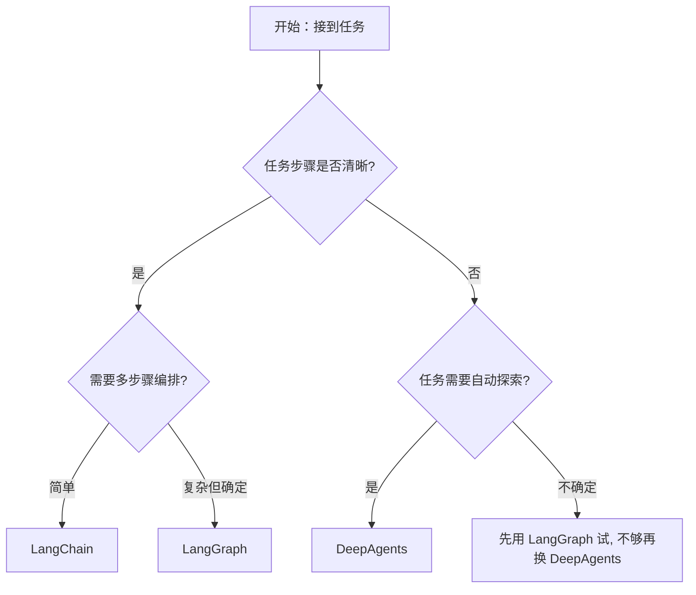

# DeepAgents 核心原理与适用场景

> 本文深入剖析了 AI 智能体框架 DeepAgents 的核心原理与适用场景。重点解答：传统智能体为何在复杂任务中"变笨"？DeepAgents 如何解决这一问题？什么场景下该用它？

---

## 1. 传统智能体的"记忆过载"问题

当智能体执行复杂任务时，**上下文窗口**会不断累积以下信息：

| 累积内容 | 说明 | 影响 |
|---------|------|------|
| 任务描述 | 初始指令与目标设定 | 占用基础 TOKEN |
| 工具调用结果 | 搜索、API、代码执行返回 | 数据量大，增长快 |
| 历史对话 | 多轮交互记录 | 持续膨胀 |

```
┌─────────────────────────────────────────┐
│            上下文窗口 (Token 上限)        │
├─────────────────────────────────────────┤
│  任务描述 │ 工具结果 │ 对话历史 │ 新任务  │
│  ████     │ ████████ │ ████████ │ ██    │
├─────────────────────────────────────────┤
│  → Token 耗尽 → 推理质量断崖式下跌 → 变笨 │
└─────────────────────────────────────────┘
```

**核心矛盾**：上下文窗口有限 vs 复杂任务需要大量中间信息。

---

## 2. DeepAgents 的核心思路：多智能体协作

### 解决路径

```
                    ┌──────────────┐
                    │   主智能体    │
                    │ (保持清晰推理) │
                    └──────┬───────┘
                           │ 任务拆解
              ┌────────────┼────────────┐
              ▼            ▼            ▼
        ┌──────────┐ ┌──────────┐ ┌──────────┐
        │ 搜索Agent│ │ 分析Agent│ │ 代码Agent│
        └────┬─────┘ └────┬─────┘ └────┬─────┘
             │            │            │
        ┌────▼─────┐ ┌────▼─────┐ ┌────▼─────┐
        │ 独立上下文│ │ 独立上下文│ │ 独立上下文│
        │ 窗口     │ │ 窗口     │ │ 窗口     │
        └────┬─────┘ └────┬─────┘ └────┬─────┘
             │            │            │
             └────────────┼────────────┘
                          ▼
                   ┌──────────────┐
                   │  精简结论汇总  │
                   │ (返回主智能体) │
                   └──────────────┘
```

### 关键优势

| 传统单智能体 | DeepAgents 多智能体 |
|-------------|-------------------|
| 所有信息堆积在同一上下文 | 每个子智能体拥有**独立上下文窗口** |
| 中间过程持续膨胀主窗口 | 中间过程隔离在子智能体内部 |
| Token 耗尽 → 推理崩溃 | 主智能体始终接收**精简结论**，保持稳定 |

---

## 3. 关键内置功能与技术对比

DeepAgents 在 LangChain 基础上封装了以下功能：

| 功能 | 说明 | 解决的问题 |
|------|------|-----------|
| 🔄 **自动化规划** | 根据目标自动生成任务流程图 | 无需手动编排工作流 |
| 📝 **上下文摘要** | 对话过长时自动摘要 | 减少 TOKEN 消耗，防止记忆过载 |
| 📁 **虚拟文件系统** | 提供会话数据存储与管理 | 方便持久化中间状态 |

---

## 4. 性能与适用场景分析

### 成本对比

```
Token 消耗倍数（相对基准）

LangGraph:  ████              1x
LangChain:  █████             1.5x
DeepAgents: ████████████████████████████████  20x+
```

### 场景选择指南

| 任务类型 | 推荐框架 | 原因 |
|---------|---------|------|
| 🔧 **确定性工作流** | LangChain / LangGraph | 步骤清晰、可控、成本低 |
| 🔍 **开放式探索** | DeepAgents | 需要自动规划和多智能体协作 |
| 📊 **中等复杂度** | LangGraph | 平衡灵活性与成本 |
| 🤖 **高度不确定任务** | DeepAgents | 自适应能力强，能处理未知路径 |

### 一句话总结

> **DeepAgents 用 20 倍 TOKEN 换来了自动化与多智能体协作的能力**——适合复杂探索型任务，但不应用于步骤明确的简单流程。

---

## 5. 决策流程图


