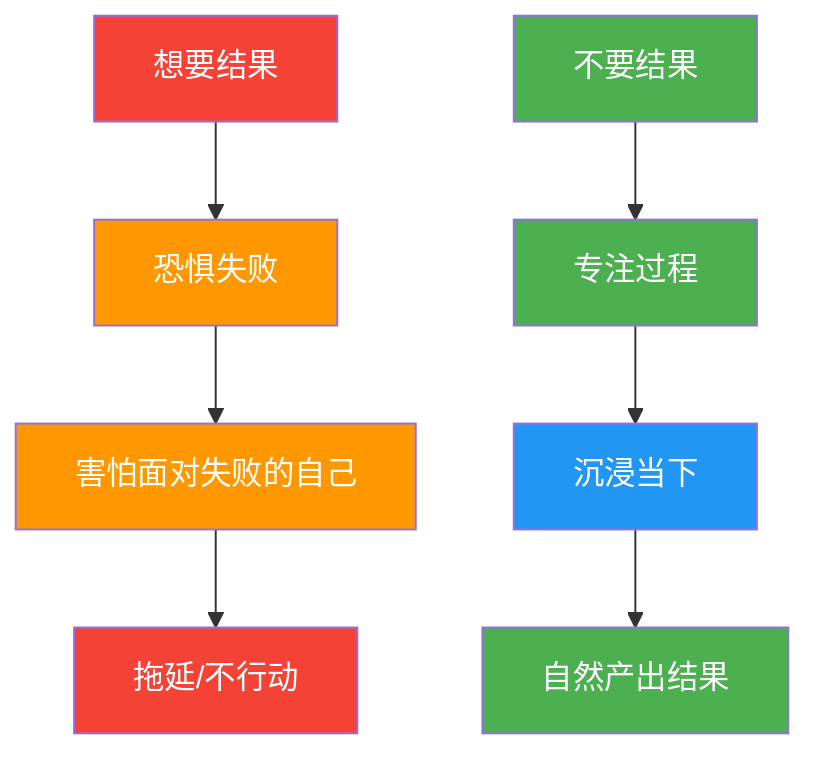

# 执行力的真相：不要结果

## 核心观点

> **提高执行力的方法只有四个字：不要结果。**

这是朋友告诉我的，他执行力特别强。大多数人做不成事不是因为懒，而是因为**太想要结果了**。

## 心理机制



## 两种心态对比

| 维度 | 盯结果型 ❌ | 重过程型 ✅ |
|------|-----------|-----------|
| **关注点** | 三个月后、半年后的结果 | 今天该做的事做了没有 |
| **心理感受** | 每一步都觉得太慢，越走越焦虑 | 沉浸于眼前的事 |
| **行为倾向** | 最终停下来 | 做着做着结果自己出来了 |
| **驱动力** | 对结果的恐惧 | 安心 |
| **最终状态** | 永远不会开始 | 永远不会失败 |

## 关键洞察

1. **拖延的本质是恐惧**：表面看是拖延，其实是害怕面对可能失败的自己
2. **结果焦虑阻碍行动**：一件事还没开始，先想"万一不好怎么办"、"万一时间白花了怎么办"
3. **关注过程，结果自然到来**：真正能做成的人从不盯着结果看
4. **安心 > 结果**：需要的不是结果，而是安心；安心只来自于四个字——**沉浸过程**
5. **只要不放弃，就永远不失败**：只要还在面对，还在做事，就不会失败

## 记忆口诀：`放-浸-安`

```
放(下结果) → 浸(入过程) → 安(心做事)
    ↓              ↓              ↓
  不焦虑        专注当下        结果自来
```

## 一句话总结

> 不要去想三个月以后怎么样，半年以后怎么样，只是问自己：**今天能不能把眼前的事做完？**

---

> 关联笔记：[[赚钱的核心逻辑]] | [[打造成个人知识中枢]]
