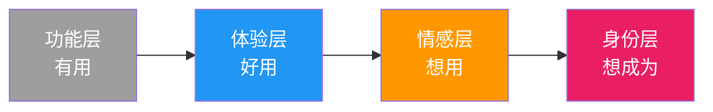

# 商业的本质：功能 vs 欲望

> **商业的成败，在于你卖的是"功能"还是"欲望"。**
> 功能是实用的，但极易陷入比价陷阱；欲望——即产品所承载的理想生活与身份认同——才是产生高溢价的关键。

## 两种商业路径的分野

生意的价值定位，决定了它是低价走量还是高价盈利。这是两种截然不同的商业路径。

| 对比维度 | 功能导向（低价生意） | 欲望导向（高价生意） |
|---------|---------------------|---------------------|
| **核心价值** | 解决问题，强调有用性 | 承载向往，投射理想自我 |
| **客户心理** | "这个东西值得买" | "我想成为那样的人" |
| **竞争方式** | 拼参数、拼价格 | 拼故事、拼认同 |
| **市场结果** | 陷入比价，价格有上限 | 产生溢价，价值无边界 |
| **商业系统** | 比价系统（谈价格） | 认同系统（谈身份） |
| **典型代表** | 拼多多白牌、廉价替代品 | 苹果、LV、Tesla |
| **护城河** | 成本优势（脆弱） | 品牌信仰（坚固） |

## 从"功能"到"欲望"的跨越

许多产品本身不差，但始终缺乏价值感，根源在于价值停留在了可比较的功能层面。**功能、流程、交付都可以被轻易复制和替代。**

真正高级的商业，不是让客户觉得产品有用，而是让他们**渴望靠近产品所代表的那种理想状态**。



### 四层递进详解

| 层级 | 关键词 | 客户心声 | 商业动作 | 溢价能力 |
|-----|--------|---------|---------|---------|
| **1. 功能层** | 有用 | "它能做什么？" | 提供解决方案 | 无溢价（可替代） |
| **2. 体验层** | 好用 | "用起来舒服吗？" | 优化流程与细节 | 小幅溢价（10-30%） |
| **3. 情感层** | 想用 | "我喜欢它的感觉" | 讲故事、造氛围 | 中幅溢价（2-5倍） |
| **4. 身份层** | 想成为 | "用它代表我是谁" | 建立品牌信仰 | 高溢价（10倍+） |

### 典型案例对照

| 品牌 | 功能层 | 欲望层 | 溢价倍数 |
|------|--------|--------|---------|
| **星巴克** | 一杯咖啡 | 第三空间、生活方式 | 5-8倍 |
| **苹果** | 一台手机 | 创新者、品味象征 | 3-5倍 |
| **LV** | 一个包 | 阶层、身份标识 | 10-20倍 |
| **Tesla** | 一辆电动车 | 科技先锋、环保先锋 | 2-3倍 |

## 记忆口诀：`功-体-情-身`

```
功(能层) → 体(验层) → 情(感层) → 身(份层)
   ↓           ↓           ↓           ↓
  能做什么   用得舒服   情感共鸣   身份认同
   ↓           ↓           ↓           ↓
  无溢价     小溢价      中溢价      高溢价
```

## 关键洞察

1. **功能决定下限，欲望决定上限**：没有功能，欲望是空中楼阁；但只有功能，永远走不出比价泥潭
2. **客户会为实用买单，但只会为欲望去溢价**：前者是理性消费，后者是感性冲动
3. **品牌本质是身份契约**：你买的不是产品，是"你想成为谁"的承诺
4. **从功能到欲望的每一步，都是护城河的加深**：功能易抄，体验难抄，情感更难，身份几乎无法复制
5. **低价竞争的死局**：在比价系统里，永远有人比你更便宜；在认同系统里，你是唯一的
