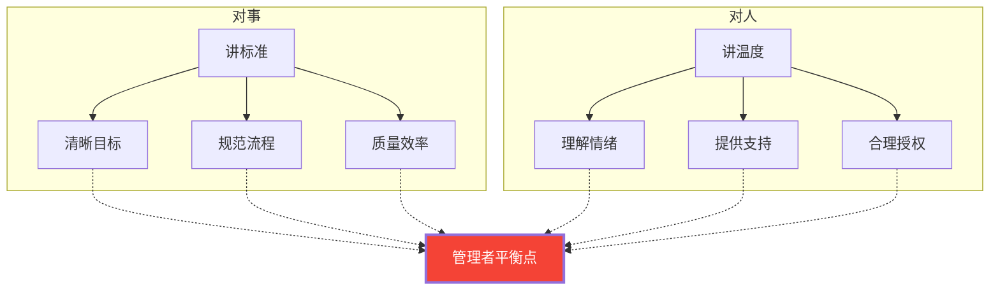

# 管理者如何接纳不完美：打造容错型团队

> **核心观点**：带团队的核心并非复制自己的能力，而是**鼓励和赋能他人**，让团队成员用自己的方式完成任务，并为他们可能搞砸的事情兜底。

## 第一性原理


## 一、建立容错机制

### 错误类型区分

| 类型 | 定义 | 典型场景 | 处理方式 |
|------|------|---------|---------|
| **原则性错误** | 触碰诚信、价值观底线 | 数据造假、泄露机密、欺瞒客户 | 🔴 零容忍，严肃处理 |
| **发展性失误** | 创新探索中的试错 | 新方法失败、判断偏差、经验不足 | 🟢 包容引导，视为学习资源 |

### 容错三步骤

| 步骤 | 动作 | 说明 |
|------|------|------|
| **1. 设立保护期** | 新项目/新方法推行初期允许失误 | 明确告知团队"这是安全区" |
| **2. 复盘探因** | 项目结束后从"问责"转向"探因" | 鼓励分享失误中的观察与思考 |
| **3. 沉淀经验** | 将教训转化为团队知识资产 | 形成checklist、SOP或避坑指南 |

## 二、优化沟通与反馈

### 波特定律

> **批评时先肯定其工作价值**，再给予改进建议。只盯着错误会摧毁动力，肯定+建议才能激发改变。

### 反馈框架

| 维度 | 错误做法 | 正确做法 |
|------|---------|---------|
| **态度** | 只关注问题本身 | 先肯定价值，再谈改进 |
| **内容** | 模糊指责（"你怎么又错了"） | 具体可操作建议（"下次可以先做X再检查Y"） |
| **环境** | 公开批评，制造恐惧 | 私下沟通，营造心理安全 |

**心理安全 = 团队成员敢于表达不同意见 + 不怕犯错被惩罚**

## 三、调整自身心态

| 心态转变 | 从 → 到 | 具体做法 |
|---------|--------|---------|
| **接纳情绪** | 情绪是敌人 → 情绪是信号 | 识别愤怒/焦虑背后的真实需求 |
| **放下完美主义** | 事事亲为 → 聚焦可控改进 | 承认局限，允许80分结果 |
| **示范包容** | 隐藏失误 → 公开分享学习经历 | "我也犯过这个错，当时我是这样学到的…" |

## 四、平衡人与事



### 授权矩阵：根据员工能力阶段调整管理方式

| 员工阶段 | 能力水平 | 管理方式 | 示例 |
|---------|---------|---------|------|
| **R1 新手** | 低能力高意愿 | 🎓 **教练式**：手把手教，明确指令 | "你先按这个步骤做，做完我们review" |
| **R2 成长期** | 能力波动意愿下降 | 💬 **支持式**：多沟通解释，一起决策 | "你觉得这个问题该怎么处理？我们一起想" |
| **R3 成熟期** | 高能力意愿波动 | 🤝 **参与式**：少指挥多支持，鼓励主导 | "这件事交给你，需要资源随时说" |
| **R4 专家** | 高能力高意愿 | 🚀 **授权式**：充分信任，只看结果 | "全权负责，完成后同步一下" |

## 记忆口诀：`容-沟-态-衡`

```
容(错机制)    沟(通反馈)    态(度调整)    衡(人与事)
   ↓              ↓              ↓              ↓
 分类型        先肯定        接纳情绪        对事讲标准
 设保护        给建议        放完美        对人讲温度
 复盘探因      心理安全      示范包容      合理授权

管理升级路径：纠错 → 容错 → 赋能
```

## 关键洞察

1. **反人性是常态**：业务高手靠自己，管理者靠团队——这个转变本身就是反直觉的
2. **容错 ≠ 放任**：有原则的包容，底线之上给空间，底线之下零容忍
3. **波特定律的本质**：人不会因为被批评得更多而变得更好，只会因为被理解得更深而愿意改变
4. **授权不是放弃控制**：而是把控制从"过程控制"升级为"标准控制"
5. **文化转变的终点**：从"纠错文化"（谁出错谁担责）到"容错文化"（出错一起学习）再到"赋能文化"（让每个人成为解决问题的主体）
