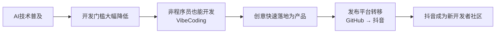
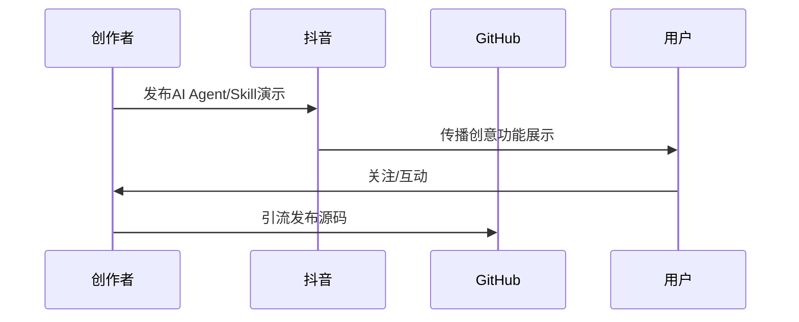

# VibeCoding：非程序员的开发热潮

> 这则视频介绍了近期火爆的"VibeCoding"现象——AI 正在打破传统开发的壁垒，让创意更容易转化为产品。抖音等平台正成为新的创意社区，与 GitHub 形成"代码"与"创意"的有趣对比。

## 核心逻辑链

## 关键概念对比

| 维度 | 传统开发 | VibeCoding |
|------|---------|-----------|
| **参与者** | 专业程序员 | 任何人（含非程序员） |
| **协作模式** | 产品+设计+前后端多人协同 | 1人 + AI |
| **驱动力** | 技术实现、代码质量 | 创意、功能展示 |
| **发布平台** | GitHub（代码仓库） | 抖音（创意展示）→ 引流 GitHub |
| **核心资产** | 代码本身 | 创意与产品体验 |
| **社区文化** | 传播代码 | 传播创意 |

## 现象拆解

### 1. VibeCoding 崛起

- **定义**：非程序员借助 AI 工具直接参与软件开发的趋势
- **典型案例**：胡彦斌、生化危机女主角等名人参与开源项目
- **本质**：开发从"专业技能"变为"创意表达工具"

### 2. 平台迁移：GitHub → 抖音

### 3. AI 降低门槛的具体表现

| 过去需要 | 现在只需 |
|---------|---------|
| 产品经理梳理需求 | 1人用自然语言描述创意 |
| UI/UX 设计师出图 | AI 自动生成界面 |
| 前端开发写页面 | AI 辅助编码 |
| 后端开发写接口 | AI 辅助编码 |
| 多人团队协作 | 1人 + AI 独立完成 |

### 4. 新创作文化

- **抖音的定位转变**：从娱乐短视频平台 → 被开发者认可的创意社区
- **用户决策逻辑**：看不懂代码 → 更关注实际功能和视觉效果
- **传播路径**：功能演示（抖音）→ 关注积累 → 源码开源（GitHub）

## 总结与启示

| 观点 | 含义 |
|------|------|
| 开发民主化 | 创意不再受限于技术能力 |
| 平台再定义 | 抖音从消费平台转向创作/开发者社区 |
| 价值转移 | 从"会写代码"到"有好创意" |
| 未来趋势 | 更多非程序员加入开发，创意产品爆发式增长 |
