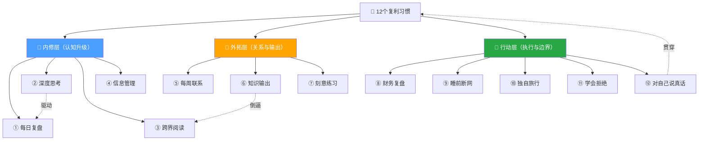
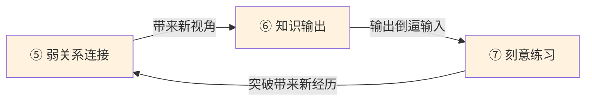
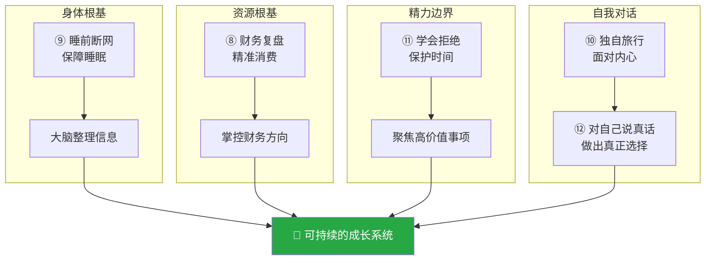
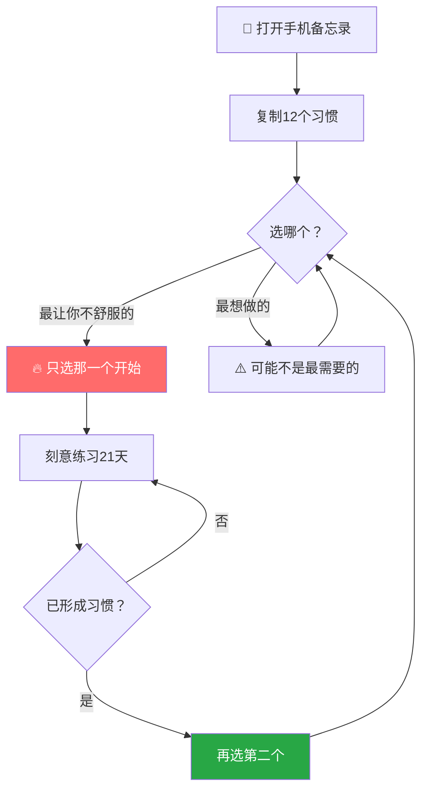

# 12个复利习惯：如何让努力真正有回报

> [!abstract] 核心论点
> 大多数人陷入"战术上勤奋，战略上懒惰"的困境——努力与回报不成正比。人生的回报率取决于所选的习惯系统，真正的复利习惯能带来**指数级长期收益**。本篇将12个习惯按**内修→外拓→行动**三层组织，形成可记忆、可执行的成长框架。

---

## 逻辑框架总览



---

## 一、内修层：认知升级（习惯 1-4）

> [!info] 层旨
> 构建高质量的认知系统——会反思、会思考、会筛选，才是一切复利的起点。

| # | 习惯 | 方法 | 原理/依据 | 核心目的 |
| :---: | :--- | :--- | :--- | :--- |
| ① | **每日复盘** | 每天写100字：今天做了什么、结果如何、下次怎么改 | 哈佛商学院研究：有反思习惯的人学习效率高23% | 提炼经验，指导未来行动 |
| ② | **深度思考** | 每天30分钟，手机放远，专注思考当前最重要的问题 | 多数人宁愿刷短视频也不愿独处思考，深度思考已成稀缺能力 | 理清思路，解决真正重要的问题 |
| ③ | **跨界阅读** | 每月读一本与专业完全无关的书 | 同行读同类书→思维同质化；跨界认知才是真正的竞争壁垒 | 打造差异化思维壁垒 |
| ④ | **信息管理** | 主动筛选信息源，取消制造焦虑、无实质内容的账号 | 劣质信息如同有毒食物，污染判断力 | 保护认知边界 |

### 内修层的逻辑链


> [!example] 跨界阅读案例
> 一位销售朋友通过阅读行为经济学，将丹尼尔·卡尼曼的"锚定效应"应用于报价策略，**业绩提升了40%**。

---

## 二、外拓层：关系与输出（习惯 5-7）

> [!info] 层旨
> 将内在认知转化为外在价值——通过连接、输出、突破，让能力被看见、被放大。

| # | 习惯 | 方法 | 原理/依据 | 核心目的 |
| :---: | :--- | :--- | :--- | :--- |
| ⑤ | **每周联系** | 每周主动联系一个久未联系的人，真诚一对一沟通 | 格兰诺维特"弱关系理论"：改变命运的机会往往来自不常联系的人 | 拓展弱关系网络，获取新信息与机会 |
| ⑥ | **知识输出** | 建立输出渠道（朋友圈/公众号/抖音），用大白话讲清一个概念 | 费曼学习法：能讲清楚 = 真正理解了 | 倒逼深度理解，而非涨粉 |
| ⑦ | **刻意练习** | 每天做一件让自己轻微不舒服的事（主动发言、拒绝请求、赞美陌生人） | 心理学"渐进式暴露"：每次突破一点，大脑重新校准恐惧判断 | 刻意扩展舒适区 |

### 外拓层的飞轮效应



---

## 三、行动层：执行与边界（习惯 8-12）

> [!info] 层旨
> 守护根基、设定边界、面对自我——没有这些底层支撑，上面的一切都是空中楼阁。

|  #  | 习惯         | 方法                       | 原理/依据                     | 核心目的                   |
| :-: | :--------- | :----------------------- | :------------------------ | :--------------------- |
|  ⑧  | **财务复盘**   | 每周查看钱花在哪，区分"投资"与"消耗"     | 巴菲特："如果你不能管理小钱，就不会管理大钱"   | 实现精准消费，掌控财务            |
|  ⑨  | **睡前断网**   | 建立睡前仪式，睡前一小时不看手机         | 斯坦福睡眠研究：睡前刷手机让深度睡眠减少20%以上 | 保障深度睡眠，让大脑整理信息         |
|  ⑩  | **独自旅行**   | 每年至少一次独自旅行，在陌生地方待一段时间    | 陌生环境迫使你面对内心：真正想要什么、在逃避什么  | 促进自我探索                 |
|  ⑪  | **学会拒绝**   | 学会说"不"，每次答应 = 拒绝另一件更重要的事 | 精力管理的本质不是做更多，而是拒绝更多       | 管理精力边界                 |
|  ⑫  | **对自己说真话** | 每天诚实问自己："我今天有没有在逃避什么？"   | 大多数人的痛苦来自内心深处被压制的声音       | 越早听见内心声音，越早做出真正属于自己的选择 |

### 行动层的守护逻辑



> [!example] 独自旅行案例
> 博主分享了自己30岁时独自前往云南，在没有行程的情况下待了十天，最终想清楚了很多事。

---

## 四、12个习惯全览表

| 层级 | # | 习惯 | 频率 | 时间投入 | 核心关键词 |
| :---: | :---: | :--- | :---: | :---: | :--- |
| 🧠 内修 | ① | 每日复盘 | 每日 | 5-10分钟 | 反思·提炼 |
| 🧠 内修 | ② | 深度思考 | 每日 | 30分钟 | 专注·稀缺 |
| 🧠 内修 | ③ | 跨界阅读 | 每月 | 灵活安排 | 壁垒·差异 |
| 🧠 内修 | ④ | 信息管理 | 持续 | 即时执行 | 过滤·保护 |
| 🌉 外拓 | ⑤ | 每周联系 | 每周 | 30-60分钟 | 弱关系·机会 |
| 🌉 外拓 | ⑥ | 知识输出 | 每周+ | 灵活安排 | 费曼·倒逼 |
| 🌉 外拓 | ⑦ | 刻意练习 | 每日 | 即时执行 | 突破·校准 |
| 🎯 行动 | ⑧ | 财务复盘 | 每周 | 15-30分钟 | 精准·掌控 |
| 🎯 行动 | ⑨ | 睡前断网 | 每日 | 睡前1小时 | 睡眠·整理 |
| 🎯 行动 | ⑩ | 独自旅行 | 每年 | 数天 | 探索·面对 |
| 🎯 行动 | ⑪ | 学会拒绝 | 持续 | 即时执行 | 边界·聚焦 |
| 🎯 行动 | ⑫ | 对自己说真话 | 每日 | 5分钟 | 诚实·选择 |

---

## 五、如何开始：选择与执行

> [!warning] 核心原则
> **不要贪多，贪多等于放弃。**



---

## 六、核心结论

> [!success] 一句话总结
> 回报不来自勤奋的**量**，而来自习惯的**质**。选对习惯系统，让每一个习惯都成为复利引擎。

---

### 记忆锚点

```
三层12习惯框架（3-7-5 递进结构 → 记忆口诀："思读管，联出练，财睡旅拒真"）

🧠 内修层（4个 · 认知升级）
├── ① 每日复盘   → 提炼经验
├── ② 深度思考   → 解决核心问题
├── ③ 跨界阅读   → 打造思维壁垒
└── ④ 信息管理   → 过滤劣质信息

🌉 外拓层（3个 · 关系与输出）
├── ⑤ 每周联系   → 拓展弱关系
├── ⑥ 知识输出   → 倒逼深度理解
└── ⑦ 刻意练习   → 扩展舒适区

🎯 行动层（5个 · 执行与边界）
├── ⑧ 财务复盘   → 精准消费
├── ⑨ 睡前断网   → 保障深度睡眠
├── ⑩ 独自旅行   → 促进自我探索
├── ⑪ 学会拒绝   → 管理精力边界
└── ⑫ 对自己说真话 → 倾听内心声音

🔑 启动法则：选最让你不舒服的那个 → 那才是你真正需要的
```
