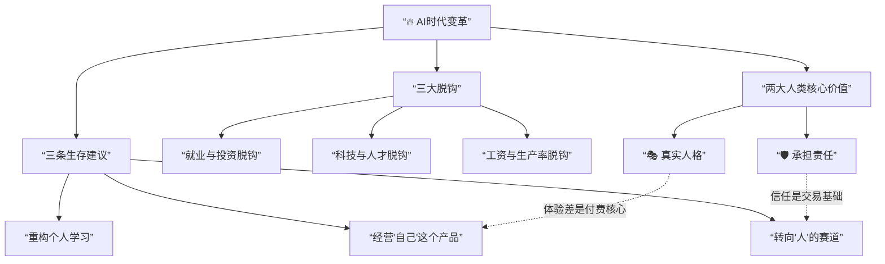
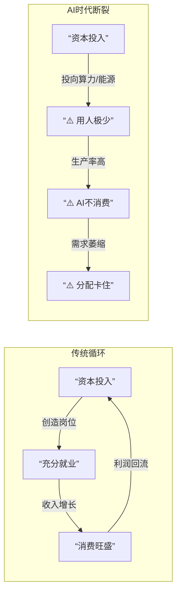
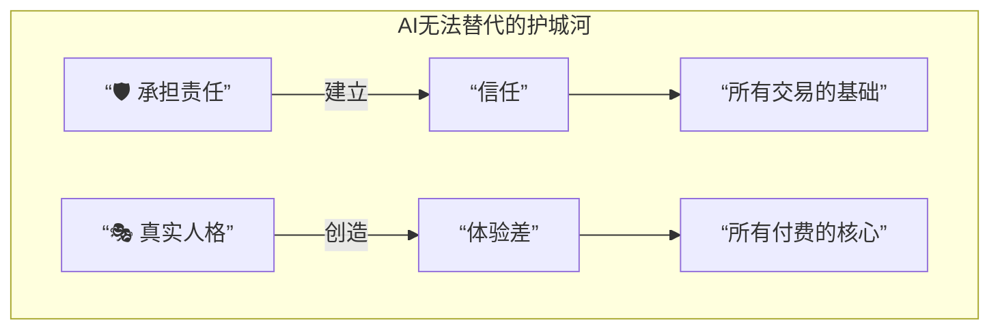
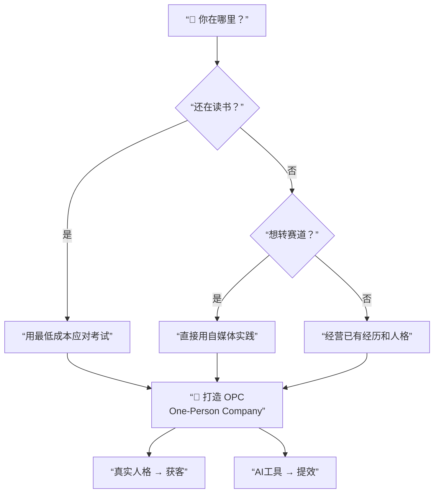

# AI时代的生存法则：打破旧逻辑，拥抱新价值

> [!abstract] 核心论点
> AI正颠覆”经济发展=充分就业”的传统逻辑，在经济与就业间造成三大前所未有的**脱钩**。面对这一变革，普通人的生存策略不再是追逐风口，而是要回归AI无法替代的人类核心价值：**承担责任**与**真实人格**。

---

## 逻辑框架总览



---

## 一、AI带来的三大”脱钩”

AI打破了过去”经济越好，工作越多”的铁律，在经济与就业之间形成了三个关键的断裂。

### 三大脱钩对照表

| 脱钩类型 | 传统逻辑 | AI时代的现实 | 核心变化 |
| :--- | :--- | :--- | :--- |
| **就业与投资脱钩** | 资本涌入 → 岗位增多 | 资本涌向算力和能源，这些领域用人极少 | 💰 钱不再创造岗位 |
| **科技进步与人才成长脱钩** | 高校专业与市场需求关联 | 科技发展太快，高校教育与市场迅速撕裂 | 📚 学历不再兜底 |
| **工资与生产率脱钩** | 生产率提升 → 工资上涨 | AI只降本增效不消费，二次分配环节被卡住 | 📉 效率不等于收入 |

### 脱钩的逻辑链



---

## 二、AI无法替代的两大人类价值

在AI时代，真正的壁垒在于其无法模拟的人类特质。

| 价值维度 | 内涵 | 为什么AI无法替代 | 商业意义 |
| :--- | :--- | :--- | :--- |
| **🛡️ 承担责任** | AI可作为工具，但最终责任必须由人承担 | “做错事要付出代价”的机制无法被算法化 | 信任是商业社会一切交易的基石 |
| **🎭 真实人格** | 经历、情感、独特体验构成”体验差” | 人只会从**他人**身上寻找理想的自己 | 体验差是未来所有付费逻辑的核心 |



---

## 三、给普通人的三条生存建议

基于以上洞察，视频给出了三条具体的行动建议，帮助个人在AI时代找到自己的位置。

### 建议总览

| 建议 | 核心行动 | 底层逻辑 | 避坑指南 |
| :--- | :--- | :--- | :--- |
| **1. 转向”人”的赛道** | 靠近需要人际互动、需要人承担责任的领域 | 离感觉和感受越近，与AI互补性越强 | ❌ 别追可被无限规模化的风口 |
| **2. 重构个人学习** | 用自媒体直接实践，而非等待专业教育 | 高校教育与市场需求已撕裂 | ❌ 别指望学校专业能兜底 |
| **3. 经营”自己”这个产品** | 打造OPC（One-Person Company） | 独特经历 = 未来创造价值的原料 | ❌ 别执念于雇佣制和铁饭碗 |

### 行动路径图



---

## 四、核心结论

> [!success] 一句话总结
> AI替代的是**劳动**，但替代不了**经营**。

产品和服务的交付可以有AI帮忙，但在获客和营销端，**真实的人格**将更具优势。你就是自己最好的产品，敢于把真实的自己展示给世界，就是最好的生存策略。

### 记忆锚点

```
3-2-3 框架
├── 3 大脱钩：投资≠就业 / 科技≠人才 / 效率≠工资
├── 2 大价值：承担责任（信任） / 真实人格（体验差）
└── 3 条建议：转赛道 / 重构学习 / 经营自己（OPC）
```