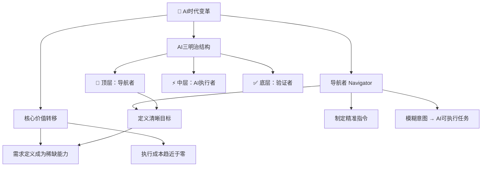
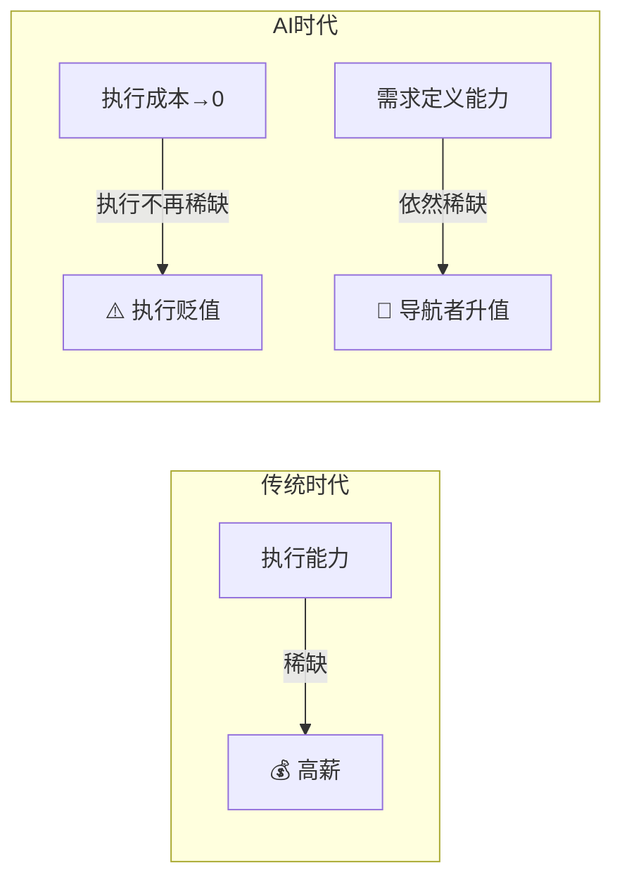
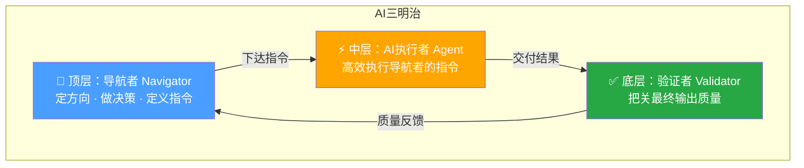

# AI时代的赢家：未来5年谁能持续赚钱？

> [!abstract] 核心论点
> 未来五年，AI将加速渗透，商业版图重塑，**过去的经验将迅速失效**。在AI什么都能干的世界里，钱将主要流向三类人。本篇重点解析第一种：**导航者（Navigator）**——能够清晰定义目标、制定策略的决策者。

---

## 逻辑框架总览



---

## 一、什么是"导航者"？

"导航者"是AI时代的**决策者和方向制定者**。他们的核心能力是将模糊的意图转化为精准的指令，让AI去执行。

> [!tip] 角色范围很广
> 导航者不仅限于创始人。任何能定义清晰目标的人都可以成为导航者，例如：产品经理、投资人，甚至是一个想清楚如何用AI解决问题的餐饮店老板。

### 导航者的核心能力

| 能力维度 | 具体表现 | 示例 |
| :--- | :--- | :--- |
| **意图转化** | 将模糊需求翻译为精准AI指令 | "提升用户留存" → "设计7日召回推送策略" |
| **目标定义** | 在不确定中锚定方向 | 明确产品该做什么、不做什么 |
| **决策判断** | 在AI给出的多个方案中选最优解 | 结合商业直觉和上下文做出判断 |

---

## 二、为什么导航者如此重要？

AI的强大在于执行，但它的最大软肋是**不知道该干什么**。它需要人类提供明确的指令。因此，当AI实现广义自动化后，真正的瓶颈就转移到了"定义问题"和"设定目标"上。

> [!important] 反常识现象
> 随着编程工具（如Cursor）越来越强大，好的产品经理反而**越来越值钱**。
> 因为当写代码的成本趋于零，知道"该做什么"就成了最关键的价值。

### 价值转移逻辑



| 时代 | 稀缺能力 | 价值流向 |
| :--- | :--- | :--- |
| **传统时代** | 执行能力（写代码、做设计、写文案） | 谁能做，谁值钱 |
| **AI时代** | 方向定义（知道做什么、为什么做） | 谁想得清，谁值钱 |

---

## 三、AI三明治结构

视频引用AI 6 Z的论文，提出了一个"AI三明治"结构，形象地展示了未来的工作模式：

### 三明治结构图



### 各层角色对照表

| 层级 | 角色 | 核心职责 | 关键能力 | 价值来源 |
| :---: | :--- | :--- | :--- | :--- |
| **顶层** 🧭 | 导航者 Navigator | 定方向、做决策、定义指令 | 意图转化、目标定义 | 提出正确的问题 |
| **中层** ⚡ | AI执行者 Agent | 高效执行导航者的指令 | 速度、规模、低成本 | 将想法变为现实 |
| **底层** ✅ | 验证者 Validator | 把关最终输出质量 | 判断力、标准感 | 确保输出可靠 |

> [!note] 核心洞察
> 在这个结构中，导航者处于**价值创造的起点**。没有清晰的指令，AI的执行越强，偏离目标的风险反而越大。

---

## 四、核心结论

> [!success] 一句话总结
> 在AI时代，人类提供的核心价值是**"需求"**。当执行成本趋近于零，"知道该做什么"的能力变得前所未有的重要。

能够清晰定义目标、制定策略的**"导航者"**，将成为AI时代最稀缺、最值钱的人才。

---

### 记忆锚点

```
导航者框架（1-1-3）
├── 1 个定义：导航者 = 决策者 + 方向制定者
├── 1 个反常识：执行成本→0，定义问题 = 唯一瓶颈
│   └── Cursor越强，产品经理越值钱
├── 3 层三明治结构
│   ├── 🧭 顶层：导航者（定义指令）  ← 价值起点
│   ├── ⚡ 中层：AI执行者（执行指令） ← 效率引擎
│   └── ✅ 底层：验证者（把关质量）   ← 质量底线
└── 核心公式
    清晰目标 + 精准指令 = AI时代最稀缺的价值
```
