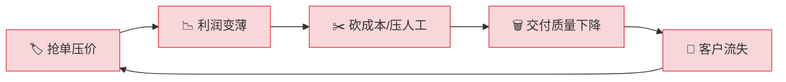
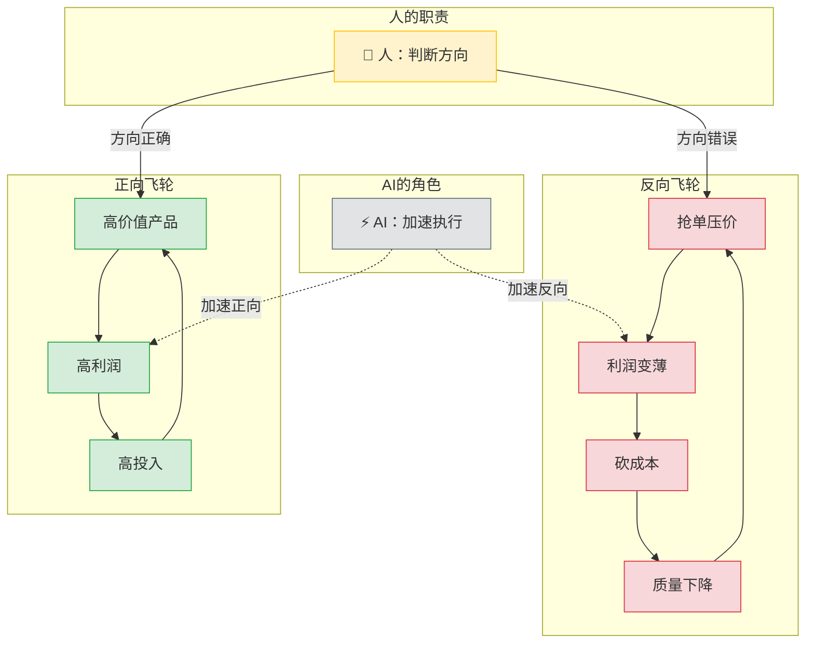

# AI飞轮效应：AI不挑方向，只会放大你的业务循环

> **核心观点**：AI本身是中性的，它不挑方向，只会放大和加速企业原有的业务循环。企业在引入AI前，必须先由人来判断和调整业务方向，不能依赖AI来做决策。

---

## 一、业务的"飞轮"效应

视频将企业的业务循环比作一个"飞轮"，其转动方向至关重要。

### 飞轮方向对比

| 维度 | 🟢 正向飞轮（滚雪球式增长） | 🔴 反向飞轮（滚下坡式衰退） |
|------|--------------------------|--------------------------|
| **起点** | 高价值产品/服务 | 抢单压价 |
| **第二阶段** | 高利润 | 利润变薄 |
| **第三阶段** | 高成本投入（研发/人才/品质） | 砍成本 / 压人工 |
| **第四阶段** | 更高价值的产品/服务 | 交付质量下降 |
| **结果** | 客户忠诚度 ↑，雪球越滚越大 | 客户流失 ↑，加速走向衰败 |
| **比喻** | 🏔️ 上坡推车——越推越轻 | ⛰️ 下坡失控——越滚越快 |

### 正向飞轮


### 反向飞轮



---

## 二、AI技术的"油门"效应

AI技术作为一个强大的"油门"，会对企业的"飞轮"产生巨大影响。

### AI的核心能力

| 能力 | 说明 |
|------|------|
| **成本趋零** | 生产文案、方案、回复等内容的成本压至趋近于零 |
| **批量产出** | 实现大规模、并行化内容生成 |
| **极速响应** | 秒级产出，远超人工效率 |

### AI对两种飞轮的不同效果

| 对比项 | 🟢 AI + 正向飞轮 | 🔴 AI + 反向飞轮 |
|--------|-----------------|-----------------|
| **产出质量** | 高质量内容 × 高效率 = 价值倍增 | 垃圾内容 × 高效率 = 灾难倍增 |
| **决策速度** | 精准决策加速 → 更快占领市场 | 错误决策加速 → 更快偏离正轨 |
| **客户影响** | 更好体验 → 客户更满意 | 更多垃圾 → 客户加速流失 |
| **最终结果** | 🏆 雪球越滚越大 | 💀 "以前作死三年，现在三个月玩完" |

### 飞轮 × AI 加速模型



---

## 三、核心结论：人是关键

视频的分析最终指向一个关键问题：**AI并不能代替人来判断业务方向。**

| 角色 | 职责 | 不可替代性 |
|------|------|-----------|
| 👤 **人** | 判断飞轮方向是否正确、是否健康 | ✅ 需要商业直觉、价值观、战略眼光 |
| ⚡ **AI** | 执行加速，将指定方向的产出效率最大化 | ❌ 只会"老老实实把你指的方向加速" |

### 行动清单

> [!tip] 在引入AI之前，先问自己：
> 1. 我的业务飞轮在往哪个方向转？
> 2. 这个方向是在"滚雪球"还是"滚下坡"？
> 3. 如果是下坡，先调整方向，再考虑AI加速
> 4. **永远不要用一个强大的工具去加速一个错误的方向**

---

## 逻辑记忆链

```
飞轮比喻 → 两个方向(正向/反向) → AI是油门(中性加速) → 方向错了AI越快越糟 → 所以：人先定方向，AI再加速
```

| 记忆锚点 | 关键词 | 核心逻辑 |
|---------|--------|---------|
| 1️⃣ 飞轮 | 业务循环 | 企业运转如同飞轮，有方向性 |
| 2️⃣ 两方向 | 正向 vs 反向 | 好循环滚雪球，坏循环滚下坡 |
| 3️⃣ 油门 | AI中性 | AI不挑方向，只负责加速 |
| 4️⃣ 放大器 | 双刃剑 | 正确方向→倍增价值；错误方向→倍增灾难 |
| 5️⃣ 人是舵手 | 核心结论 | 人定方向，AI踩油门 |
