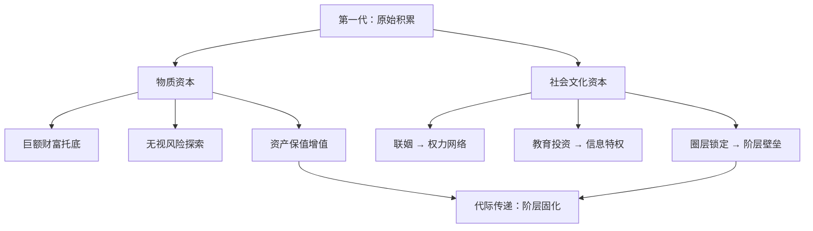
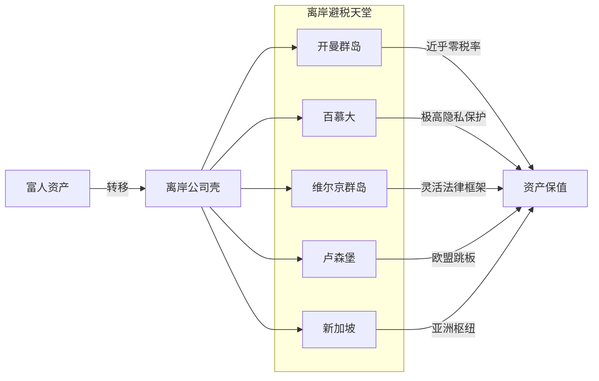
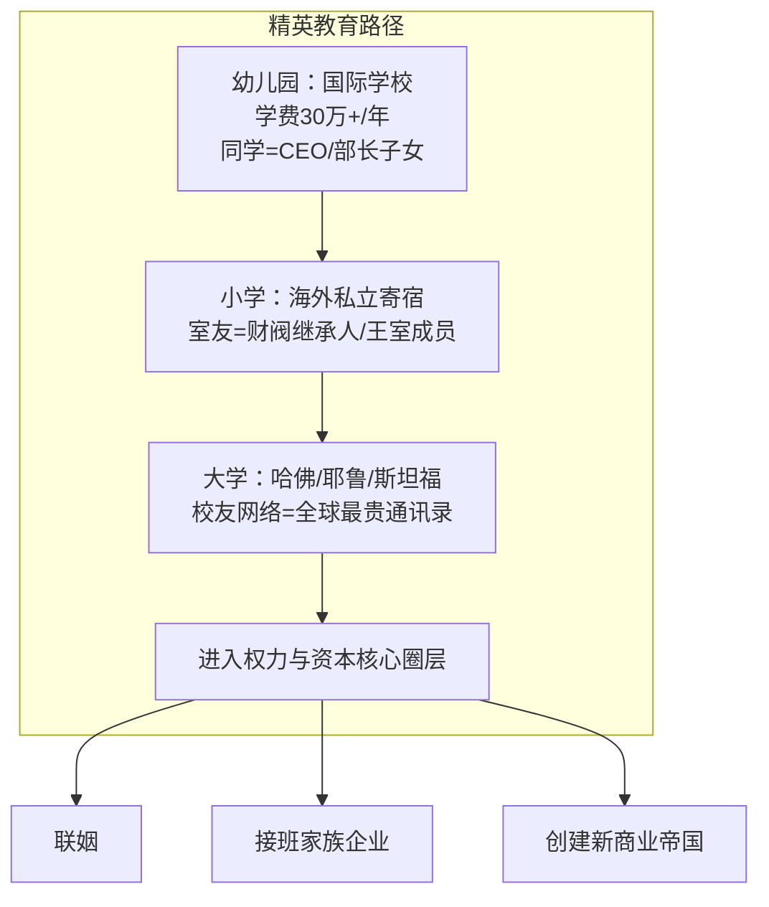
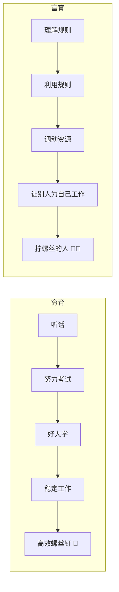
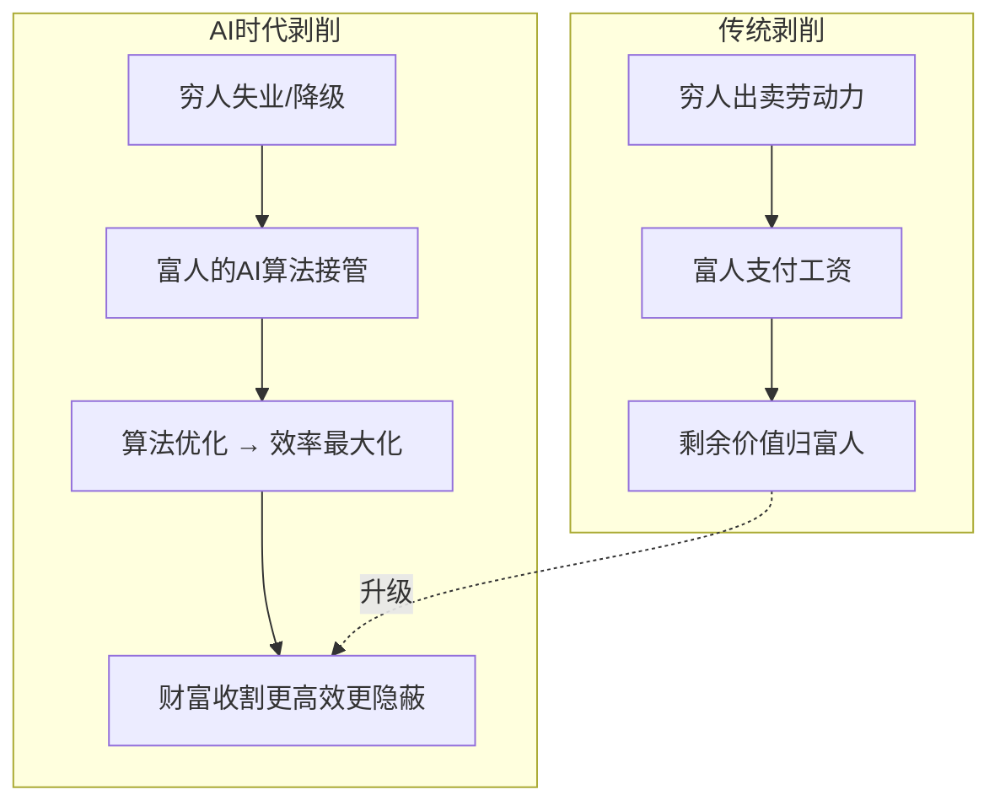
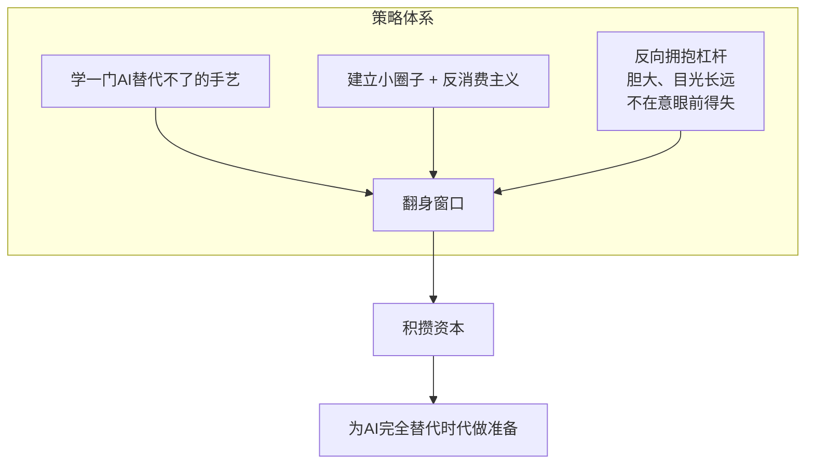
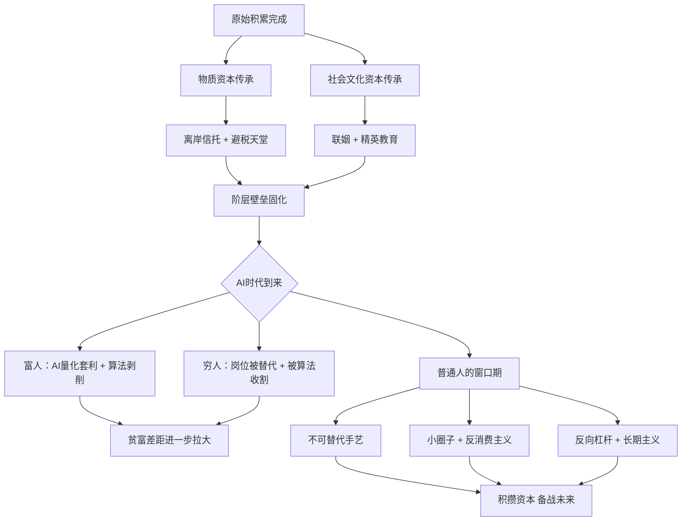

> [!abstract] 核心论点
> AI时代，富人通过 **物质资本 + 社会文化资本** 双重加持构建阶层壁垒，传统传承手段（信托、联姻、精英教育）与新技术（AI量化、算法剥削）叠加，进一步压缩普通人生存空间。但过渡期仍存窗口。

---

## 一、财富传承的两大基石

第一代富豪完成原始积累后，优势通过两条路径代际传递：

| 资本类型 | 核心内涵 | 传承方式 | 效果 |
|---------|---------|---------|------|
| **物质资本** | 巨额财富 | 信托、遗产、股权 | 后代可无视风险大胆探索 |
| **社会文化资本** | 人脉、信息、圈层 | 联姻、精英教育、俱乐部 | 锁定阶层优势，形成信息特权 |

---

## 二、离岸信托与避税天堂

### 2.1 家族信托 — 合法的”金蝉脱壳”

富人将资产装入法律壳子（信托），子孙每年仅可领取利息，**不可动用本金**。该结构**不可撤销**，即使后代面临债务、离婚、破产，信托资产均不受影响。

### 2.2 避税天堂 — 全球资产隐匿网络

| 避税天堂 | 税率 | 核心优势 | 典型用途 |
|---------|------|---------|---------|
| 开曼群岛 | 0% | 零公司税、零资本利得税 | 基金注册、控股公司 |
| 百慕大 | 0% | 无所得税、无遗产税 | 保险、再保险公司 |
| BVI（维尔京群岛） | 0% | 极高隐私、灵活公司法 | 离岸信托、SPV |
| 卢森堡 | 低 | 欧盟成员、税收协定广 | 欧洲控股架构 |
| 新加坡 | 低 | 亚洲金融中心、属地税制 | 家族办公室 |

---

## 三、联姻与精英教育

### 3.1 联姻 — 两家公司合并资产负债表

> [!quote] 本质
> 顶级豪门的婚姻 = **两家公司的资产负债表合并**。通过详尽婚前协议（涉及股权、信托、下一代教育权），整合两个家族的财富与权力网络。

### 3.2 精英教育 — 隐形阶层网络

| 阶段 | 去向 | 投入 | 核心收获 |
|------|------|------|---------|
| 幼儿园 | 国际学校（30万+/年） | 高昂学费 | 从小锁定顶级同龄圈层 |
| 小学 | 海外私立寄宿 | 文化适应 + 学费 | 国际人脉（财阀、王室后代） |
| 大学 | 哈佛/耶鲁/斯坦福 | 竞争极其激烈 | 全球最贵”通讯录” |
| 毕业后 | 权力与资本核心 | — | 直接对接资源与机会 |

---

## 四、穷富教育的本质区别

| 维度         | 穷育                     | 富育                      |
| ---------- | ---------------------- | ----------------------- |
| **培养目标**   | 高效的螺丝钉 🔩              | 拧螺丝的人 🧑‍💼             |
| **思维模式**   | 听话 → 努力 → 考好大学 → 找稳定工作 | 理解规则 → 利用规则 → 调动资源 → 用人 |
| **核心能力**   | 执行力、服从性                | 资源整合、系统思维、领导力           |
| **风险态度**   | 厌恶风险，追求稳定              | 拥抱风险，用资本对冲              |
| **时间视野**   | 短期（月薪、年终奖）             | 长期（资产增值、代际传承）           |
| **对AI的态度** | 担心被替代                  | 利用AI替代别人                |

---

## 五、AI时代的新剥削形式

| 维度 | 传统模式 | AI时代模式 |
|------|---------|-----------|
| **剥削方式** | 直接雇佣劳动 | 算法驱动，无需直接雇佣 |
| **效率** | 人力管理成本 | 毫秒级自动化决策 |
| **隐蔽性** | 可见的劳资关系 | 算法黑箱，难以察觉 |
| **金融领域** | 人工交易、信息差 | AI量化：毫秒套利、事件驱动 |
| **劳动力替代** | 蓝领为主 | 白领+蓝领双线替代 |

### AI替代岗位全景

| 类别 | 被替代岗位 | 替代方式 | 影响人群 |
|------|-----------|---------|---------|
| **白领** | 初级律师、会计 | AI文档审查、自动化审计 | 中产知识分子 |
| **白领** | 翻译、文案 | LLM翻译/写作 | 语言类从业者 |
| **白领** | 客服、数据分析 | AI对话/BI自动化 | 服务业、数据岗 |
| **蓝领** | 仓储、分拣、包装 | 机器人+自动化流水线 | 制造业工人 |
| **蓝领** | 驾驶、配送 | 自动驾驶、无人配送 | 运输业从业者 |

---

## 六、普通人的最后机会

> [!important] 窗口期
> AI尚未完全取代人类的**过渡时期**，是普通人最后一次翻身窗口。

### 6.1 三大核心策略

| 策略 | 核心思路 | 具体行动 |
|------|---------|---------|
| **不可替代手艺** | 做AI搞不定的事 | 手艺型、情感型、创造型技能 |
| **小圈子 + 反消费主义** | 降低被动支出，积累原始资本 | 减少洗脑消费，建立信任网络 |
| **反向拥抱杠杆** | 胆子大、目光远 | 利用信息差和趋势，敢于长期投入 |

### 6.2 生存缝隙 — 富人的盲区

| 方向 | 特征 | 为什么AI/富人搞不定 |
|------|------|-------------------|
| 个性化手作 | 非标准化、有温度 | AI无法复制人的情感连接 |
| 本地化服务 | 社区深耕、关系驱动 | 无法规模化，富人看不起 |
| 垂直小众领域 | 极细分市场需求 | 市场太小，大公司不值得做 |
| 创意/IP经营 | 个人品牌、独特视角 | 人格化内容不可被算法替代 |

---

## 全篇逻辑总览

