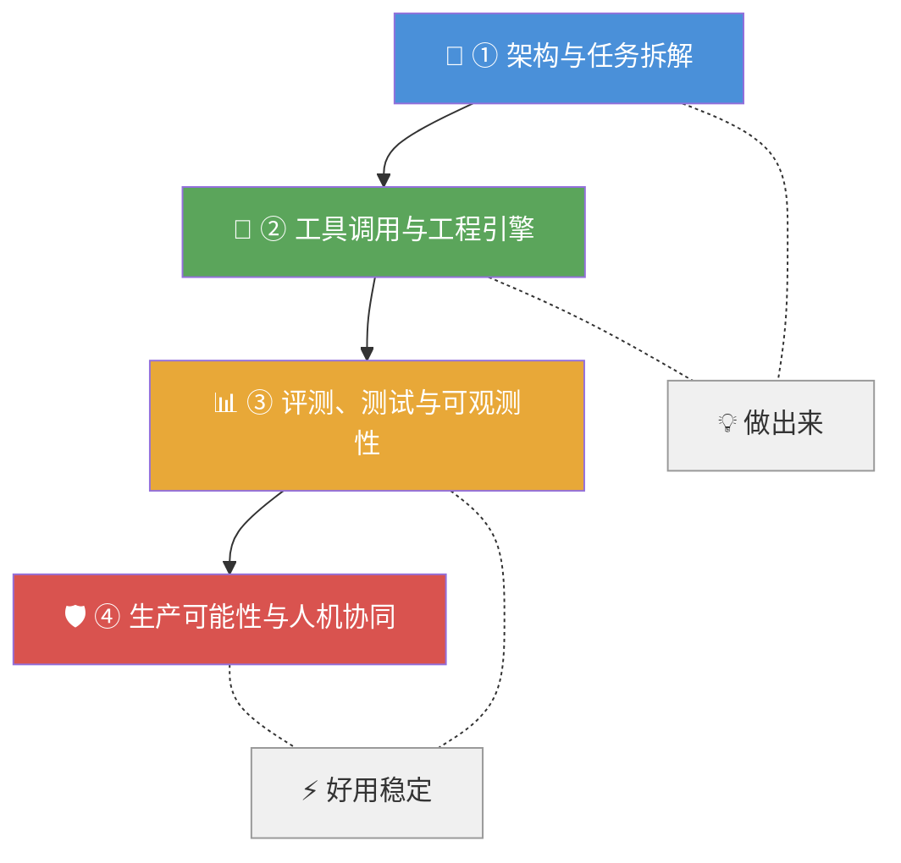

# 智能体工程师面试核心四要点

视频作者基于近期面试经验，总结了评估智能体工程师的四个核心维度。前两点决定了能否做出智能体，后两点则决定了做出的系统是否真正可用、稳定且可迭代。

---

## 🧠 逻辑记忆框架

**口诀：「拆 → 调 → 测 → 产」** —— 做出来 → 跑起来 → 看得清 → 稳得住

**分组记忆（2×2 矩阵）：**

| | **做出来** | **好用稳定** |
|---|---|---|
| **设计层** | ① 架构与任务拆解 | ③ 评测、测试与可观测性 |
| **工程层** | ② 工具调用与工程引擎 | ④ 生产可能性与人机协同 |

**递进逻辑：**
- **第①步**：知道怎么拆（设计智能体的骨架）
- **第②步**：知道怎么连（让智能体能调工具、有状态）
- **第③步**：知道怎么查（能看、能调、能优化）
- **第④步**：知道怎么守（能上线、能容错、能回退）

---

## 四维度能力关系图



---

## 一、架构与任务拆解

这是最关键的能力，考验的是将真实业务转化为智能体可执行步骤的能力。

- **核心判断**：能判断一个问题是需要简单的大模型调用，还是需要工作流、多智能体协作、计划模式等更复杂的架构。
- **实践原则**：倾向于**简单、可组合**的设计，而非一开始就使用最复杂的框架。
- **拆解能力**：能将业务拆分为清晰的状态、步骤、失败恢复机制、工具调用和验收条件。

> 📌 **记忆锚点**：好的架构师 = 用最简单的方案解决复杂的问题，而不是用最复杂的方案解决简单的问题。

---

## 二、工具调用与工程引擎

这是智能体区别于普通调用的关键，涉及规划、多步执行、状态保留等复杂工程问题。

- **核心区别**：能规划任务、调用工具、保留状态、执行多步操作。
- **关键知识点**：工具Schema设计、函数调用、权限约束、超时/异常处理、上下文压缩等。
- **实战经验**：一个真正落地过智能体的人会明白，很多失败并非模型不够聪明，而是**工具设计太烂、上下文管理不当**或状态无法恢复。

> 📌 **记忆锚点**：智能体的"手和脚"—— 工具设计 = 手的灵活性，状态管理 = 脚的记忆力。

---

## 三、评测、测试与可观测性

这是最被低估的能力，决定了智能体能否被有效调试和持续优化。

- **评测标准**：需要有一套客观标准来衡量智能体输出的正确性，而不是凭感觉。
- **可观测性**：能记录、回放和调试智能体的每一步推理、工具调用和安全护栏。
- **重要性**：没有这套机制，上线后的智能体就是一个**无法调试的黑盒**，出了问题也无从排查。

> 📌 **记忆锚点**：没有可观测性的智能体 = 蒙眼开车，跑得快但不知道什么时候撞墙。

---

## 四、生产可能性与人机协同

这决定了智能体能否在真实生产环境中安全、可靠地运行。

- **核心考量**：状态持久化、断点恢复、人工审核边界、成本与延迟控制、误操作防护、日志监控、降级回滚等。
- **人机协同**：明确区分哪些动作可以自动执行，哪些必须经过人工审核，确保安全。
- **资深标志**：能设计出**可暂停、可恢复、可审计、可回滚**的智能体系统。

> 📌 **记忆锚点**：生产级智能体的"五可"原则 —— 可暂停 · 可恢复 · 可审计 · 可回滚 · 可降级。

---

## 总结：智能体工程师的能力画像

前两点是基础，能让你做出一个智能体；后两点是升华，能让你做出一个真正能用的系统。

### 📋 能力维度总览表

| 能力维度 | 核心关键词 | 决定什么 | 失败表现 |
|---|---|---|---|
| ① 架构与任务拆解 | 简单、可组合 | 能不能**做出来** | 架构过度设计或拆解不清导致返工 |
| ② 工具调用与工程引擎 | Schema、状态、异常 | 能不能**跑起来** | 工具设计烂、上下文爆炸、状态丢失 |
| ③ 评测、测试与可观测性 | 可量化、可回放 | 做出来**好不好用** | 黑盒运行、无法定位问题、迭代靠猜 |
| ④ 生产可能性与人机协同 | 安全、可恢复 | 上线后**稳不稳定** | 无法回滚、误操作、成本失控 |

### 🔗 能力成熟度路径

```
初级 ──→ 中级 ──→ 高级 ──→ 资深
 ①          ②          ③          ④
能做出来    能跑起来    能看问题    稳如磐石
```

💡 最终，一个强大的智能体工程师是**扎实的后端工程能力**、**产品思维**和**系统架构理解**的结合体。
