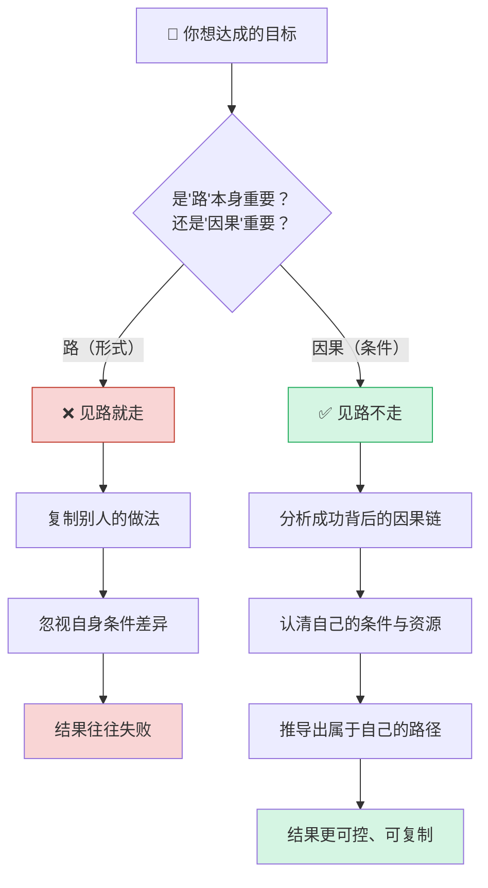
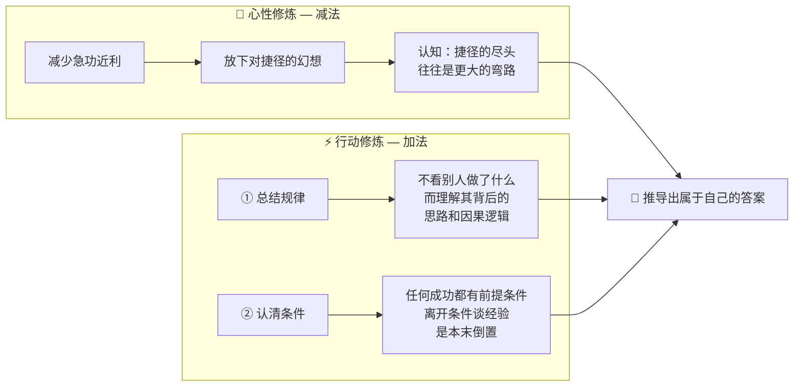
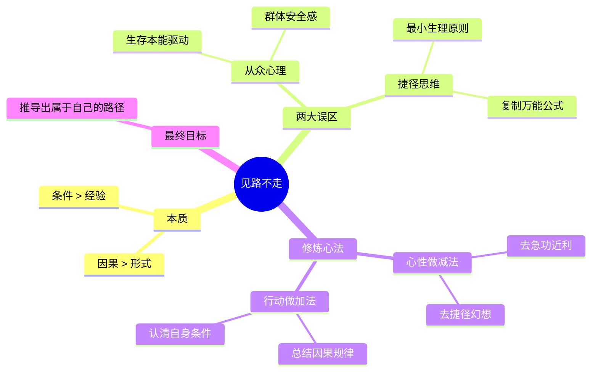

# 见路不走：看透成功的本质

> **核心命题**：人生的陷阱往往不是无路可走，而是盲目跟随他人的成功路径。真正的成功在于摆脱教条和路径依赖，看透现象背后的因果规律，并结合自身条件进行独立思考和判断。

---

## 一、什么是"见路不走"

> 📖 出自小说《天幕红尘》，主角叶子龙的核心哲学。

### 面馆的故事

| 角色 | 观点 | 思维方式 |
| :---: | :--- | :---: |
| 面馆老板 | 手擀面一定比机器面好吃 | **教条思维** — 执着于"形式" |
| 叶子龙 | 面条好吃的本质不在于制作方式，而在于软硬度、厚薄等客观标准 | **因果思维** — 回归"条件" |

**启示**：路的本质是其背后的**因果关系**，而非路本身。

---

## 二、认知误区：为何人们总是"见路就走"

人们陷入"见路就走"的误区，有两个根本原因：

| 根因 | 来源 | 表现 | 典型话术 |
| :---: | :---: | :--- | :--- |
| 🧍 **从众心理** | 原始社会的生存本能 | 恐惧独立思考，倾向跟随群体以获得安全感 | "大家都在做，肯定没问题" |
| ⚡ **捷径思维** | 大脑的"最小生理原则" | 直接复制他人的"万能公式"，而非费力探索规律 | "这个流量打法直接抄就行" |

---

## 三、底层逻辑：因果链全景图

---

## 四、修炼方法：八字心法

> **为道日损，为学日益** — 心性上做减法，行动上做加法。

### 行动修炼详解

| 步骤 | 核心动作 | 关键问题 | 避免的陷阱 |
| :---: | :--- | :--- | :--- |
| ① 总结规律 | 透过现象看因果逻辑 | "他为什么这样做？背后的条件是什么？" | 只看表面行为，机械模仿 |
| ② 认清条件 | 评估自身资源、能力、环境 | "我的条件和当时的条件一样吗？" | 离开条件谈经验，本末倒置 |

---

## 五、全篇逻辑总览

