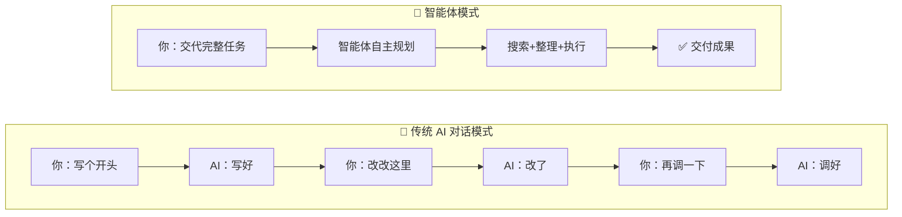
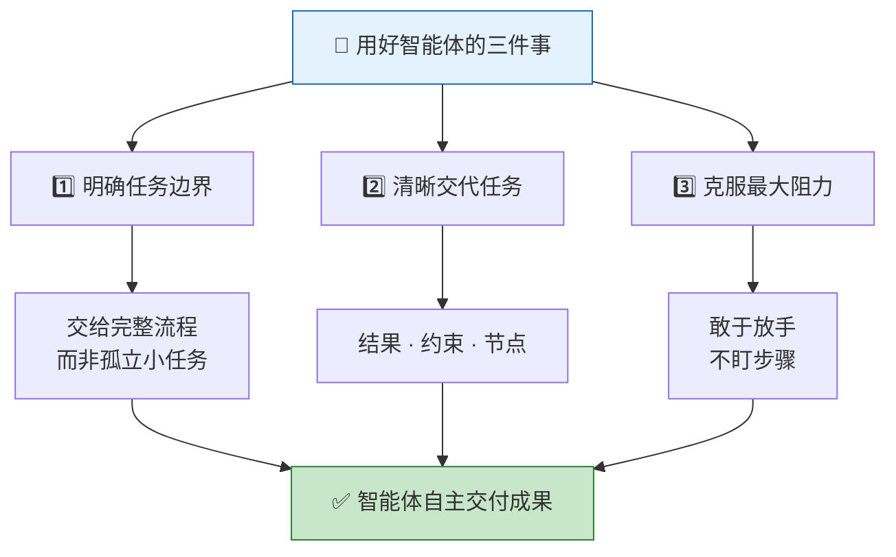
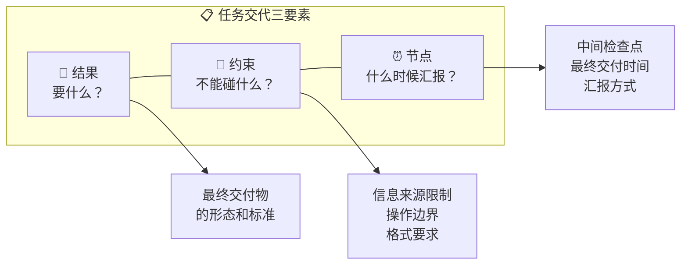
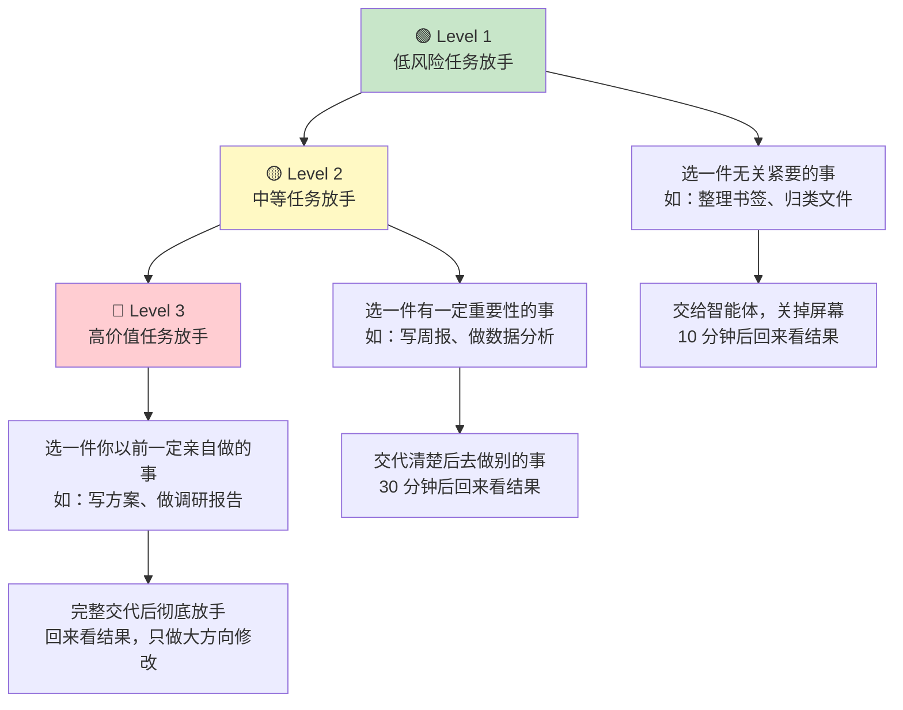
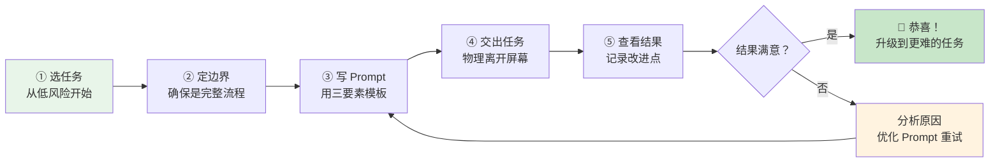

# 用好AI智能体的核心心法：三件事法则

> **核心主张**：用好智能体不在于技术或平台，而在于想清楚并做好 **三件事**——将智能体从"工具"升级为"执行者"。

---

## 前置认知：AI 工具 vs AI 智能体

在展开三件事之前，必须先理解这两者的本质区别，否则后续的方法无法落地。

| 对比维度 | 传统 AI 对话（如 ChatGPT 聊天） | AI 智能体（Agent） |
|---------|-------------------------------|-------------------|
| **交互模式** | 你一句我一句，来回对话 | 你交代一次，它自主跑完 |
| **角色定位** | 你的"副驾驶"，陪你一起干 | 你的"下属"，替你干完 |
| **执行方式** | 每一步都需要你确认和引导 | 自主规划步骤、调用工具、完成全流程 |
| **工具使用** | 不能主动调用外部工具 | 可自主搜索、读写文件、调用 API |
| **你的状态** | 全程盯着屏幕参与 | 可以去干别的事，回来看结果 |
| **类比** | 像带实习生手把手干活 | 像把项目交给一个能独立工作的员工 |



> **关键转变**：你的角色从"操作者"变成"管理者"——不再关注"怎么做"，而是聚焦"做什么"和"做成什么样"。

---

## 总览：三件事框架



---

## 第一件事：明确任务边界

### 核心原则

不要把智能体当作处理孤立小任务的工具，而要交给它 **有头有尾的完整流程**。

### 什么样的任务适合交给智能体？

| 判断条件 | ✅ 适合 | ❌ 不适合 |
|---------|--------|----------|
| **步骤数量** | 3 个以上步骤 | 一步就能完成（如"帮我翻译这句话"） |
| **是否需要搜索** | 需要从网上查资料、找数据 | 纯靠已有知识就能回答 |
| **是否需要工具** | 需要读写文件、生成表格、调用接口 | 纯文本对话即可 |
| **是否有明确产出** | 最终要交付一个文档/表格/报告 | 只是想聊聊天、头脑风暴 |
| **流程是否有头有尾** | 从起点到终点可以完整描述 | 开放性的探索，没有固定终点 |

### 正反案例对比

| 场景 | ❌ 碎片化使用（工具思维） | ✅ 完整任务（智能体思维） |
|------|------------------------|------------------------|
| **竞品调研** | "帮我搜一下 A 公司的价格" → "再查 B 公司" → "帮我整理一下" | "调研 A、B、C 三家公司的定价策略，包括价格区间、计费模式、目标客群，整理成对比表格并写出结论" |
| **内容创作** | "帮我列个大纲" → "帮我写第一段" → "帮我润色一下" | "写一篇 2000 字的行业分析文章，主题是 2026 年 AI 智能体市场趋势，包含市场规模、主要玩家、技术路线、未来预测四个部分，配上数据来源" |
| **数据整理** | "把这个表格的格式调一下" → "再加一列" → "帮我算一下总计" | "把这份原始销售数据按月份和产品线汇总，计算增长率，找出 TOP3 产品，输出一份带图表的分析报告" |
| **旅行规划** | "帮我查一下东京有什么好玩的" | "规划 5 天 4 晚东京自由行，预算每人 1 万，包括机票酒店比选、每日行程安排、交通路线、餐厅推荐，输出完整行程单" |

### 任务自检清单

在给智能体分配任务前，用以下 5 个问题快速自检：

- [ ] 这个任务是否有 **明确的起点和终点**？
- [ ] 完成它是否需要 **3 个以上步骤**？
- [ ] 智能体是否需要 **搜索信息或使用工具**？
- [ ] 最终产出是否是一个 **可交付的具体成果**？
- [ ] 我能否用 **一句话描述清楚** 这个任务是什么？

> 如果 5 个问题中有 3 个以上回答"是"，这就适合交给智能体作为完整任务。

---

## 第二件事：清晰交代任务

> 像带新员工一样交代任务——智能体会一次性跑完整个流程，初期的模糊会导致结果跑偏。

### 为什么交代方式如此重要？

智能体与传统对话最大的不同在于：**它不会中途问你怎么办**。它会按照你的描述一口气跑完，如果开头就理解偏差，等结果出来才发现不对，前面的时间和算力就全浪费了。

这就像给远程新员工布置工作——你不能说"你先做着，有问题问我"，因为你们之间没有实时沟通渠道，他只能按你邮件里写的来。

### 交代三要素详解



#### 🎯 要素一：结果——"做成什么样？"

不要说"帮我调研一下"，要具体描述最终交付物的样子。

| 模糊 ❌ | 清晰 ✅ |
|---------|--------|
| "帮我做个调研" | "做一份 3 页的 PDF 报告，包含市场概况、竞品对比表格、趋势判断" |
| "帮我整理数据" | "按月份汇总销售数据，输出 Excel 表格，包含增长率计算和趋势折线图" |
| "帮我写篇文章" | "写一篇 1500 字公众号文章，口语化风格，带 3 个小标题，面向 25-35 岁职场人" |

**关键句式**：`"最终我需要一份 [格式] 的 [产出物]，包含 [具体内容要求]"`

#### 🚧 要素二：约束——"什么不能碰？"

约束条件越明确，智能体越不容易跑偏。常见约束类型：

| 约束类型 | 说明 | 示例 |
|---------|------|------|
| **信息源约束** | 限定数据来源 | "只用公开信息，不要编造数据" |
| **范围约束** | 限定研究范围 | "只看国内市场的公司，不考虑海外" |
| **格式约束** | 限定输出格式 | "用 Markdown 表格呈现，不要用纯文本列表" |
| **风格约束** | 限定表达风格 | "语气正式专业，面向企业管理层阅读" |
| **禁区约束** | 明确禁止的操作 | "不要修改原有表格的结构，不要删除任何原始数据" |

**关键句式**：`"注意：[具体禁区或限制条件]"`

#### ⏰ 要素三：节点——"什么时候让我看？"

对于耗时较长的任务，设置中间检查点可以避免全部做完才发现方向错了。

| 任务时长 | 建议节点设置 | 示例 |
|---------|------------|------|
| 5 分钟以内 | 不需要中间节点，直接交付 | "做完直接给我" |
| 5-30 分钟 | 先出大纲/框架，确认后再做完整版 | "先给我看目录结构，我确认了再展开写" |
| 30 分钟以上 | 分阶段交付，每阶段确认后继续 | "先完成第一部分给我看，确认没问题再继续后面" |

**关键句式**：`"先给我看 [中间产物]，我确认后再继续"` 或 `"全部做完一次性交付"`

### 万能 Prompt 模板

将三要素组合，形成一个可直接复用的任务交代模板：

```
## 任务
[一句话说清楚要做什么]

## 具体要求
- [具体要求1]
- [具体要求2]
- [具体要求3]

## 交付格式
[描述最终交付物的格式和标准]

## 约束条件
- [约束1：信息来源限制]
- [约束2：操作边界]
- [约束3：风格要求]

## 交付方式
[中间检查节点 / 一次性交付]
```

### 实战演练：从模糊到清晰

**场景**：你想让智能体帮你做一个客户满意度调查分析。

**第一步 — 模糊版本**：
> "帮我分析一下客户满意度调查的数据"

**第二步 — 加入结果**：
> "帮我分析客户满意度调查数据，做一份分析报告"

**第三步 — 加入约束**：
> "帮我分析客户满意度调查数据，做一份分析报告。只分析 2026 年 Q1 的数据，不要包含历史对比。报告中不要出现具体客户名称，用编号代替。"

**第四步 — 加入节点**：
> "帮我分析客户满意度调查数据，做一份分析报告。只分析 2026 年 Q1 的数据，不要包含历史对比。报告中不要出现具体客户名称，用编号代替。**先给我看分析维度和大纲，我确认后再写完整报告。**"

---

## 第三件事：克服最大阻力

### 核心诊断

> 真正的阻力并非技术，而是使用者 **不敢放手的心态**。

这是三件事中最难的一件，因为它不是技能问题，而是 **心理问题**。

### 常见心理障碍分析

| 心理障碍 | 内心独白 | 真相 | 克服方法 |
|---------|---------|------|---------|
| **不放心** | "万一它做错了怎么办？" | 错了可以重做，比你自己做快得多 | 把"一次做对"的预期改为"快速迭代" |
| **控制欲** | "我想看着它每一步怎么做" | 盯着看 = 你自己还在干活，没解放 | 关掉屏幕去做别的事，物理隔离 |
| **完美主义** | "不够好，我要改改" | 先完成再完善，90% 的成品比 0% 的完美有价值 | 设定"可接受标准"而非"完美标准" |
| **习惯性微操** | "这里应该这样写，那里要调一下" | 你又在"陪跑"了，没给智能体发挥空间 | 忍住，等全部做完再统一修改 |
| **沉没成本** | "我都花这么多时间调了，不如自己做" | 这次自己做完 = 下次还得自己做 | 把每次失败当作训练"放手能力"的机会 |

### "放手"的渐进式训练

不要一步到位，分阶段建立信任：



### 放手后的正确姿势

| ❌ 错误做法 | ✅ 正确做法 |
|------------|-----------|
| 每 2 分钟看一次进度 | 设个闹钟，到时间再看 |
| 看到不满意立刻打断修改 | 等全部跑完，记录问题，下次优化 prompt |
| 这次不行就自己接手做完 | 分析哪里交代不清，重新调整后重来 |
| 只关注最终结果对不对 | 复盘：哪些交代得好？哪些需要更清晰？ |

---

## 实践路线图

### 新手入门：从哪件事开始？

| 推荐优先级 | 任务类型 | 具体场景示例 | 预计耗时 |
|-----------|---------|------------|---------|
| ⭐ 第一选择 | 信息整理类 | 把 20 篇收藏文章整理成主题摘要表 | 5-10 分钟 |
| ⭐⭐ 第二选择 | 调研分析类 | 调研 3 家竞品公司的功能、定价、用户评价 | 15-30 分钟 |
| ⭐⭐⭐ 第三选择 | 内容创作类 | 写一篇行业周报或公众号文章 | 20-40 分钟 |
| 🔥 进阶挑战 | 多步综合类 | 制定一份完整的季度营销方案 | 30-60 分钟 |

### 完整实践流程



---

## 常见踩坑与排查指南

| 问题现象 | 可能原因 | 对应解决 |
|---------|---------|---------|
| 结果完全跑偏 | 任务交代模糊，缺少"结果"要素 | 补充具体的交付物描述 |
| 包含了不该有的内容 | 缺少"约束"要素，没有设禁区 | 明确列出"不要做什么" |
| 做到一半停了 | 任务太复杂，缺少中间节点 | 拆分为阶段性交付 |
| 格式乱七八糟 | 没有指定输出格式 | 明确说明"用表格/用 Markdown/用 PDF" |
| 内容太浅不深入 | prompt 中缺少深度要求 | 加上"要有数据支撑""要有分析而非罗列" |
| 你自己忍不住打断 | 心理上的控制欲和完美主义 | 物理离开，设闹钟再回来看 |
| 结果 90% 对但要大改 | 约束条件不够细 | 在约束中增加风格、细节、标准的要求 |

---

## 三件事总结对照表

| # | 要点 | 核心关键词 | 本质转变 | 常见障碍 | 一句话心法 |
|---|------|-----------|---------|---------|-----------|
| 1 | 明确任务边界 | **完整流程** | 从"碎片指令"→"端到端任务" | 任务拆得太细，不敢给完整任务 | 给它一件事，不是一步棋 |
| 2 | 清晰交代任务 | **结果·约束·节点** | 从"随便看看"→"带新员工式交代" | 默认 AI 能猜到你的意图 | 你写不清楚，它就做不对 |
| 3 | 克服最大阻力 | **敢于放手** | 从"盯着陪跑"→"交付式信任" | 不放心、想微操、控制欲 | 关掉屏幕，去做别的事 |

---

## 核心记忆口诀

> **一事一界一放手，结果约束节点有。**
> **任务交代像带人，关掉屏幕等成果。**

- **一事**：交给完整的一件事（不是碎片步骤）
- **一界**：划清边界（什么能做、什么不能碰）
- **一放手**：物理上离开，信任智能体
- **结果约束节点**：交代的三要素，缺一不可

---

> 💡 **反思与行动**：
> 1. 这三点中，你觉得哪一点最难做到？为什么？
> 2. 你今天就可以交给智能体的一件事是什么？
> 3. 用上面的 Prompt 模板，现在就写出你的第一个"完整任务"。
