# AI下半场：FDE人才争夺战

> **核心论点**：AI行业已从"拼模型"的上半场，进入"拼落地"的下半场。能将AI真正融入企业日常运营的 **FDE（前置交付工程师）** 成为稀缺人才，引发大厂疯抢，年薪百万起步。然而高昂的成本让中小企业难以企及，催生了新的解决方案。

---

## 🧠 逻辑记忆框架

```
记忆口诀：「上模下落，FDE四能，八成重复，五步落地，今天开干」

┌──────────────────────────────────────────────────────────────┐
│  1. 两个阶段 ── 上半场拼模型 → 下半场拼落地                    │
│  2. 一类人才 ── FDE：技术+产品+沟通+执行（四能）                │
│  3. 一个困境 ── 百万年薪，中小企业用不起                       │
│  4. 一条出路 ── AI吃掉80%重复劳动 → 成本大众化                 │
│  5. 一套方法 ── 诊→选→建→嵌→养（五步落地法）                   │
│  6. 一条路线 ── 找场景→做原型→量化效果→写案例→投岗位（今天开干） │
└──────────────────────────────────────────────────────────────┘
```

---

## 一、AI的上半场与下半场

行业焦点已发生根本性转变，从技术竞赛转向价值创造。

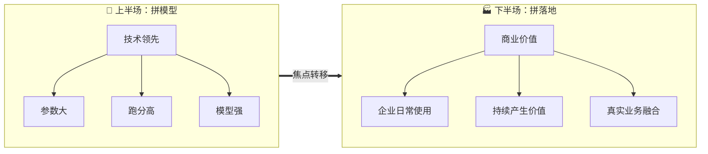

|    维度    |   🔬 上半场    |    🏭 下半场     |
| :------: | :---------: | :-----------: |
| **核心目标** |    技术领先     |     商业落地      |
| **衡量标准** | 模型强、参数大、跑分高 | 企业日常使用、持续产生价值 |
| **竞争焦点** |   实验室基准测试   |    真实业务场景     |
| **关键角色** |    算法研究员    | FDE（前置交付工程师）  |
| **价值体现** |    技术突破     |   可量化的业务回报    |

---

## 二、FDE：连接AI与商业的桥梁

FDE是能将AI真正落地的关键角色，他们的任务是让AI在企业中 **每天被使用、持续出结果**，而不只是一个漂亮的Demo。

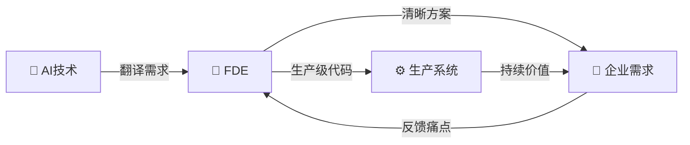

### FDE的四大核心能力（T型人才）

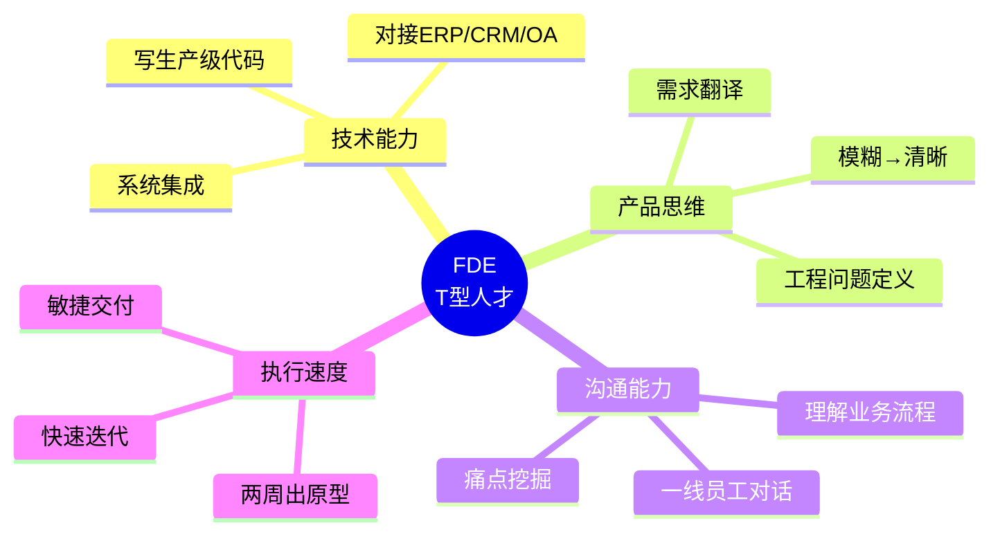

> 💡 **记忆锚点**：FDE = **F**rontline（一线沟通）+ **D**elivery（交付执行）+ **E**ngineering（工程能力）

| 能力维度 | 具体要求 | 为什么重要 |
|:--------:|:--------:|:----------:|
| 🛠 **技术能力** | 能写生产级代码，对接企业ERP/CRM/OA系统 | 确保AI能跑在生产环境，不是Demo |
| 🎯 **产品思维** | 能将老板模糊的需求翻译成清晰的工程问题 | 弥合"想要"和"能做"的鸿沟 |
| 🗣 **沟通能力** | 能与一线员工沟通，理解真实业务流程 | 发现真正痛点，而非表面需求 |
| ⚡ **执行速度** | 能在两周内做出可用的原型 | 快速验证，降低试错成本 |

> ⚠️ 这种人才极为稀少，愿意从事此类工作的工程师 **不足10%**，因此身价不菲。

---

## 三、全球FDE薪资一览

无论是国外还是国内，FDE的薪酬都处于行业顶端。

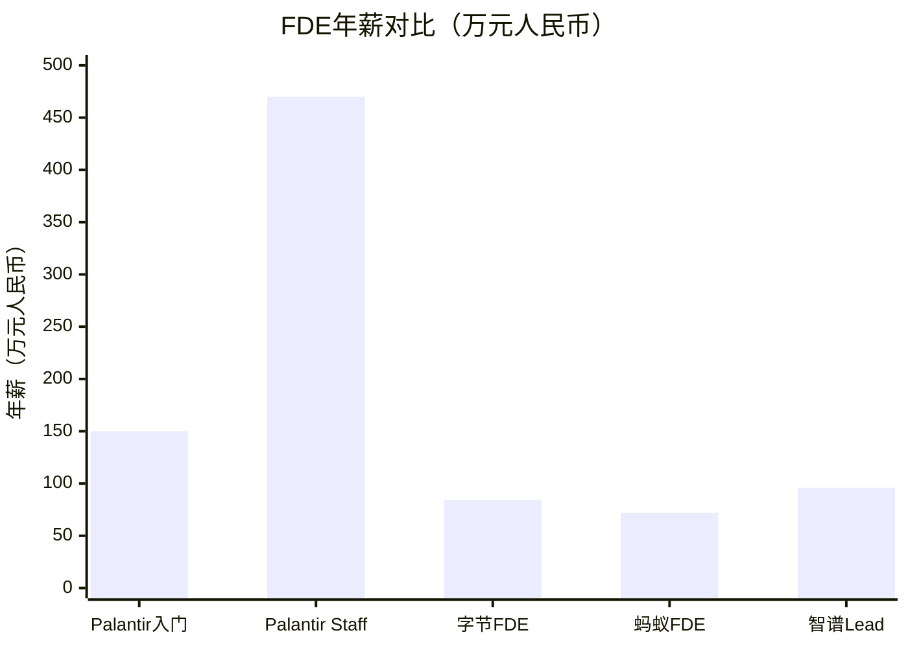

### 国外

| 公司 | 级别 | 年薪总包 | 折合人民币 |
|:----:|:----:|:--------:|:----------:|
| Palantir | 入门级 | $200,000 起 | ≈ 150万 |
| Palantir | Staff级别 | $630,000+ | ≈ 470万+ |

### 国内

| 公司 | 岗位 | 月薪范围 | 年薪估算（12薪） |
|:----:|:----:|:--------:|:----------------:|
| 字节跳动 | FDE | 3.5万 - 7万 | 42万 - 84万 |
| 蚂蚁集团 | FDE | 4万 - 6万 | 48万 - 72万 |
| 智谱 | FDE Lead | 6万 - 8万 | 72万 - 96万 |

> 📊 **数据洞察**：国外FDE薪资显著高于国内，但国内头部厂商的FDE薪酬已达互联网行业上游水平。

---

## 四、中小企业的AI落地困境

FDE服务的高昂成本主要面向大客户，这让广大中小企业陷入了"想用但用不起"的尴尬境地。

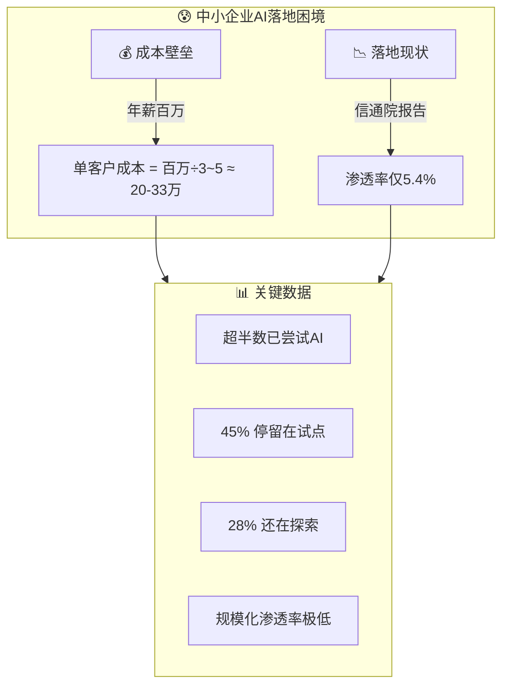

| 困境维度 | 具体表现 | 数据来源 |
|:--------:|:--------:|:--------:|
| 💰 **成本壁垒** | 一个FDE年薪百万，服务3-5个客户，单客户人力成本高达 **20-33万** | 行业估算 |
| 📉 **落地现状** | 超半数已尝试AI，但 **45%停留试点**，**28%仍在探索** | 信通院报告 |
| 🔒 **规模化鸿沟** | 真正实现规模化应用的渗透率极低，中小企业仅 **5.4%** | 信通院报告 |

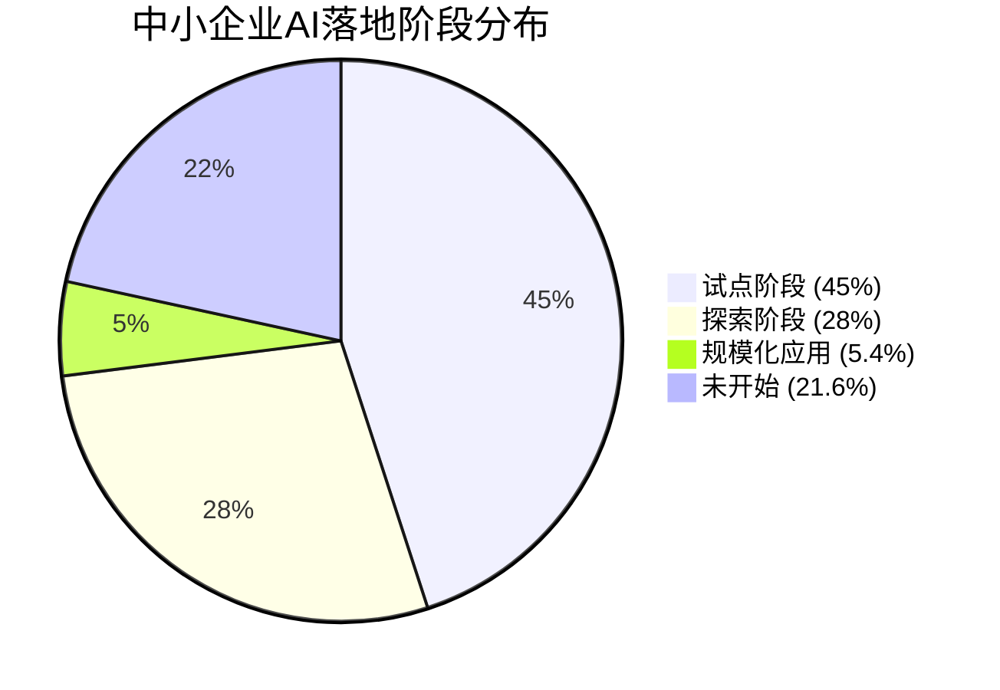

---

## 五、破局之道：让AI落地成本大众化

> 🔑 **核心洞察**：FDE的工作中 **80%是重复性劳动**（如数据采集、清洗、方案推送等），这部分工作可以交给AI系统自动化完成。

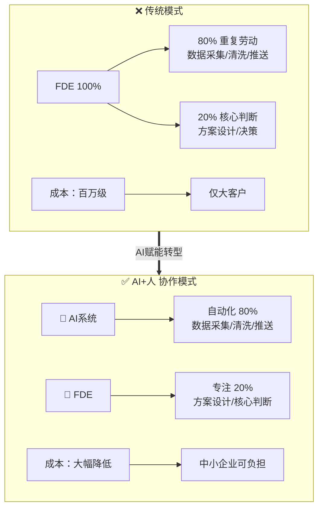

### 80/20 法则在FDE工作中的应用

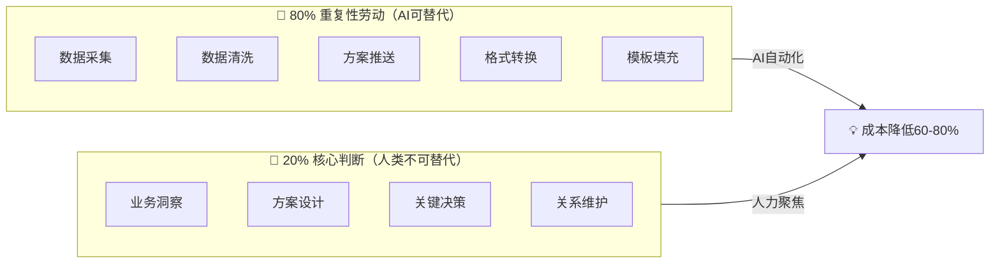

| 工作类型 | 占比 | 具体内容 | AI替代程度 |
|:--------:|:----:|:--------:|:----------:|
| 🔄 **重复性劳动** | 80% | 数据采集、清洗、方案推送、格式转换 | ⭐⭐⭐⭐⭐ 完全可替代 |
| 🧠 **核心判断** | 20% | 业务洞察、方案设计、关键决策 | ⭐ 需要人类经验 |

> **破局逻辑**：通过 **"AI + 人"** 的协作模式，将人力解放出来，只处理剩下20%需要判断的核心工作 → 整体成本 **大幅降低** → 中小企业也能负担得起 → AI落地真正实现 **大众化**。

---

## 六、FDE核心方法论：「五步落地法」

> 🎯 **方法论本质**：FDE的工作不是"帮企业用AI"，而是 **"让AI在企业里活下来"**——像种树一样，不是把树苗扔在地里，而是选土、挖坑、浇水、施肥、等它扎根。

### 方法论总览

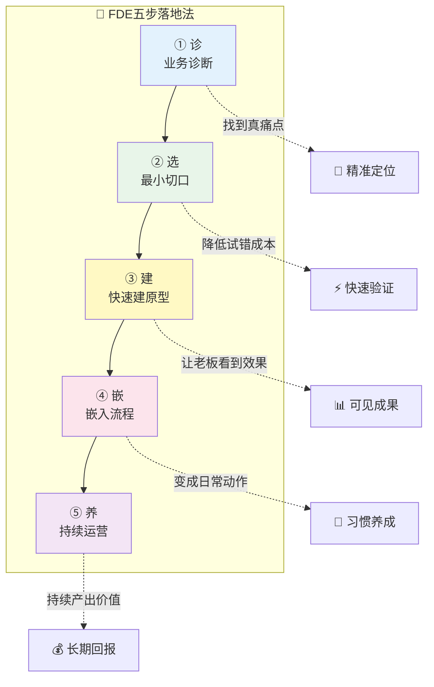

### 第一步：诊 —— 业务诊断（1-2天）

**核心目标**：找到企业 **真正能用AI解决的痛点**，而非老板想象的痛点。

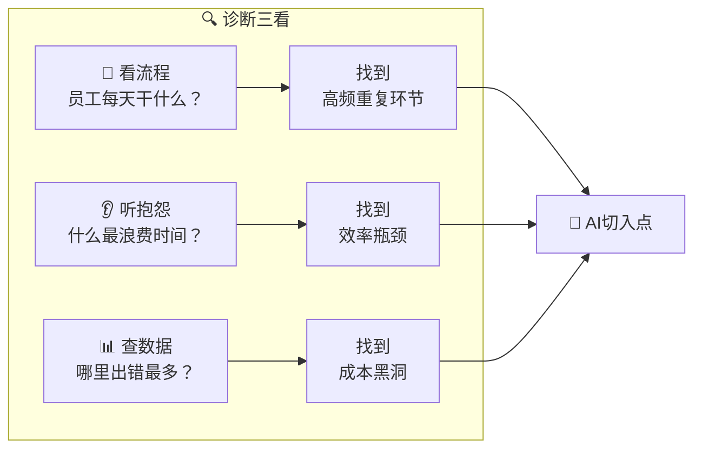

| 诊断维度 | 具体动作 | 关键问题 | 产出物 |
|:--------:|:--------:|:--------:|:------:|
| 👀 **看流程** | 跟岗观察一线员工半天 | "哪些步骤是机械重复的？" | 业务流程图 + 耗时标注 |
| 👂 **听抱怨** | 访谈3-5个不同岗位员工 | "你每天最烦的重复工作是什么？" | 痛点清单（按频率排序） |
| 📊 **查数据** | 调取业务系统数据 | "哪里出错率最高、返工最多？" | 效率瓶颈热力图 |
| 💡 **做判断** | 交叉验证三个维度 | "哪个痛点最适合AI解决？" | **AI切入点分析报告** |

> 💡 **方法论精髓**：不要问老板"你想用AI做什么"，要问一线员工"**你最讨厌的重复工作是什么**"。老板要的是面子，员工给的才是真相。

### 第二步：选 —— 最小切口（半天）

**核心目标**：从所有痛点中选出 **一个最适合AI切入的场景**，要求"小、痛、快"。

**选切口的「STP法则」**：

| 维度 | 英文 | 含义 | 判断标准 |
|:----:|:----:|:----:|:--------:|
| **S** | Small | 范围要小 | 一个部门、一个流程、一个动作 |
| **T** | Typical | 足够典型 | 解决了可以复制到其他场景 |
| **P** | Painful | 足够痛 | 大家深受其苦，有改变的动力 |

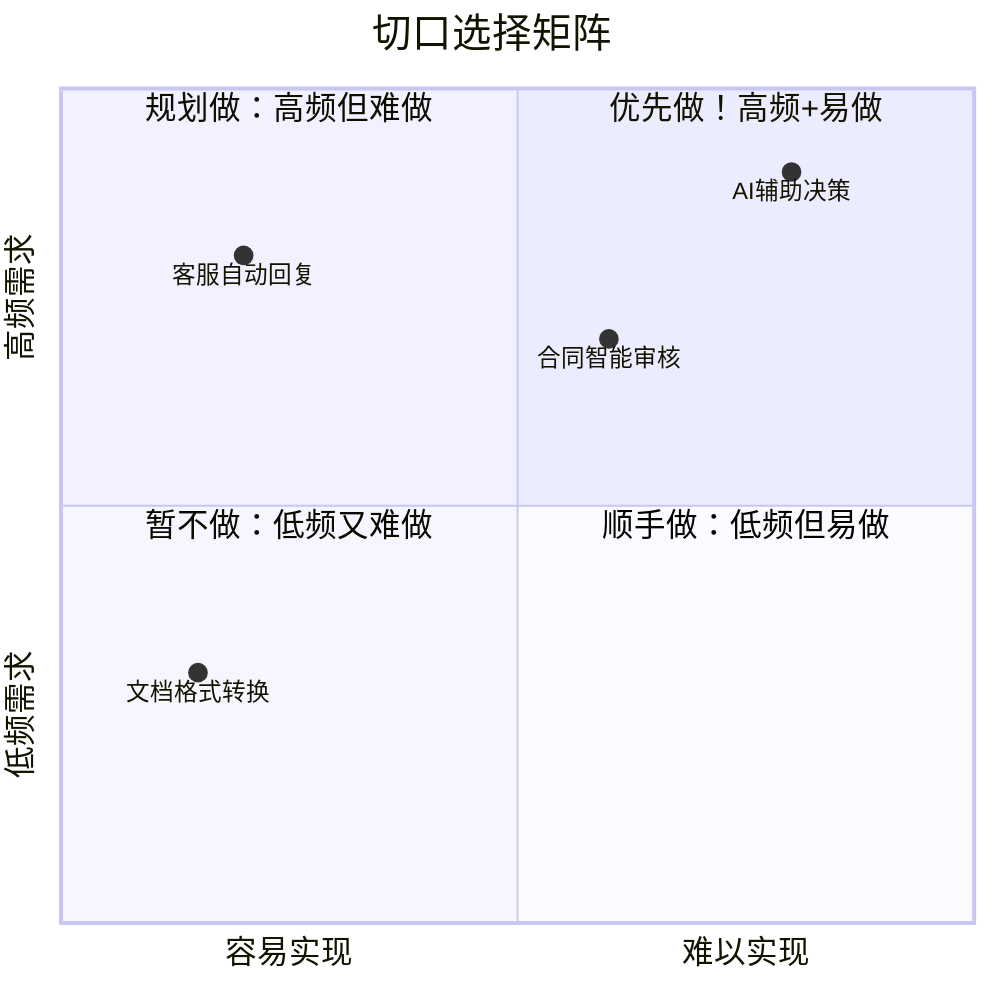

### 第三步：建 —— 快速建原型（3-5天）

**核心目标**：用最快速度做出 **能让老板和业务方"哇"一下的原型**。

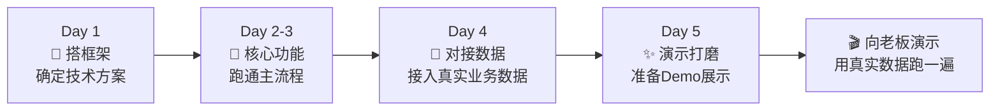

| 原型建设原则 | 说明 | 反面教材 |
|:------------:|:----:|:--------:|
| 🎯 **用真实数据** | 不用假数据，让老板看到自己的业务被AI处理 | "这是用模拟数据演示的效果" |
| ⚡ **只做核心链路** | 先跑通最重要的一步，不搞大而全 | "我们在做一个完整的系统" |
| 📊 **量化效果** | 用数字说话：节省X小时、准确率X% | "效果挺好的" |
| 🔄 **留改进接口** | 演示时说明"下一步可以加..." | "这个做完了" |

> 💡 **关键心法**：原型的目的是 **赢得信任和资源**，不是交付最终产品。"5分钟让老板点头" > "5周做一个完美系统"。

### 第四步：嵌 —— 嵌入流程（1-2周）

**核心目标**：把原型 **变成日常工作中不可或缺的一环**，让AI"消失"在流程里。

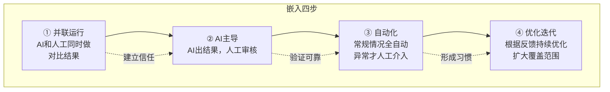

| 嵌入阶段 | 人的角色 | AI的角色 | 持续时间 | 成功标志 |
|:--------:|:--------:|:--------:|:--------:|:--------:|
| ① 并联运行 | 执行者（自己做，AI辅助） | 助手 | 1-2天 | 员工愿意尝试 |
| ② AI主导 | 审核者（AI出结果，人审核） | 执行者 | 3-5天 | 准确率>90% |
| ③ 自动化 | 监督者（只处理异常） | 主力 | 1-2周 | 80%场景无需人工 |
| ④ 优化迭代 | 优化者（提改进需求） | 自运转 | 持续 | 员工离不开它 |

> 💡 **方法论精髓**：嵌入的关键不是技术，而是 **改变人的习惯**。"并联运行"是让员工从"被迫接受"到"主动依赖"的过渡。

### 第五步：养 —— 持续运营（长期）

**核心目标**：让AI系统 **持续产生价值**，并扩展更多场景。

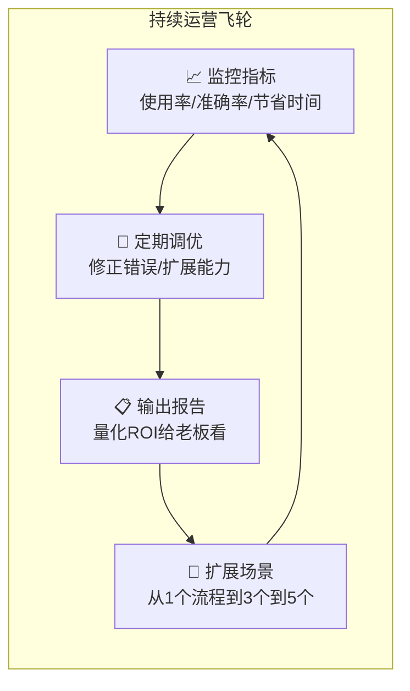

| 运营动作 | 频率 | 具体内容 | 产出物 |
|:--------:|:----:|:--------:|:------:|
| 📈 **指标监控** | 每周 | 使用次数、准确率、节省工时 | 周报仪表盘 |
| 🔧 **问题修复** | 实时 | 处理异常case、修正错误输出 | 问题修复日志 |
| 📋 **ROI报告** | 每月 | 量化节省成本、效率提升 | 月度价值报告 |
| 🚀 **场景扩展** | 每季 | 从成功案例复制到新场景 | 扩展计划书 |

### 方法论全景速查表

| 步骤 | 关键词 | 周期 | 核心产出 | 最大风险 | 避坑指南 |
|:----:|:------:|:----:|:--------:|:--------:|:--------:|
| ① 诊 | 找真痛点 | 1-2天 | 痛点分析报告 | 听老板的而非一线的 | **跟岗观察 > 开会讨论** |
| ② 选 | 最小切口 | 半天 | 切入场景定义 | 切口太大 | **STP：小+典型+痛** |
| ③ 建 | 快速原型 | 3-5天 | 可演示原型 | 追求完美 | **真实数据 > 完美架构** |
| ④ 嵌 | 嵌入流程 | 1-2周 | 日常使用习惯 | 强推硬上 | **并联运行 → 渐进替代** |
| ⑤ 养 | 持续运营 | 长期 | 持续ROI | 交付后不管 | **月度报告 → 持续扩展** |

---

## 七、如何先从事FDE：从零到一的行动路线

> 📍 **核心观点**：你不需要先成为"百万年薪的FDE"才能开始。FDE是一个 **在实战中生长出来的角色**——从今天开始，用下面的路线一步步走过去。

### 你是谁？四条入场路径

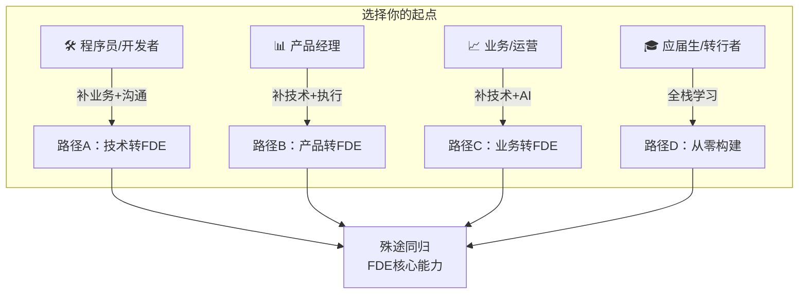

| 你的背景 | 入场路径 | 需要补的能力 | 优势 | 预计转型周期 |
|:--------:|:--------:|:------------:|:----:|:----------:|
| 🛠 程序员/开发者 | 技术转FDE | 业务理解、沟通表达、产品思维 | 技术功底扎实 | 3-6个月 |
| 📊 产品经理 | 产品转FDE | 代码能力、系统集成、AI工具实操 | 需求理解力强 | 4-8个月 |
| 📈 业务/运营 | 业务转FDE | 编程基础、AI工具、工程思维 | 深谙业务痛点 | 6-12个月 |
| 🎓 应届生/转行 | 从零构建 | 全部四项能力 | 无包袱、学习快 | 6-12个月 |

### 核心能力建设：16周学习计划

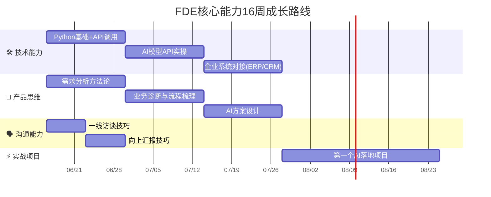

> 💡 四个模块并行推进，不是串行。技术学2周就开始做项目，边做边补其他能力。

### 技术能力路线图（最核心的硬功夫）

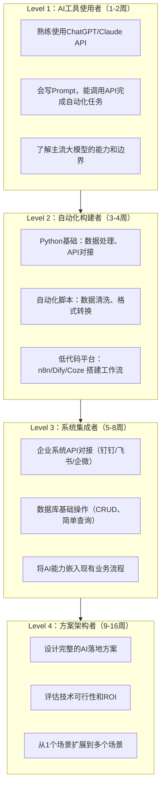

### 实战项目：你的第一个FDE案例

> 🎯 **不要等到"学完了"再做——今天就找一个场景开始。**

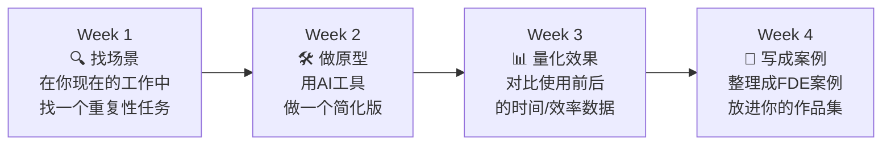

| 推荐练手项目 | 难度 | 涉及能力 | 预期产出 |
|:-----------:|:----:|:--------:|:--------:|
| 📧 邮件/消息自动分类回复 | ⭐ | API调用+Prompt | 自动化脚本 |
| 📋 周报/日报自动汇总生成 | ⭐⭐ | 数据处理+模板 | 生成系统 |
| 📞 客户咨询智能分流 | ⭐⭐ | 意图识别+对接IM | 分流机器人 |
| 📑 合同/文档智能审核 | ⭐⭐⭐ | NLP+规则引擎 | 审核工具 |
| 📊 销售数据自动分析报告 | ⭐⭐⭐ | 数据分析+可视化 | 报告生成器 |

### 求职准备：FDE面试通关清单

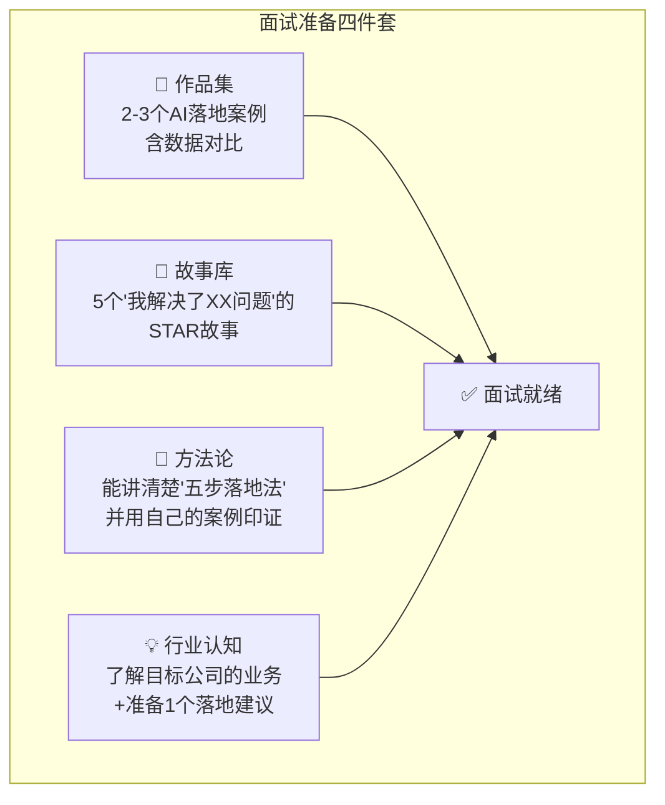

| 准备项 | 具体内容 | 常见面试题 |
|:------:|:--------:|:----------:|
| 📁 **作品集** | 2-3个案例，每个包含：痛点→方案→原型→效果数据 | "给我看一个你做的AI落地项目" |
| 🎤 **故事库** | STAR格式：情境→任务→行动→结果（带数字） | "说说你遇到的最大挑战" |
| 🧠 **方法论** | 五步落地法 + 自己的理解和变体 | "你怎么从零开始帮企业落地AI？" |
| 💡 **行业认知** | 研究目标客户行业，准备一个"如果我做你们的FDE"方案 | "你觉得我们公司最适合用AI改造的环节是什么？" |

### 职业成长阶梯

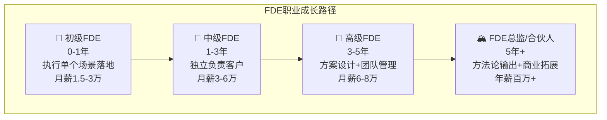

| 阶段 | 核心能力 | 典型工作 | 薪资范围 | 突破关键 |
|:----:|:--------:|:--------:|:--------:|:--------:|
| 🌱 初级FDE | 技术执行、快速原型 | 按方案落地一个AI场景 | 1.5-3万/月 | **做出第一个成功案例** |
| 🌿 中级FDE | 独立诊断、方案设计 | 独立负责1-2个客户 | 3-6万/月 | **积累3+跨行业案例** |
| 🌳 高级FDE | 方案架构、团队赋能 | 设计多场景方案、带团队 | 6-8万/月 | **方法论沉淀+可复制** |
| 🏔 FDE总监 | 商业洞察、战略级方案 | 商业拓展、行业影响力 | 年薪百万+ | **建立个人品牌** |

### 今天就做：FDE入门第一步

> 🚀 **不等"准备好了"再开始，而是"开始了"才能准备好。**

| 时间 | 行动 | 产出 |
|:----:|:----:|:----:|
| **今天** | 列出你当前工作中3个最重复的任务 | 痛点清单 |
| **本周** | 选1个任务，用ChatGPT/Claude API做一个自动化脚本 | 第一个原型 |
| **下周** | 量化效果（节省了多少时间），写成案例 | 第一个案例 |
| **本月** | 学完Python基础 + AI API调用，再做1-2个案例 | 作品集雏形 |
| **3个月后** | 有3个案例，开始投递FDE岗位 | 求职启动 |

---

## 📋 全文总结

```mermaid
graph TD
    A["AI进入下半场<br/>拼落地"] --> B["FDE成为关键角色<br/>四能复合人才"]
    B --> C["百万年薪<br/>中小企业用不起"]
    C --> D["80%工作可AI自动化"]
    D --> E["成本大众化<br/>中小企业破局"]
    E --> F["五步落地法<br/>诊→选→建→嵌→养"]
    F --> G["今天开干<br/>找场景→做原型→写案例"]
    G --> H["🎯 成为FDE<br/>AI真正普惠"]
```

| 问题 | 答案 |
|:----:|:----:|
| 行业趋势是什么？ | 从"拼模型"转向"拼落地" |
| 谁是关键角色？ | FDE（前置交付工程师） |
| 为什么稀缺？ | 四能复合（技术+产品+沟通+执行），不足10%工程师愿意做 |
| 中小企业怎么办？ | AI自动化80%重复劳动，成本降至可负担 |
| **FDE怎么做？** | **五步落地法：诊→选→建→嵌→养** |
| **怎么入门FDE？** | **今天就找场景→做原型→量化效果→写案例→3个月后求职** |
| 最终目标是什么？ | 让AI落地成本大众化，实现AI普惠 |

---

## 🔗 关联笔记

- [[2026-06-11 AI智能体的核心心法]] — AI智能体使用的"三件事法则"是FDE技术能力的底层基本功
- FDE的方法论（五步落地法）= 把「智能体三件事」从个人效率 → 放大到企业级落地
