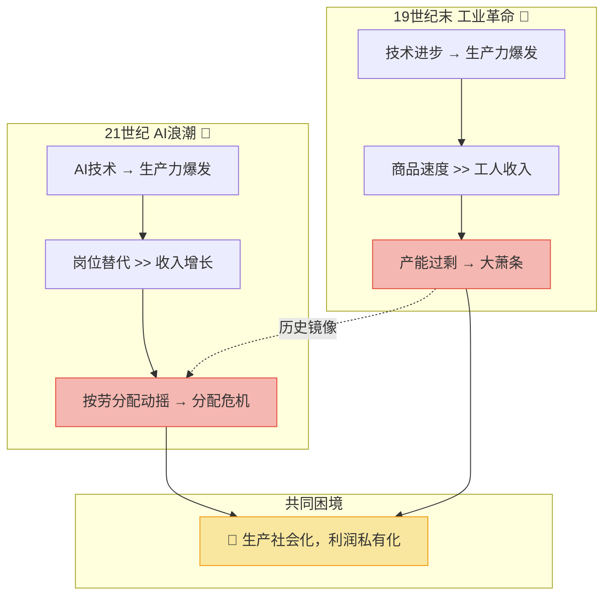
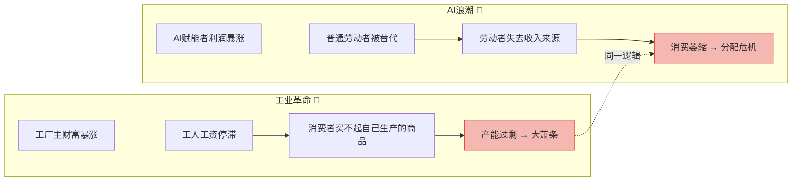
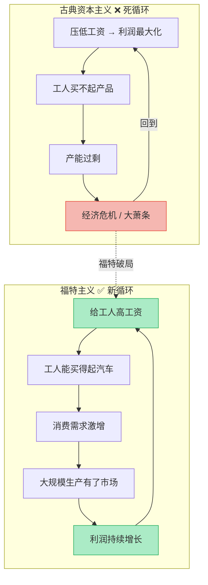
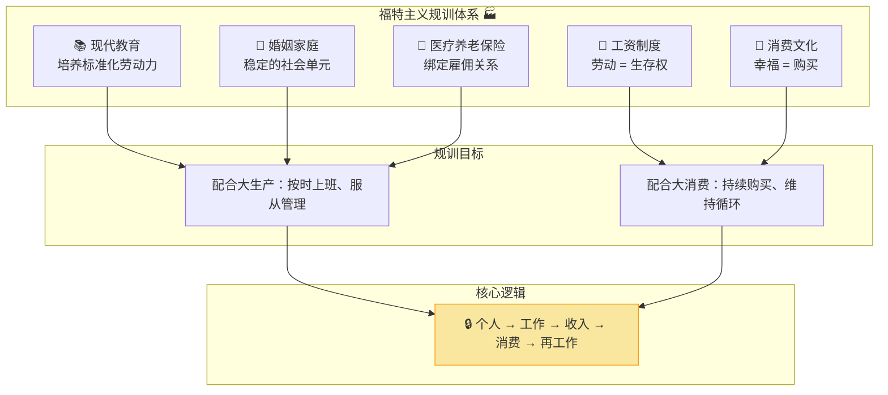
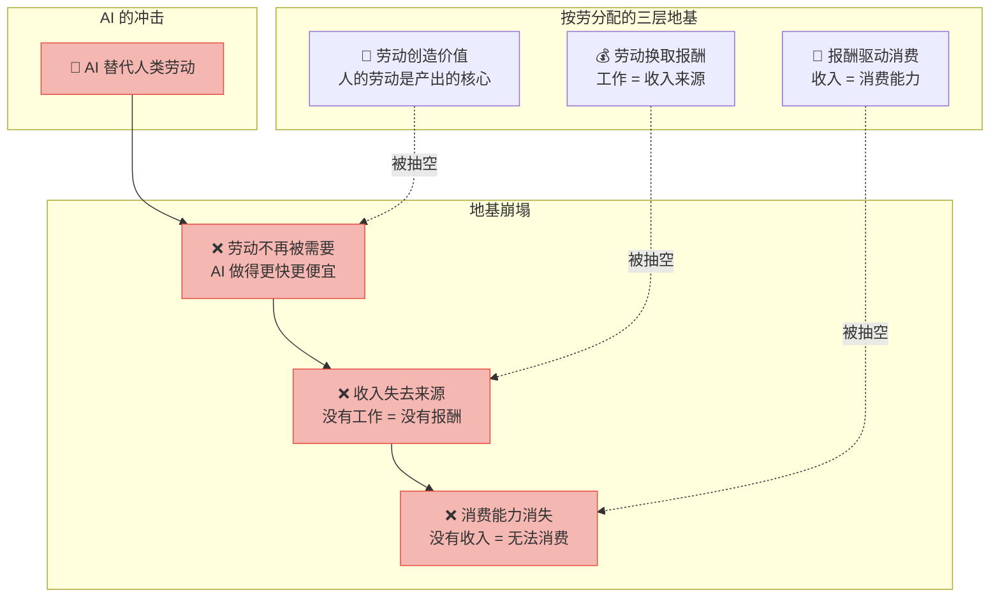
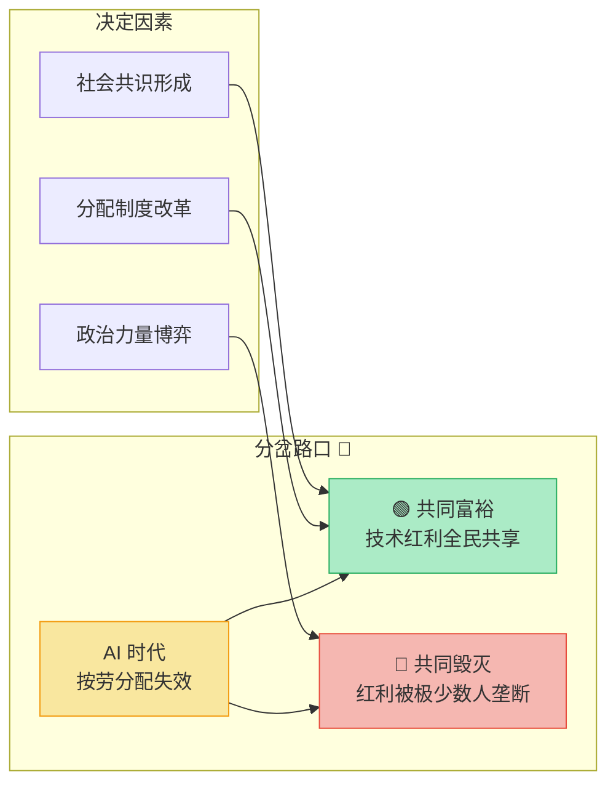
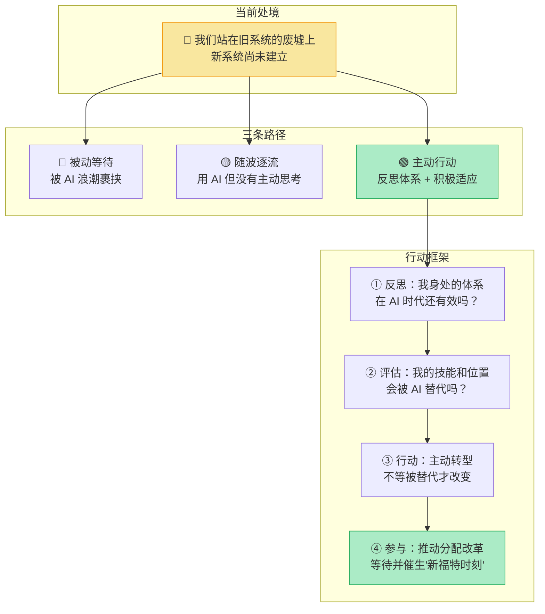
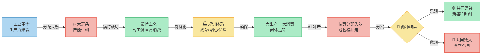

# AI时代的分配困局：从工业革命到"福特时刻"

> 核心观点：通过对比19世纪末工业革命与21世纪AI浪潮，揭示技术革命背后的**社会分配问题**。AI正在动摇传统的按劳分配体系，引发"共同富裕"还是"共同毁灭"的终极之问。关键在于——如何将AI带来的**时代红利**分配给普通人。

---

## 全景总览：两次技术革命的镜像对照

> 💡 **一句话总结**：历史不会重复，但会**押韵**——两次革命的核心矛盾不是技术，而是**分配**。

---

## 一、历史的镜子：工业革命 vs AI浪潮

### 两次革命的结构性对比

| 维度 | 工业革命（19世纪末-20世纪初） | AI浪潮（21世纪） |
|------|-------------------------------|------------------|
| **核心技术** | 蒸汽机、电力、流水线 | AI、机器人、大模型 |
| **生产力变化** | 商品生产速度暴增 | 知识/服务产出速度暴增 |
| **收入增长** | 工人收入远落后于产能 | 普通劳动者收入增长停滞 |
| **核心矛盾** | 产能过剩 + 消费不足 | 岗位替代 + 按劳分配失效 |
| **社会后果** | "大萧条"——荒诞的"贫困中的富裕" | 贫富分化加剧，中产焦虑 |
| **分配结构** | 生产社会化，利润私有化 | 生产社会化，利润私有化（更极端） |

### 矛盾的镜像

> 🔑 **关键洞察**：两次革命的底层逻辑完全一致——**生产力的爆发如果没有匹配的分配机制，就会从繁荣走向危机**。

---

## 二、消费主义的诞生：福特主义的"续命"

### 古典资本主义的分配死局

面对"生产社会化，利润私有化"的零和博弈，古典资本主义陷入了一个结构性死结：工厂主拼命压低工人工资以最大化利润，却没人意识到——**如果工人买不起产品，整个系统就会崩溃**。

### 福特的破局：一场"结构性调整"

亨利·福特做出了一个当时看来疯狂的决定：**给工人前所未有的高工资和福利**。

### 福特主义的本质

| 维度 | 内容 |
|------|------|
| **核心逻辑** | 让工人消费自己生产的产品，解决产能过剩 |
| **历史意义** | 资本主义历史上**唯一一次**分配模式的结构性调整 |
| **运作方式** | 高工资 + 福利保障 → 大众消费能力 → 大生产有市场 |
| **双赢结果** | 工人获得体面生活，资本家获得持续增长 |
| **副作用** | 催生了一整套"规训体系"——确保人们持续工作和消费 |

> 💡 **关键洞察**：福特主义不是慈善，而是资本主义的**自我拯救**——通过重新分配，让"大生产"和"大消费"形成闭环。

---

## 三、现代社会的规训体系：福特主义的遗产

### 规训体系全景

福特主义的遗产不仅是消费主义，还包括一整套为工业社会量身定制的**规训工具**。这套体系将个人牢牢绑定在"生产-消费"的链条上。

### 规训工具拆解

| 规训工具 | 表面功能 | 深层目的 | 在工业体系中的角色 |
|----------|----------|----------|-------------------|
| **📚 现代教育** | 传授知识技能 | 培养服从纪律的标准化劳动力 | 为大生产提供"合格零件" |
| **💒 婚姻家庭** | 情感归属 | 稳定社会单元，培养下一代劳动者 | 劳动力的"再生产"机制 |
| **🏥 医疗养老保险** | 社会保障 | 将个人绑定在雇佣关系中 | 失去工作 = 失去保障 → 不敢离开 |
| **💼 工资制度** | 劳动报酬 | 将生存权与雇佣劳动挂钩 | "不工作就活不下去"的底层逻辑 |
| **🛒 消费文化** | 生活品质 | 制造持续的消费需求 | 确保"大生产"的终端——有人买单 |

> 🔑 **关键洞察**：我们以为自己在"自由选择"，实际上从教育到退休，每一步都走在**福特主义设计的轨道**上。这套体系不是阴谋，而是工业时代的**最优解**——但它的根基是"劳动有价值"。

---

## 四、AI时代的分配困境：地基被动摇

### 核心冲击：劳动变得"可有可无"

当AI能够替代大部分人类劳动时，按劳分配的**地基**就被抽走了。这不是渐进的变化，而是结构性崩塌。

### AI时代的两种可能结局

| 维度 | 🟢 共同富裕（乐观路径） | 🔴 "黑客帝国"式困境（悲观路径） |
|------|--------------------------|-------------------------------|
| **技术红利分配** | AI 红利通过 UBI / 公共服务等方式惠及全民 | AI 红利被少数人垄断，大多数被边缘化 |
| **人的角色** | 从劳动中解放，追求创造力和自我实现 | 沦为"无用阶级"，失去经济和社会价值 |
| **社会结构** | 扁平化、去中心化的协作社会 | 极端分层：AI赋能者 vs 被替代者 |
| **消费模式** | 基本需求由社会公共供给覆盖 | 消费能力断裂，经济循环崩溃 |
| **历史类比** | 福特主义的升级版——"新福特时刻" | 大萧条的极端版——"共同毁灭" |
| **关键变量** | 分配制度的改革速度 | 技术替代的速度 vs 制度变革的速度 |

> 💡 **核心之问**：AI 时代的"福特时刻"会不会到来？——即一种**新的分配模式**，让技术红利不再是少数人的盛宴。

---

## 五、未来之路：等待21世纪的"福特时刻"

### 在旧系统中寻找位置

### 个人行动指南

| 步骤 | 行动 | 核心问题 | 目标 |
|------|------|----------|------|
| **① 反思** | 审视自己身处的现代体系 | "教育-工作-消费"这条路在 AI 时代还走得通吗？ | 看清自己所处的"规训轨道" |
| **② 评估** | 评估自身技能的价值 | 我的工作中，哪些部分 AI 已经能做？ | 识别被替代的风险等级 |
| **③ 行动** | 主动学习和转型 | 如何从"被 AI 替代"变成"与 AI 协同"？ | 占据 AI 无法替代的位置 |
| **④ 参与** | 关注并推动分配制度变革 | 新的"福特时刻"需要什么条件？ | 不做旁观者，参与塑造未来 |

### 分配模式演化全景

| 时代 | 分配模式 | 核心逻辑 | 当前状态 |
|------|----------|----------|----------|
| **前工业时代** | 按地分配 | 有地则有粮 | ✅ 已被替代 |
| **工业时代早期** | 按资分配 | 有资本则有利润 | ⚠️ 仍在运作，但加剧分化 |
| **工业时代成熟期** | 按劳分配（福特主义） | 工作 = 收入 = 消费 | 🔴 地基被 AI 动摇 |
| **AI 时代** | **？新分配模式** | 技术红利如何惠及全民？ | ❓ 尚未出现——等待"新福特时刻" |

> 🔑 **关键洞察**：每一次分配模式的变革，都发生在**旧模式无法维系**之时。AI 正在让按劳分配走向同样的结局——而新模式的诞生，需要一个新的"福特"。

---

## 六、逻辑记忆框架

### 逻辑链记忆法

> **一句话记忆**：**生产力爆发 → 分配失衡 → 福特主义续命 → 规训体系固化 → AI 冲击地基 → 等待新福特时刻**

### 核心认知升级

| 维度 | 旧认知 | 新认知 |
|------|--------|--------|
| **技术革命** | 技术进步 = 更多就业 | 技术进步可能**消灭**就业，但创造新的分配问题 |
| **消费主义** | 自由选择的生活方式 | 福特主义的遗产——为配合大生产而设计的**规训工具** |
| **按劳分配** | 天经地义的公平原则 | 特定历史阶段的产物，其地基正在被 AI **抽走** |
| **社会制度** | 自然形成的秩序 | 为配合特定生产方式而设计的**工具**，可以被改变 |
| **个人定位** | 在体系中努力攀登 | 先**反思体系本身**是否还有效，再决定方向 |
| **未来走向** | 渐进式改善 | 需要**结构性变革**——等待并催生"新福特时刻" |

### 全文逻辑地图

| 章节 | 核心问题 | 关键答案 |
|------|----------|----------|
| **全景总览** | 两次革命有何共同点？ | 生产力爆发 + 分配失衡 = 社会危机 |
| **历史的镜子** | 工业革命和 AI 浪潮有何相似？ | "生产社会化，利润私有化"的同一逻辑 |
| **福特主义** | 资本主义如何续命？ | 高工资 → 大众消费 → 唯一一次结构性分配调整 |
| **规训体系** | 现代制度为何如此？ | 为配合大生产和大消费而设计的整套工具 |
| **AI 分配困境** | AI 时代为何不同？ | 按劳分配的地基被抽走——劳动变得可有可无 |
| **未来之路** | 个人该如何行动？ | 反思体系、评估位置、主动转型、参与变革 |

---

## 一句话终极心法

> **我们不是站在技术的十字路口，而是站在分配的十字路口。AI 不是问题——问题是我们有没有智慧，创造一个让技术红利惠及每个人的新"福特时刻"。**
