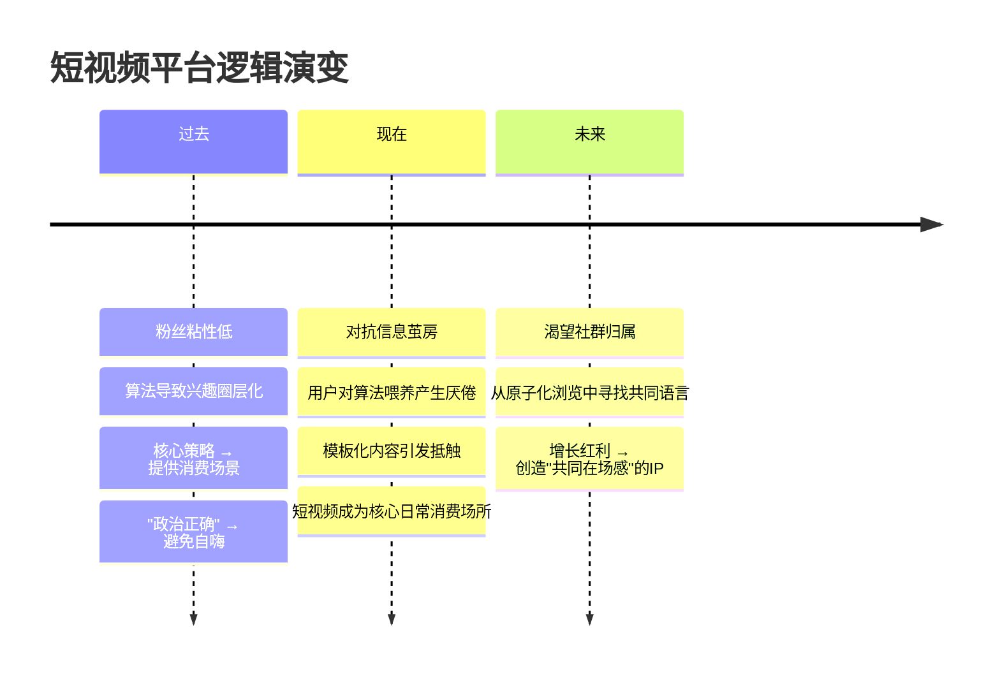
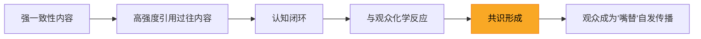
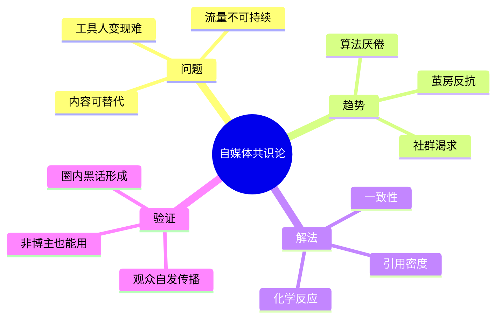

# 自媒体IP的"共识"时代：从工具人到社群领袖

> **核心论点**：自媒体的未来属于能为观众提供"共识"的IP，而非单纯输出知识的"工具人博主"。

---

## 一、为什么"工具人博主"走不远？

### 1.1 困境总览

| 困境维度 | 具体表现 | 根本原因 |
|---------|---------|---------|
| 💰 变现困难 | 垂直干货博主难以推广高客单价产品；低客单价走量需要巨大流量 | 知识本身不具备溢价，同质化严重 |
| 📉 流量不稳 | 难以打造持续爆款，偶尔成功后流量迅速衰减 | 粉丝粘性低，内容缺乏情感锚点 |
| 🔄 可替代性强 | 模板化内容易被模仿和复制 | 输出的是"信息"而非"认同" |

### 1.2 核心矛盾

```
信息越丰富 → 干货越廉价 → 工具人越可替代 → 变现越困难
```

---

## 二、平台逻辑的三次变迁



### 关键转折点

| 阶段 | 用户心理 | 内容策略 | 变现模式 |
|------|---------|---------|---------|
| **过去** | "给我有用的" | 围绕产品/营销，提供消费场景 | 直接带货 |
| **现在** | "我受够了算法" | 对抗同质化，寻找真实感 | 信任溢价 |
| **未来** | "我要找到同类" | 创造共识，构建社群 | IP认同变现 |

---

## 三、什么是"共识"型内容？

### 3.1 定义与核心机制



> **一句话记忆**：共识 = 一致性 × 引用密度 × 化学反应

### 3.2 "共识" vs "工具人"对比

| 对比维度 | 🛠️ 工具人博主 | 🤝 共识型IP |
|---------|-------------|------------|
| 内容本质 | 信息传递 | 身份认同 |
| 与观众关系 | 教-学（单向） | 共创-共鸣（双向） |
| 内容特征 | 干货、技巧、教程 | 梗、黑话、内部笑点 |
| 传播动力 | "这个有用，转发" | "这说的就是我！" |
| 粉丝粘性 | 低（用完即走） | 高（社群归属） |
| 变现天花板 | 低（课程/低价带货） | 高（品牌溢价/社群付费） |
| 护城河 | 弱（易被替代） | 强（历史内容沉淀） |

---

## 四、案例拆解

### 成功案例

| 案例 | 共识触发点 | 传播机制 |
|------|-----------|---------|
| 🦶 娱乐网红"大脚趾毛" | 一个荒诞的身体特征梗 | 网友集体玩梗 → 形成圈内暗号 |
| 🧠 商业博主"dontbesilent" | 反复强调"这是个心理问题" | 金句被圈子内广泛引用 → 成为共识标签 |

### ❌ 反面案例（伪共识）

> **"超级个体"、"从100w到1000w"** — 这类口号式叙事看似有凝聚力，实则千篇一律，缺乏独特性和互动性，无法构成真正的共识。

**判别标准**：真正的共识必须能被**观众自发引用和再创作**，而不是只能由博主本人重复。

---

## 五、逻辑记忆框架



### 🧠 一句话总结

> 当信息不再稀缺，**稀缺的是归属感**。谁能让观众觉得"这是我们自己的圈子"，谁就掌握了下一个时代的流量密码。

---

## 六、行动思考

- [ ] 我的内容是否有"被观众引用和再创作"的潜力？
- [ ] 我是否有持续输出的**一致性主线**？
- [ ] 我想打造什么样的个人IP？——知识专家 or 共识领袖？
