# AI Agent 长期记忆系统设计解析

为AI Agent设计长期记忆，不能仅靠简单的RAG（检索增强生成）。真正的挑战在于处理记忆的**动态变化**与**内在关联**。核心思路是一个"热-温-冷"三层架构，并通过"记录-检索-反思"的闭环实现Agent的**自我进化**。

> 💡 **一句话总结**：真正的记忆 ≠ RAG，而是分层管理 + 双模存储 + 进化闭环。

---

## 一、核心挑战：超越简单的RAG

面试官指出，直接回答"用RAG"是不够的。RAG像一个搜索引擎，无法处理复杂的记忆问题。

| 维度 | ❌ 简单RAG的局限 | ✅ 真正的记忆系统 |
|------|------------------|-------------------|
| **记忆冲突** | 无法处理，如用户上周和上上周的偏好矛盾 | 理解时间线，自动解决冲突 |
| **推理能力** | 仅做相似度匹配 | 像人一样推理："昨天不爱吃香菜 → 今天大概率也不爱" |
| **管理方式** | 扁平存储，简单堆砌 | 分层管理 + 深度理解 |

---

## 二、记忆架构："热-温-冷"三层设计

借鉴人类记忆的工作方式，Agent的记忆系统应采用分层架构，以平衡**速度、容量和效率**。

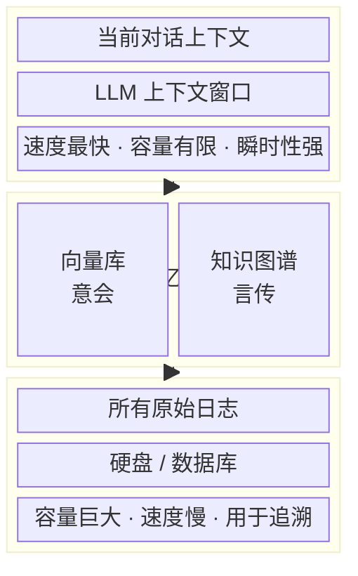

| 层级 | 作用 | 存储方式 | 特点 |
|------|------|----------|------|
| 🔴 **热记忆** | 当前对话上下文 | LLM上下文窗口 | 速度最快，但容量有限，瞬时性强 |
| 🟡 **温记忆** | 长期偏好与知识 | 向量库 + 知识图谱 | **核心层**，负责"意会"与"言传" |
| 🔵 **冷记忆** | 所有原始日志 | 硬盘/数据库 | 容量巨大，但速度慢，用于追溯 |

> 🔑 **关键洞察**：温记忆是整个系统的**核心**，向下沉淀冷记忆，向上支撑热记忆。

---

## 三、核心引擎：温记忆的双模存储

"温记忆"是整个系统的核心，它需要同时处理两种不同类型的信息，因此采用了"向量库 + 知识图谱"的双模存储方案。

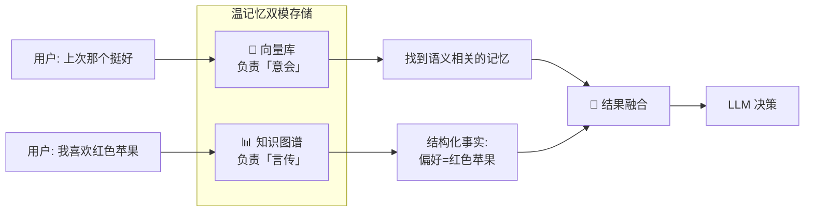

| 存储类型 | 功能 | 应用场景 | 类比 |
|----------|------|----------|------|
| **向量库** | 负责"意会"，理解"感觉上相似"的东西 | 用户说"上次那个挺好"，能找到相关记忆 | 人的**直觉** |
| **知识图谱** | 负责"言传"，存储结构化的事实 | 明确记录"谁是谁的老板"、"用户喜欢红色苹果" | 人的**逻辑** |

---

## 四、记忆的生命周期：记录与检索

记忆系统的核心流程分为"**记录**"和"**检索**"两大环节，确保信息被有效管理和利用。

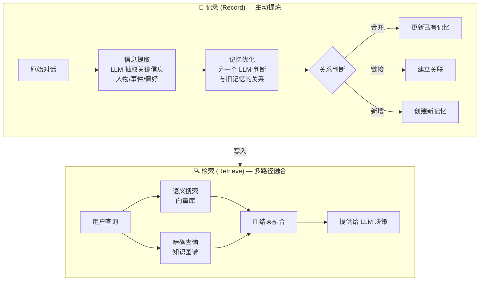

### 记录 (Record)：信息的提炼与整合

记录过程并非简单地存储原始对话，而是一个**主动提炼**和优化的过程：

| 步骤 | 操作 | 说明 |
|------|------|------|
| 1️⃣ 信息提取 | LLM 抽取关键信息 | 从对话中提取人物、事件、偏好等 |
| 2️⃣ 记忆优化 | 另一个 LLM 充当"优化器" | 判断新信息与旧记忆的关系 |
| 3️⃣ 关系决策 | 合并 / 链接 / 新增 | 防止记忆库变得混乱 |

### 检索 (Retrieve)：多路径融合

检索时，系统会**兵分两路**，然后融合结果，以提供最全面的信息。

| 路径 | 来源 | 特点 |
|------|------|------|
| **语义搜索** | 向量库 | 查找"感觉上"相关的记忆 |
| **精确查询** | 知识图谱 | 查找事实性的信息 |
| **结果融合** | 两路整合 | 整合后提供给 LLM 进行决策 |

---

## 五、高级能力：记忆驱动的自我进化

高级的Agent不仅能记忆，还能从记忆中学习，形成一个**进化闭环**。

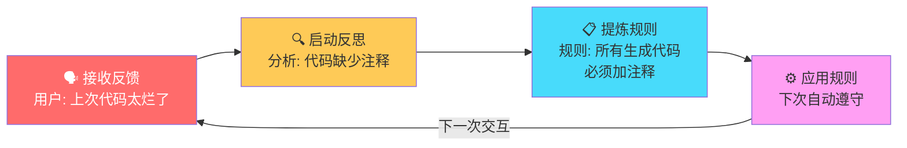

| 阶段 | 动作 | 示例 |
|------|------|------|
| 1️⃣ 接收反馈 | 捕获用户的正面/负面评价 | "上次给的代码太烂了" |
| 2️⃣ 启动反思 | 分析问题根源 | "代码缺少注释" |
| 3️⃣ 提炼规则 | 将教训总结为可复用规则 | "所有生成代码必须加注释" |
| 4️⃣ 应用规则 | 下次自动遵守，实现**自我进化** | 生成代码时自动附带注释 |

---

## 六、生产实践：挑战与解决方案

在实际应用中，记忆系统会面临各种挑战，但都有相应的解决思路。

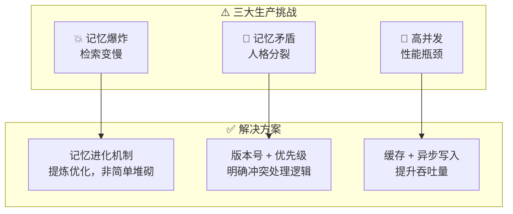

| 挑战 | 问题描述 | 解决方案 |
|------|----------|----------|
| 💥 **记忆爆炸** | 记忆量激增，检索变慢 | 通过"记忆进化"机制，不断提炼和优化知识，而非简单堆砌 |
| 🔀 **记忆矛盾** | 新旧记忆冲突，导致"人格分裂" | 为规则添加**版本号**和**优先级**，明确冲突时的处理逻辑 |
| 🚀 **高并发瓶颈** | 大量请求下性能下降 | 使用**缓存**和**异步写入**等技术，提升系统吞吐量 |

---

## 七、总结：构建会学习的智能体

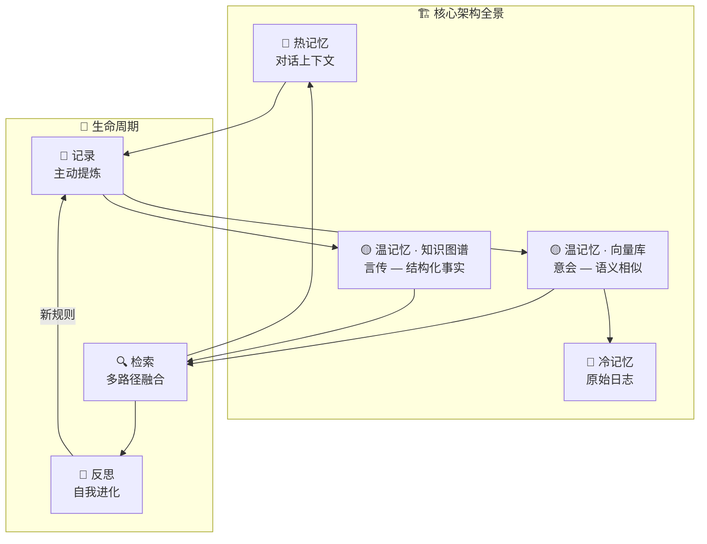

> 💡 **面试官想听到的**，不是简单罗列技术名词，而是一个能体现深度思考的完整方案。

**核心要点回顾**：

| 关键概念 | 核心思想 |
|----------|----------|
| **分层架构** | 热-温-冷三层，平衡速度、容量与效率 |
| **双模存储** | 向量库（意会）+ 知识图谱（言传），覆盖两类记忆需求 |
| **进化式记录** | 主动提炼 + 关系判断，而非简单堆砌 |
| **多路径检索** | 语义搜索 + 精确查询，融合后提供给 LLM |
| **自我进化** | 反馈 → 反思 → 规则 → 应用，形成学习闭环 |

---

## 八、实战案例

理论最终需要落地。以下通过三个递进案例，展示记忆系统在不同复杂度场景中的实际应用。

### 案例一：个人 AI 助手 — "懂你的贴心管家"

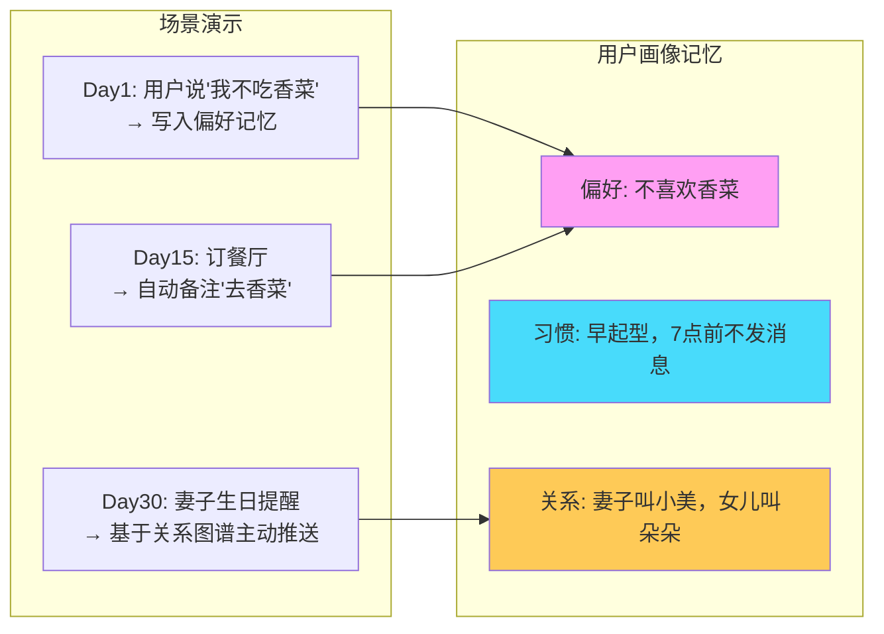

**记忆运作细节**：

| 时间线 | 用户输入 | 记忆动作 | 存储位置 |
|--------|----------|----------|----------|
| Day 1 | "我不吃香菜" | **新增**：偏好 → 饮食禁忌 | 温记忆 · 知识图谱 |
| Day 3 | "上次那个餐厅不错" | **链接**：关联餐厅记忆与偏好记忆 | 温记忆 · 向量库 |
| Day 7 | "帮我订明天餐厅" | **检索**：调取偏好 → 自动备注 | 热记忆 → LLM 决策 |
| Day 15 | 订餐场景复现 | **推理**：无需提醒，自动去香菜 | 记忆驱动行为 |
| Day 30 | 无交互 | **主动**：基于关系图谱推送提醒 | 冷记忆 → 温记忆激活 |

> 🔑 **亮点**：记忆不仅被动响应，还能**主动驱动行为**——这是从"工具"到"管家"的跃迁。

---

### 案例二：智能客服 — "记住每一次对话的品牌"

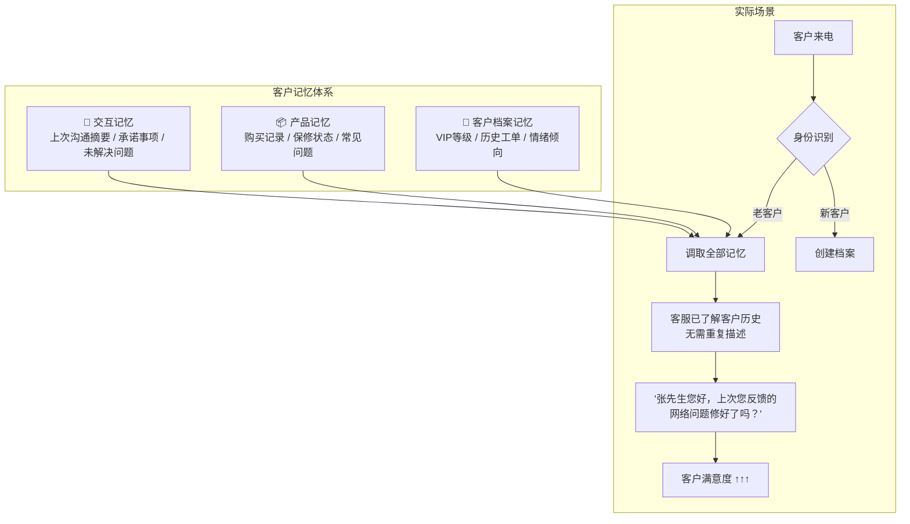

**核心记忆策略对比**：

| 策略 | 无记忆系统 | 有记忆系统 | 差异化价值 |
|------|-----------|-----------|-----------|
| **身份识别** | 每次要求提供账号 | 来电即识别，直接称呼 | 客户尊贵感 |
| **问题处理** | "请您描述一下问题" | "上次您反馈的网络问题，现在好了吗？" | 减少重复沟通 |
| **承诺追踪** | 客服承诺后无法追踪 | 记忆未解决事项，主动回访 | 信任度 ↑ |
| **情绪感知** | 无法感知情绪变化 | 检测到客户情绪恶化 → 升级处理 | 危机预防 |
| **个性化服务** | 千人一面 | 根据历史偏好推荐方案 | 转化率 ↑ |

**记忆冲突解决实例**：

```
场景：客户上次说"我对价格敏感"，但本次说"给我最好的方案"
┌──────────────────────────────────────────────────────┐
│  记忆版本 1（旧）：价格敏感度高                        │
│  记忆版本 2（新）：本次需求优先级 > 价格                │
│                                                      │
│  记忆优化器判断：这不是矛盾，而是【场景升级】            │
│  → 更新规则：日常 → 价格敏感；重要决策 → 质量优先       │
│  → 保留版本链：v1(2026-05-01) → v2(2026-06-12)       │
└──────────────────────────────────────────────────────┘
```

---

### 案例三：编程助手 — "从写代码到理解团队"

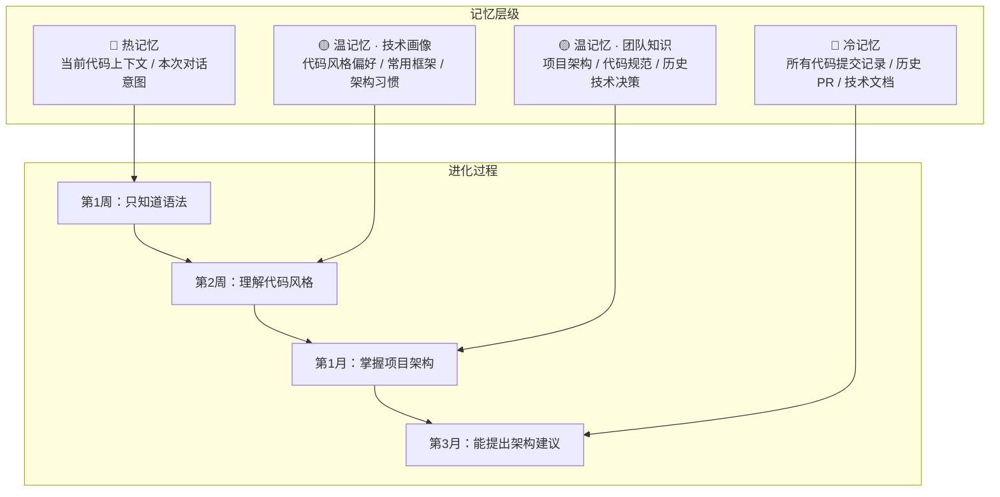

**编程助手记忆进化时间线**：

| 阶段 | 记忆积累 | 能力表现 | 记忆类型驱动 |
|------|----------|----------|-------------|
| **第1周** | 语言偏好、IDE 设置 | 正确格式化代码，使用偏好的语法糖 | 热记忆 |
| **第2周** | 常用库、命名习惯 | 推荐符合团队风格的代码，避免已弃用的API | 温记忆 · 向量库 |
| **第1月** | 项目架构、模块依赖 | 新代码自动放到正确模块，遵循分层约定 | 温记忆 · 知识图谱 |
| **第3月** | 历史技术决策与原因 | 能解释"为什么用这个方案"，并避免已踩过的坑 | 温记忆 + 冷记忆联合检索 |

**实际交互示例**：

```
┌─────────────────────────────────────────────────────────┐
│  开发者：帮我写个用户认证模块                              │
│                                                         │
│  无记忆助手：                                            │
│  → 生成通用 JWT 认证代码                                 │
│  → 可能与项目现有架构冲突                                 │
│                                                         │
│  有记忆助手：                                            │
│  → 检索知识图谱：项目使用 NextAuth + Prisma              │
│  → 检索向量库：上次类似模块用了 middleware 模式           │
│  → 检索冷记忆：团队曾弃用 session 方案（附原因）          │
│  → 生成代码：符合项目规范，避免历史踩坑                    │
│  → 附注："根据3月15日的技术讨论，建议避免X方案"            │
└─────────────────────────────────────────────────────────┘
```

> 🔑 **核心价值**：编程助手从"代码生成器"进化为"团队技术成员"，记忆是关键。

---

## 九、最高级思考问答

以下是面试官可能提出的**终极追问**，以及体现深度思考的回答策略。

---

### Q1：记忆系统应该"记住一切"还是"主动遗忘"？

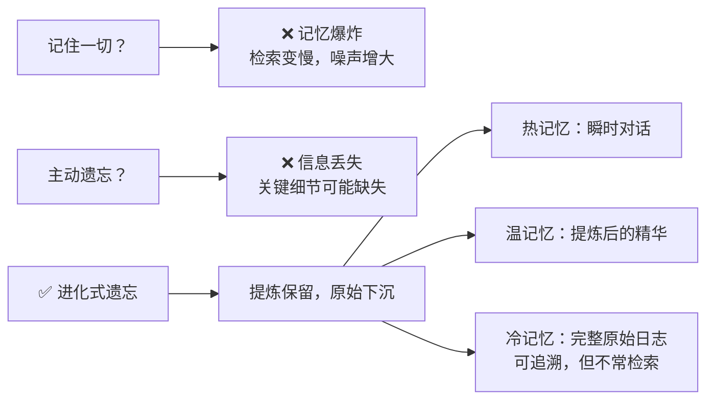

**回答要点**：

| 策略 | 做法 | 类比人类 |
|------|------|----------|
| **分层衰减** | 热记忆自然过期 → 温记忆定期提炼 → 冷记忆长期归档 | 人会忘记"昨天午餐吃了什么"，但记住"不喜欢吃香菜" |
| **重要性加权** | 高频被检索的记忆自动"升温"，长期不用的逐渐"降温" | 常用的知识随时能想起，不用的需要提示才能回忆 |
| **提炼而非删除** | 原始数据永不删除（冷记忆），但温记忆只保留提炼后的精华 | 你不会记住每本书的每一页，但会记住核心观点 |

> 💡 **高级回答**：好的记忆系统不是"记住一切"，而是像人脑一样——**记住重要的，提炼必要的，保留可追溯的**。遗忘不是缺陷，而是一种能力。

---

### Q2：如何评估记忆系统的效果？怎么知道"记住了"是有用的？

**评估框架（四层递进）**：

| 层级 | 指标 | 衡量方式 | 目标 |
|------|------|----------|------|
| **L1 · 准确性** | 记忆提取准确率 | 检索的记忆是否与当前场景相关 | > 90% |
| **L2 · 有效性** | 任务完成率提升 | 有记忆 vs 无记忆的任务成功率对比 | 显著提升 |
| **L3 · 效率性** | 交互轮次减少 | 用户需要重复说明的次数 | 老客户 < 1轮 |
| **L4 · 满意度** | 用户主观体验 | NPS评分、用户反馈、留存率 | 持续提升 |

**A/B 测试设计**：

```
┌─────────────────────────────────────────────┐
│  对照组：无记忆 Agent                        │
│  实验组：有记忆 Agent                        │
│                                             │
│  场景1：回头客户咨询                         │
│  → 对照组：平均 5.2 轮对话完成任务           │
│  → 实验组：平均 1.8 轮对话完成任务           │
│  → 结论：记忆系统减少 65% 交互轮次           │
│                                             │
│  场景2：个性化推荐                           │
│  → 对照组：推荐点击率 12%                    │
│  → 实验组：推荐点击率 34%                    │
│  → 结论：记忆驱动的推荐提升 183%             │
└─────────────────────────────────────────────┘
```

> 💡 **高级回答**：记忆系统的价值不在于"记住了多少"，而在于**"因为记住了，多创造了多少价值"**。最终衡量标准是：用户是否感受到了"被理解"。

---

### Q3：记忆系统的隐私边界在哪里？

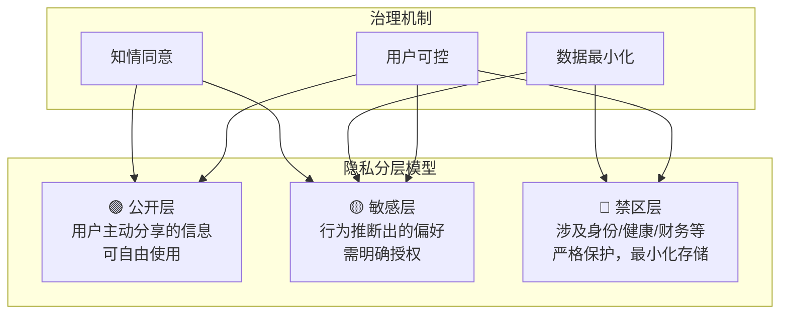

| 原则 | 实践 | 示例 |
|------|------|------|
| **知情同意** | 明确告知用户哪些信息被记忆 | "我记住了您不喜欢香菜，要清除吗？" |
| **数据最小化** | 只记忆对服务有价值的信息 | 不需要记住用户的身份证号 |
| **用户可控** | 用户随时可以查看、修改、删除记忆 | 提供"记忆管理面板" |
| **遗忘权** | 支持"忘掉我"的完整请求 | 一键清除所有记忆数据 |
| **审计追踪** | 每次记忆的读写都有日志 | 可追溯"什么时候记住了什么" |

> 💡 **高级回答**：技术能力 ≠ 应该使用。**能记住不代表应该记住**。好的记忆系统必须内置"克制"——像医生一样，知道什么该记、什么不该记、什么该忘。

---

### Q4：如果记忆出错了怎么办？记忆污染如何防范？

**记忆错误的三种类型与对策**：

| 错误类型 | 产生原因 | 危害 | 防范策略 |
|----------|----------|------|----------|
| **幻觉记忆** | LLM 提取了不存在的"事实" | 错误偏好被持久化 | 关键记忆需用户确认 + 置信度评分 |
| **污染记忆** | 恶意输入注入错误信息 | 系统行为被操纵 | 输入校验 + 异常检测 + 记忆签名 |
| **退化记忆** | 多次提炼后信息失真 | "传话游戏"效应 | 保留原始日志 + 定期回源校验 |

**记忆置信度机制**：

```
记忆条目示例：
{
  "content": "用户不喜欢香菜",
  "confidence": 0.95,          // 置信度
  "source": "user_explicit",   // 来源类型
  "times_recalled": 12,        // 被检索次数
  "last_verified": "2026-06-10",
  "version": 3,                // 版本号
  "evidence": [                // 证据链
    "Day1: 用户明确说'我不吃香菜'",
    "Day5: 点餐时主动要求去香菜",
    "Day15: 评价'这家餐厅去香菜很到位'"
  ]
}
```

> 💡 **高级回答**：人类记忆也会出错，但我们有"元认知"——知道自己可能记错了。AI 记忆系统也需要这种能力：**每条记忆都应该有置信度和证据链**，而不是盲目自信。

---

### Q5：记忆与上下文窗口的关系？既然上下文越来越大，还需要记忆系统吗？

**上下文窗口 vs 记忆系统**：

| 维度 | 上下文窗口 | 记忆系统 | 关系 |
|------|-----------|----------|------|
| **容量** | 有限（即使128K/1M tokens） | 理论上无限（持久化存储） | 互补 |
| **成本** | 每 token 都计费，越长越贵 | 按需检索，只加载相关部分 | 成本优化 |
| **精度** | 长上下文易出现"迷失中间" | 精准检索，只呈现相关信息 | 精度增强 |
| **持续性** | 会话结束即消失 | 跨会话持久存在 | 时间维度扩展 |
| **选择性** | 全部塞入，无差别对待 | 主动筛选，按需加载 | 效率提升 |

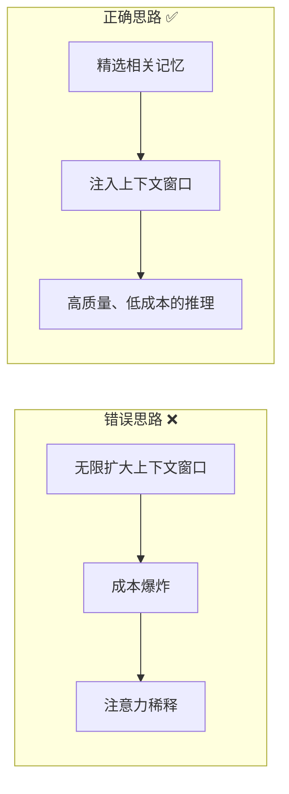

> 💡 **高级回答**：上下文窗口是"短期工作台"，记忆系统是"长期图书馆"。工作台再大，也不能把整个图书馆搬上去——你需要的是**在正确的时间，把正确的书，放到工作台上**。记忆系统的本质，就是一个**智能图书管理员**。

---

### Q6：终极一问 — 记忆会让 AI 产生"自我"吗？

| 维度 | 当前 AI（无记忆） | 有记忆的 AI | 有自我意识的 AI |
|------|-------------------|-------------|-----------------|
| **身份** | 每次对话都是陌生人 | 能记住用户，建立关系 | 能记住自己，有连续体验 |
| **成长** | 永远从零开始 | 从经验中学习和进化 | 形成独特的"人格"和价值观 |
| **决策** | 完全依赖模型参数 | 受记忆影响，个性化决策 | 基于自我认知做出"选择" |
| **边界** | 工具 | 伙伴 | ❓ 伦理未定 |

**哲学思辨**：

```
"忒修斯之船" 问题：
┌─────────────────────────────────────────────┐
│  如果一个 AI 的记忆被完全替换，              │
│  它还是同一个 AI 吗？                        │
│                                             │
│  如果两个 AI 共享同一套记忆，                │
│  它们是同一个 AI 吗？                        │
│                                             │
│  → 记忆是否构成了 AI 的"身份"？              │
│  → 这取决于我们如何定义"自我"               │
└─────────────────────────────────────────────┘
```

> 💡 **终极回答**：记忆是自我的**必要条件**，但不是**充分条件**。人有记忆，但记忆不等于意识。当前的记忆系统让 AI 从"工具"走向"伙伴"，但距离"自我"还有本质的鸿沟。作为工程师，我们设计的不是意识，而是**让交互变得有意义的连续性**。
