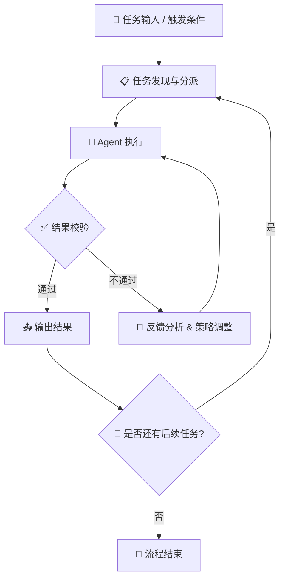
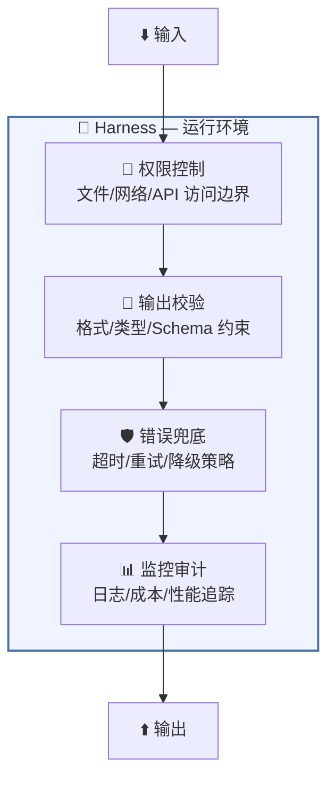
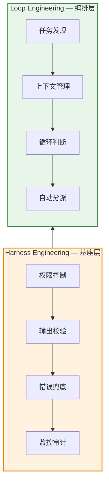

# Loop Engineering & Harness Engineering — AI Agent 的两大工程支柱

本文深入解析两个面向 AI Agent 的核心工程概念：**Loop Engineering（循环工程）** 和 **Harness Engineering（驾驭工程）**。二者分别解决 AI 系统中"自主运转"与"稳定可控"两大关键问题。

---

## 一、核心概念速览

| 维度 | Loop Engineering（循环工程） | Harness Engineering（驾驭工程） |
|:---|:---|:---|
| **本质** | 设计带上下文的反馈闭环 | 搭建稳定可控的运行环境 |
| **目标** | 让系统自动发现、分派、执行任务并自我纠正 | 让 AI 在生产环境中稳定、可靠、可控地运行 |
| **核心隐喻** | 🔄 设计自动驾驶流程 | 🏇 给 AI 套上"马具" |
| **关注层次** | 工作流编排（多步骤、多轮决策） | 运行环境约束（单 Agent 行为规范） |
| **关键能力** | 上下文记忆、自动判断、循环迭代 | 权限控制、输出校验、错误兜底 |
| **解决的问题** | 人需要从"手动写提示词"中解放 | AI 不能"自由发挥"、跳过工程规矩 |

---

## 二、Loop Engineering（循环工程）

### 2.1 定义

> Loop Engineering 的核心是设计一个**"带上下文的反馈闭环"**，让系统能自动发现、分派和执行任务，并根据反馈决定下一步行动。

它强调系统的三大能力：

- **持续运行** — 不依赖人工逐步触发，自主推进任务链
- **上下文记忆** — 保留每轮交互的状态与结果，支撑连续决策
- **自我纠正** — 当输出不满足条件时，自动重试或调整策略

### 2.2 反馈闭环流程图



### 2.3 典型场景

| 场景 | 循环体现 |
|:---|:---|
| 代码审查 Agent | 审查 → 发现 Bug → 自动修复 → 重新审查 → 通过 |
| 数据分析 Agent | 查询数据 → 生成图表 → 检查异常 → 补充分析 → 输出报告 |
| 写作助手 Agent | 起草 → 自检语法/逻辑 → 润色 → 终审 → 发布 |

---

## 三、Harness Engineering（驾驭工程）

### 3.1 定义

> Harness Engineering 的本质是为 AI 搭建一个**稳定、可控的"运行环境"**，就像给 AI 套上"马具"，使其在生产环境中稳定、可靠、可控地运行。

它解决的核心痛点：

- 🚫 AI 可能"自由发挥"，跳过工程规范
- 🚫 输出格式不可预测，难以集成到下游系统
- 🚫 缺少权限边界，存在安全隐患

### 3.2 驾驭工程架构图



### 3.3 典型场景

| 场景 | 驾驭体现 |
|:---|:---|
| 生产环境代码生成 | 限制只能访问指定仓库，输出必须通过 lint + test |
| 客服对话 Agent | 禁止泄露用户隐私，回答必须引用知识库来源 |
| 自动化部署 Agent | 仅在审批后执行，操作范围限定在 staging 环境 |

---

## 四、两者的关系与区别

### 4.1 一句话总结

> **Harness 是"搭建赛道"，Loop 是"设计自动驾驶流程"。**

Harness 保证单个 Agent **跑得稳**；Loop 让系统从"问 AI 答什么"转变为"**能问 AI、能检查 AI、能决定 AI 下一步做什么**"的自动化工作流。

### 4.2 层次关系图



### 4.3 对比总结

```
┌──────────────────────────────────────────────────────────┐
│              Loop + Harness 协同模型                      │
├──────────────────────────────────────────────────────────┤
│                                                          │
│   ┌─────────────────────────────────┐                    │
│   │   Loop（循环工程）               │                    │
│   │   ┌───────┐    ┌───────┐        │                    │
│   │   │ 感知  │───▶│ 决策  │──┐     │   多了"判断"       │
│   │   └───────┘    └───────┘  │     │   和"循环"         │
│   │        ▲                  │     │                    │
│   │        │    ┌───────┐    │     │                    │
│   │        └────│ 执行  │◀───┘     │                    │
│   │             └───────┘          │                    │
│   └────────────┬──────────────────┘                    │
│                │ 运行在                                 │
│                ▼                                        │
│   ┌─────────────────────────────────┐                    │
│   │   Harness（驾驭工程）            │                    │
│   │   权限 │ 校验 │ 兜底 │ 监控      │   保证"跑得稳"     │
│   └─────────────────────────────────┘                    │
│                                                          │
└──────────────────────────────────────────────────────────┘
```

---

## 五、关键洞察

1. **Harness 是基础** — 没有稳定可控的运行环境，循环再精妙也不可靠
2. **Loop 是进阶** — 在 Harness 之上叠加判断与循环，实现真正的自主工作流
3. **二者互补** — Loop 提供"智能"，Harness 提供"护栏"，缺一不可
4. **工程实践建议** — 先建 Harness（确保安全可控），再设计 Loop（提升自动化程度）

---

## 六、正在发生的真实案例（2025—2026）

### 6.1 Loop Engineering 实战案例

| 案例 | 产品/项目 | 循环机制 | 时间线 |
|:---|:---|:---|:---|
| **AI 编程 Agent 自主修 Bug** | Claude Code / Cursor Agent / OpenAI Codex (ChatGPT) | 写代码 → 跑测试 → 检查结果 → 自动修复 → 再跑测试 → 全部通过才停止 | 2025—2026 持续迭代 |
| **Deep Research 深度研究** | Gemini Deep Research / Perplexity Pro | 分解问题 → 多源搜索 → 交叉验证 → 发现信息缺口 → 补充搜索 → 生成报告 | 2025 Q3 上线，2026 成为标配 |
| **Manus 自主任务 Agent** | Manus AI | 接收模糊目标 → 自动规划步骤 → 调用工具执行 → 检查结果 → 调整计划 → 循环直到完成 | 2025 Q1 爆火，后续多产品跟进 |
| **CI/CD 自愈流水线** | GitHub Copilot Workspace + Actions | 代码提交 → CI 失败 → Agent 分析日志 → 自动修复 → 重新触发 CI → 通过 | 2025—2026 企业级落地 |
| **自动化安全巡检** | Wiz AI + CrowdStrike Charlotte | 持续扫描威胁 → 生成告警 → Agent 研判误报 → 自动处置低危 → 升级高危给人工 → 更新规则 | 2026 安全行业主流范式 |

### 6.2 Harness Engineering 实战案例

| 案例 | 产品/项目 | 驾驭机制 | 时间线 |
|:---|:---|:---|:---|
| **MCP 沙箱协议** | Anthropic Model Context Protocol | 统一工具接口 + 权限声明 + 沙箱隔离，Agent 只能调用被授权的工具和数据 | 2024 Q4 发布，2026 成为行业标准 |
| **Agent 安全护栏** | Guardrails AI / NVIDIA NeMo Guardrails | 输入过滤 → 输出校验 → 话题限制 → PII 脱敏 → 合规审计链 | 2025 企业合规刚需 |
| **代码执行沙箱** | E2B / Daytona / Docker AI Sandbox | Agent 生成的代码在隔离容器中运行，限制文件系统/网络/资源访问 | 2025—2026 基础设施化 |
| **企业级 Agent 平台** | Microsoft Copilot Studio / Salesforce Agentforce | 多租户权限隔离 + 数据源绑定 + 审批流程 + 成本限额 + 审计日志 | 2025 全面商用 |
| **Agent 可观测性** | LangSmith / Arize Phoenix / Braintrust | 全链路 Trace + Token 成本监控 + 输出质量评分 + 回归测试 | 2025—2026 Agent Ops 兴起 |

### 6.3 典型案例深度拆解：Claude Code 的 Loop + Harness 协同

```
┌─────────────────────────────────────────────────────────────┐
│                Claude Code 工程架构拆解                       │
├─────────────────────────────────────────────────────────────┤
│                                                             │
│  【Loop 层 — 循环工程】                                      │
│  ┌───────────────────────────────────────────────────┐      │
│  │                                                   │      │
│  │  用户指令 ──▶ 规划 ──▶ 执行 ──▶ 验证 ──┐          │      │
│  │                    ▲               │    │          │      │
│  │                    │          ┌────┴──┐ │          │      │
│  │                    └──────────│ 判断  │◀┘          │      │
│  │                    未通过      │通过?  │            │      │
│  │                               └───┬───┘            │      │
│  │                             通过 ↓                  │      │
│  │                          输出结果给用户              │      │
│  └───────────────────────────────────────────────────┘      │
│                                                             │
│  【Harness 层 — 驾驭工程】                                    │
│  ┌───────────────────────────────────────────────────┐      │
│  │  🔒 权限系统    文件系统白名单 / 命令审批           │      │
│  │  📐 输出约束    结构化 JSON Schema / diff 格式     │      │
│  │  🛡️ 沙箱隔离    Bash 命令沙箱 / 网络隔离           │      │
│  │  📊 成本管控    Token 预算 / 自动停止条件           │      │
│  │  📝 审计日志    全量操作记录 / 可追溯               │      │
│  └───────────────────────────────────────────────────┘      │
│                                                             │
└─────────────────────────────────────────────────────────────┘
```

> **核心观察**：2025—2026 年，几乎所有成功的 AI Agent 产品都在**同时做两件事** — 用 Loop 让 Agent 变"聪明"（能自主迭代），用 Harness 让 Agent 变"规矩"（能安全上线）。二者的成熟度共同决定了产品的工程水平。

---

## 七、最高级思考问答 — 全文总结

### Q1：Loop 和 Harness，到底该先做哪个？

> **A：Harness 先行，Loop 渐进。**
>
> 这是一个**"先刹车，再油门"**的逻辑。没有刹车的车，油门越大越危险。同样，没有 Harness 的 Agent，Loop 越复杂，失控面越大。
>
> 实践路径：**Phase 1** 先让单个 Agent 稳定可控（Harness）→ **Phase 2** 再让 Agent 能自主循环（简单 Loop）→ **Phase 3** 最后让多 Agent 协同编排（复杂 Loop）。

---

### Q2：Harness 做到什么程度算"过度"？会不会把 Agent 管死了？

> **A：好问题。关键在于区分"护栏"和"牢笼"。**
>
> | 类型 | 特征 | 后果 |
> |:---|:---|:---|
> | **护栏（Guardrail）** | 限制边界，边界内自由 | Agent 稳定且灵活 ✅ |
> | **牢笼（Cage）** | 限制每一步动作 | Agent 退化为脚本 ❌ |
>
> **判断标准**：如果 Agent 在边界内的行为仍然是**涌现的、创造性的**，那 Harness 就是好的。如果 Agent 的每一步都被硬编码了，那你其实不是在"驾驭 AI"，而是在写传统脚本 — 只是用自然语言写了而已。
>
> **最佳实践**：约束**边界**（能做什么、不能做什么），而非约束**路径**（怎么做）。

---

### Q3：Loop 会不会"空转"？如何避免无限循环？

> **A：会。这是 Loop Engineering 最核心的工程挑战。**
>
> 空转的三种典型模式与解法：
>
> ```
> ┌────────────────────────────────────────────────────────┐
> │           Loop 空转模式与解法                            │
> ├──────────────┬───────────────────┬────────────────────┤
> │  空转模式     │  根因             │  解法              │
> ├──────────────┼───────────────────┼────────────────────┤
> │  🔄 死循环    │ 判断条件永远不满足  │ 设最大迭代次数     │
> │  📉 震荡循环  │ 修复 A 引入 B，    │ 引入回归检测       │
> │              │ 修复 B 又丢失 A    │ + 状态快照回滚     │
> │  🌀 伪进展    │ 每次都有"改善"但   │ 设进步阈值         │
> │              │ 永远达不到通过标准  │ (每轮必须提升 ≥X%) │
> └──────────────┴───────────────────┴────────────────────┘
> ```
>
> **核心原则**：每个 Loop 都必须有一个**明确的退出条件** — 包括"成功退出"和"失败退出"。没有失败退出的 Loop 是一颗定时炸弹。

---

### Q4：人在 Loop 中扮演什么角色？最终会被完全替代吗？

> **A：人的角色从"执行者"转变为"裁判"和"设计师"。**
>
> ```mermaid
> flowchart LR
>     subgraph Phase1["阶段一：人在环内"]
>         H1["👤 人写提示词"] --> A1["🤖 AI 回答"] --> H1
>     end
>     subgraph Phase2["阶段二：人在环上"]
>         H2["👤 人审核/纠正"] --> L2["🔄 Agent 循环"] --> H2
>     end
>     subgraph Phase3["阶段三：人在环外"]
>         H3["👤 人定目标 & 设边界"] --> L3["🔄 自主循环"]
>         L3 --> H3
>     end
>     Phase1 --> Phase2 --> Phase3
> ```
>
> - **现在**（2025—2026）：大多数系统处于**阶段一到阶段二**的过渡期
> - **近期**（2026—2027）：更多系统进入阶段二，人负责审核关键节点
> - **远期**：部分标准化任务进入阶段三，但**人永远负责定义"什么是对的"**
>
> **关键洞察**：人被替代的不是"判断力"，而是"执行步骤"。**设计 Loop 本身、定义通过标准、处理极端边界** — 这些仍然是且将是人类最核心的价值。

---

### Q5：这对软件工程师意味着什么？

> **A：软件工程师的角色正在从"写代码的人"变成"设计 AI 工作流的人"。**
>
> | 传统工程师 | AI 时代工程师 |
> |:---|:---|
> | 写实现逻辑 | 设计 Loop 的判断条件和退出策略 |
> | 调试代码 | 调试 Agent 为什么在第 3 轮循环做出了错误决策 |
> | 写单元测试 | 设计 Harness 的校验规则和权限边界 |
> | 做 Code Review | 评估 Agent 输出质量，定义"足够好"的标准 |
> | 管服务器 | 管 Agent 的成本、延迟和安全边界 |
>
> **最终总结 — 全文核心公式**：
>
> ```
> ┌──────────────────────────────────────────────────────┐
> │                                                      │
> │   🏇 Harness = 让 AI 跑得稳（安全、可控、可观测）     │
> │   🔄 Loop    = 让 AI 跑得远（自主、迭代、闭环）       │
> │                                                      │
> │   🎯 成功的 AI 产品 = Harness² × Loop                │
> │                                                      │
> │   （Harness 是平方，因为它是基础；                    │
> │    没有稳定的 Harness，Loop 越强风险越大）             │
> │                                                      │
> └──────────────────────────────────────────────────────┘
> ```
