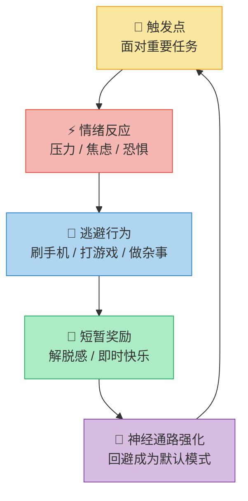
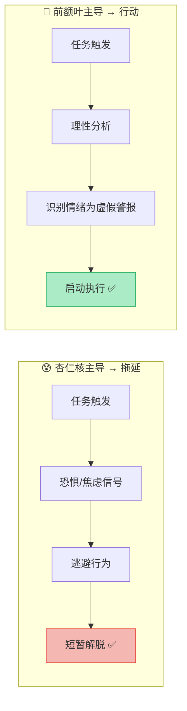
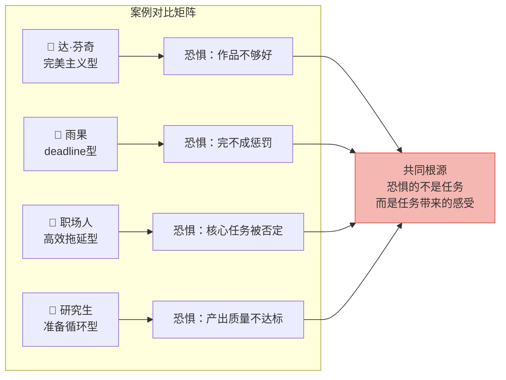
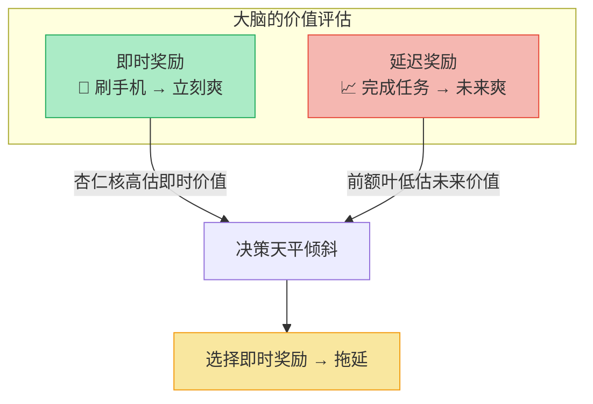
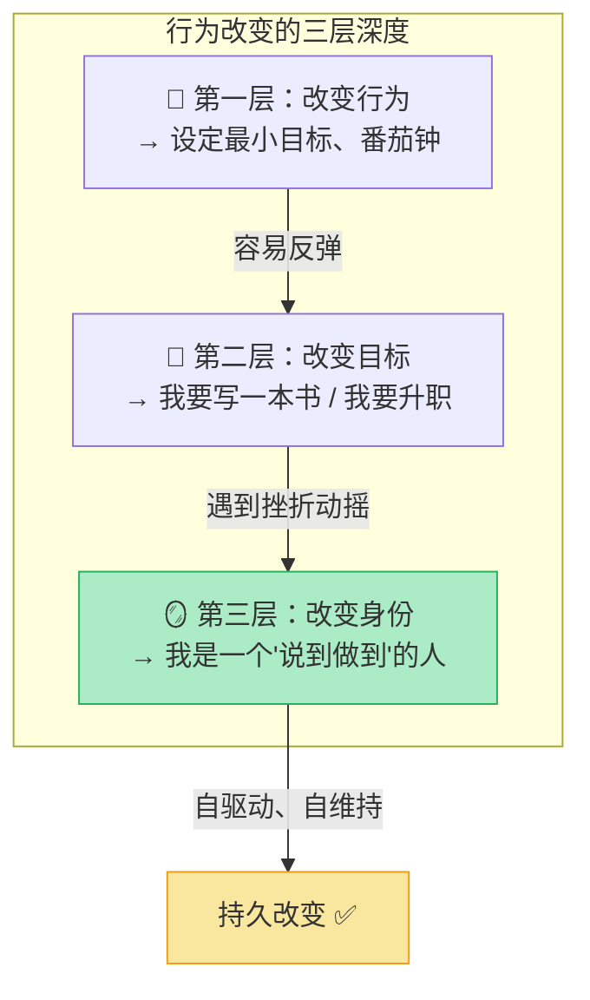
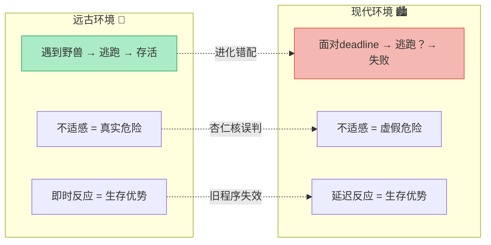
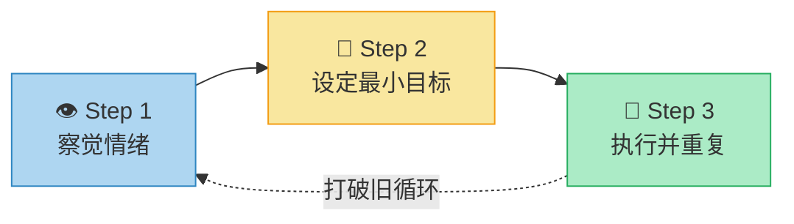
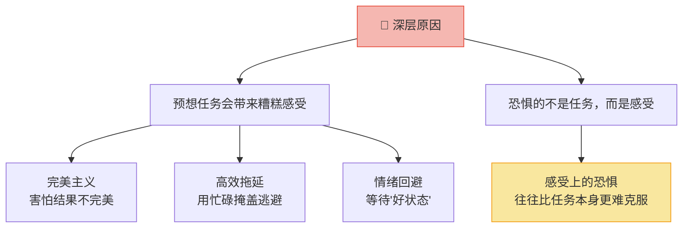

# 拖延症的本质与破解：从脑科学到行动

> 核心观点：拖延并非时间管理问题，而是**情绪调节问题**。大脑因害怕负面情绪而选择逃避，形成"回避循环"。

---

## 一、拖延的本质：回避循环

### 循环模型

### 循环拆解

| 阶段 | 表现 | 脑内机制 | 结果 |
|------|------|----------|------|
| ① 触发点 | 面对需要完成的重要任务 | 前额叶皮层启动任务意图 | 意识到"该做了" |
| ② 情绪反应 | 压力、焦虑、对失败的恐惧 | 杏仁核检测到"威胁"，发出警报 | 产生不适感 |
| ③ 逃避行为 | 刷手机、打游戏、做杂事 | 多巴胺系统驱动寻求即时奖励 | 注意力转移 |
| ④ 奖励机制 | 短暂解脱感、轻松感 | 大脑将逃避标记为"好事" | 正向强化逃避 |
| ⑤ 循环固化 | 每次逃避都加深神经通路 | 赫布定律：共同激活的神经元连接加强 | 拖延成为默认模式 |

> **关键洞察**：自律的神经回路像久未使用的肌肉一样萎缩，而回避回路越练越强。

---

## 二、脑科学视角：情绪脑 vs 理性脑

### 两大系统对比

| 维度 | 杏仁核（情绪脑） | 前额叶皮层（理性脑） |
|------|------------------|----------------------|
| **角色** | 威胁探测器 | 理性决策者 |
| **触发条件** | 任务引发恐惧、压力、不适 | 冷静分析利弊 |
| **驱动行为** | 逃离危险（逃避任务） | 执行任务（克服困难） |
| **反应速度** | 快速、自动化 | 较慢、需主动调动 |
| **能量消耗** | 低（本能反应） | 高（需要意志力） |
| **进化历史** | 古老（生存本能） | 新近（高级认知） |

### 博弈模型

> **拖延的根源**：杏仁核的情绪信号**压倒**了前额叶的理性分析 → 无法启动任务。

---

## 三、真实案例：从古至今的拖延困局

### 案例一：达·芬奇——天才的诅咒

| 维度 | 内容 |
|------|------|
| **人物** | 列奥纳多·达·芬奇（1452-1519），文艺复兴全才 |
| **拖延表现** | 《蒙娜丽莎》画了4年；《最后的晚餐》反复拖延，修道院院长向米兰公爵投诉；生前留下的完成作品不足20幅，而手稿笔记超过7000页 |
| **情绪根源** | 完美主义 + 兴趣弥散——每个新想法都带来兴奋，而"完成"意味着面对"可能不够好"的评判 |
| **脑科学解读** | 杏仁核对"作品不够完美"的恐惧 → 逃避到新的创意项目（多巴胺驱动的"高效拖延"）→ 前额叶的目标承诺系统始终无法关闭 |
| **核心教训** | **拖延不是懒，是恐惧的高级伪装**——即使是人类史上最伟大的大脑也无法幸免 |

### 案例二：维克多·雨果——极端策略破局

| 维度 | 内容 |
|------|------|
| **人物** | 维克多·雨果（1802-1885），法国文学巨匠 |
| **拖延表现** | 《巴黎圣母院》写作拖延超过一年，出版商不断催稿，合同即将违约 |
| **破局方法** | 雨果做了一个极端决定：让仆人锁起自己所有的外出衣物，只留下一件大披肩，把自己"困"在书房里 |
| **脑科学解读** | 通过**消除逃避选项**，直接切断了回避循环中的"逃避行为"节点。当杏仁核无法找到逃避出口时，只能被迫面对任务，前额叶得以接管 |
| **核心教训** | **环境设计 > 意志力**——与其和情绪脑搏斗，不如让逃避变得不可能 |

### 案例三：当代职场人——"高效拖延"陷阱

| 维度 | 内容 |
|------|------|
| **典型画像** | 互联网大厂员工，每天"很忙"但核心产出为零 |
| **拖延表现** | 上午回邮件、整理笔记、做PPT模板、看行业报告、参加"有价值"的分享会……一天结束，最重要的产品方案一个字没动 |
| **情绪根源** | 核心任务（方案）的不确定性引发焦虑，而"有用的小事"提供虚假成就感，同时回避真正风险 |
| **脑科学解读** | 杏仁核将"可能被否定的方案"标记为威胁 → 转向"安全的小任务"获得多巴胺奖励 → 形成"忙碌=效率"的自我欺骗回路 |
| **核心教训** | **最高危的拖延不是摸鱼，而是"正确地做错误的事"**——用战术上的勤奋掩盖战略上的逃避 |

### 案例四：研究生论文困境——"准备开始"的无限循环

| 维度 | 内容 |
|------|------|
| **典型画像** | 硕博研究生，开题报告反复修改却迟迟不动笔正文 |
| **拖延表现** | "先看完这50篇文献再写""先把笔记整理得更完美""等下周一开始一定写"——永远在"准备开始" |
| **情绪根源** | 对"写出来的东西不够好"的恐惧，以及对导师评价的焦虑 |
| **脑科学解读** | "准备"行为本身产生"我正在推进"的虚假信号（多巴胺释放），实际上是在用低风险的收集行为替代高风险的创造行为 |
| **核心教训** | **"准备好了再开始"是最大的谎言**——行动先于动机，而非相反 |

### 案例横向对比

---

## 四、高维解读：超越"克服拖延"本身

### 4.1 双系统理论：卡尼曼的认知框架

| 维度 | 系统1（快思考） | 系统2（慢思考） |
|------|----------------|----------------|
| **对应脑区** | 杏仁核 + 边缘系统 | 前额叶皮层 |
| **特征** | 快速、自动、情绪化、耗能低 | 缓慢、刻意、理性化、耗能高 |
| **在拖延中的角色** | "这个任务让我焦虑 → 快逃！" | "这个任务很重要 → 应该执行" |
| **进化意义** | 原始环境中，快速逃离威胁 = 存活 | 复杂环境中，长远规划 = 优势 |
| **致命弱点** | 无法区分"真实威胁"和"想象威胁" | 容易被疲劳、情绪、认知负荷击溃 |

> **高维洞察**：拖延本质上是**进化错配**——我们用石器时代的大脑，应对信息时代的任务。杏仁核无法区分"被老虎追"和"面对deadline"，都用同一套逃跑程序响应。

### 4.2 时间贴现（Temporal Discounting）

**时间贴现的本质**：人脑天然对"现在的1块钱"赋予比"未来的10块钱"更高的主观价值。当任务奖励遥远（写论文→毕业→找工作→...），而逃避奖励即时（刷手机→立刻获得多巴胺），大脑几乎必然选择后者。

| 扭曲程度 | 典型场景 | 破解思路 |
|----------|----------|----------|
| **轻度** | 知道明天要交报告，今晚还能安心刷剧 | 将未来后果"拉到现在"——想象明天交不出的具体场景 |
| **中度** | deadline在一个月后，完全无法启动 | 人为制造"微型deadline" + 外部承诺机制 |
| **重度** | 考研/考公，目标在一年后，每天"明天再开始" | 需要身份认同层面的转变——从"我要做"变成"我是这种人" |

### 4.3 身份认同：最高维度的破局点

> 改编自 James Clear《原子习惯》核心框架：真正的行为改变是**身份改变**。当你说"我不拖延"时，你是在否定旧身份；当你说"我是一个立刻行动的人"时，你是在建构新身份。每一次"最小行动"都是在为新身份投票。

### 4.4 斯多葛哲学的古老智慧

| 斯多葛原则 | 对应拖延场景 | 现代脑科学解释 |
|------------|-------------|----------------|
| **"区分你能控制的和不能控制的"** | 你无法控制情绪反应（杏仁核自动触发），但你可以控制行动（前额叶的选择） | 将注意力从"我不想做"转移到"我能做的最小一步" |
| **"消极想象（Premeditatio Malorum）"** | 提前想象"如果继续拖延，3个月后的自己会怎样" | 激活前额叶的情景模拟功能，拉高未来奖励的主观价值 |
| **"障碍即道路（The Obstacle Is the Way）"** | 拖延的恐惧感本身，正是你需要穿越的东西 | 暴露疗法原理：直面恐惧而非逃避，杏仁核会逐渐脱敏 |
| **"活在当下"** | 不要去想"还有30页没写"，只关注"现在的5分钟" | 将认知资源锁定在当前时刻，减少前额叶的认知负荷 |

### 4.5 拖延的进化隐喻

---

## 五、破解之道：打断旧回路，建立新习惯

### 核心原则

> 根据 Tim Pychyl 教授的研究：克服拖延的关键在于**开始任务**，而非**完成任务**。

### 三步训练法

| 步骤 | 方法 | 原理 | 示例 |
|------|------|------|------|
| **① 察觉并命名情绪** | 停下来，说出当前感受 | 情绪命名激活前额叶，抑制杏仁核活跃度 | "我现在感到焦虑，因为我害怕写不好" |
| **② 设定最小目标** | 将任务分解为极小的、可执行的单元 | 降低杏仁核的威胁感知，减少启动阻力 | 写论文 → "打开文档写10分钟"；运动 → "穿上鞋子出门" |
| **③ 执行并重复** | 每天坚持完成小目标，无需考虑结果 | 重复激活前额叶通路，强化新神经回路 | 不追求完美，只关注"开始了"这个事实 |

### 最小目标设定参考

| 场景 | ❌ 错误目标 | ✅ 最小目标 |
|------|------------|------------|
| 写论文 | "今天写完3000字" | "打开文档，写10分钟" |
| 运动健身 | "跑5公里" | "穿上鞋子，出门走5分钟" |
| 整理房间 | "打扫整个屋子" | "整理桌面一个角落" |
| 学习编程 | "学完一整章" | "打开教程，看1个小节" |
| 读书 | "读完100页" | "翻开书，读1页" |

---

## 六、拖延的伪装与深层原因

### 常见伪装识别

| 伪装类型 | 表面说辞 | 真实心理 | 识别信号 |
|----------|----------|----------|----------|
| **完美主义** | "要做就做到最好" | 害怕结果不够好，不敢开始 | 迟迟不行动，总说"还没准备好" |
| **高效拖延** | "我先做点有用的事" | 用次要事务逃避核心任务 | 整理笔记、看创业书、回复非紧急邮件 |
| **情绪逃避** | "状态不好，等会儿再做" | 逃避任务带来的糟糕感受 | 等"灵感来了"才开始 |
| **自我安慰** | "deadline才是第一生产力" | 用压力合理化逃避行为 | 每次都拖到最后时刻 |

### 深层因果链

---

## 总结：从认知到行动的全景地图

### 核心记忆卡片

| 认知 | 行动 |
|------|------|
| 拖延 = 情绪问题，非时间问题 | 先处理情绪，再处理任务 |
| 杏仁核发出虚假威胁警报 | 命名情绪 → 唤醒前额叶 |
| 逃避被大脑奖励 → 回路强化 | 用最小目标打断旧循环 |
| 完美主义是拖延的高级伪装 | "完成"优于"完美" |
| 关键是**开始**，不是完成 | 设定5分钟最小目标，立即执行 |

### 高维认知升级

| 维度 | 旧认知 | 新认知 |
|------|--------|--------|
| **本质** | 我太懒了 | 我的杏仁核在误报威胁 |
| **策略** | 靠意志力硬扛 | 设计环境 + 最小行动 |
| **身份** | "我是一个爱拖延的人" | "我是一个正在建立行动习惯的人" |
| **时间** | "等状态好了再开始" | "行动创造状态，而非等待状态" |
| **恐惧** | 逃避恐惧 | 穿越恐惧——每次直面都是对杏仁核的脱敏训练 |

### 一句话终极心法

> **不要试图消灭情绪，而是学会带着情绪行动。你不需要"准备好"才能开始——开始了，才会准备好。**
