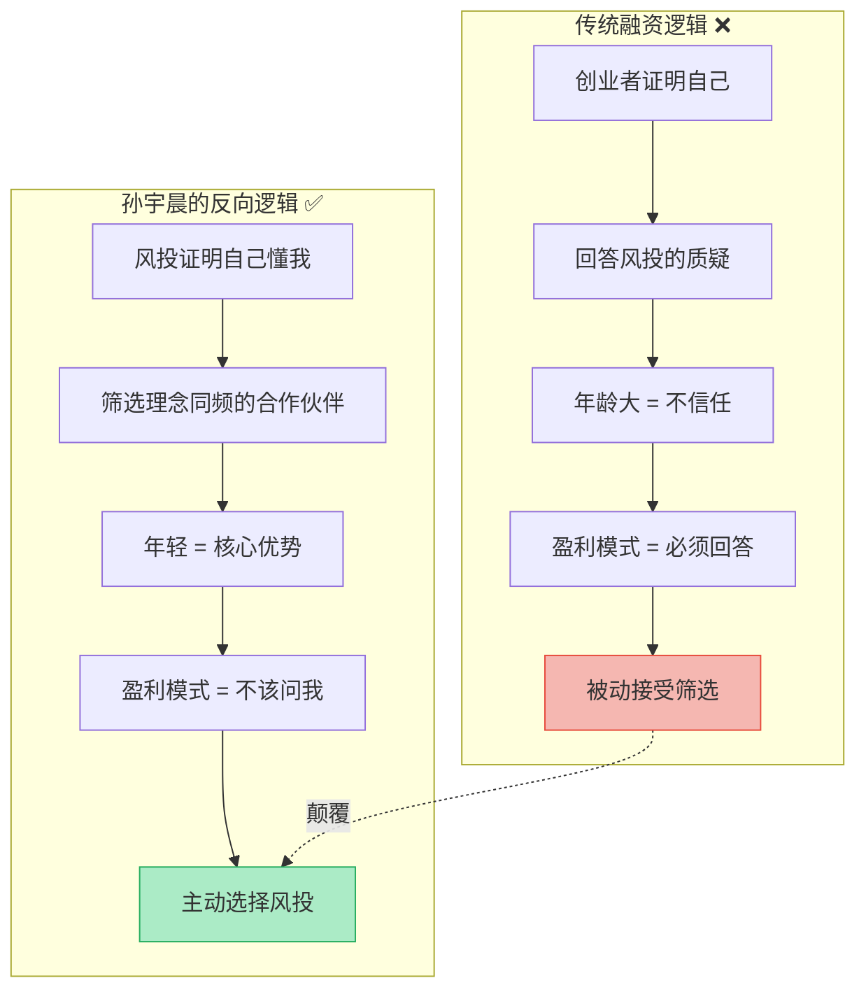
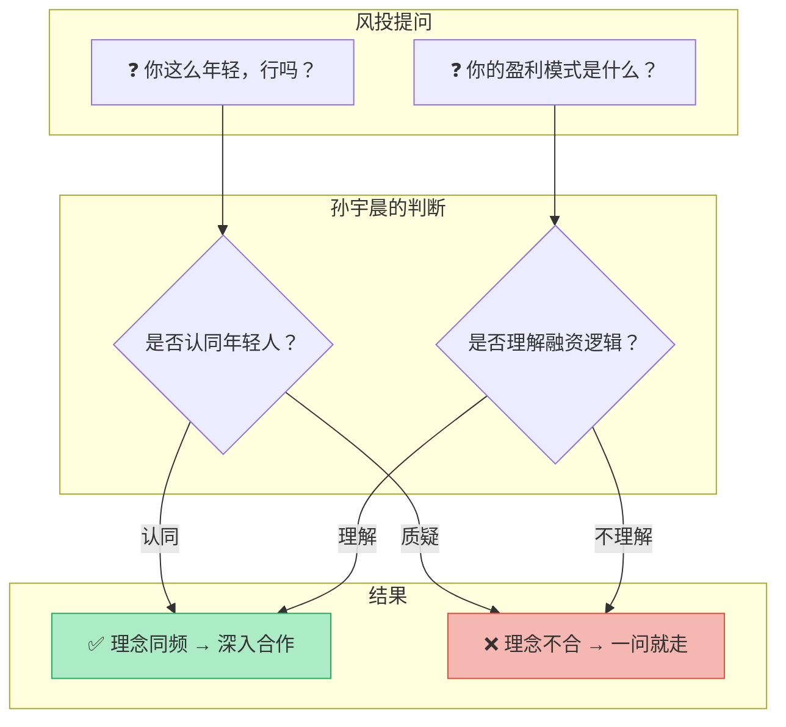
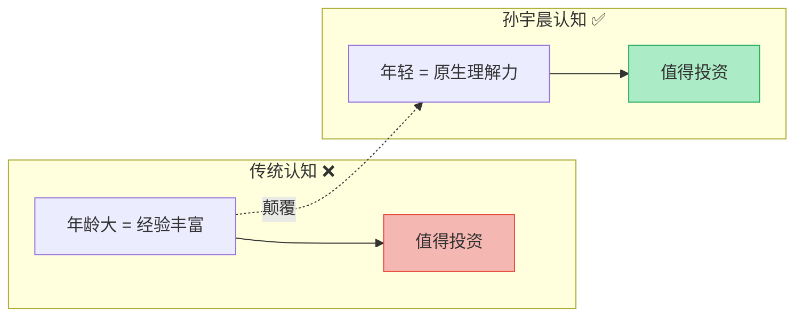
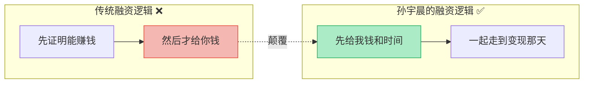
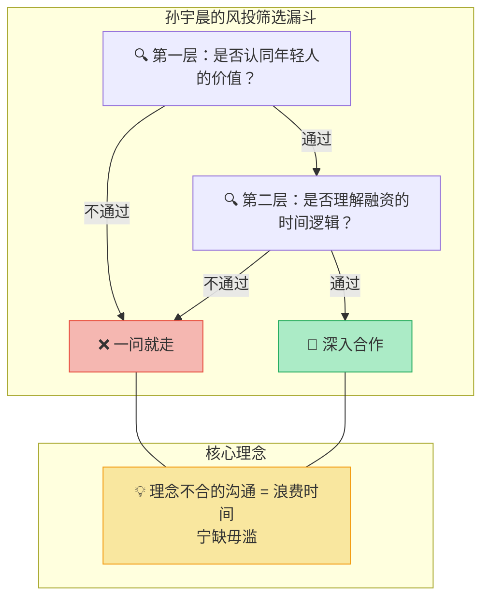
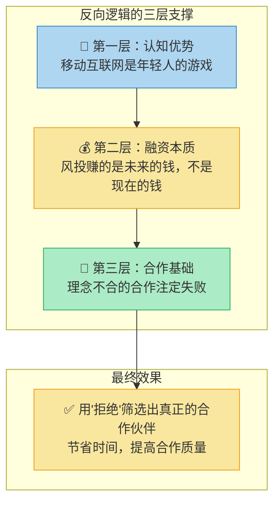
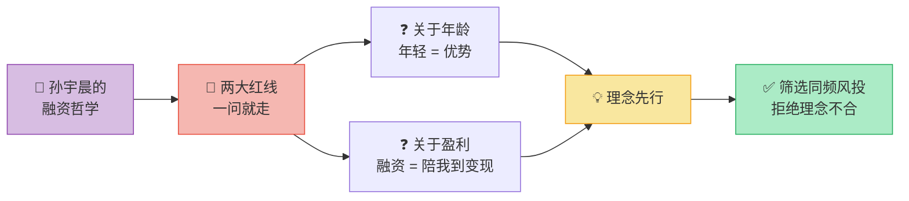

# 孙宇晨：创业者与风投的"反向"对话

> 核心观点：孙宇晨在与央视财经的对话中，展示了一套颠覆性的融资哲学——**不是创业者向风投证明自己，而是创业者筛选风投**。面对两个"红线"问题，他选择一问就走。这背后是对"年轻即优势"的坚定信念，以及对风投角色的重新定义。

---

## 全景总览：孙宇晨的融资逻辑

> 💡 **一句话总结**：不是"风投选我"，而是"我选风投"**——理念不合，一问就走。

---

## 两大"红线"问题：一问就走

### 核心态度

孙宇晨表示，面对以下两个问题时，他会**直接拒绝合作**，因为这代表了双方理念的**根本不合**。

### 红线问题对比表

| 维度 | 🚫 风投的常规提问 | ✅ 孙宇晨的"反向"逻辑 | 深层信念 |
|------|-------------------|----------------------|----------|
| **关于年龄** | "你这么年轻，能把团队带到很大吗？" | 只与**看重年轻人**的风投打交道。懂他的风投会反过来质疑："都这么老了，还怎么适应移动互联网？" | 年轻 = 对新时代的原生理解力 |
| **关于盈利** | "你的盈利模式是什么？" | 找风投的原因就是**暂时无法盈利**。如果盈利模式清晰，就不需要融资。风投的角色是"陪我到变现那一天"。 | 融资 = 用时间换空间 |

### 红线决策模型

### 逐条深度拆解

#### 红线一：关于年龄

| 视角 | 内容 |
|------|------|
| **风投视角** | 年轻 = 缺乏经验、缺乏管理能力 → 高风险 |
| **孙宇晨视角** | 年轻 = 原生理解移动互联网、没有历史包袱 → 核心优势 |
| **反向逻辑** | 真正懂趋势的风投会反过来想："30岁以上的人，还能适应移动互联网吗？" |
| **底层信念** | 在移动互联网时代，**年龄不是资产，而是负债**——年轻人是数字原住民 |

#### 红线二：关于盈利模式

| 视角 | 内容 |
|------|------|
| **风投视角** | 没有盈利模式 = 商业逻辑不清晰 → 需要解释 |
| **孙宇晨视角** | 有盈利模式就不需要融资了 → 问这个问题说明你不理解风投的本质 |
| **反向逻辑** | 风投的价值 = 在盈利之前提供资金支持，"陪我到变现那一天" |
| **底层信念** | 融资的逻辑是**用时间换空间**——先做大价值，再考虑变现 |

---

## 核心观点：理念先行的融资哲学

### 选择风投的标准

孙宇晨的态度非常明确：选择风投的核心标准不是**金额大小**，而是**理念是否同频**。

### 两种融资哲学对比

| 维度 | 传统创业者 | 孙宇晨 |
|------|-----------|--------|
| **姿态** | 被动：被风投审视、筛选 | 主动：反向筛选风投 |
| **对质疑的态度** | 耐心解释、证明自己有值 | 理念不合就放弃，不浪费时间 |
| **年龄观** | 尽量显得成熟稳重 | 年轻就是最大的资本 |
| **盈利观** | 急于证明盈利模式 | 先做价值，后谈变现 |
| **与风投关系** | 上下级：风投是"考官" | 平等：风投是"合伙人" |
| **核心逻辑** | "请投我" | "你懂我吗？" |

---

## 深度分析：反向逻辑的底层框架

### 为什么"反向"有效？

### 反向逻辑的风险与适用条件

| 条件 | 说明 |
|------|------|
| ✅ **适用场景** | 创业者确实处于新兴领域，拥有年轻人特有的认知优势 |
| ✅ **适用场景** | 商业模式本身需要时间验证（如平台型、生态型） |
| ✅ **适用场景** | 创业者有足够的底气和替代选择 |
| ❌ **不适用场景** | 传统行业，经验和资源积累至关重要 |
| ❌ **不适用场景** | 盈利模式确实不清晰，且短期内看不到变现路径 |
| ❌ **不适用场景** | 创业者没有足够的谈判筹码 |

---

## 逻辑记忆框架

### 逻辑链记忆法

> **一句话记忆**：**两大红线过滤理念 → 年轻是优势而非负债 → 融资是陪跑到变现 → 理念不合一问就走**

### 核心认知升级

| 维度 | 旧认知 | 新认知 |
|------|--------|--------|
| **融资关系** | 创业者被风投挑选 | 创业者与风投**双向选择** |
| **年龄** | 年轻 = 不成熟、高风险 | 年轻 = **原生理解力**，是核心资产 |
| **盈利模式** | 必须提前想清楚才能融资 | 融资的目的就是在盈利前**争取时间** |
| **风投角色** | 考官、决策者 | **合伙人**——陪你到变现那一天 |
| **沟通策略** | 耐心回答所有问题 | 理念不合的问题**直接拒绝**，节省时间 |

### 全文逻辑地图

| 章节 | 核心问题 | 关键答案 |
|------|----------|----------|
| **全景总览** | 孙宇晨的融资逻辑是什么？ | 反向筛选——不是被风投选，而是选风投 |
| **两大红线** | 哪些问题一问就走？ | "你这么年轻行吗"和"盈利模式是什么" |
| **核心观点** | 选择风投的标准是什么？ | 理念同频 > 金额大小 |
| **深度分析** | 反向逻辑为什么有效？ | 认知优势 + 融资本质 + 合作基础三层支撑 |

---

## 一句话终极心法

> **创业不是讨好资本，而是找到真正懂你的伙伴。当你对自己的逻辑足够坚定时，"拒绝"就是最好的筛选器——理念不合，一问就走。**
