# 中国ToB为何养不出Palantir？——FDE的三重缺失

> 核心观点：中国ToB市场难以诞生Palantir式的公司，根本原因不是技术差距，而是**无法培养出合格的FDE（Field Delivery Engineer）**。FDE不只是高级交付工程师，更是集**顾问、架构师、沟通者**于一体的复合角色。其生存需要三个前提同时成立，而这三个前提在中国ToB环境中**集体缺失**，形成了一个难以打破的恶性循环。

---

## 全景总览：FDE的三个生存前提

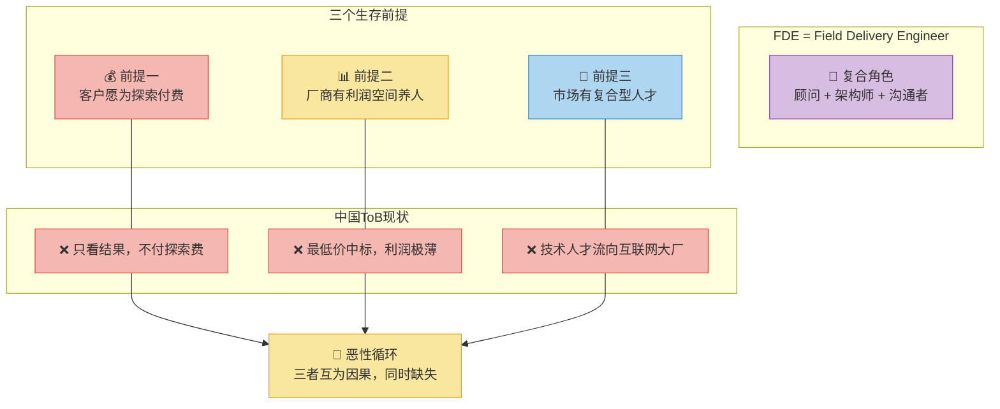

> 💡 **一句话记忆**：FDE 需要 **客户买单 + 厂商养得起 + 人才找得到**，三者缺一不可，而中国ToB三者同时不满足。

---

## 前提一：客户不愿为"探索"付费

### 核心矛盾

FDE的核心工作是深入客户现场，花费**数周甚至数月**理解其业务流程。这一过程本身需要客户付费，但在国内，合同逻辑通常是 **"结果导向"**——客户只关心最终交付的功能是否满足需求，而将FDE的探索时间、试错成本视为厂商的内部成本。

### 认知错位模型

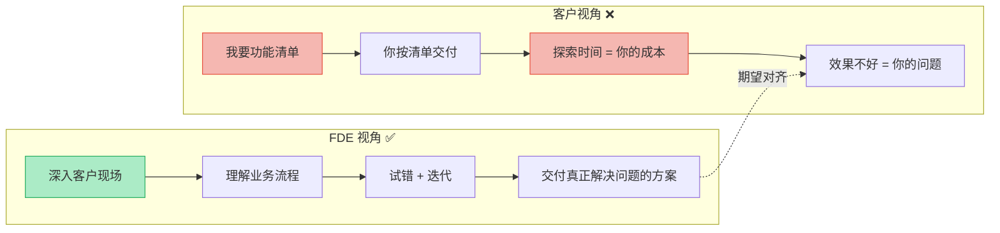

### 付费逻辑对比

| 维度 | Palantir 模式（✅ 海外） | 中国ToB模式（❌ 国内） |
|------|--------------------------|------------------------|
| **付费对象** | 为"探索过程"付费——FDE驻场本身就是价值 | 为"交付结果"付费——只看功能是否上线 |
| **合同逻辑** | 按时间/顾问费计费，允许试错 | 固定价格+固定交付物，试错成本厂商自担 |
| **风险承担** | 客户与厂商共担探索风险 | 厂商承担全部风险 |
| **FDE 地位** | 被尊为"业务顾问"，与客户高管平等对话 | 被当成"实施人员"，被要求技术完美 |
| **结果** | FDE 价值被承认，投入产出合理 | 厂商陷入"顾问被挑剔，技术被嫌弃"的两难 |

> 🔑 **关键洞察**：FDE 的价值在于"帮客户想清楚要什么"，但这个"想清楚"的过程在国内**不被定价**。

---

## 前提二：厂商无利润空间养人

### 核心矛盾

FDE是一个**高薪角色**，其成本需要由公司利润覆盖。但国内ToB市场普遍存在 **"最低价中标"** 现象，尤其在政府采购中，价格成为决定性因素。厂商为了拿下项目不得不压缩利润，甚至陷入 **"交付黑洞"**。

### 利润挤压模型

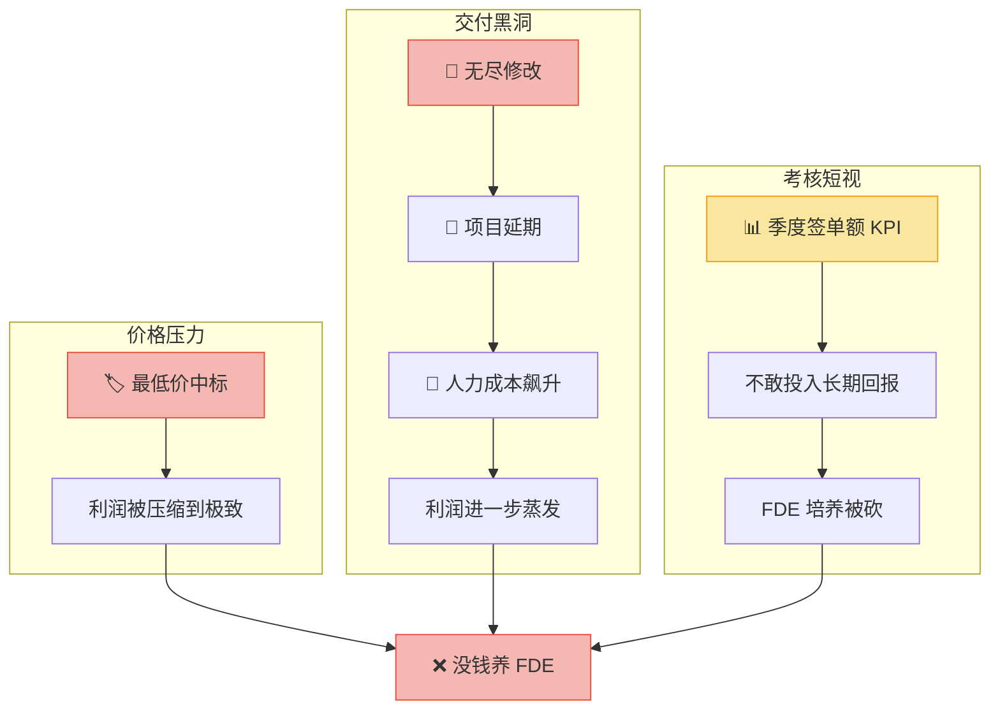

### 厂商困境拆解

| 困境 | 表现 | 根因 | 对 FDE 的影响 |
|------|------|------|--------------|
| **💰 利润薄** | 最低价中标，毛利极低 | 政府采购价格权重过高 | 无法承担 FDE 的高人力成本 |
| **🕳️ 交付黑洞** | 无尽修改 + 无限延期 | 需求不明确，客户预期失控 | FDE 沦为"救火队员"，无法做深度探索 |
| **📊 KPI 短视** | 季度签单额为核心考核 | 上市公司/VC 增长压力 | 无预算、无耐心投资长期人才培养 |
| **💳 付款模式** | "一单一结"，回款周期长 | 甲方强势，尾款难以收回 | 现金流不足以支撑 FDE 长期驻场 |

> 🔑 **关键洞察**：FDE 是"用利润养出来的能力"，而中国ToB厂商的利润空间**已经被挤压到养不起任何人**。

---

## 前提三：市场缺乏复合型人才

### FDE 能力模型

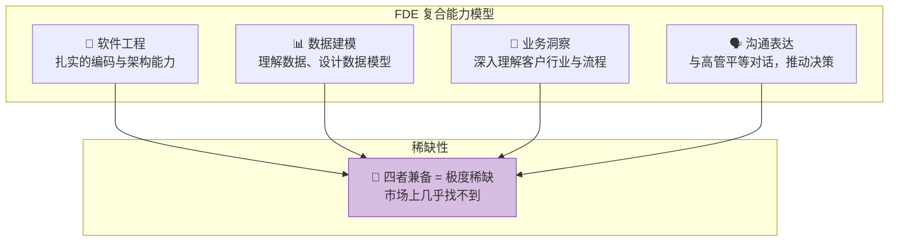

### 人才流向分析

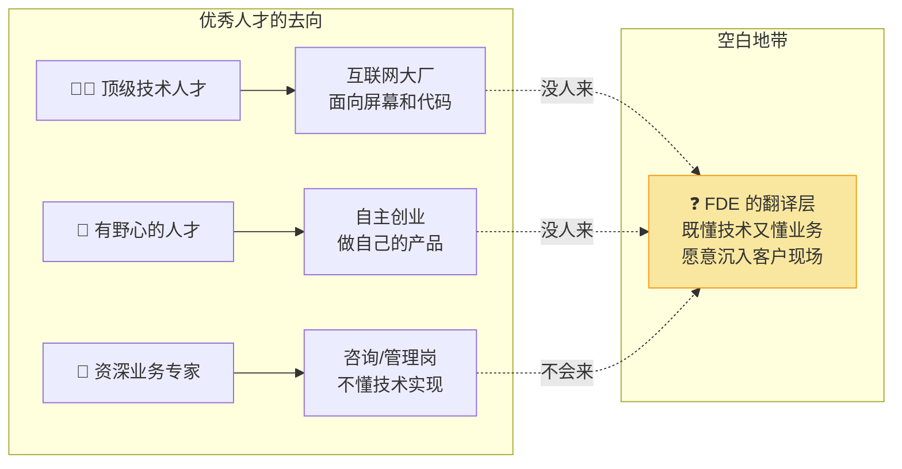

### 人才矩阵对比

| 人才类型 | 技术能力 | 业务能力 | 沟通能力 | 愿意驻场 | 适合做 FDE？ |
|----------|----------|----------|----------|----------|-------------|
| **互联网大厂工程师** | ⭐⭐⭐⭐⭐ | ⭐⭐ | ⭐⭐ | ❌ 不愿意 | ❌ 不匹配 |
| **传统IT项目经理** | ⭐⭐⭐ | ⭐⭐⭐ | ⭐⭐⭐⭐ | ✅ 愿意 | ⚠️ 缺技术深度 |
| **管理咨询顾问** | ⭐⭐ | ⭐⭐⭐⭐⭐ | ⭐⭐⭐⭐⭐ | ✅ 愿意 | ⚠️ 不懂技术实现 |
| **资深行业专家** | ⭐ | ⭐⭐⭐⭐⭐ | ⭐⭐⭐ | ✅ 愿意 | ❌ 技术空白 |
| **FDE（理想型）** | ⭐⭐⭐⭐ | ⭐⭐⭐⭐ | ⭐⭐⭐⭐ | ✅ 愿意 | ✅ **完美匹配** |

> 🔑 **关键洞察**：FDE 不是一个"岗位"，而是一个 **"翻译层"**——在中国，这个翻译层**几乎无人填补**。

---

## 恶性循环：三个前提如何相互强化

### 循环机制图

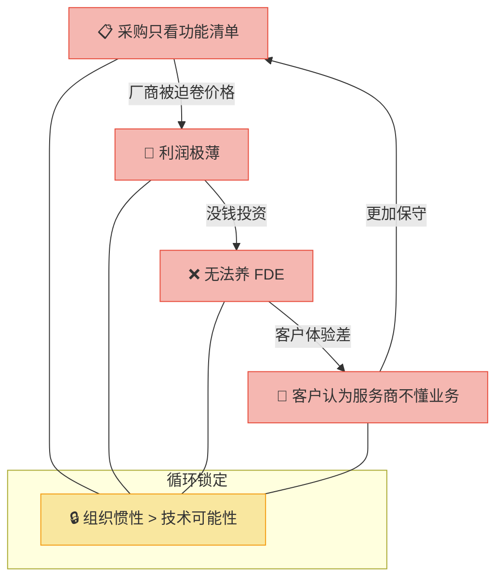

### 循环拆解

| 环节 | 现象 | 后果 |
|------|------|------|
| **① 采购只看功能清单** | 客户用功能数量衡量价值，而非业务结果 | 厂商被迫"堆功能"，而非"解问题" |
| **② 利润极薄** | 最低价中标 → 毛利极低 | 无力投入长期人才培养 |
| **③ 无法养 FDE** | 没有FDE驻场，只有交付工程师 | 客户体验差，觉得服务商不懂业务 |
| **④ 客户更加保守** | 因为被"不懂业务"的服务商伤过 | 更不愿为探索付费，更强调功能清单 |

> 💡 **核心锁定**：这个循环使中国ToB市场**难以从"卖功能"转向"卖结果"**，组织的惯性远大于技术的可能性。

---

## 深度对比：Palantir vs 中国ToB

| 维度 | Palantir（✅ 能跑通） | 中国ToB（❌ 跑不通） |
|------|----------------------|---------------------|
| **FDE 角色** | 核心岗位，与工程师平级 | 不存在或归入"实施" |
| **客户付费意愿** | 愿意为探索付费，理解试错价值 | 只为交付结果付费 |
| **厂商利润** | 高毛利项目，有能力养高薪FDE | 低价竞争，利润微薄 |
| **人才供给** | 硅谷人才愿意做"非纯技术"角色 | 优秀人才只愿做"纯技术"或"纯管理" |
| **合同模式** | 按顾问时薪+项目制，允许迭代 | 固定价格+固定范围，试错=亏损 |
| **考核周期** | 长期价值导向 | 季度/年度 KPI 导向 |
| **交付标准** | "业务问题解决了吗？" | "功能上线了吗？" |
| **市场成熟度** | 客户理解"软件是投资" | 客户认为"软件是成本" |

---

## 逻辑记忆框架

### 逻辑链记忆法

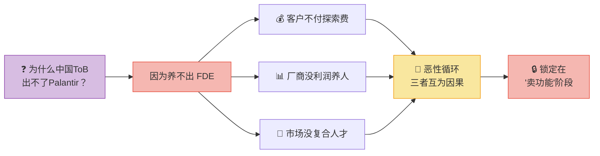

> **一句话记忆**：**FDE 三重缺失 → 恶性循环 → 锁定在"卖功能"而非"卖结果"**

### 核心认知升级

| 维度 | 旧认知 | 新认知 |
|------|--------|--------|
| **问题本质** | 中国技术不行 | 不是技术问题，是**商业生态**问题 |
| **FDE 定义** | 高级交付工程师 | **顾问+架构师+沟通者**的复合角色 |
| **付费逻辑** | 为功能付费 | 应为**探索和结果**付费 |
| **人才观** | 技术人才做技术 | FDE 需要的是**"翻译层"人才** |
| **循环认知** | 单个问题可以解决 | 三个前提**互为因果**，必须同时突破 |
| **破局方向** | 培养更多FDE | 先改变**付费逻辑和利润结构** |

### 全文逻辑地图

| 章节 | 核心问题 | 关键答案 |
|------|----------|----------|
| **全景总览** | FDE 是什么？为什么重要？ | 集顾问、架构师、沟通者于一体的复合角色 |
| **前提一** | 客户为什么不付费？ | "结果导向"合同逻辑不承认探索价值 |
| **前提二** | 厂商为什么养不起？ | 最低价中标 + 交付黑洞 + KPI短视 |
| **前提三** | 人才为什么找不到？ | 优秀人才流向互联网/创业，"翻译层"空白 |
| **恶性循环** | 三者如何互相锁定？ | 采购保守→利润薄→无FDE→体验差→更保守 |
| **深度对比** | Palantir 为什么能跑通？ | 付费意愿+高利润+人才供给的生态正循环 |

---

## 正在发生的真实案例：理论不是假设，是现实

> 中国ToB养不出FDE，不是学术推演，而是**每天都在上演的商业现实**。以下案例从不同维度印证了"三重缺失"的真实杀伤力。

---

### 案例一：Salesforce 折戟中国 —— 全球ToB之王的"水土不服"

| 维度 | 内容 |
|------|------|
| **事件** | Salesforce 曾三次尝试进入中国市场（2006/2011/2019），最终在 2022 年关闭中国大陆直接业务，转为纯生态合作模式 |
| **对应困境** | 前提一 + 前提二：客户不付探索费 + 利润空间不足 |
| **关键细节** | Salesforce 的核心模式是"顾问先行"——先派 Solution Engineer 驻场 3-6 个月梳理客户业务流程，再实施 CRM。但中国客户拒绝为"梳理流程"付费，要求"买来就能用"。同时，本土竞品（纷享销客、销售易）以 1/5 的价格提供"开箱即用"方案，Salesforce 的高毛利模式在中国完全跑不通 |
| **FDE 视角** | Salesforce 的 AE（Account Executive）+ SE（Solution Engineer）组合本质上就是 FDE 模型——但这个模型**在中国土壤中无法存活** |
| **核心教训** | **全球最成功的 ToB 公司，也打不穿中国的"付费逻辑墙"**——这不是能力问题，是生态问题 |

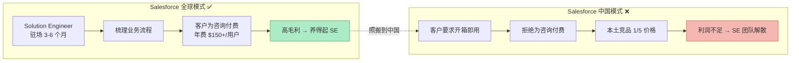

---

### 案例二：华为"铁三角"—— 中国式FDE的近似解

| 维度 | 内容 |
|------|------|
| **事件** | 华为在 2006 年苏丹项目失败后，创立了"铁三角"模型：客户经理（AR）+ 解决方案专家（SR）+ 交付专家（FR），三人一组深入客户现场 |
| **对应困境** | 前提三的近似突破：用"团队协作"替代"个人全能" |
| **关键细节** | "铁三角"本质上是用**三个人的组合**来覆盖FDE一个人应有的能力——AR负责关系和商务、SR负责方案和架构、FR负责交付和落地。这是对FDE人才稀缺的一种"组织化替代"。但华为模式的成立依赖**高客单价的大项目**（通常千万级以上），只有在超大项目中才能养活这样的三人小组 |
| **FDE 视角** | "铁三角"证明了**中国不是不需要FDE能力，而是无法让一个人承担这个能力**——必须拆成三人才能运作 |
| **核心教训** | **"铁三角"是FDE的组织化降级方案**——它证明了中国ToB可以通过团队弥补个人能力的缺失，但无法改变"单个人才市场不存在FDE"的事实 |

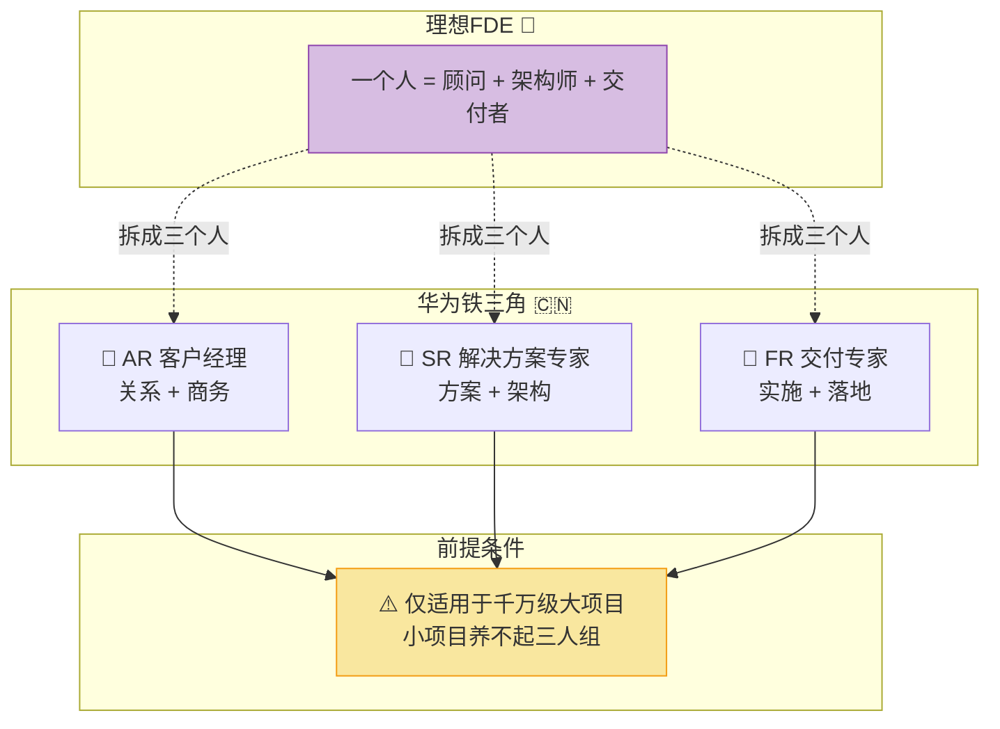

---

### 案例三：用友/金蝶的转型困局 —— 老牌ToB的利润陷阱

| 维度 | 内容 |
|------|------|
| **事件** | 用友网络 2020-2024 年连续亏损超 60 亿元，从传统ERP向云服务（用友BIP）转型艰难；金蝶国际连续亏损多年后 2024 年才首次盈利 |
| **对应困境** | 前提二：利润空间不足 + 前提一：客户不付订阅费 |
| **关键细节** | 传统ERP时代，用友/金蝶靠"软件许可+实施费"盈利，有利润空间养实施顾问（FDE的雏形）。但转向云订阅后，客户拒绝按年付费（习惯一次性买断），厂商被迫维持"半云半本地"模式，收入下降但成本上升。同时，政府/国企客户通过低价招标进一步挤压利润 |
| **FDE 视角** | 用友/金蝶在ERP时代曾经有过"实施顾问"角色，但在云转型中**这个能力层被利润压力逐步削薄**——从"懂业务的顾问"退化为"配系统的技术员" |
| **核心教训** | **即便是中国最大的ToB软件公司，也无法在利润挤压下维持FDE能力**——这不是个案，是行业宿命 |

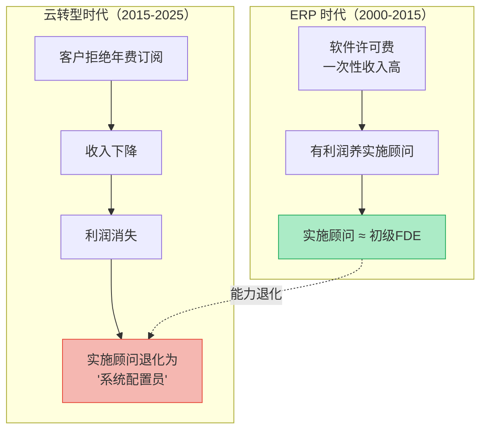

---

### 案例四：AI Agent 浪潮 —— 新变量还是旧陷阱？

| 维度 | 内容 |
|------|------|
| **事件** | 2024-2026 年，大量 AI Agent 创业公司涌入中国ToB市场，试图用 AI 替代人工完成"业务理解+方案设计+系统实施"的工作 |
| **对应困境** | 试图用技术绕过FDE缺失，但撞上同一面墙 |
| **关键细节** | AI Agent 理论上可以替代FDE的"业务理解"和"方案设计"能力——让 AI 做"翻译层"。但中国ToB客户同样不愿为"AI 梳理业务流程"付费，反而期望 AI"即插即用"。同时，AI Agent 公司也面临同样的利润困境：ToB 客单价低、交付重、定制化多，AI 降低了人力成本但**没有改变付费逻辑** |
| **FDE 视角** | AI 可以增强FDE的效率，但**无法替代FDE存在的商业前提**——客户愿意付费、厂商有利润、市场有人才，这三个前提不会因为 AI 而自动成立 |
| **核心教训** | **技术变革≠商业变革**——AI 是工具升级，但如果商业生态不变，FDE 的三重缺失依然是死结 |

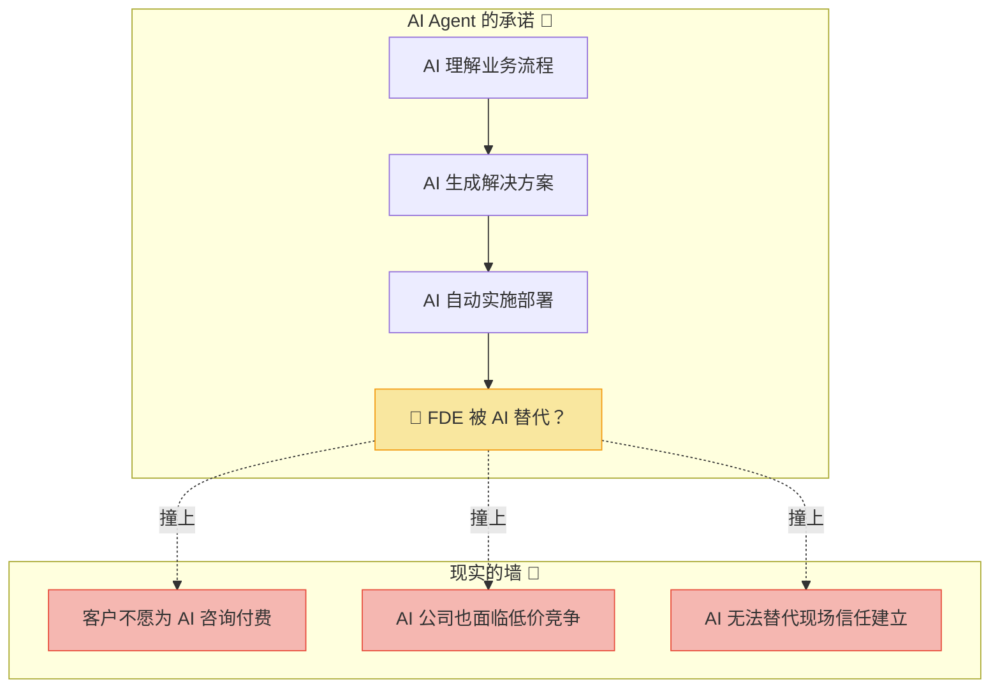

---

### 案例横向对比

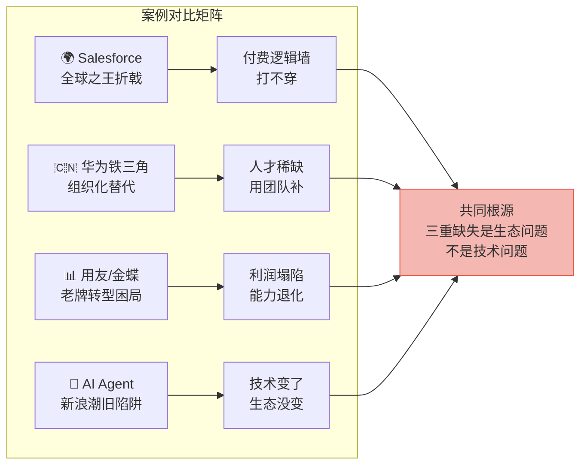

| 案例 | 对应前提 | 核心启示 |
|------|----------|----------|
| 🌍 **Salesforce** | 前提一 + 前提二 | 全球最强ToB公司也打不穿中国的付费逻辑墙 |
| 🇨🇳 **华为铁三角** | 前提三 | 用三人团队替代一个人的FDE，但只适用于大项目 |
| 📊 **用友/金蝶** | 前提二 | 利润压力下，FDE能力从"顾问"退化为"配置员" |
| 🤖 **AI Agent** | 全部 | 技术可以升级，但商业生态不变则困局不变 |

> 🔑 **四个案例的共同信号**：FDE的三重缺失不是"可以优化"的问题，而是**结构性锁定**——无论是全球巨头、本土龙头还是新技术浪潮，都无法单独突破。

---

## 最高级思考问答：超越"FDE缺失"本身

> 以下是关于中国ToB与FDE问题的**终极追问**，旨在穿透表象，触及底层逻辑与可能的破局方向。

---

### Q1：AI 时代，FDE 这个角色还有存在的必要吗？

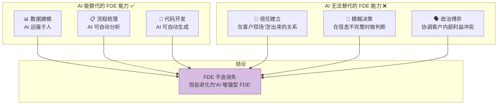

| 维度 | 传统 FDE | AI 增强型 FDE | 纯 AI 替代 |
|------|----------|-------------|-----------|
| **效率** | 手动梳理流程，耗时数周 | AI 辅助分析，数天完成 | AI 自动完成 |
| **深度** | 依赖个人经验 | AI + 行业知识库加持 | 缺乏上下文理解 |
| **信任** | ✅ 现场建立的信任 | ✅ 人与AI协同建立信任 | ❌ 无法建立信任 |
| **判断** | ✅ 模糊场景的判断力 | ✅ AI提供选项，人做判断 | ⚠️ 无法处理利益博弈 |
| **成本** | 高（单人年薪50万+） | 中（AI降低人力需求） | 低（但无法落地） |

> 💡 **高级回答**：AI 不会消灭 FDE，而是**重塑 FDE**。未来的 FDE 不是"一个人做所有事"，而是"一个人 + AI 做一个团队的事"。但核心前提不变——**客户必须为这个角色的存在付费**，否则再强的 AI 也无用武之地。

---

### Q2：中国ToB有没有可能打破这个恶性循环？突破口在哪里？

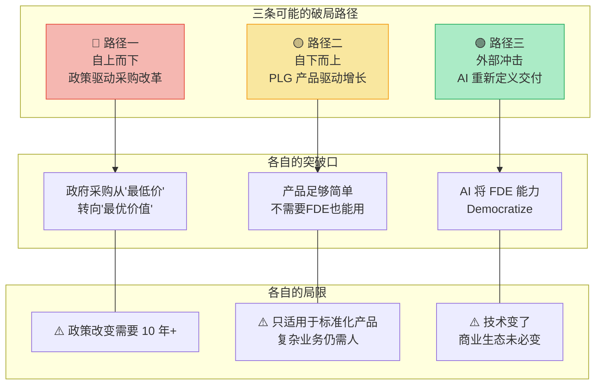

| 路径 | 逻辑 | 时间线 | 可能性 | 局限 |
|------|------|--------|--------|------|
| **🔴 政策驱动** | 政府采购从"最低价"转向"最优价值"评标 | 10-15 年 | ⭐⭐⭐ | 体制惯性极大，改变需要时间 |
| **🟡 PLG 绕过** | 产品足够简单（如飞书、钉钉），用户自助使用，根本不需要 FDE | 5-10 年 | ⭐⭐⭐⭐ | 只适用于标准化场景，复杂业务无法覆盖 |
| **🟢 AI 重塑** | AI 将 FDE 能力"民主化"，让普通工程师也能做 FDE 的工作 | 3-5 年 | ⭐⭐⭐ | 降低了人才门槛，但不改变付费逻辑 |
| **🔵 出海反哺** | 中国ToB公司先在海外建立 FDE 能力，再反向输入国内 | 5-10 年 | ⭐⭐ | 需要企业有全球化视野和能力 |

> 💡 **高级回答**：恶性循环不会"被打破"，而是会被**绕过**。最现实的路径是 **PLG（产品驱动增长）**——当产品足够简单，用户自己就能用起来，FDE 就不再是必要条件。但这也意味着：**中国ToB的终局可能不是"养出Palantir式的FDE"，而是"根本不需要FDE"。**

---

### Q3：华为的"铁三角"能成为中国版FDE的解法吗？

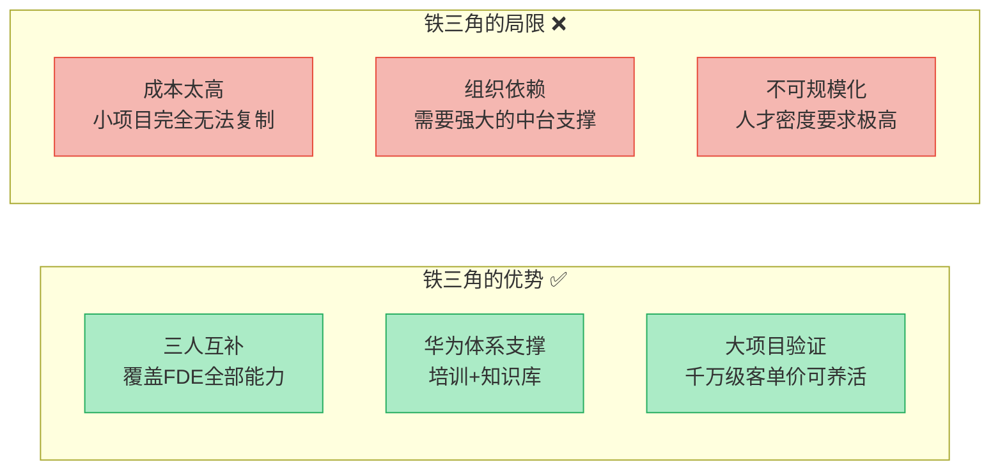

| 维度 | 铁三角模式 | Palantir FDE 模式 | 评估 |
|------|-----------|-------------------|------|
| **能力覆盖** | 三人组合 ≈ 一个 FDE | 一个人 ≈ 完整 FDE | 铁三角是"组织降级" |
| **适用项目** | 千万级以上大项目 | 百万到千万级均可 | 铁三角覆盖面窄 |
| **可复制性** | 需要华为级中台和培训体系 | 依赖个人能力+公司方法论 | 铁三角门槛更高 |
| **人才市场** | 需要三个专才，各自可招 | 需要一个全才，招不到 | 铁三角**绕开了人才稀缺** |
| **规模化** | 受限于人才密度和管理半径 | 受限于个人能力天花板 | 各有瓶颈 |

> 💡 **高级回答**：铁三角是**中国ToB在FDE人才稀缺约束下的最优组织创新**，但它解决的是"如何在没有FDE的情况下完成FDE的工作"，而不是"如何培养出FDE"。它是**绕道而行**，而非**正面突破**。

---

### Q4：如果中国ToB永远养不出FDE，那出路在哪里？

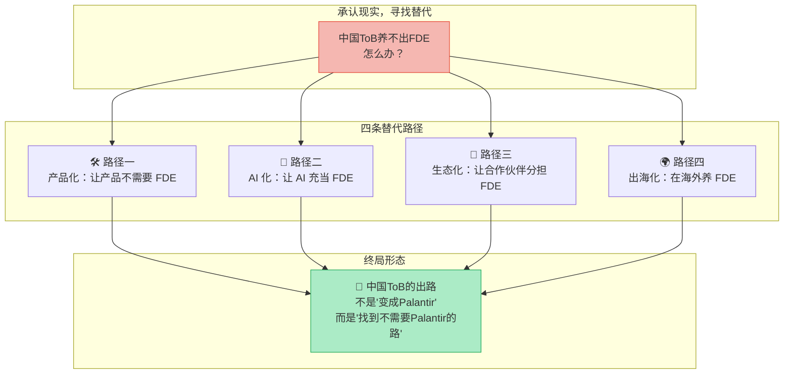

| 路径 | 核心逻辑 | 代表企业 | 适用场景 |
|------|----------|----------|----------|
| **🛠️ 产品化** | 产品足够简单，用户自助上手，消灭FDE需求 | 飞书、钉钉、Notion | 标准化通用场景 |
| **🤖 AI 化** | AI 替代FDE的业务理解和方案设计能力 | 各类 AI Agent 创业公司 | 中等复杂度业务 |
| **👥 生态化** | 建立合作伙伴网络，由渠道商承担FDE角色 | Salesforce（AppExchange） | 行业垂直场景 |
| **🌍 出海化** | 在海外高利润市场养FDE，反向服务国内 | 字节（Lark）、Shein | 有全球化能力的企业 |

> 💡 **高级回答**：出路不在于"如何复制Palantir"，而在于**重新定义问题**。如果FDE养不出来，那就让产品不需要FDE、让AI替代FDE、让生态分担FDE。**真正的创新不是在旧框架里找答案，而是提出一个新问题。**

---

### Q5：终极一问 —— 这背后更深层的中国商业文化因素是什么？

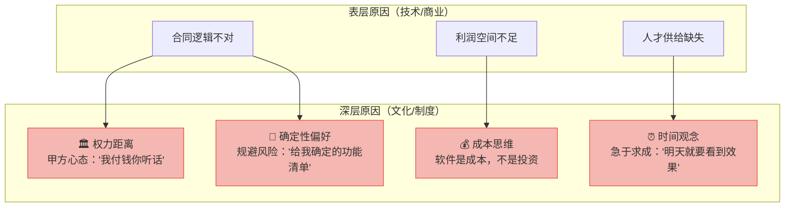

| 文化因素 | 在ToB中的表现 | 对 FDE 的致命影响 |
|----------|-------------|-----------------|
| **🏛️ 权力距离大** | 甲方心态："我付钱，你听话" | FDE 需要与客户"平等对话"，但甲方不接受服务商"指导"自己 |
| **⏰ 急于求成** | "明天就要看到效果" | FDE 需要数周/数月"泡"在客户现场，甲方没有这个耐心 |
| **📐 确定性偏好** | "给我确定的功能清单，别跟我谈探索" | FDE 的核心价值在于"在不确定中找方向"，客户拒绝这种不确定性 |
| **💰 成本思维** | "软件是成本中心，能少花钱就少花" | FDE 是高成本角色，在"成本思维"下首先被砍 |
| **🎭 面子文化** | 客户不愿承认"我不知道自己要什么" | FDE 的前提是客户承认"我需要帮助想清楚"，面子文化堵死了这个入口 |

> 💡 **终极回答**：FDE 的三重缺失，本质上是**中国商业文化在ToB领域的投射**——权力距离让FDE无法平等对话，急于求成让FDE没有时间探索，确定性偏好让FDE的价值不被承认，成本思维让FDE的预算被砍。这不是靠技术或管理能解决的，而是需要**一代人商业文化的迭代**。好消息是，随着新一代决策者的崛起和AI的冲击，这个文化正在缓慢但不可逆地改变。

---

## 总结：全文逻辑记忆全景

### 全文逻辑地图

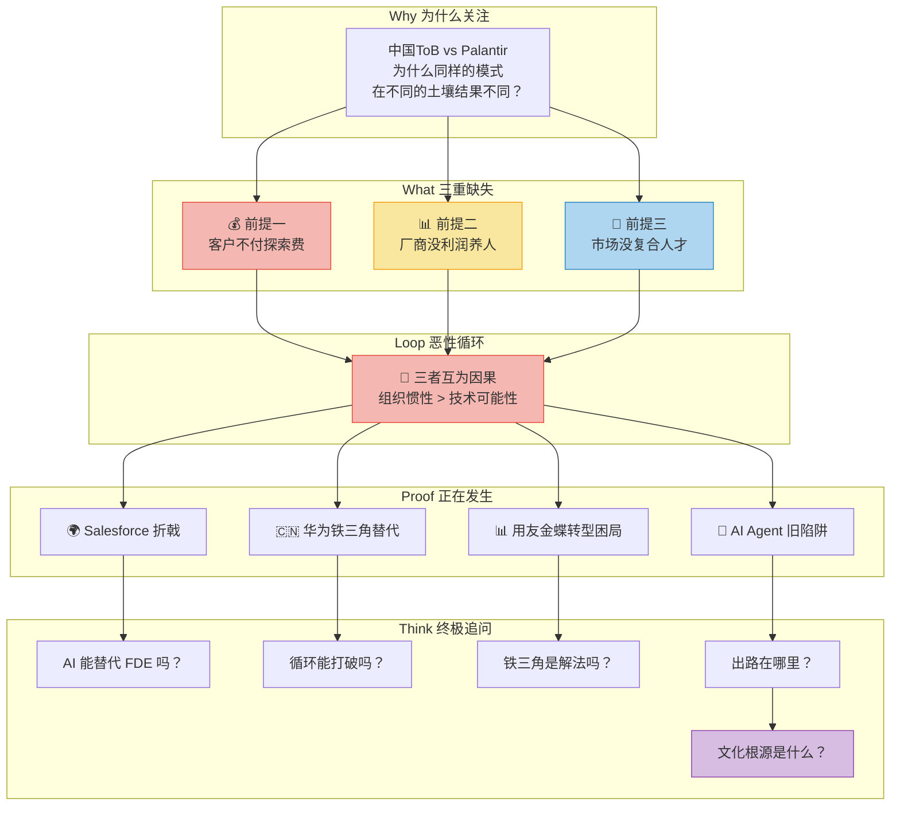

### 逻辑链记忆法

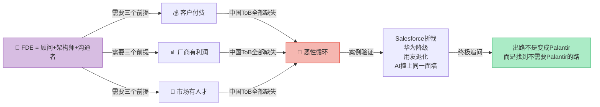

> **一句话记忆**：**FDE 三重缺失 → 恶性循环 → 案例验证 → 出路不在旧框架，而在新问题**

### 核心认知升级

| 维度 | 旧认知 | 新认知 |
|------|--------|--------|
| **问题本质** | 中国技术不行 | 不是技术问题，是**商业生态 + 文化**问题 |
| **FDE 定义** | 高级交付工程师 | **顾问+架构师+沟通者**的复合翻译层 |
| **循环认知** | 单个问题可以解决 | 三个前提**互为因果**，必须系统性突破 |
| **案例启示** | 做得不够好所以失败 | **全球最强公司也打不穿**——是结构性问题 |
| **AI 的角色** | AI 能替代 FDE | AI 增强FDE效率，但**不改变商业前提** |
| **出路方向** | 培养更多FDE | **让产品不需要FDE**，或找到替代方案 |
| **文化根源** | 管理/流程问题 | **权力距离+急于求成+成本思维**的深层锁定 |

### 全文知识全景对照

| 章节 | 核心问题 | 关键答案 | 记忆锚点 |
|------|----------|----------|----------|
| **全景总览** | FDE 是什么？ | 顾问+架构师+沟通者的复合角色 | 🧩 翻译层 |
| **前提一** | 客户为什么不付费？ | "结果导向"不承认探索价值 | 💰 探索无价 |
| **前提二** | 厂商为什么养不起？ | 最低价+交付黑洞+KPI短视 | 📊 利润蒸发 |
| **前提三** | 人才为什么找不到？ | 优秀人才流向互联网，翻译层空白 | 🧠 人才断层 |
| **恶性循环** | 三者如何锁定？ | 互为因果，组织惯性>技术可能 | 🔁 循环锁定 |
| **深度对比** | Palantir 为何能跑通？ | 付费+利润+人才的生态正循环 | ✅ 生态适配 |
| **真实案例** | 现实中如何验证？ | Salesforce折戟/华为降级/用友退化/AI撞墙 | 🌍 全球困境 |
| **终极追问** | 出路在哪里？ | 不是变成Palantir，而是找到不需要它的路 | 🚀 重新定义 |

---

## 一句话终极心法

> **中国ToB的困境不是缺技术、缺产品、缺人才——而是缺一个让FDE能存活的商业生态。**
>
> 在客户不愿为探索付费、厂商没有利润养人、市场找不到复合型人才这三重锁死之下，组织的惯性远大于任何技术的可能性。
>
> 全球最强的 Salesforce 打不穿这面墙，华为用铁三角绕道而行，用友金蝶在利润塌陷中失去了FDE能力，AI 浪潮撞上的也是同一面墙。
>
> **出路不在于"如何复制Palantir"，而在于"如何找到一条不需要Palantir的路"——让产品足够简单以至于不需要FDE，让AI充当翻译层，让生态分担顾问角色。**
>
> 真正的创新不是在旧框架里找答案，而是**提出一个全新的问题**。
