# 马斯克的五大预言：未来十年的变革路线图

> 该视频深入解读了埃隆·马斯克关于未来的五个核心预判，并将其拆解为普通人可以理解的商业趋势和避坑要点。视频强调，马斯克的预言并非科幻故事，而是基于商业逻辑的推演，旨在帮助人们看清未来十年的变革方向，并为个人发展和投资决策提供参考。

---

## 全景总览：五大预言的逻辑关系

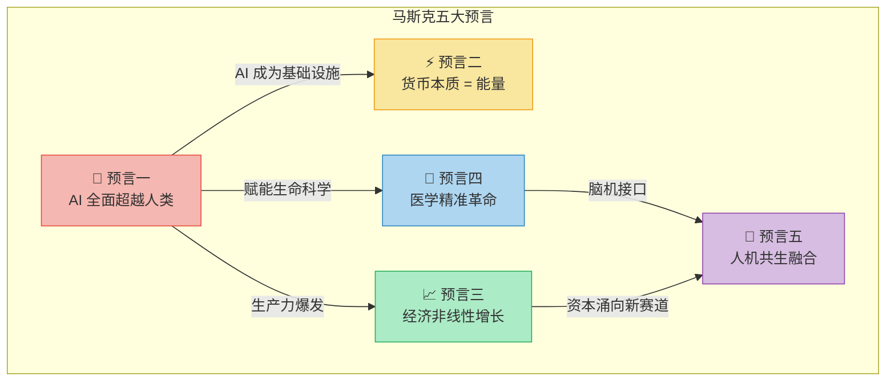

> 💡 **核心逻辑**：AI超越人类是**根基**，它驱动了货币体系、经济增长、医学革命的连锁变革，最终指向人机共生的终局。

---

## 预言一：AI 将全面超越人类

### 核心观点

马斯克认为，AI 机器人在精细操作和知识同步上已展现出超越人类的能力。这不是对未来的猜测，而是**正在发生的事实**。

### 商业影响与个人机遇

| 维度 | 内容 |
|------|------|
| **核心观点** | AI 在精细操作和知识同步上已展现超越人类的能力 |
| **商业影响** | 依赖经验和手艺的行业，技术门槛将被 AI 突破 |
| **个人机遇** | 主动拥抱 AI，用其提升个人竞争力，而不是等待 AI 来敲门 |

### 行业冲击矩阵

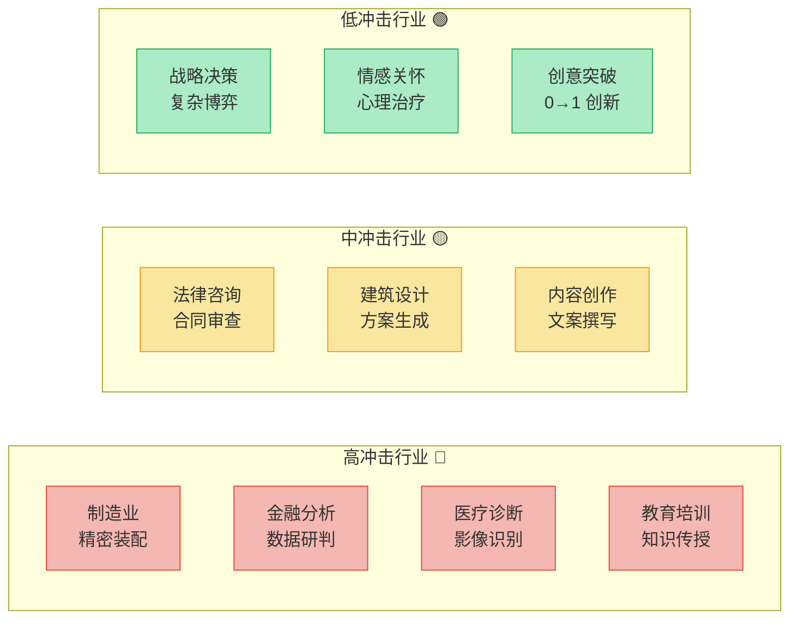

| 冲击等级 | 行业特征 | 典型职业 | AI 替代程度 |
|----------|----------|----------|------------|
| 🔴 **高冲击** | 规则明确、数据密集、可标准化 | 流水线工人、数据分析师、影像科医生 | 60-80% |
| 🟡 **中冲击** | 需要专业判断，但模式可学习 | 律师助理、初级设计师、文案写手 | 30-60% |
| 🟢 **低冲击** | 需要创造力、共情、复杂决策 | 企业战略官、心理治疗师、艺术家 | 10-30% |

> 🔑 **行动指南**：不是"AI 会不会取代我"，而是"**会用 AI 的我**取代**不会用 AI 的我**"。

---

## 预言二：未来货币的本质是能量

### 核心观点

钱作为中间商的角色将被削弱，未来的交易本质上是**能量的交换**。当 AI 和机器人大幅降低劳动成本，商品的生产成本趋近于能源成本。

### 商业影响与个人机遇

| 维度 | 内容 |
|------|------|
| **核心观点** | 钱作为中间商的角色被削弱，交易本质是能量交换 |
| **商业影响** | 商品价格趋近于零，靠差价赚钱的买卖受冲击 |
| **个人机遇** | 重视能源和算力的价值——谁掌控资源，谁掌握入场券 |

### 货币演化路径

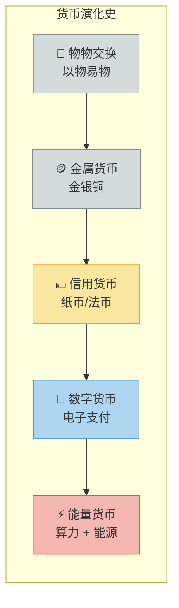

### 价值锚点迁移

| 时代 | 价值锚点 | 核心资源 | 财富逻辑 |
|------|----------|----------|----------|
| **农业时代** | 土地 | 耕地、水源 | 有地则有粮，有粮则有权 |
| **工业时代** | 资本 | 工厂、设备 | 有资本则有产能，有产能则有利润 |
| **信息时代** | 数据 | 流量、用户 | 有数据则有洞察，有洞察则有优势 |
| **AI 时代** | 能量 | 算力、能源 | 有算力则有智能，有智能则有一切 |

> 🔑 **底层逻辑**：当 AI 把劳动成本压到接近零，商品的价格就只剩下**能源成本**。谁掌握了能源和算力，谁就掌握了新时代的"印钞机"。

---

## 预言三：全球经济将迎来非线性增长

### 核心观点

AI 和机器人的爆发将推动生产力**指数级增长**，全球经济可能在 5-7 年内翻一番。增长不再是线性的，而是**爆发式的**。

### 商业影响与个人机遇

| 维度 | 内容 |
|------|------|
| **核心观点** | AI + 机器人推动生产力指数级增长，5-7 年经济翻一番 |
| **商业影响** | 资产配置需要更主动，否则会被时代甩开 |
| **个人机遇** | 借势卡位，提前布局，而不是停在原地等待 |

### 线性增长 vs 指数增长

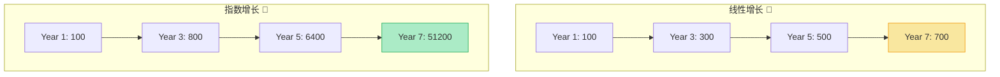

### 不同角色的应对策略

| 角色 | 线性思维（❌ 危险） | 指数思维（✅ 正确） |
|------|---------------------|---------------------|
| **个人** | 靠加薪攒钱，稳定第一 | 投资自身技能复利，拥抱变化 |
| **企业** | 按年度计划稳步扩张 | 搭建 AI 能力平台，随时抓住爆发点 |
| **投资者** | 分散配置，追求平均回报 | 集中押注指数级赛道（AI、能源、生物技术） |
| **政策制定者** | 基于历史数据制定政策 | 为颠覆性变革预留制度弹性 |

> 🔑 **关键洞察**：指数增长初期看起来和线性增长没什么区别——**直到拐点到来**。现在就是拐点附近。

---

## 预言四：医学将迎来精准革命

### 核心观点

医学将告别原始试错阶段，通过**编写代码**和**修改基因**来精准治疗疾病。"试错式医学"将进化为"编程式医学"。

### 商业影响与个人机遇

| 维度 | 内容 |
|------|------|
| **核心观点** | 医学从试错走向精准，通过编写代码和修改基因治疗疾病 |
| **商业影响** | 进一步降低对传统医疗劳动力的需求 |
| **个人机遇** | 创造力比劳动力更有价值，找到机器无法替代的事 |

### 医学范式转变

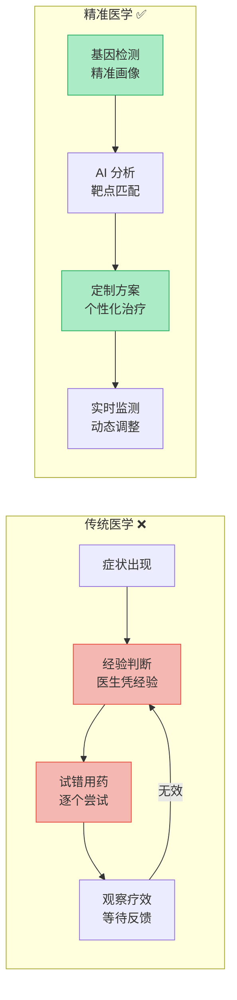

### 医学范式对比

| 维度 | 传统医学（试错式） | 精准医学（编程式） |
|------|--------------------|--------------------|
| **诊断方式** | 症状 + 经验判断 | 基因检测 + AI 辅助分析 |
| **治疗逻辑** | 同类疾病用同类药 | 根据个人基因定制方案 |
| **药物开发** | 大规模临床试验，耗时10年+ | AI 模拟 + 靶点精准匹配 |
| **医生角色** | 决策者（凭经验） | 协作者（AI 提供选项，医生做判断） |
| **核心局限** | "平均值有效"不等于"对你有效" | 数据隐私、伦理争议 |

> 🔑 **深层趋势**：劳动力本身的价值在降低，**创造力**变得越来越重要。核心命题变成——找到**自己能做而机器无法替代**的事情。

---

## 预言五：人机共生融合

### 核心观点

马斯克认为，AI 的发展最终将走向与人脑的深度融合。通过脑机接口（如 Neuralink），人类将能够直接与 AI 协同，实现认知能力的**指数级增强**。这不是取代，而是**进化**。

### 商业影响与个人机遇

| 维度 | 内容 |
|------|------|
| **核心观点** | AI 与人脑将走向深度融合，通过脑机接口实现认知增强 |
| **商业影响** | 脑机接口、神经科技将成为下一个万亿级赛道 |
| **个人机遇** | 提前关注人机协作领域，培养与 AI 协同工作的能力 |

### 人机共生演化路线

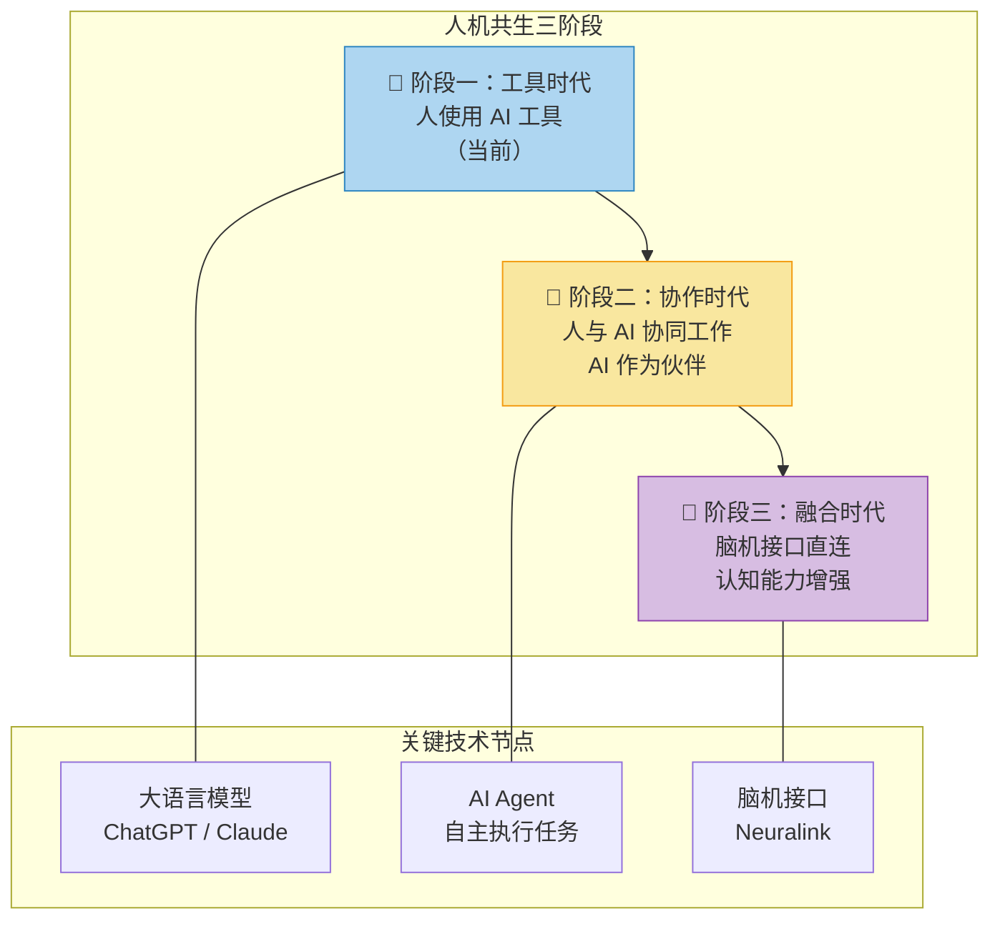

### 人机关系演进

| 阶段 | 时间线 | 人机关系 | 人的角色 | 关键能力 |
|------|--------|----------|----------|----------|
| **工具时代** | 2023-2025 | 人命令，AI 执行 | 指挥者 | 提问能力、提示词工程 |
| **协作时代** | 2025-2030 | 人规划，AI 协同 | 决策者 | 判断力、系统思维 |
| **融合时代** | 2030+ | 人机一体 | 进化者 | 想象力、价值观、意图 |

> 🔑 **终极判断**：未来的竞争不是"人 vs AI"，而是"**人机协同体 vs 纯人力**"。越早学会与 AI 共生，越能占据先机。

---

## 正在发生的真实案例：预言不是未来，是现在

> 马斯克的五大预言不是科幻剧本，而是**已经在发生的商业现实**。以下案例证明，每一个预言都有真实的落地证据。

---

### 案例一：AI 超越人类 — Figure 机器人与 AI 程序员

| 维度 | 内容 |
|------|------|
| **事件** | 2024-2026 年，Figure 01/02 人形机器人进入宝马工厂实测；OpenAI、Anthropic 的 AI 系统在编程竞赛中击败人类冠军 |
| **对应预言** | 预言一：AI 在精细操作和知识同步上超越人类 |
| **关键数据** | Figure 机器人可完成拧螺丝、搬运零件等精细操作；AI 编程助手（Copilot/Cursor）已承担 40%+ 的代码编写量 |
| **深层信号** | AI 不再是"辅助工具"，而是**独立劳动力**——它不休息、不请假、不抱怨，24小时运转 |
| **启示** | 当机器能"看、想、做"三合一，所有依赖"手艺+经验"的行业门槛将被夷平 |

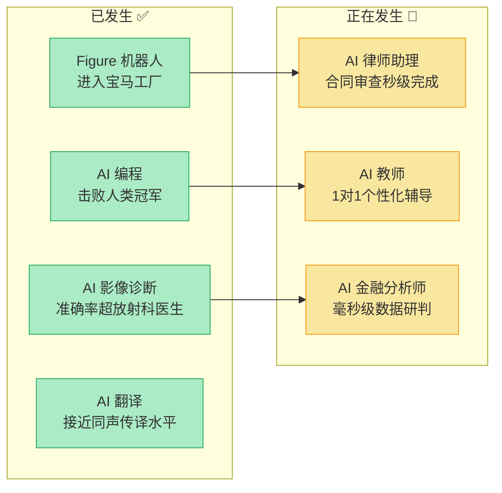

---

### 案例二：货币 = 能量 — 数据中心就是新的"油田"

| 维度 | 内容 |
|------|------|
| **事件** | 全球科技巨头疯狂抢购电力资源：微软重启三里岛核电站，亚马逊收购核电站供数据中心用电，马斯克预测"芯片之后最缺的是电" |
| **对应预言** | 预言二：未来货币的本质是能量 |
| **关键数据** | 2025 年全球数据中心用电量约占全球 3-5%，预计 2030 年达 10%+；美国电价在数据中心集中地区翻倍 |
| **深层信号** | 算力的瓶颈不是芯片，而是**电力**——谁拥有能源，谁就拥有 AI 时代的"石油" |
| **启示** | 比特币挖矿是"能量→数字货币"的最直接案例；未来国家竞争力将以**能源储备和算力规模**衡量 |

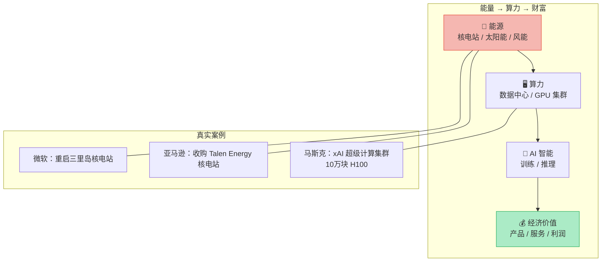

**能量货币化证据链**：

| 现象 | 表面 | 本质 |
|------|------|------|
| 科技巨头抢购核电 | 企业行为 | **算力需要能源，能源就是竞争力** |
| 比特币挖矿 | 金融投机 | **用电力"铸造"数字资产——能量的金融化** |
| 电价暴涨地区 | 供需失衡 | **AI 时代的"石油危机"正在上演** |
| 各国部署 AI 算力中心 | 技术基建 | **本质是"能量转化站"——把电变成智能** |

---

### 案例三：非线性增长 — ChatGPT 的恐怖增速

| 维度 | 内容 |
|------|------|
| **事件** | ChatGPT 2 个月破 1 亿用户（史上最快）；NVIDIA 市值从 2023 年 1 万亿飙升至 2025 年 3 万亿+；全球 AI 投资 2024 年超 2000 亿美元 |
| **对应预言** | 预言三：经济将迎来非线性增长 |
| **关键数据** | ChatGPT：5 天破百万 → 2 月破亿（TikTok 用了 9 个月）；NVIDIA 年收入从 2023 年 600 亿 → 2025 年 1300 亿+，翻倍只用一年 |
| **深层信号** | AI 产业的增长曲线不是线性的，而是**垂直拉升**——这就是马斯克说的"5-7 年翻一番"的缩影 |
| **启示** | 站在指数曲线上的企业和人，财富积累速度会超出想象；站在曲线外的，会被瞬间甩开 |

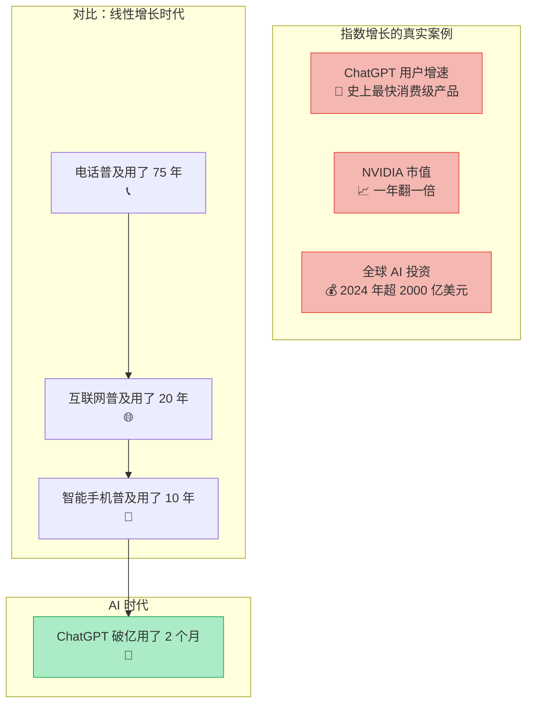

**增长速度对比表**：

| 技术 | 达到 1 亿用户 | 增速倍数 |
|------|-------------|----------|
| **电话** | 75 年 | 基准（1x） |
| **互联网** | 20 年 | 3.75x |
| **智能手机** | 10 年 | 7.5x |
| **TikTok** | 9 个月 | 100x |
| **ChatGPT** | 2 个月 | **450x** |

---

### 案例四：精准医学 — AlphaFold 与 CRISPR 的突破

| 维度 | 内容 |
|------|------|
| **事件** | DeepMind 的 AlphaFold 预测了 2 亿+ 蛋白质结构；CRISPR 基因编辑疗法获 FDA 批准（2023）；mRNA 疫苗技术在疫情期间被验证 |
| **对应预言** | 预言四：医学将迎来精准革命 |
| **关键数据** | AlphaFold 将蛋白质结构预测从"数年实验"压缩到"分钟级计算"；首款 CRISPR 疗法（Casgevy）定价 220 万美元，一次治愈镰刀细胞病 |
| **深层信号** | 医学正在从"试错"走向"编程"——**人体就是代码，疾病就是 Bug，治疗就是打补丁** |
| **启示** | 生物信息学 + AI 是下一个爆发点；"个性化医疗"不再是口号，而是商业模式 |

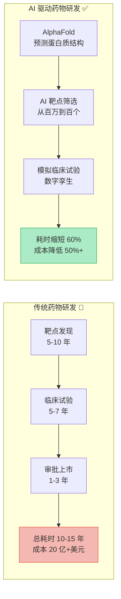

**精准医学里程碑**：

| 时间 | 事件 | 意义 |
|------|------|------|
| **2020** | AlphaFold 2 发布 | 蛋白质结构预测从实验科学变成**计算科学** |
| **2023** | 首款 CRISPR 疗法获批 | 人类首次能"编辑基因"治愈遗传疾病 |
| **2024** | AI 辅助癌症早筛 | 通过血液检测 AI 识别早期癌症信号 |
| **2025** | mRNA 个性化癌症疫苗 | 根据患者肿瘤基因定制疫苗，进入临床三期 |
| **2026** | AI 数字孪生临床试验 | 用虚拟患者加速药物验证，FDA 开始接受 |

---

### 案例五：人机共生 — Neuralink 脑机接口人体试验

| 维度 | 内容 |
|------|------|
| **事件** | Neuralink 于 2024 年完成首例人类大脑芯片植入；2025 年已有数名瘫痪患者通过思维控制电脑和手机；Meta、Synchron 等公司也在推进脑机接口 |
| **对应预言** | 预言五：人机共生融合 |
| **关键数据** | 首例患者 Noland Arbaugh 植入后，仅用意念即可操控电脑下棋、玩游戏；设备无线充电，无需外接 |
| **深层信号** | 脑机接口从实验室走向人体——**人脑与 AI 的物理连接已经存在**，不再是理论 |
| **启示** | 短期：医疗康复（瘫痪、失语）；中期：认知增强；长期：人机融合。当前处于"工具时代"末期 |

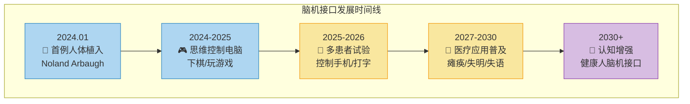

**人机共生竞争格局**：

| 公司/机构 | 技术路线 | 当前进展 | 目标 |
|-----------|----------|----------|------|
| **Neuralink** | 侵入式脑机接口（植入芯片） | 人体试验中，已有多例植入 | 恢复运动能力 → 认知增强 |
| **Synchron** | 微创血管内脑机接口 | FDA 突破性设备认定 | 更低风险，更快普及 |
| **Meta** | 非侵入式腕带 EMG | 原型机阶段 | 消费级人机交互 |
| **OpenAI / Anthropic** | AI Agent 作为"外挂大脑" | 已商用 | 认知协作 → 深度融合 |

> 🔑 **五个案例的共同信号**：未来不是"来了"，而是**"正在展开"**——每一个预言都已经有了真实世界的锚点。

---

## 最高级思考问答：超越预言本身

> 以下是关于马斯克五大预言的**终极追问**，旨在穿透表象，触及底层逻辑。

---

### Q1：AI 大规模取代人类工作后，普通人靠什么生存？

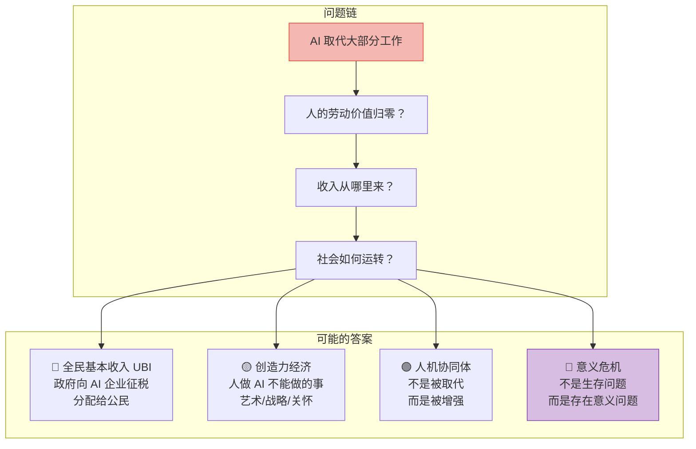

**深层分析**：

| 层面 | 浅层答案 | 深层真相 |
|------|----------|----------|
| **经济** | 政府发 UBI | UBI 只是过渡方案——真正的问题是**分配权力**的重新洗牌 |
| **职业** | 转向创造力工作 | 不是所有人都能/愿意转向——**中间层**最危险 |
| **心理** | 人会找到新意义 | 历史上每次技术革命都伴随大规模**意义危机** |
| **政治** | 民主制度会适应 | 掌握 AI 的少数人可能形成**新型权力垄断** |

> 💡 **最高级思考**：真正的风险不是"失业"，而是**"无用阶级"的出现**——当一个人的劳动不再有经济价值时，社会如何定义他的存在意义？这是技术问题，更是哲学问题。

---

### Q2：教育体系应该如何应对？现在的孩子该学什么？

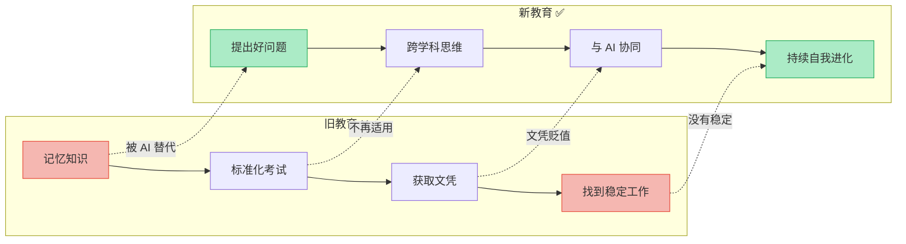

**教育范式对比**：

| 维度 | 旧范式（❌ 正在失效） | 新范式（✅ 必须转向） |
|------|----------------------|----------------------|
| **核心能力** | 记忆力、计算力 | **提问力、判断力、创造力** |
| **学习方式** | 标准化课程、统一进度 | 个性化学习、AI 辅助 |
| **知识价值** | 知识就是力量 | **能运用知识才是力量**——AI 拥有所有知识 |
| **职业准备** | 学一门专业，吃一辈子 | **终身学习**——技能半衰期急剧缩短 |
| **成功路径** | 好学校 → 好工作 → 稳定生活 | 发现热爱 → 持续创造 → 适应变化 |

> 💡 **最高级思考**：教育的终极目标不是"教会孩子什么"，而是**"让孩子成为能自我进化的人"**。当 AI 能回答所有问题，**提出好问题**就成了最稀缺的能力。

---

### Q3：这些预言会加速贫富分化吗？普通人如何避免被甩开？

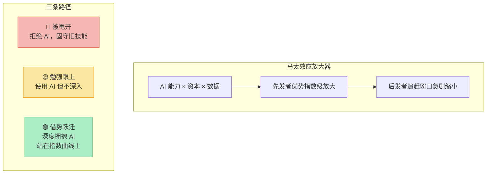

**分化机制分析**：

| 维度 | 加速分化的力量 | 普通人的对抗策略 |
|------|----------------|-----------------|
| **技术鸿沟** | AI 工具使用能力差异巨大 | **立即开始用**——不需要懂技术，只需要会提问 |
| **资本鸿沟** | AI 投资回报集中在少数人手中 | 投资 AI 相关指数基金，**让资本为你工作** |
| **认知鸿沟** | 理解趋势的人提前布局 | **持续学习**——关注 AI 行业动态，培养判断力 |
| **教育鸿沟** | 优质教育资源更加集中 | 利用 AI 作为**免费私教**——这是史上最大的教育平权工具 |

> 💡 **最高级思考**：AI 既是最大的**分化加速器**，也是最大的**平权工具**——一个农村孩子用 ChatGPT 学英语，效果可能超过城市孩子的一对一外教。关键不在于你有什么资源，而在于**你是否知道如何使用它**。

---

### Q4：马斯克的预言是远见还是营销？如何辨别？

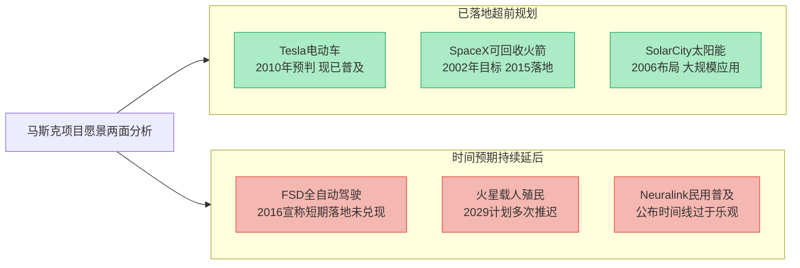

**判断框架**：

| 判断维度 | 远见的特征 | 营销的特征 |
|----------|-----------|-----------|
| **方向** | 大方向正确，符合物理和商业逻辑 | 模糊的、难以证伪的表述 |
| **时间线** | 时间经常不准确（过于乐观） | "明年""很快"——永远在前方 |
| **动机** | 推动行业变革、吸引人才和投资 | 服务于股价、融资、个人品牌 |
| **验证** | 已有部分实现（Tesla/SpaceX） | 完全未实现，仅停留在 PPT |

> 💡 **最高级思考**：**方向和时间的分离**是关键——马斯克的"方向"几乎总是对的，但"时间线"几乎总是错的。正确的态度是：**相信方向，但不迷信时间表**。不要因为他的时间表不准就否定方向，也不要因为方向正确就相信所有时间承诺。

---

### Q5：普通人现在应该做什么？给出一个最小行动方案

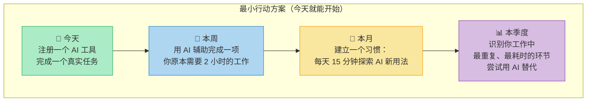

**行动优先级矩阵**：

| 优先级 | 行动 | 投入 | 回报 | 时间窗口 |
|--------|------|------|------|----------|
| 🔴 **P0** | 学会用 AI 工具完成日常工作 | 每天 15 分钟 | 效率提升 2-5 倍 | **现在** |
| 🔴 **P0** | 理解 AI 能做什么、不能做什么 | 每周读 2 篇行业分析 | 建立正确认知框架 | **现在** |
| 🟡 **P1** | 投资 AI/能源相关资产 | 每月定投 | 搭上指数增长列车 | 3 个月内 |
| 🟡 **P1** | 培养一个 AI 无法替代的技能 | 持续投入 | 建立护城河 | 6 个月内 |
| 🟢 **P2** | 关注脑机接口、生物技术前沿 | 保持好奇 | 提前看到下一个浪潮 | 持续 |
| 🟢 **P2** | 建立个人知识体系和影响力 | 长期积累 | 在创造力经济中立足 | 长期 |

> 💡 **最高级思考**：不要等到"准备好了"再行动——**行动本身就是最好的准备**。马斯克自己的经历就是最好的证明：他不是先学会了造火箭才创立 SpaceX，而是**在做的过程中学会了造火箭**。

---

## 总结：五大预言的逻辑记忆框架

### 全文逻辑地图

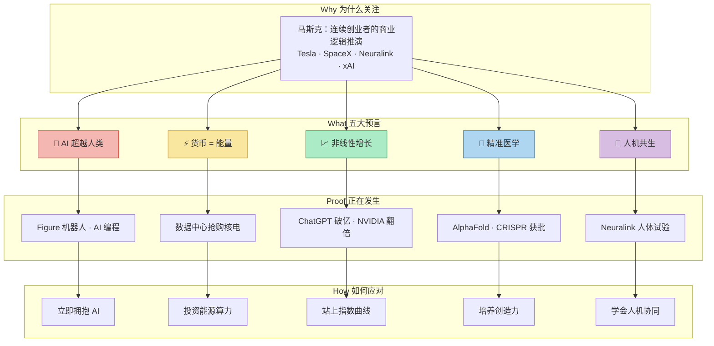

### 逻辑链记忆法

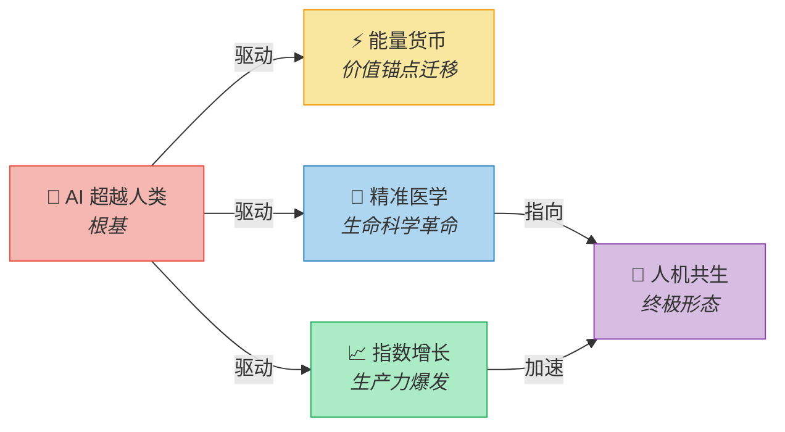

> **一句话记忆**：**AI 生根 → 能量为币 → 经济指数爆炸 → 医学精准编程 → 人机终局共生**

### 核心认知升级

| 预言 | 旧认知 | 新认知 | 行动关键词 |
|------|--------|--------|-----------|
| **AI 超越人类** | AI 是工具，人有独特优势 | AI 是新型劳动力，不拥抱就被淘汰 | **主动学习** |
| **货币 = 能量** | 钱是财富的衡量标准 | 能源和算力才是真正的价值锚点 | **投资资源** |
| **非线性增长** | 经济缓慢线性增长 | 5-7 年可能翻一番 | **借势卡位** |
| **精准医学** | 看病靠医生经验 | 编程式治疗，基因级别定制 | **培养创造力** |
| **人机共生** | 人与机器是竞争关系 | 人机融合是进化方向 | **学会协同** |

### 五大预言 × 真实案例 × 终极追问 全景对照

| 预言 | 正在发生的案例 | 最高级追问 | 核心行动 |
|------|----------------|-----------|----------|
| 🤖 **AI 超越人类** | Figure 机器人、AI 编程击败人类 | AI 取代工作后，人靠什么生存？ | 今天就开始用 AI |
| ⚡ **货币 = 能量** | 科技巨头抢购核电、电价暴涨 | 能源垄断会不会造就新型霸权？ | 关注能源和算力资产 |
| 📈 **非线性增长** | ChatGPT 破亿、NVIDIA 翻倍 | 贫富分化会不会不可逆转？ | 站上指数曲线 |
| 🧬 **精准医学** | AlphaFold、CRISPR 获批 | 基因编辑的伦理边界在哪里？ | 培养创造力 |
| 🔗 **人机共生** | Neuralink 人体试验 | 人脑接入 AI 后，"我"还是"我"吗？ | 学会人机协同 |

### 一句话终极心法

> **不要试图预测未来——而是成为未来需要的那种人。**
>
> 马斯克预言的本质不是"未来会发生什么"，而是"未来需要什么样的人"。
>
> 答案是：**能与 AI 共生的人、能掌控能量的人、能站在指数曲线上的人、能创造力突破的人、能持续进化的人。**
>
> **你不需要等到准备好——开始了，才会准备好。**
