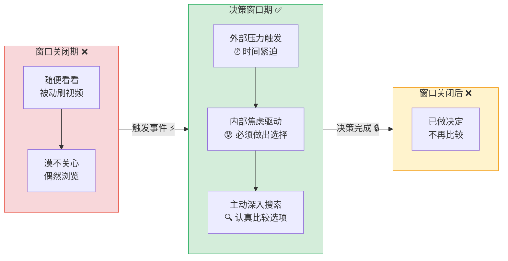
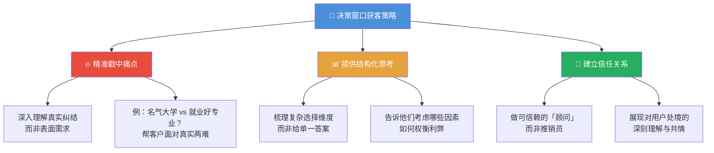
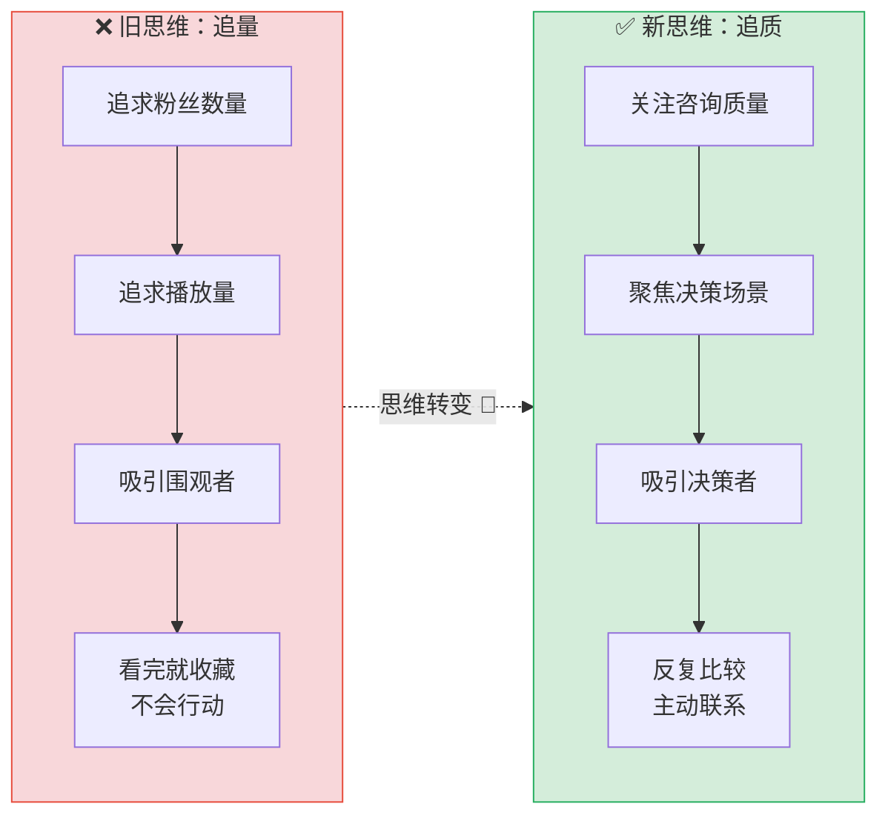
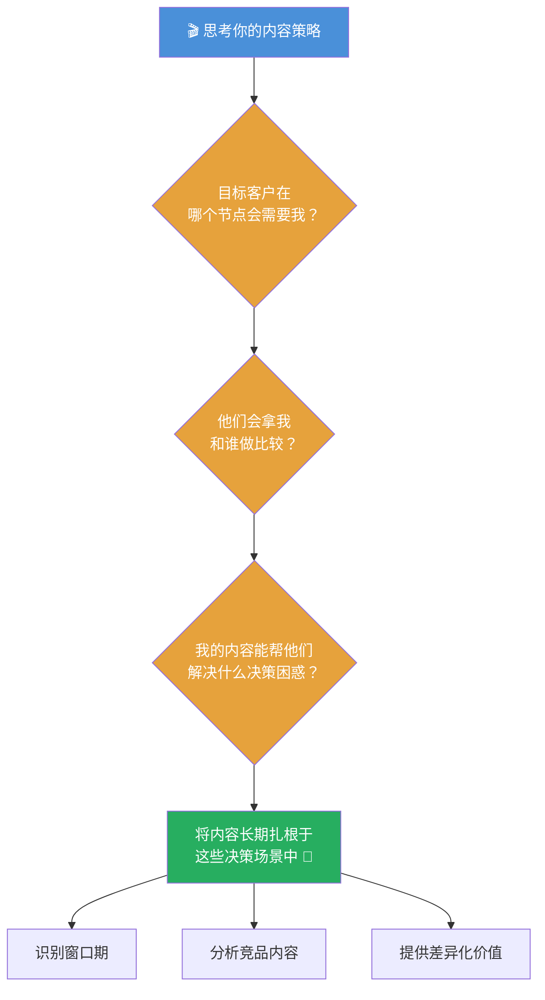
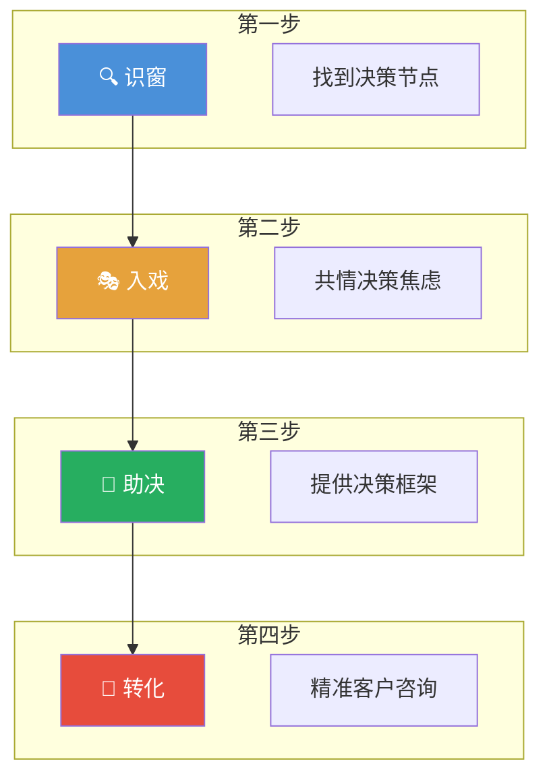
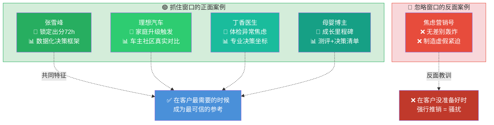
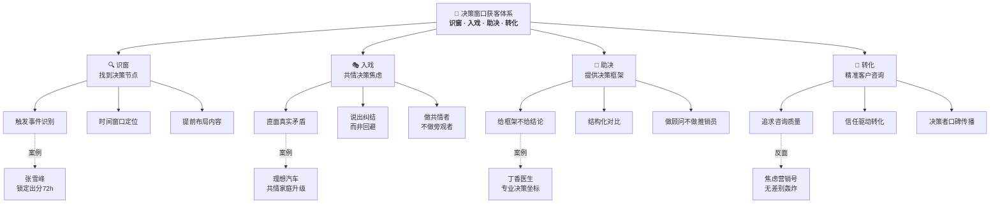

# 获客视频的核心：抓住客户的「决策窗口」

> [!abstract] 总览
> 做获客视频就像帮助考生填报高考志愿——关键不在于吸引所有人，而在于精准捕捉客户从「随便看看」转变为「必须认真选择」的那个**决策节点**。在这个窗口期提供有价值的决策辅助，才能将围观流量转化为真实咨询。

---

## 🧠 逻辑记忆框架

**口诀：「识窗 → 入戏 → 助决 → 转化」**

**四步获客模型：**

| | **🔍 识窗** | **🎭 入戏** | **🧭 助决** | **🎯 转化** |
|---|---|---|---|---|
| **关键动作** | 找到决策窗口 | 进入客户决策场景 | 提供决策辅助 | 精准客户主动咨询 |
| **核心问题** | 客户什么时候开始认真选？ | 他们的真实纠结是什么？ | 我能帮他们理清什么？ | 咨询量质量高不高？ |
| **内容角色** | 观察者 | 共情者 | 顾问 | 信赖对象 |

**递进逻辑：**
- **识窗**：先识别客户在哪个时间节点会从「路过」变为「认真比较」
- **入戏**：深入理解决策者在那个节点的真实焦虑和纠结
- **助决**：用内容做决策辅助工具，而非单纯的产品展示
- **转化**：吸引来的不是围观者，而是正在反复比较的精准决策者

---

## 核心概念：什么是「决策窗口」？

> [!tip] 定义
> 「决策窗口」是一个人或家庭在面临重要选择时，因**外部压力**或**内部焦虑**而必须开始认真研究、比较并做出决定的那个时间点。

**特征对比：**

| 维度 | 窗口关闭时 | 窗口打开时 |
|:---:|:---|:---|
| **用户状态** | 被动刷视频，偶然浏览 | 主动搜索，认真比较 |
| **信息需求** | 漠不关心或泛泛了解 | 深入、结构化、有针对性 |
| **行动意愿** | 看完就走，不会行动 | 反复观看、对比、判断 |
| **内容偏好** | 娱乐性、轻松型 | 专业性、决策参考型 |

> [!example] 典型场景
> 高考考生分数公布后，家长需要为孩子填报志愿。此时他们会从「被动刷视频」转变为「主动、认真地研究学校、专业和城市发展前景」——这就是决策窗口打开的瞬间。

---

## 如何在「决策窗口」吸引客户？

### 三大策略详解

| 策略 | 核心要点 | 具体做法 | 记忆锚点 |
|:---:|:---|:---|:---:|
| **🔥 精准戳中痛点** | 深入理解用户在做选择时的真实纠结和不确定性 | 不要回避客户的矛盾心理，反而要把矛盾摆在台面上，帮他们正视 | 🎯 说出他们不敢说的话 |
| **📊 提供结构化思考** | 帮助用户梳理复杂的选择维度，而非提供单一答案 | 教会客户「怎么选」比告诉他「选哪个」更有价值——给框架，不给结论 | 🧭 给地图，不给终点 |
| **🤝 建立信任** | 成为用户愿意共同承担判断风险的「顾问」 | 通过展现对用户处境的深刻理解，建立专业、可信、有温度的形象 | 🤝 做同行者，不做推销员 |

---

## 核心转变：从「吸引所有人」到「吸引决策者」

| 对比维度 | ❌ 旧模式：吸引所有人 | ✅ 新模式：吸引决策者 |
|:---:|:---|:---|
| **关注指标** | 粉丝数、播放量 | 咨询量、转化率 |
| **目标受众** | 所有可能刷到的人 | 正处于决策窗口的精准客户 |
| **内容定位** | 泛娱乐、博眼球 | 决策辅助、专业参考 |
| **用户行为** | 看完 → 收藏 → 遗忘 | 反复观看 → 比较 → 主动咨询 |
| **最终效果** | 虚假繁荣，无法变现 | 精准获客，高效转化 |

> [!tip] 关键洞察
> 不要追求让 100 万人「觉得有意思」，而要让你的目标客户觉得「这个人/这个内容值得信赖」。**100 个决策者的反复比较，胜过 10 万个围观者的一次点赞。**

---

## 内容策略落地：扎根决策场景

**落地三问：**

| 问题 | 思考方向 | 输出 |
|:---:|:---|:---|
| **何时？** | 目标客户在什么时间节点从「随便看」变成「必须选」？ | 找到你的行业「高考出分」时刻 |
| **与谁比？** | 客户在窗口期会看哪些内容/创作者来做判断？ | 明确竞品和内容差异化空间 |
| **帮什么？** | 你的内容能帮客户理清哪个决策维度？ | 确定内容的核心价值主张 |

---

## 🧠 逻辑记忆：四位一体获客模型

> [!note] 记忆心法
> **「识窗 → 入戏 → 助决 → 转化」**
>
> 1. **识窗**（找到节点）—— 不是所有时候都有用，只在窗口期才有意义
> 2. **入戏**（共情焦虑）—— 不假装问题不存在，而是直面客户的纠结
> 3. **助决**（提供框架）—— 教人「怎么选」比告诉人「选哪个」更高级
> 4. **转化**（精准获客）—— 追求的不是点赞，而是那些正在反复比较你的决策者

---

## 高考志愿比喻 —— 完整映射

| 高考志愿填报 | 获客视频创作 | 对应策略 |
|:---|:---|:---:|
| 分数公布 → 家长开始紧张 | 客户遇到触发事件 → 决策窗口打开 | 🔍 识窗 |
| 家长焦虑：选学校？选专业？选城市？ | 客户纠结：选 A 方案？还是 B 方案？ | 🎭 入戏 |
| 好的填报指导：帮你分析利弊、理清思路 | 好的获客内容：提供决策框架、结构化对比 | 🧭 助决 |
| 家长最终选择了信赖的顾问机构 | 客户主动咨询你、选择你 | 🎯 转化 |
| ❌ 差的指导：一味推销、不管适合不适合 | ❌ 差的内容：只吹自己、不帮客户思考 | 避坑 |

---

## 📰 正在发生的真实案例

> [!quote] 理论必须落地
> 以下案例均发生在 **2024–2026 年**，覆盖教育、汽车、保险、房产、母婴行业，正面与反面各取典型。

### 正反面案例速览

| | 🟢 抓住决策窗口 | 🔴 忽略决策窗口 |
|:---:|:---|:---|
| **代表** | 张雪峰、理想汽车社区、丁香医生 | 焦虑营销号、传统4S店广撒网、保险电话推销 |
| **核心理念** | 在决策节点提供框架，做值得信赖的顾问 | 不管客户在什么阶段，一味推销自己 |
| **循环结果** | 精准咨询爆满，口碑自传播 | 播放量虚高但转化极低，或根本无人问津 |

---

### 🟢 案例一：张雪峰 ——「决策窗口」的教科书级实践

张雪峰是「决策窗口」理论最完美的代言人。他精准锁定了**高考出分后的 72 小时**——这是中国家庭最大的集体决策窗口。

**四步模型映射：**

| 获客步骤 | 张雪峰的实践 |
|:---:|:---|
| 🔍 识窗 | 锁定「出分到填报截止」这 3-7 天——家长从「随便看看」变成「必须选」的紧迫窗口 |
| 🎭 入戏 | 不说空话，直接面对真实矛盾：「这个分数，选 985 冷门还是 211 热门？」 |
| 🧭 助决 | 提供结构化框架：城市 > 学校 > 专业？用就业数据、行业趋势帮家长理清维度 |
| 🎯 转化 | 从免费视频 → 付费咨询 → 志愿填报服务，精准家长排队抢购 |

> [!success] 核心启示
> 张雪峰的成功不在于「讲得好笑」，而在于他**只在决策窗口最紧迫的时候提供最有价值的判断框架**。平时刷他视频的人可能只是看热闹，但出分后认真看的那批家长——才是真正付费的人。这正是「100 个决策者 > 10 万个围观者」的完美验证。

---

### 🟢 案例二：理想汽车 —— 在「家庭升级」窗口扎根

理想汽车的内容获客策略，是「决策窗口」在汽车行业的经典应用。他们的目标客户在**孩子出生 / 二胎 / 换房**时打开决策窗口。

**四步模型映射：**

| 获客步骤 | 理想汽车的实践 |
|:---:|:---|
| 🔍 识窗 | 识别触发事件：家庭成员增加、旧车年限到了、摇到新能源牌——这些都是「必须开始认真选车」的信号 |
| 🎭 入戏 | 不吹参数，而是共情真实纠结：「30 万预算， SUV 还是 MPV？纯电还是增程？老婆要舒服，爸妈要安全」 |
| 🧭 助决 | 车主社区提供真实用车场景对比：长途自驾、日常通勤、接送孩子、周末露营——帮用户按**自己的生活方式**做判断 |
| 🎯 转化 | 车主自发推荐 → 试驾预约 → 大定，形成「决策者影响决策者」的信任链条 |

> [!success] 核心启示
> 理想的社区运营本质上是**让已经过了窗口的决策者（老车主）成为新决策者的参考坐标**。一个真实车主的用车分享，比 100 条广告更能打动正在纠结的准客户——因为他们正在窗口期，需要的是「可信赖的同行者」而非「推销员」。

---

### 🟢 案例三：丁香医生 —— 在「健康焦虑」窗口建立信任

医疗健康领域的决策窗口往往由**体检报告异常、家人确诊、突发症状**触发。丁香医生正是在这些时刻成为用户的「决策顾问」。

**四步模型映射：**

| 获客步骤 | 丁香医生的实践 |
|:---:|:---|
| 🔍 识窗 | 识别触发事件：体检报告出结果、孩子发烧半夜搜索、父母确诊某个疾病——焦虑瞬间拉满 |
| 🎭 入戏 | 不说「别担心」的空话，而是直面焦虑：「甲状腺结节 3 级到底要不要手术？」——把用户最纠结的问题摆上台面 |
| 🧭 助决 | 提供结构化决策框架：什么情况下观察？什么情况下必须干预？不同方案的利弊对比？——帮用户建立判断坐标 |
| 🎯 转化 | 免费科普 → 付费问诊 → 体检套餐推荐，用户在焦虑中找到了可信赖的「健康顾问」 |

> [!success] 核心启示
> 健康领域的决策窗口往往伴随着**强烈的情绪压力**。能在这一刻提供冷静、专业、结构化分析的人，获得的不是点赞，而是**深层信任**——这种信任一旦建立，用户会反复回来、推荐给朋友，形成长期价值。

---

### 🔴 反面案例：焦虑营销号 —— 不看窗口，只制造恐惧

大量保险、教育、健康领域的营销号，完全忽视「决策窗口」的存在，采用**无差别焦虑轰炸**策略。

| 营销动作 | 实际后果 | 窗口理论诊断 |
|:---|:---|:---:|
| 「再不买保险就来不及了！」—— 不管用户年龄和阶段，强推焦虑 | 用户反感取关，即使有需求也不找你了 | 🔍 没识窗：在窗口没打开时强推 = 骚扰 |
| 「别人家孩子 3 岁就会编程了！」—— 制造虚假紧迫感 | 家长短期焦虑但长期不信任，觉得被利用 | 🎭 没入戏：不理解家长真实需求，只制造恐惧 |
| 「我们的课程是最好的！」—— 只说自己的好，不帮客户分析 | 客户看完觉得「都说自己好，我到底该信谁？」 | 🧭 没助决：没有提供决策框架，没有差异化价值 |
| 高频推送、限时优惠、倒计时 | 用户被信息轰炸后选择逃避，而非决策 | 🎯 没转化：逼迫决策 ≠ 辅助决策，适得其反 |

> [!fail] 核心教训
> 焦虑营销的本质是**试图在决策窗口没打开时强行制造窗口**——这就像在高考还没出分时就给家长打电话推销志愿填报服务，只会让人反感。真正的获客是在窗口自然打开的那一刻，恰好站在那里，成为他们最需要的「决策参谋」。

---

### 🟢 案例四：母婴垂类博主 —— 在「成长里程碑」窗口精准获客

2025-2026 年，一批母婴垂类博主通过精准捕捉**孩子成长里程碑**触发的决策窗口，实现了从几百粉丝到稳定变现的跨越。

**四步模型映射：**

| 获客步骤 | 母婴博主的实践 |
|:---:|:---|
| 🔍 识窗 | 识别触发节点：宝宝 6 个月加辅食、1 岁选早教、2 岁如厕训练、3 岁选幼儿园——每个里程碑都是一个决策窗口 |
| 🎭 入戏 | 直面新手妈妈的真实焦虑：「辅食要不要加盐？」「早教班到底有没有用？」——不说教，先共情 |
| 🧭 助决 | 提供对比表格、测评视频、决策清单——帮妈妈「怎么选」而非告诉她「买这个」 |
| 🎯 转化 | 妈妈们在窗口期反复回来对比 → 信任建立后，推荐的母婴产品自然转化 |

> [!success] 核心启示
> 母婴领域的决策窗口是**可预测、可提前布局**的——孩子的成长节点不会突然消失。聪明的创作者会**在窗口打开前 1-2 周**就发布相关内容，确保当家长开始焦虑搜索时，第一个看到的就是自己。

---

### 案例对比总结图

| 案例 | 行业 | 决策窗口触发点 | 核心策略 | 一句话总结 |
|:---:|:---:|:---|:---|:---|
| 张雪峰 | 教育 | 高考出分 → 填报截止 | 数据框架 + 直面矛盾 | 在最紧迫的 72 小时，做最专业的判断参考 |
| 理想汽车 | 汽车 | 家庭升级（二胎/换房） | 车主社区 + 场景对比 | 让过了窗口的人帮正在窗口里的人做决策 |
| 丁香医生 | 健康 | 体检异常 / 突发症状 | 专业分析 + 决策坐标 | 在焦虑最高点提供冷静的结构化判断 |
| 母婴博主 | 母婴 | 成长里程碑（辅食/入园） | 提前布局 + 测评清单 | 窗口可预测，提前 2 周布局抢占搜索首位 |
| 焦虑营销号 | 保险/教育 | ❌ 没有窗口，强行制造 | 恐惧轰炸 + 限时逼迫 | 在窗口没打开时强推 = 骚扰 + 信任崩塌 |

---

## 🔮 高级思考问答：全文深度总结

> 以下八个问答，从概念本质到实操落地，层层递进，帮助你从"知道"走向"做到"。

---

### Q1：「决策窗口」和普通的「用户需求」有什么本质区别？

> [!question]- 展开思考
> **核心答案：需求是一直存在的，窗口是需求被「激活」的那个瞬间。**
>
> 用一个比喻来理解：
> - **需求** = 一颗种子，埋在土里，一直存在
> - **决策窗口** = 春雨落下，种子开始发芽的那个时刻
>
> | 维度 | 普通需求 | 决策窗口 |
> |------|---------|:---:|
> | 时间性 | 持续存在，没有明确时限 | 有明确的打开和关闭时间 |
> | 紧迫感 | 「以后可能需要」 | 「现在必须决定」 |
> | 信息行为 | 偶尔看看， casually 浏览 | 主动搜索、反复比较、认真判断 |
> | 行动概率 | 极低——看完就走 | 极高——比较后就会行动 |
>
> **2026 年的典型例子**：
> - 一个人可能一直有「学英语」的需求（普通需求），但只有当他拿到外企 offer、要求 3 个月后英语面试时——决策窗口才打开
> - 一个家庭可能一直想「换辆车」（普通需求），但只有当二胎出生、5 座车不够坐时——决策窗口才打开
>
> **终极心法**：不要试图在种子还没发芽时就去摘果实。找到那场「春雨」——客户生命中的触发事件——在窗口打开的那一刻精准出现。

---

### Q2：我怎么知道自己行业的「决策窗口」是什么时候？

> [!question]- 展开思考
> **核心答案：回溯你现有客户的决策路径，找到那个让他们「从被动变主动」的触发事件。**
>
> **三步定位法**：
>
> **第一步：回访老客户**
> - 问他们：「你当初是什么原因开始认真考虑买/用我们的服务的？」
> - 找到高频出现的答案——那就是触发事件
>
> **第二步：搜索行为分析**
> - 看你的客户在咨询时都搜了什么关键词？
> - 「XX 和 XX 哪个好」「XX 怎么选」「XX 避坑指南」——这些搜索模式说明他们已经在窗口里了
>
> **第三步：生命周期定位**
> - 画出客户的人生/业务时间线
> - 找到那些「不得不变」的节点
>
> | 行业 | 常见触发事件 | 决策窗口特征 |
> |------|:---|:---|
> | 教育 | 升学节点、政策变化、孩子表现出特殊兴趣 | 时间紧迫，信息量大，需要快速决策 |
> | 房产 | 结婚、生子、工作变动、学区政策 | 金额巨大，试错成本高，反复比较 |
> | 健康 | 体检异常、确诊、家人生病 | 情绪压力大，需要专业+安心的指引 |
> | B2B SaaS | 业务扩张、系统老旧、竞品倒逼、融资到位 | 理性决策，多人参与，需要 ROI 论证 |
> | 母婴 | 孩子成长里程碑、季节变化、入园入学 | 可预测，可提前布局，信任驱动 |
>
> **终极心法**：你的「决策窗口」不是你自己定义的，是客户生命中的**真实事件**定义的。回到客户的生活场景中去，而不是坐在办公室里猜。

---

### Q3：「给框架不给结论」，客户不会去找别人做决策吗？

> [!question]- 展开思考
> **核心答案：恰恰相反——给框架的人才是最终被信赖的人，因为客户要的不是「被说服」，而是「被尊重」。**
>
> 这是一个反直觉但极其重要的洞察：
>
> | 内容类型 | 客户感受 | 信任度 | 转化率 |
> |---------|:---:|:---:|:---:|
> | 「选我！我最棒！」 | 被推销，产生防备 | ⭐⭐ | 低——客户觉得你只在乎成交 |
> | 「这些维度你都要考虑，我帮你一一分析」 | 被尊重，感到安心 | ⭐⭐⭐⭐⭐ | 高——客户觉得你在帮他 |
>
> 为什么「给框架」反而更能赢：
> 1. **客户不怕做选择，怕的是做错选择**。你帮他理清了维度，他就有信心做决策
> 2. **框架本身就是专业性的最高证明**。能教人「怎么选」的人，比直接说「选我」的人高级 10 倍
> 3. **当你客观分析（包括承认自己的不足）时，信任反而更强**。客户会觉得「这个人连缺点都告诉我，是真的在为我考虑」
>
> **2026 年的典型验证**：
> - 张雪峰从不直接说「必须报 XX 大学」，而是说「如果你是这个分数、这个地域、想从事这个行业，那么以下几种方案的利弊是...」——结果家长反而更信任他的判断
> - 数码测评博主说「这款手机适合拍照党，但游戏性能一般」——比「这款手机天下第一」更让人信服
>
> **终极心法**：最高级的获客不是「说服」，而是让客户觉得「跟你聊完之后，我自己想清楚了」——然后他们会主动选你，并且推荐你。

---

### Q4：决策窗口很短，我怎么确保内容恰好在那时候被看到？

> [!question]- 展开思考
> **核心答案：不需要「恰好」——你需要的是「提前布局，持续存在，在窗口打开时已经在那里等着」。**
>
> 三种布局策略：
>
> **策略一：提前 2-4 周埋伏**
> - 很多决策窗口是**可预测**的（升学、政策变化、季节需求）
> - 在窗口打开前就发布好内容，让算法有时间推荐
> - 当窗口打开、用户开始搜索时，你的内容已经在「那里等着」
>
> **策略二：常青内容 + 节点激活**
> - 制作不依赖具体时间的「常青型」决策框架内容
> - 在窗口期到来时，通过直播、互动、评论区运营来「激活」这些内容
>
> **策略三：建立「搜索拦截」体系**
> - 决策窗口打开后，用户的第一动作是**搜索**
> - 布局关键词：「XX怎么选」「XX和XX哪个好」「XX避坑」
> - 确保你的内容出现在这些搜索结果的顶部
>
> | 时间线 | 布局动作 | 目标 |
> |-------|:---|:---|
> | 窗口前 4 周 | 发布常青型决策框架内容 | 建立搜索基础 |
> | 窗口前 1-2 周 | 发布行业热点解读、政策分析 | 提升曝光权重 |
> | 窗口打开时 | 直播、互动、限时答疑 | 精准捕获窗口期用户 |
> | 窗口关闭后 | 收集反馈、优化内容 | 为下一个窗口做准备 |
>
> **终极心法**：你不是在「追赶」窗口，而是在**提前建好房子，等窗口来了请客户进来坐**。内容创作者最好的状态是：「我一直在这里，你需要的时候，我刚好在。」

---

### Q5：我是小创作者，粉丝很少，怎么和头部大号竞争「决策窗口」？

> [!question]- 展开思考
> **核心答案：决策窗口竞争的不是流量，而是「信任密度」——小创作者反而有优势。**
>
> | 维度 | 头部大号 | 小创作者 / 个人 |
> |------|---------|:---|
> | **内容深度** | 泛、覆盖广、但难以深入 | 可以在一个细分场景做到极致 |
> | **信任关系** | 粉丝多但关系浅 | 粉丝少但关系深、互动多 |
> | **响应速度** | 流程长、难以个性化 | 灵活快速、可以一对一回应 |
> | **专业壁垒** | 靠品牌背书 | 靠真实经验和案例积累 |
> | **获客效率** | 100 万播放 → 100 个咨询（转化率低） | 1000 播放 → 200 个咨询（转化率极高） |
>
> 小创作者的三大窗口优势：
>
> 1. **极致垂直**：大号做「高考志愿填报」，你可以做「浙江考生 550-580 分段的计算机专业怎么选」——越窄越精准
> 2. **真实体验**：你就是客户「过来人」，你的真实经历比大号的理论框架更有说服力
> 3. **即时互动**：评论区、私信的及时回复，让客户觉得「这个人真的在乎我的问题」
>
> **终极心法**：决策窗口里，客户要的不是「最知名的人」，而是「最懂我处境的人」。10 个铁杆信任你的精准客户，比 10 万个路过你视频的大号粉丝更有价值。

---

### Q6：如何从「追播放量」的思维真正转变为「追咨询质量」？

> [!question]- 展开思考
> **核心答案：改变你的「成功指标」——从前端数据（播放、点赞）转向后端数据（咨询量、成交率、客户满意度）。**
>
> **新旧指标体系对比**：
>
> | | ❌ 旧指标体系 | ✅ 新指标体系 |
> |---|---|---|
> | **核心指标** | 播放量、粉丝数、点赞数 | 咨询量、咨询质量、成交率 |
> | **内容评估** | 「这条视频播放多少？」 | 「这条视频带来了几个精准咨询？」 |
> | **增长方式** | 追热点、蹭流量、博眼球 | 深耕决策场景、优化转化路径 |
> | **心态** | 「为什么播放量下降了？」 | 「这个月的咨询质量比上月好了吗？」 |
> | **风险** | 平台算法一变就崩 | 只要客户还有决策需求，就永远有价值 |
>
> **转变的三步实操**：
>
> 1. **停止每天看播放量**。改成每周统计：本周有几个精准咨询？其中几个成交？
> 2. **回访成交客户**。问他们：「你是看了哪条内容后来找我的？」——找到真正带来转化的内容，加大投入
> 3. **建立「决策内容矩阵」**。按照客户的决策阶段，系统性地生产不同阶段的辅助内容
>
> **终极心法**：播放量是给平台看的，咨询量才是给你自己看的。一个每月只发 4 条视频但带来 30 个精准咨询的创作者，远比一个月发 30 条视频只有 2 个咨询的人活得更好。

---

### Q7：「决策窗口」理论在 B2B 领域怎么用？

> [!question]- 展开思考
> **核心答案：B2B 的决策窗口不是由「个人焦虑」触发的，而是由「业务事件」触发的——找到那些事件，就是你内容扎根的土壤。**
>
> B2B 决策窗口的特殊性：
>
> | 维度 | B2C 决策窗口 | B2B 决策窗口 |
> |------|:---:|:---:|
> | **触发者** | 个人或家庭事件 | 业务事件、组织变化 |
> | **决策人** | 一个人或夫妻 | 多人决策链（使用者、评估者、批准者） |
> | **窗口时长** | 几天到几周 | 几周到几个月 |
> | **信息需求** | 情感 + 理性并重 | 理性为主，需要 ROI 论证 |
> | **信任建立** | 共情 + 专业 | 案例 + 数据 + 行业口碑 |
>
> B2B 常见的「窗口触发事件」：
> - **融资到位**：拿到钱，开始采购
> - **业务扩张**：新开城市/业务线，需要新系统
> - **合规要求**：新政策出台，必须升级
> - **竞品刺激**：竞争对手上了新系统，我们不能落后
> - **痛点爆发**：旧系统出大问题了，不得不变
>
> **B2B 内容策略**：
> - 针对每个触发事件，准备「决策框架型」内容（选型指南、ROI 计算器、行业对比报告）
> - 在触发事件发生时（如新政策出台），第一时间发布解读内容
> - 让已有的成功案例成为「决策参考」——B2B 客户最信的不是你说的，是别人用的
>
> **终极心法**：B2B 的决策窗口更长、更理性、参与人更多——但底层逻辑完全一样：**在客户「必须开始认真选」的时刻，成为他们最信赖的决策参考。**

---

### Q8：如何用 AI 来增强「决策窗口」的捕获能力？

> [!question]- 展开思考
> **核心答案：AI 不能替你找到窗口——但能让你的内容在窗口打开时，更快、更准、更深地触达决策者。**
>
> | AI 应用场景 | 具体做法 | 效果 |
> |:---|:---|:---|
> | **窗口预测** | 用 AI 分析行业数据、政策变化、搜索趋势，预判下一波决策窗口何时打开 | 从「被动等窗口」到「提前 4 周布局」 |
> | **内容个性化** | 根据不同客户画像，自动生成不同版本的决策框架内容 | 同一个窗口期，给不同细分客户不同的「助决」内容 |
> | **搜索拦截** | 用 AI 分析窗口期客户的搜索关键词，优化内容标题和结构 | 确保你的内容出现在客户搜索结果的顶部 |
> | **互动辅助** | 用 AI 做评论区/私信的即时回复，解答初步决策问题 | 在窗口期给客户「秒回」的体验，建立信任 |
> | **反馈分析** | 用 AI 分析成交客户的决策路径，找到真正起作用的「关键时刻」 | 持续优化你的「窗口获客」策略 |
>
> **2026 年最前沿的实践**：
> - 一些教育博主已经用 AI 生成「个性化选校方案」——输入分数、地域、偏好，AI 自动生成对比报告——这就是在「助决」环节用 AI 做到了 10 倍效率
> - 一些 SaaS 公司用 AI 分析客户的官网变化、招聘信息、融资新闻，自动判断「这个客户是不是进入采购窗口了」——然后精准推送内容
>
> **终极心法**：AI 是「决策窗口」理论的放大器——它让你**看得更早（预测）、触得更准（个性化）、响应更快（即时互动）、迭代更准（反馈分析）**。但核心不变：**你仍然必须是那个在窗口期真正理解客户焦虑、帮他们理清思路的「人」。**

---

## 🧠 全文总结：一张图看懂「决策窗口」获客

> [!success] 终极总结
>
> **知**：「决策窗口」不是一个营销技巧，而是一种**看待客户的全新视角**——客户不是随时都需要的，他们只在特定的时刻才真正「准备好被帮助」。你的工作是在那个时刻出现，成为他们最信赖的决策参谋。
>
> **行**：每天问自己四个问题：
> 1. 我的客户，在什么时候会从「随便看看」变成「必须选择」？（识窗）
> 2. 我是否真正理解他们在那个时刻的焦虑和纠结？（入戏）
> 3. 我的内容是在帮他们「理清思路」还是在「推销自己」？（助决）
> 4. 我追求的是播放量，还是精准的咨询量？（转化）
>
> **合一**：获客的本质不是「让更多人看到你」，而是**在客户最需要帮助的时刻，恰好成为那个值得信赖的决策参考**。这不是一个技巧，而是一种「以客户决策为中心」的内容哲学。

---

## 附：全量对照表

| 模块 | 核心概念 | 关键词 | 反面教训 |
|:---:|:---|:---:|:---|
| 识窗 | 找到客户从「随便看看」变为「必须选择」的时间节点 | 🔍 触发事件 | 不知道客户什么时候才认真——永远在「撒网」 |
| 入戏 | 深入理解客户在决策时刻的真实纠结和焦虑 | 🎭 共情 | 不理解客户处境——内容「自嗨」，无法打动人 |
| 助决 | 提供结构化决策框架，帮客户理清思路 | 🧭 框架 | 只推销不帮思考——客户觉得你和别人没区别 |
| 转化 | 吸引精准决策者，追求咨询质量而非播放量 | 🎯 质量 | 追量不追质——虚假繁荣，无法变现 |
| 信任 | 成为客户愿意反复比较、主动联系的信赖对象 | 🤝 顾问 | 一锤子买卖——没有口碑传播，获客成本越来越高 |
| 布局 | 在窗口打开前就提前准备好内容，抢占搜索首位 | 📅 预判 | 临时抱佛脚——窗口来了内容还没准备好 |

---

## 一句话带走

> [!tip] 核心记忆
> 获客的本质不是**吸引眼球**，而是**在客户最需要做决定的时候，成为他们信赖的决策参考**。
>
> **口诀回顾**：识窗 → 入戏 → 助决 → 转化 🎯
>
> **关键转变**：从「我的内容有多少人看」→「有多少决策者正在反复比较我」
>
> **现实印证**：张雪峰锁定 72h ✅ vs 焦虑营销号无差别轰炸 ❌

---

> [!question] 互动思考
> 你所在的行业，客户的「决策窗口」通常是什么时候？可以分享一下你的观察，我们一起探讨如何抓住这些关键节点。
