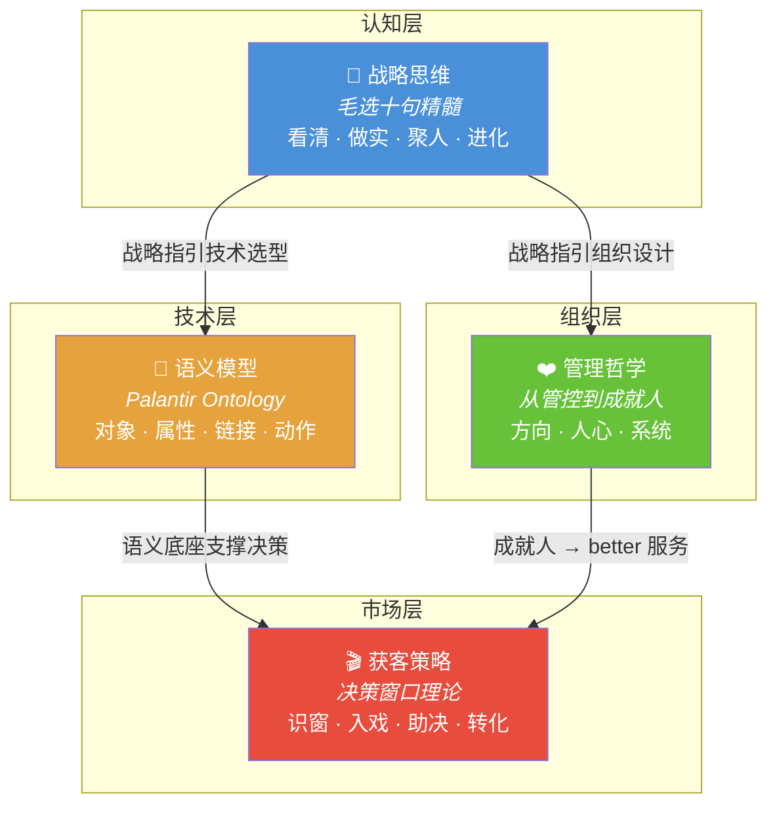
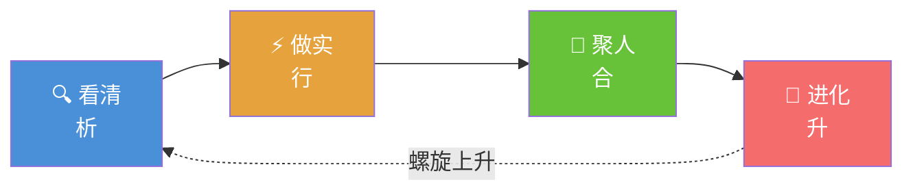
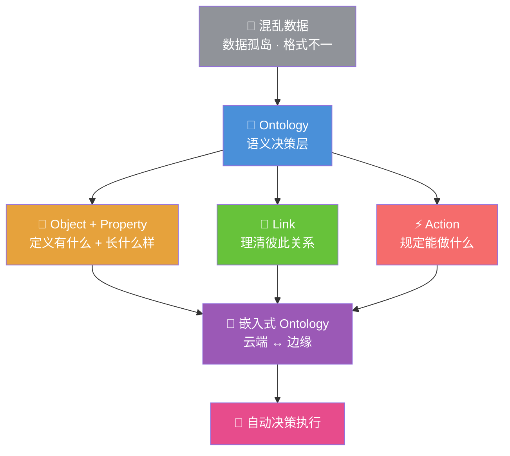
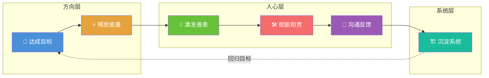
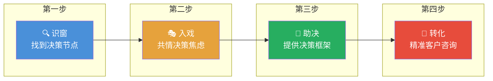
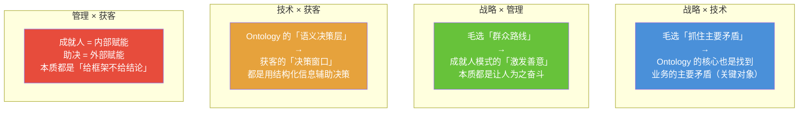
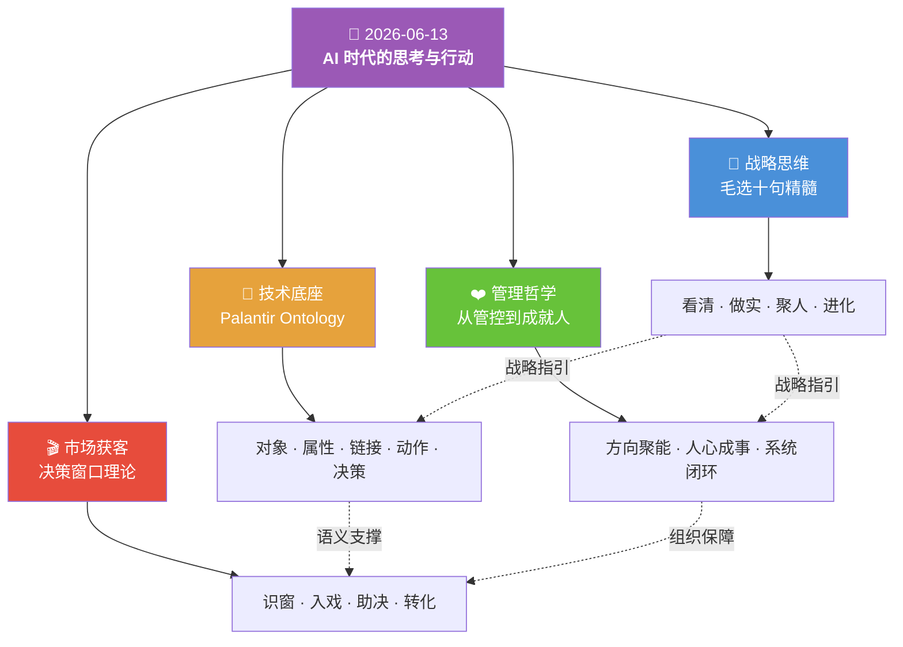

#  📚 2026-06-14 知识汇总

> [!abstract] 今日总览
> 今天的学习围绕**「AI 时代如何系统性地思考和行动」**展开，涵盖四大主题：从**战略思维**（毛选智慧）到**技术底座**（Palantir Ontology），从**团队管理**（成就人模式）到**市场获客**（决策窗口），形成一条从「认知 → 架构 → 组织 → 市场」的完整链路。

---

## 🧠 逻辑记忆框架

> [!tip] 记忆口诀
> **「谋局 → 筑基 → 聚力 → 破局」**
> 先**谋划全局**（战略分析），再**筑牢地基**（语义模型），然后**凝聚团队**（成就人），最终**突破市场**（决策窗口）。四步递进，形成 AI 时代的行动闭环。

### 今日主题速览表

| 序号 | 主题 | 核心关键词 | 一句话记忆 | 详细笔记 |
|:---:|------|:--------:|-----------|:------:|
| 1 | 战略思维 | 🎯 方向 | 先看清方向，再投入资源 | [[2026-06-13 《毛选》十句精髓图解]] |
| 2 | 技术底座 | 🧩 语义 | AI 的护城河不是模型，是语义模型 | [[2026-06-13 将企业业务逻辑抽象为可复用、可执行的语义模型，才是真正的护城河]] |
| 3 | 团队管理 | ❤️ 成就 | 用系统和文化成就人，而非用人干活 | [[2026-06-13 管理的底层逻辑：从管控到成就人]] |
| 4 | 市场获客 | 🎯 窗口 | 在客户最需要做决定的时候出现 | [[2026-06-13 获客视频的核心：抓住客户的「决策窗口」]] |

---

## 四大主题关系图

---

## 主题一：战略思维 —— 毛选十句精髓

> [!summary] 核心提炼
> 毛选智慧是一个**四位一体的闭环系统**：分析 → 行动 → 整合 → 进化，螺旋上升。

| 板块 | 精髓 | 核心关键词 | 当代应用 |
|:---:|------|:--------:|---------|
| 战略分析 | 分清敌我 · 抓住主要矛盾 · 持久战 | 🎯 聚焦 | 中美芯片博弈：分阶段自主突围 |
| 实践方法 | 调查研究 · 实事求是 · 灵活策略 | 🔍 务实 | AI 大模型混战：在场景中游泳学会游泳 |
| 力量整合 | 群众路线 · 统一战线 | 🤝 共赢 | 开源 vs 闭源：得生态者得天下 |
| 自我提升 | 实践中学习 · 自我革新 | 🔄 进化 | 开发者转型：边用边学，日省其身 |

> [!tip] 记忆心法
> **一看二做三聚人，四回看时已更新。**

📖 详见 → [[2026-06-13 《毛选》十句精髓图解]]

---

## 主题二：技术底座 —— Palantir Ontology

> [!summary] 核心提炼
> 企业 AI 的真正护城河不是大模型本身，而是能将业务逻辑抽象为**可复用、可执行的语义模型**（Ontology）。

| 层级 | 核心概念 | 一句话 | 业务类比 |
|:---:|---------|-------|---------|
| 1️⃣ | Object Type | 企业中"有什么" | 组织架构图里的岗位 |
| 2️⃣ | Property | 每个对象的特征 | 员工表里的字段 |
| 3️⃣ | Link Type | 对象之间的关系 | 组织架构里的汇报线 |
| 4️⃣ | Action Type | 可以对对象做什么 | HR 系统里的"审批""调岗" |
| 5️⃣ | Decision | 自动触发的决策链路 | 满足条件自动执行 |

> [!tip] 记忆心法
> **「对象 → 属性 → 链接 → 动作 → 决策」** —— 五步闭环，层层递进。

📖 详见 → [[2026-06-13 将企业业务逻辑抽象为可复用、可执行的语义模型，才是真正的护城河]]

---

## 主题三：团队管理 —— 从管控到成就人

> [!summary] 核心提炼
> 管理的核心不是行使权力，而是通过**方向 → 人心 → 系统**的三层驱动循环，让普通员工也能创造亮眼成绩。

| 对比维度 | ❌ 传统管控模式 | ✅ 现代成就模式 |
|:---:|:---:|:---:|
| **角色定位** | 裁判、监工 | 教练、铺路石 |
| **核心手段** | 规则、指令、追责 | 赋能、担责、反馈 |
| **团队依赖** | 少数精英骨干 | 系统能力、普通员工 |
| **文化导向** | 埋头拼搏、无私奉献 | 共同成长、创造价值 |
| **正反面案例** | X/Twitter：裁员管控 → 系统崩溃 | 胖东来：善待员工 → 模式输出翻倍 |

> [!tip] 记忆心法
> **「方向聚能 → 人心成事 → 系统闭环」** 🔄

📖 详见 → [[2026-06-13 管理的底层逻辑：从管控到成就人]]

---

## 主题四：市场获客 —— 决策窗口理论

> [!summary] 核心提炼
> 获客的关键不是吸引所有人，而是在客户从「随便看看」变成「必须选择」的**决策窗口期**，提供有价值的决策辅助。

| 案例 | 行业 | 决策窗口触发点 | 核心策略 | 一句话总结 |
|:---:|:---:|:---|:---|:---|
| 张雪峰 | 教育 | 高考出分 → 72h | 数据框架 + 直面矛盾 | 在最紧迫的时刻做最专业的参考 |
| 理想汽车 | 汽车 | 家庭升级 | 车主社区 + 场景对比 | 让过了窗口的人帮窗口里的人决策 |
| 丁香医生 | 健康 | 体检异常 | 专业分析 + 决策坐标 | 在焦虑最高点提供冷静判断 |
| 焦虑营销号 | 保险/教育 | ❌ 无窗口强推 | 恐惧轰炸 | 在窗口没打开时强推 = 骚扰 |

> [!tip] 记忆心法
> **「识窗 → 入戏 → 助决 → 转化」** —— 100 个决策者 > 10 万个围观者 🎯

📖 详见 → [[2026-06-13 获客视频的核心：抓住客户的「决策窗口」]]

---

## 🔗 四大主题交叉洞察

> 今天的学习内容并非孤立存在，四个主题之间有深层的**逻辑互锁**。

| 交叉点 | 共同原理 | 在不同场景的表达 |
|:---:|---------|:---|
| 战略 × 技术 | **抓主要矛盾** | 毛选：找到决定全局的关键点；Ontology：找到核心业务对象 |
| 战略 × 管理 | **群众路线 = 成就人** | 毛选：让所有人为共同利益而战；管理：让普通员工创造亮眼成绩 |
| 技术 × 获客 | **语义驱动决策** | Ontology：构建语义决策层；获客：在决策窗口提供决策框架 |
| 管理 × 获客 | **赋能而非控制** | 管理：给语境不微操（Context Not Control）；获客：给框架不给结论 |

---

## 📊 今日知识全景图

---

## 📝 今日行动清单

| 优先级 | 行动项 | 关联主题 | 状态 |
|:---:|:---|:------:|:---:|
| ⭐⭐⭐ | 将「析→行→合→升」口诀应用到当前项目规划中 | 战略思维 | 🔲 待办 |
| ⭐⭐⭐ | 梳理业务核心对象，尝试构建简易 Ontology 模型 | 技术底座 | 🔲 待办 |
| ⭐⭐ | 对照管理七步循环，检视团队当前的薄弱环节 | 团队管理 | 🔲 待办 |
| ⭐⭐ | 识别目标客户的决策窗口触发事件，布局内容 | 市场获客 | 🔲 待办 |
| ⭐ | 每日 15 分钟复盘，践行「自我革新」 | 战略思维 | 🔲 待办 |

---

> [!success] 终极总结
>
> **知**：今天的四篇内容看似跨度很大，实则围绕同一个核心命题 —— **AI 时代，如何用系统性的思考框架指导从战略到执行的全链路**。
>
> **行**：
> 1. **谋局**（战略思维）—— 方向对了，努力才有意义
> 2. **筑基**（语义模型）—— 地基牢了，AI 才能真正落地
> 3. **聚力**（成就人）—— 团队强了，执行才有保障
> 4. **破局**（决策窗口）—— 客户准了，增长才有质量
>
> **合一**：四个主题的统一性在于 —— **不要试图控制一切，而要构建系统、赋能他人、在关键节点精准出击。**
