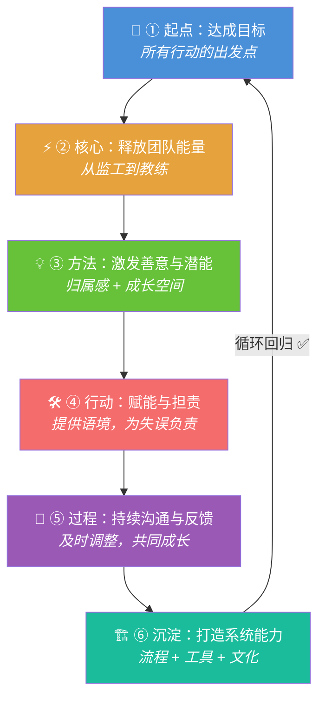
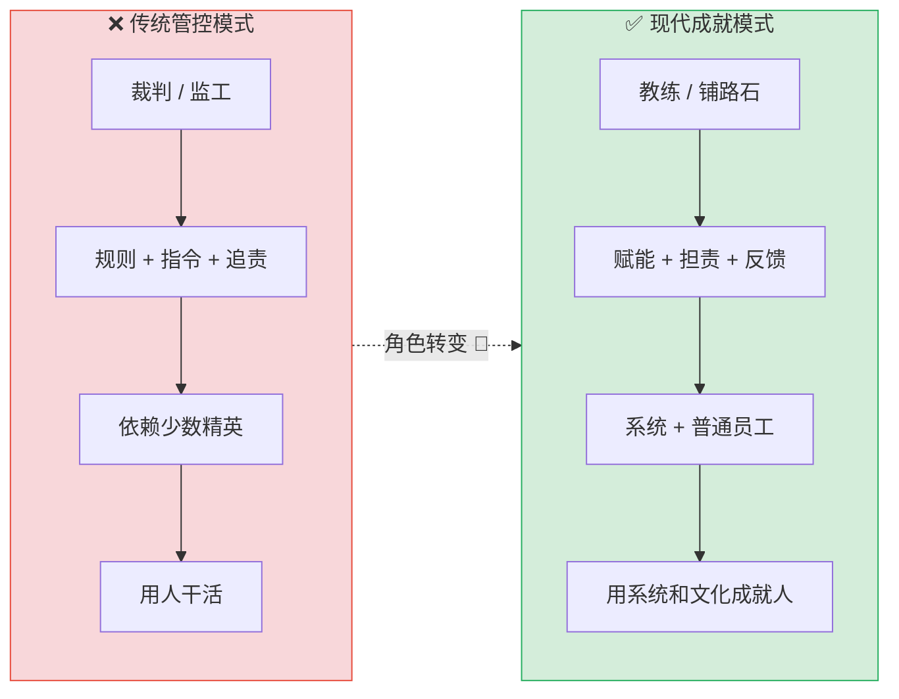
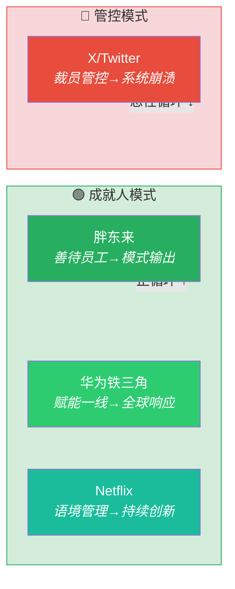

# 管理的底层逻辑：从管控到成就人

> [!abstract] 总览
> 管理的核心是**达成目标**，而非行使权力。其底层逻辑是一个从"管控个人"到"成就团队"的完整循环，最终通过打造**系统和文化**来实现目标，而非依赖少数精英。

---

## 🧠 逻辑记忆框架

**口诀：「方向聚能 → 人心成事 → 系统闭环」**

**三层驱动模型（7 步循环）：**

| | **🎯 方向层（Why）** | **❤️ 人心层（Who）** | **🏗️ 系统层（How）** |
|---|---|---|---|
| **关键动作** | ① 达成目标 → ② 释放能量 | ③ 激发善意 → ④ 赋能担责 → ⑤ 沟通反馈 | ⑥ 沉淀系统 → ⑦ 回归目标 |
| **核心问题** | 去哪里？靠什么驱动？ | 靠谁？怎么激发？ | 怎么固化？如何循环？ |
| **管理者角色** | 定方向 | 当教练 | 建体系 |

**递进逻辑：**
- **方向层**：先定目标，再用目标凝聚团队能量
- **人心层**：用善意激发潜能，用赋能和沟通让能量落地
- **系统层**：将经验沉淀为流程和体系，驱动目标高效达成，完成闭环

---

## 管理的逻辑循环

---

## 循环七步详解

### ① 起点：达成目标
管理的最终目的是为了达成组织目标，这是所有行动的**出发点和落脚点**。

### ② 核心：释放团队能量
要达成目标，关键在于释放团队的能量，而不是管控个人行为。这需要管理者从"监工"转变为"**教练**"。

### ③ 方法：激发善意与潜能
释放能量的根本在于激发团队成员的**善意和潜能**，而非施加恐惧和规则。这需要创造归属感和成长空间。

### ④ 行动：赋能与担责
作为教练，管理者的核心任务是**赋能**（提供清晰语境和安全边界）和**担责**（为团队的失误负责），而不是指挥和甩锅。

### ⑤ 过程：持续沟通与反馈
通过持续的沟通和及时的反馈，帮助团队**及时调整方向**，共同成长，而不是事后追责或被动等待结果。

### ⑥ 沉淀：打造系统能力
最终目标是沉淀出一套可复用的**团队体系能力**，包括流程、工具和正向文化，让普通员工也能创造亮眼成绩。

### ⑦ 终点：回归目标
当系统和文化运转起来，就能高效地驱动团队达成最初设定的目标，完成一个**完整的管理循环**。

---

## 管理者的角色转变

整个逻辑循环的关键在于管理者角色的**根本转变**，从依赖个人权威转向依靠系统和文化。

| 对比维度 | ❌ 传统管控模式 | ✅ 现代成就模式 |
|:---:|:---:|:---:|
| **角色定位** | 裁判、监工 | 教练、铺路石 |
| **核心手段** | 规则、指令、追责 | 赋能、担责、反馈 |
| **团队依赖** | 少数精英骨干 | 系统能力、普通员工 |
| **文化导向** | 埋头拼搏、无私奉献 | 共同成长、创造价值 |
| **最终结果** | 用人干活 | 用系统和文化成就人 |

---

## 📰 正在发生的真实案例

> [!quote] 理论必须落地
> 以下案例均发生在 **2024–2026 年**，覆盖零售、科技、社交媒体行业，正反面各取典型。

### 正反面案例速览

| | 🟢 成就人模式 | 🔴 管控模式 |
|:---:|:---|:---|
| **代表** | 胖东来、华为铁三角、Netflix | X/Twitter（马斯克接管后） |
| **核心理念** | 赋能一线、系统沉淀、善待员工 | 裁员瘦身、指令驱动、依赖少数精英 |
| **循环结果** | 调改门店业绩翻倍，模式可复制输出 | 广告商出逃、估值缩水 70%+，系统崩溃 |

---

### 🟢 案例一：胖东来 ——「成就人」的教科书

胖东来是中国零售业的现象级企业。2024–2025 年，于东来亲自带队**帮扶永辉超市、步步高**，将"胖东来模式"整套输出，调改门店业绩普遍翻倍。

**七步循环映射：**

| 循环步骤 | 胖东来的实践 |
|:---:|:---|
| ① 🎯 达成目标 | 成为中国零售标杆，让管理模式**跨企业可复制** |
| ② ⚡ 释放能量 | 员工满意度极高，**主动服务**而非被动执行 |
| ③ 💡 激发善意 | 设"委屈奖"、"不开心假"、周二闭店休息、薪资远超同行 |
| ④ 🛠️ 赋能担责 | 一线员工**有权直接处理客诉和退换货**，无需层层请示 |
| ⑤ 🔄 沟通反馈 | 于东来频繁巡店，**面对面交流**而非看报表 |
| ⑥ 🏗️ 沉淀系统 | 形成完整的"胖东来模式"运营体系（选品、服务、薪酬） |
| ⑦ 🔄 回归目标 | 帮扶永辉、步步高，调改门店业绩**翻倍增长** |

> [!success] 核心启示
> 胖东来证明了：**善待员工 ≠ 增加成本**，而是构建系统能力的核心投资。当"成就人"变成可复制的系统，管理就能跨越企业边界。

---

### 🟢 案例二：华为铁三角 —— 让听得见炮声的人做决策

华为在全球市场的快速响应能力，来自其经典的**"铁三角"赋能体系**。

**管理循环映射：**

| 循环步骤 | 华为的实践 |
|:---:|:---|
| ① 🎯 达成目标 | 全球化扩张，快速响应客户需求 |
| ② ⚡ 释放能量 | 一线团队被充分授权，**不用层层上报**就能决策 |
| ③ 💡 激发善意 | "以客户为中心"的价值导向，让一线有使命感 |
| ④ 🛠️ 赋能担责 | **铁三角**（客户经理 + 方案专家 + 交付专家）组成最小作战单元 |
| ⑤ 🔄 沟通反馈 | 后台财务、HR 嵌入一线，从**管控者变为服务者** |
| ⑥ 🏗️ 沉淀系统 | 形成授权手册 + 问责机制 + 信息透明的完整体系 |
| ⑦ 🔄 回归目标 | 全球市场持续扩张，客户响应速度大幅提升 |

> [!success] 核心启示
> 赋能不是放任——华为在**明确授权边界**的同时建立**问责机制**，让一线既有能力又有约束，实现"呼唤炮火"的精准赋能。

---

### 🟢 案例三：Netflix —— Context, Not Control

Netflix 是"成就人"管理哲学的全球标杆，其文化手册被硅谷奉为经典。

**管理循环映射：**

| 循环步骤 | Netflix 的实践 |
|:---:|:---|
| ① 🎯 达成目标 | 持续创新，从 DVD 租赁到流媒体到内容制作的**三次跃迁** |
| ② ⚡ 释放能量 | **无休假制度、无报销审批**，给员工最大自由 |
| ③ 💡 激发善意 | 高薪 + 人才密度 + 与优秀的人共事，创造内在驱动力 |
| ④ 🛠️ 赋能担责 | **"情境管理"而非"控制管理"**——领导者提供战略语境，团队自主决策 |
| ⑤ 🔄 沟通反馈 | 360° 坦诚反馈，**对上对下都可以直言不讳** |
| ⑥ 🏗️ 沉淀系统 | "自由 + 责任"文化写入《不拘一格》一书，成为**可学习的方法论** |
| ⑦ 🔄 回归目标 | 全球 3 亿+ 付费用户，内容创新持续引领行业 |

> [!success] 核心启示
> 自由不是没有规则，而是用**高人才密度 + 清晰语境 + 坦诚文化**替代层层管控，让每个人都能像 CEO 一样思考。

---

### 🔴 反面案例：X/Twitter —— 管控模式的系统性溃败

2022 年马斯克接管 Twitter（后更名 X）后，实施典型的**管控 + 瘦身**策略，是"传统管控模式"的当代反面教材。

**管控模式如何一步步失败：**

| 管控动作 | 实际后果 | 对应循环断裂点 |
|:---|:---|:---:|
| 裁员 80%（7500→1500 人） | 大量关键工程师流失，**机构知识断裂** | ② 能量被消灭，不是被释放 |
| 强令 80 小时工作周 | 员工倦怠，**士气跌至谷底** | ③ 善意被恐惧取代 |
| 砍掉信任安全、内容审核团队 | 平台违规内容激增，**广告商大量撤离** | ④ 无人担责，系统性风险暴露 |
| 顶层指令驱动，取消远程办公 | 技术故障频发，平台多次宕机 | ⑤ 反馈机制断裂，问题无人预警 |
| 依赖少数"精英"硬撑 | 系统稳定性持续下降 | ⑥ 无法沉淀系统能力 |

> [!fail] 核心教训
> 管控模式的所有特征——裁员瘦身、指令驱动、依赖精英、恐惧文化——在 X 上都**一一应验为灾难**。估值从 440 亿美元缩水超 70%，完美诠释了从"成就人"到"毁掉系统"的恶性循环。

---

### 案例对比总结图

---

## 一句话带走

> [!tip] 核心记忆
> 管理的艺术在于让这套逻辑循环转动起来，从**"用人干活"**走向**"用系统和文化成就人"**。
> 
> **口诀回顾**：方向聚能 → 人心成事 → 系统闭环 🔄
> 
> **现实印证**：胖东来帮扶翻倍 ✅ vs X/Twitter 管控崩溃 ❌
