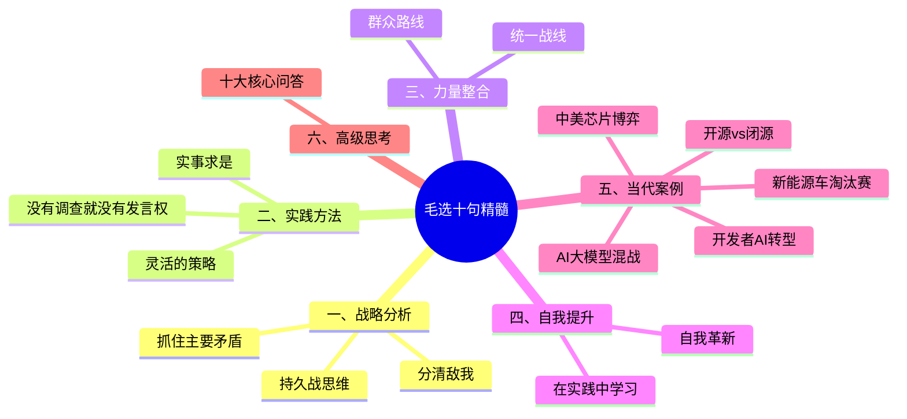
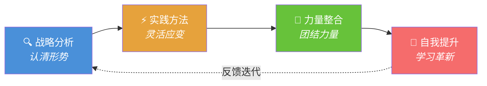
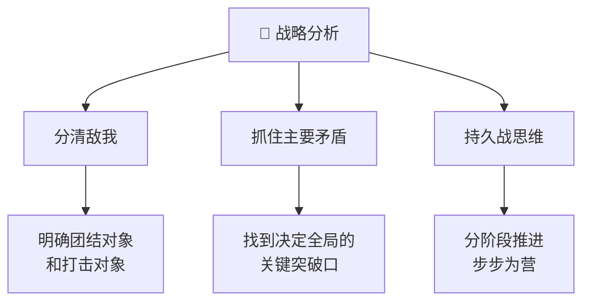
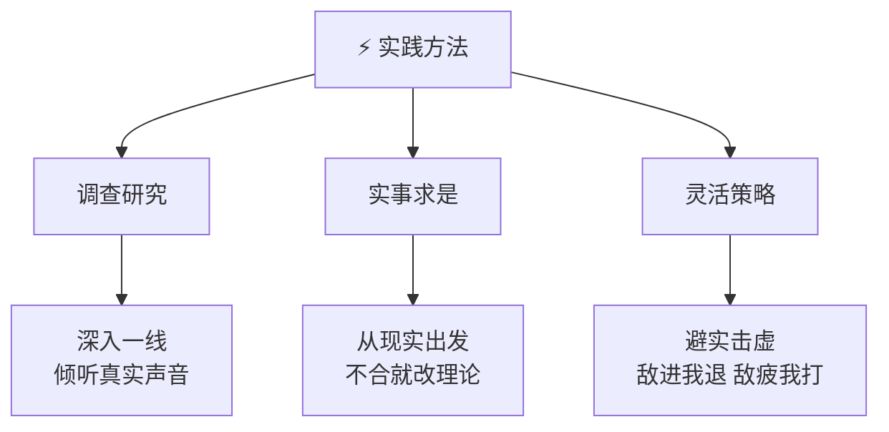
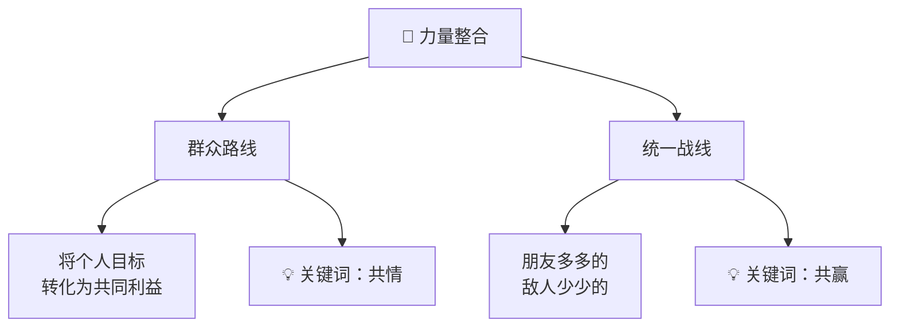
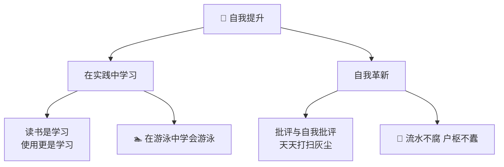
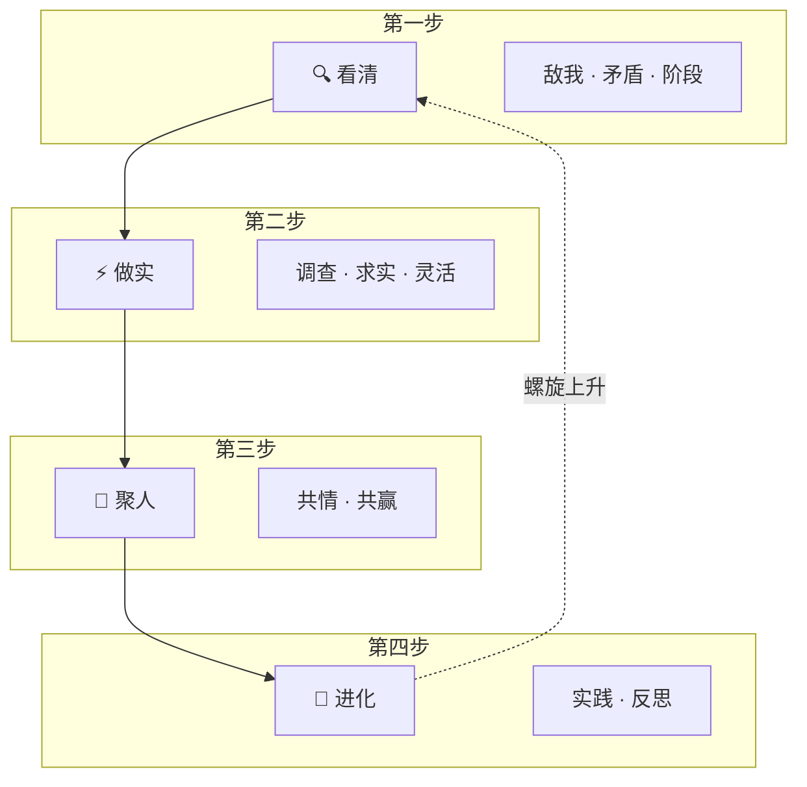
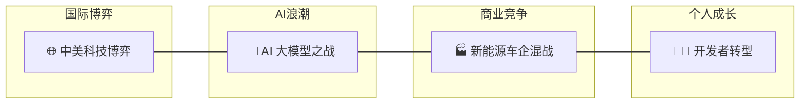
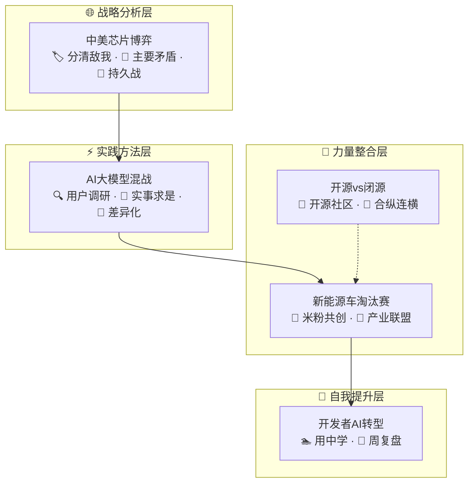
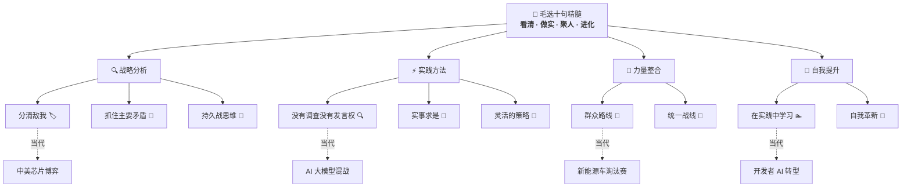

# 《毛选》十句精髓图解

> [!abstract] 总览
> 视频提炼了《毛选》中的十大核心思想，涵盖了从**战略分析**、**实践方法**到**团队建设**的完整体系。这些智慧不仅是历史的总结，更是指导我们在复杂现实中**认清形势、抓住关键、灵活应变**的行动指南。

---

## 整体框架图





> [!tip] 逻辑记忆口诀
> **「析 → 行 → 合 → 升」** —— 先**分析**形势，再付**行动**，**合力**攻坚，最后自我**升华**。四步循环，螺旋上升。

---

## 十大精髓速查表

| 序号 | 精髓 | 所属板块 | 一句话记忆 |
|:---:|------|:------:|-----------|
| 1 | 分清敌我 | 战略分析 | 先搞清楚谁是我们的朋友，谁是我们的敌人 |
| 2 | 抓住主要矛盾 | 战略分析 | 打蛇打七寸，牵牛牵鼻子 |
| 3 | 持久战思维 | 战略分析 | 战略上藐视，战术上重视 |
| 4 | 没有调查就没有发言权 | 实践方法 | 不摸底就不开口 |
| 5 | 实事求是 | 实践方法 | 理论不合实际就改理论 |
| 6 | 灵活的策略 | 实践方法 | 避实击虚，你打你的我打我的 |
| 7 | 群众路线 | 力量整合 | 让所有人为了共同利益而战 |
| 8 | 统一战线 | 力量整合 | 朋友搞得多多的，敌人搞得少少的 |
| 9 | 在实践中学习 | 自我提升 | 在游泳中学会游泳 |
| 10 | 自我革新 | 自我提升 | 像洗脸扫地一样天天打扫思想灰尘 |

---

## 一、战略分析：认清形势，抓住关键

> 在行动之前，首先要进行宏观分析，明确方向和核心矛盾。



| 核心思想 | 核心要点 | 记忆锚点 |
|---------|---------|---------|
| **分清敌我** | 这是事业的首要问题。必须搞清楚该团结谁、打击谁，否则注定失败。 | 🏷️ 谁上船，谁下水 |
| **抓住主要矛盾** | 在一团乱麻中，必须找到决定全局的关键点。解决了它，其他问题便迎刃而解。 | 🎯 打蛇打七寸 |
| **持久战思维** | 伟大事业非一蹴而就。战略上要藐视困难，战术上要重视困难，步步为营。 | 🐢 积小胜为大胜 |

> [!example] 现实映射
> - **创业**：先明确竞争对手（敌我）→ 找到核心用户痛点（主要矛盾）→ 制定三年规划（持久战）
> - **求职**：认清行业趋势（敌我）→ 突破核心技能短板（主要矛盾）→ 持续迭代简历和面试（持久战）

---

## 二、实践方法：从现实出发，灵活应变

> 理论必须与实践相结合，并根据实际情况灵活调整策略。



| 核心思想 | 核心要点 | 记忆锚点 |
|---------|---------|---------|
| **没有调查，就没有发言权** | 不要空谈逻辑，必须深入一线、基层，倾听真正干活的人的声音。 | 🔍 先摸底再开口 |
| **实事求是** | 决策应从客观现实出发，而非书本教条。如果理论不符合现状，就应修改理论。 | 📐 实践是检验真理的唯一标准 |
| **灵活的策略** | 避免在对方擅长的领域硬碰硬。要"敌进我退，敌疲我打"，寻找其防守薄弱的真空地带。 | 🥊 你打你的，我打我的 |

> [!example] 现实映射
> - **产品开发**：先做用户调研（调查）→ 根据数据而非直觉决策（实事求是）→ 差异化竞争（灵活策略）
> - **谈判沟通**：先了解对方底线（调查）→ 基于双方实际利益出方案（实事求是）→ 迂回达成目标（灵活策略）

---

## 三、力量整合：团结一切可以团结的力量

> 个人力量有限，必须学会团结和动员更广泛的力量。



| 核心思想 | 核心要点 | 记忆锚点 |
|---------|---------|---------|
| **群众路线** | 要将个人目标转化为大家的共同利益，让所有人为共同目标而战。 | 📣 让每个人都觉得"这与我有关" |
| **统一战线** | 要把支持我们的人搞得多多的，反对我们的人搞得少少的。即使是对手，只要有共同利益也可阶段性合作。 | 🌉 求同存异，合纵连横 |

> [!example] 现实映射
> - **团队管理**：让成员看到个人成长与团队目标的交集（群众路线）→ 跨部门拉通协作（统一战线）
> - **开源项目**：让贡献者获得成长和声誉（群众路线）→ 与竞品项目共建生态标准（统一战线）

---

## 四、自我提升：在实践中学习与革新

> 个人和团队的成长，源于持续的实践和自我反思。



| 核心思想 | 核心要点 | 记忆锚点 |
|---------|---------|---------|
| **在实践中学习** | 读书是学习，使用也是学习，且是更重要的学习。要在游泳中学会游泳。 | 🏊 下水才能学会游泳 |
| **自我革新** | 如同打扫房子和洗脸，团队必须通过批评与自我批评，不断清除"灰尘"，才能保持长久的战斗力。 | 🧹 日省其身，有则改之 |

> [!example] 现实映射
> - **技术成长**：看文档是学习，写代码更是学习（实践学习）→ 定期 code review、复盘（自我革新）
> - **习惯养成**：每天写日记复盘（自我革新）→ 在真实项目中试错迭代（实践学习）

---

## 逻辑记忆：四位一体框架



> [!note] 记忆心法
> **一看二做三聚人，四回看时已更新。**
>
> 1. **看清**（战略分析）—— 方向对了，努力才有意义
> 2. **做实**（实践方法）—— 脚踩实地，拒绝空谈
> 3. **聚人**（力量整合）—— 独行快，众行远
> 4. **更新**（自我提升）—— 每一次循环，都是更好的自己

---

## 五、当代实战案例

> 以 2024-2026 年的真实商业与科技事件为镜，看毛选智慧如何活在当下。



---

### 案例 1：中美芯片博弈 —— 战略分析的教科书

> [!abstract] 对应精髓：分清敌我 · 抓住主要矛盾 · 持久战思维

| 维度 | 案例事实 | 毛选智慧 |
|------|---------|---------|
| **分清敌我** | 美国联合日本、荷兰限制对华半导体设备出口（2023-2025），中国明确"自主可控"方向 | 搞清楚谁是遏制者、谁是可以争取的合作伙伴 |
| **主要矛盾** | 先进制程芯片（3nm 及以下）是卡脖子的核心——不是所有芯片都缺，焦点在高端制造 | 打蛇打七寸，集中资源攻关键点 |
| **持久战** | 中国芯片产业从成熟制程（28nm）逐步向上突破，不指望一夜追平，而是分阶段突围 | 战略上藐视（终将自主），战术上重视（每步扎实） |

> [!tip] 启示
> 华为 Mate 60 搭载的麒麟 9000S 芯片（2023 年发布）正是「持久战」的缩影 —— 不是一步到位的 3nm，而是在受限条件下实事求是的最优解。

---

### 案例 2：AI 大模型混战 —— 实践方法的活教材

> [!abstract] 对应精髓：没有调查就没有发言权 · 实事求是 · 灵活的策略

| 维度 | 案例事实 | 毛选智慧 |
|------|---------|---------|
| **调查研究** | 2024-2025 年大量 AI 公司盲目追逐参数规模，忽视用户真实需求。而 Cursor、Midjourney 等产品深入开发者/设计师工作流，做足用户调研，反而脱颖而出 | 不到一线去，就不知道用户到底要什么 |
| **实事求是** | Anthropic、OpenAI 等公司根据模型实际表现（而非宣传口径）迭代安全策略；国内百度文心一言从追求"全面对标 GPT"转向聚焦搜索+办公场景 | 理论不合实际就改理论 |
| **灵活策略** | 中小 AI 公司避开与 GPT/Claude 的正面通用对话竞争，转而做垂直领域（法律、医疗、教育），在对手防守薄弱处建立优势 | 敌进我退，寻找真空地带 |

> [!tip] 启示
> 2025-2026 年 AI 编码助手（Claude Code、Cursor、GitHub Copilot）的爆发证明：不是在实验室里比参数赢的，而是在真实开发场景中「在游泳中学会游泳」。

---

### 案例 3：新能源车淘汰赛 —— 力量整合的商业演绎

> [!abstract] 对应精髓：群众路线 · 统一战线

| 维度 | 案例事实 | 毛选智慧 |
|------|---------|---------|
| **群众路线** | 小米汽车（2024 年入局）通过米粉社区共创产品设计、定价策略，让用户觉得"这车有我一份"，SU7 上市即爆单 | 把个人目标（造好车）转化为大家的共同利益 |
| **统一战线** | 比亚迪与丰田合资（2020）、与英伟达合作智驾（2025）；蔚来做换电联盟联合长安、吉利 —— 把朋友搞得多多的 | 即使是竞争对手，有共同利益就能阶段性合作 |
| **反面教材** | 部分造车新势力（威马、高合）孤军作战，既不建用户社群（脱离群众），也不寻求产业联盟（没有统一战线），最终资金链断裂 | 孤军奋战，无人响应 |

> [!tip] 启示
> 雷军说"小米汽车是我最后一次创业" —— 他押的不是技术，是十年积累的用户关系网。这正是「群众路线」的极致运用。

---

### 案例 4：开发者 AI 转型 —— 自我提升的当下叙事

> [!abstract] 对应精髓：在实践中学习 · 自我革新

| 维度 | 案例事实 | 毛选智慧 |
|------|---------|---------|
| **实践中学习** | 2025-2026 年，大量传统开发者通过直接使用 Claude Code / Copilot 等 AI 工具提升 10x 效率 —— 不是先学完理论再动手，而是在真实项目中"用 AI 学 AI" | 读书是学习，使用也是学习，而且是更重要的学习 |
| **自我革新** | 优秀的工程师每周回顾自己的 prompt 工程效率、代码审查质量，淘汰过时的工作习惯（如逐行手写重复代码），拥抱 AI 辅助编程新范式 | 天天打扫思想灰尘，有则改之 |
| **反面教材** | 一部分开发者停留在"AI 会取代我"的恐慌中拒绝尝试，另一部分盲目依赖 AI 输出不做审查 —— 两个极端都是没有做到实事求是的自我革新 | 固步自封 = 温水煮青蛙 |

> [!tip] 启示
> 真正的「自我革新」不是焦虑驱动的盲目学习，而是像打扫房间一样 —— **每天花 15 分钟复盘**：今天哪些工作可以做得更好？哪些习惯该扔掉了？

---

### 案例 5：开源 vs 闭源 AI —— 统一战线与群众路线的科技版

> [!abstract] 对应精髓：统一战线 · 群众路线 · 灵活的策略

| 维度 | 案例事实 | 毛选智慧 |
|------|---------|---------|
| **统一战线** | Meta 开源 LLaMA 系列模型（2023-2025），吸引全球开发者生态，联合中小公司对抗 OpenAI/Google 的闭源垄断 —— "把支持开源的人搞得多多的" | 求同存异，合纵连横 |
| **群众路线** | Linux 基金会、Apache 基金会等开源社区依靠"人人为我、我为人人"的群众路线，构建了对抗商业巨头的技术底座 | 让所有人都觉得这与我有关 |
| **灵活策略** | 开源社区不与闭源公司比算力、比资金，而在社区生态、透明度、可定制性上建立差异化优势 | 避实击虚，你打你的我打我的 |

> [!tip] 启示
> 2026 年开源 AI 模型（LLaMA、Mistral、Qwen 等）已占据全球 AI 部署量的半壁江山 —— 这就是「统一战线」加「群众路线」的力量。

---

### 当代案例速查总表



| 案例 | 时代背景 | 核心精髓 | 一句话总结 |
|------|---------|---------|-----------|
| 中美芯片博弈 | 2023-2026 科技脱钩 | 分清敌我 + 持久战 | 不赌速胜，分阶段自主突围 |
| AI 大模型混战 | 2024-2026 百模大战 | 调查研究 + 灵活策略 | 不在红海硬卷，去蓝海扎根 |
| 新能源车淘汰赛 | 2024-2026 行业洗牌 | 群众路线 + 统一战线 | 用户是根基，联盟是护城河 |
| 开发者 AI 转型 | 2025-2026 工具革命 | 实践学习 + 自我革新 | 别等准备好了再开始，开始了才能准备好 |
| 开源 vs 闭源 | 2023-2026 生态之争 | 统一战线 + 群众路线 | 得生态者得天下，得开发者得生态 |

---

## 六、高级思考问答：全文深度总结

> 以下十个问答，每个对应一条精髓，层层递进，帮助你从"知道"走向"做到"。

---

### Q1：为什么说"分清敌我"是首要问题？在 2026 年怎么理解"敌"和"我"？

> [!question]- 展开思考
> **核心答案：敌我不是善恶之分，而是利益方向之分。**
>
> 在当代商业语境中：
> - **"敌"** = 与你争夺同一资源/市场的力量（不一定是坏人，只是利益冲突）
> - **"我"** = 与你利益方向一致的合作伙伴
> - **灰色地带** = 需要争取的中间力量
>
> **2026 年的应用**：
> - 创业时，竞品不是"敌人"，争夺同一批用户的注意力才是
> - 职场中，同事不是"敌人"，晋升名额的有限性才是需要分析的结构性矛盾
> - 技术选型中，某个框架不是"敌人"，它不适合你的场景才是真正需要拒绝的
>
> **终极心法**：不要情绪化地定义敌我，要理性地分析利益结构。今天的朋友可能是明天的竞争对手，今天的对手可能是明天的盟友。

---

### Q2：如何在信息过载的时代"抓住主要矛盾"？

> [!question]- 展开思考
> **核心答案：主要矛盾 = 解决了它，其他问题都变简单或不再重要的那个问题。**
>
> 判断方法 —— **三步排除法**：
> 1. **列出所有问题**（至少 10 个）
> 2. **两两配对问**："如果只能解决一个，另一个会自动缓解吗？"
> 3. **胜出者就是主要矛盾**
>
> **2026 年的典型场景**：
> - 一个 AI 创业公司的主要矛盾可能不是"模型不够好"，而是"找不到付费场景"
> - 一个求职者的主要矛盾可能不是"简历不够好"，而是"没有明确方向"
> - 一个团队的主要矛盾可能不是"技术能力不够"，而是"目标不清晰"
>
> **终极心法**：大多数人不是输在不够努力，而是输在努力错了方向。花 80% 的时间找主要矛盾，20% 的时间解决它。

---

### Q3：在追求"即时反馈"的时代，如何坚持"持久战"？

> [!question]- 展开思考
> **核心答案：把大目标拆成可度量的小里程碑，每个里程碑都有"小胜"的反馈。**
>
> 持久战 ≠ 慢慢来，而是：
> - **战略层面**：接受这是一场 3-5 年的征程
> - **战术层面**：每个季度都有可验证的阶段性成果
>
> **2026 年的最佳实践**：
> - **OKR 体系**本身就是持久战的现代版 —— 年度目标（战略）+ 季度关键结果（战术）
> - **敏捷开发**的 Sprint 机制 —— 两周一个小循环，每个循环都有可交付成果
> - **个人成长**：不要定"一年学会 AI"这种目标，而是"本周用 AI 完成一个真实任务"
>
> **终极心法**：持久战最大的敌人不是困难，而是中途看不到希望的绝望。所以，制造"小胜"是持久战的核心战术。

---

### Q4：AI 时代，"调查研究"的形式发生了什么变化？

> [!question]- 展开思考
> **核心答案：工具变了，但"到一线去"的本质没变，甚至更重要了。**
>
> AI 可以帮你收集数据、分析趋势、生成报告 —— 但它替代不了：
> - **真实的用户访谈**（看到用户皱眉的那一刻）
> - **一线的现场观察**（走进工厂、走进客户办公室）
> - **亲身的使用体验**（自己用产品踩坑）
>
> **2026 年的反面教材**：
> - 很多 AI 产品的 PM 只看 ChatGPT 的分析报告，不去真实用户那里做访谈 → 做出的功能用户不需要
> - 很多创业者用 AI 生成市场调研报告，却从未和 10 个潜在客户面对面聊天 → 自嗨型创业
>
> **终极心法**：AI 让调研的"量"提升了 100 倍，但"质"仍然需要你去现场。数据告诉你 What，只有现场能告诉你 Why。

---

### Q5："实事求是"和"经验主义"的区别是什么？

> [!question]- 展开思考
> **核心答案：经验主义是"过去怎么做就怎么做"，实事求是是"此刻现实是什么就怎么做"。**
>
> | 维度 | 经验主义 | 实事求是 |
> |------|---------|---------|
> | 时间锚点 | 过去 | 当下 |
> | 决策依据 | "以前都是这样的" | "现在的情况是..." |
> | 面对变化 | 抗拒、套旧模板 | 拥抱、调整方法 |
> | 典型表现 | "这个行业一直是这么做的" | "这个行业正在被重新定义" |
>
> **2026 年的典型案例**：
> - 诺基亚的失败 = 经验主义（"手机就是硬件"）vs 苹果的实事求是（"用户要的是体验"）
> - 传统零售 vs 直播电商 = 经验主义（"开店等客来"）vs 实事求是（"用户在哪我就去哪"）
>
> **终极心法**：你最大的经验，可能恰恰是你最大的枷锁。定期问自己："如果我是今天才入行的新人，我会怎么做？"

---

### Q6：面对巨头碾压，"灵活策略"怎么用？

> [!question]- 展开思考
> **核心答案：不与强者在同一维度竞争，创造自己的竞争维度。**
>
> "灵活的策略"的三个层次：
> 1. **空间灵活**：巨头做不到的地方（细分市场、本地化、长尾需求）
> 2. **时间灵活**：巨头反应不过来的时候（快速迭代、抢先发布）
> 3. **角色灵活**：把竞争关系转化为合作关系（成为巨头的生态伙伴）
>
> **2026 年的实战示范**：
> - **Notion** vs 微软 Office —— 不做另一个 Office，做"all-in-one workspace"
> - **Claude** vs GPT —— 不在同一维度卷，聚焦"安全、可信赖、长上下文"
> - **独立开发者** vs 大厂 —— 不做全功能产品，做某个痛点的极致解决方案
>
> **终极心法**：弱者赢的方式不是变得更强，而是换一个赛道让自己成为强者。

---

### Q7：在个人主义时代，"群众路线"还有效吗？

> [!question]- 展开思考
> **核心答案：越个人主义的时代，群众路线越稀缺，越有效。**
>
> 群众路线的当代翻译 = **共情力 + 利益共享机制**
>
> 为什么 2026 年更需要它：
> - 远程办公让人越来越孤立 → 能凝聚团队的领导者更稀缺
> - AI 替代了执行工作 → 能激发人的创造力和热情变得更关键
> - 信息茧房让人只关心自己 → 能打破壁垒、连接不同的人更有价值
>
> **2026 年的正面案例**：
> - **胖东来**：员工满意度行业第一，因为真正把员工利益放在首位 → 员工自发提供极致服务
> - **Linux 社区**：没有任何强制机制，却吸引了全球最顶尖的开发者 → 因为贡献开源对每个人都有利
>
> **终极心法**：领导力 = 让别人发自内心地想跟你走。不是靠权力，是靠"跟你走对他们也有好处"。

---

### Q8："统一战线"在商业竞争中具体怎么操作？

> [!question]- 展开思考
> **核心答案：找到你与"潜在盟友"的交集利益，暂时搁置分歧，共同行动。**
>
> 统一战线的三步操作法：
> 1. **画圈**：列出所有相关方（客户、供应商、竞品、监管方、媒体……）
> 2. **分类**：哪些是铁杆盟友？哪些可以争取？哪些是核心对手？
> 3. **行动**：与铁杆盟友深度绑定，对可争取者创造合作场景，对核心对手集中资源
>
> **2026 年的操作范例**：
> - 一家 SaaS 创业公司：与上下游 ISV 建生态（统一战线）→ 与大厂差异化定位（灵活策略）→ 与用户共创产品（群众路线）
> - 一个人的职业发展：跨行业社交扩大"朋友池"（统一战线）→ 深耕核心技能（主要矛盾）→ 持续学习新知识（自我革新）
>
> **终极心法**：商业竞争不是零和博弈。最高明的策略不是消灭对手，是让对手变成盟友，让竞争变成共生。

---

### Q9：AI 时代"在实践中学习"的最佳路径是什么？

> [!question]- 展开思考
> **核心答案：不要先学完再用，而是边用边学 —— AI 本身就是你的学习加速器。**
>
> 2026 年最高效的学习循环：
> ```
> 真实任务 → 用 AI 辅助完成 → 复盘哪里做得好/不好 → 优化方法 → 下一个更难的任务
> ```
>
> 与传统学习路径的对比：
>
> | 维度 | 传统路径 | AI 时代的实践学习 |
> |------|---------|-----------------|
> | 起点 | 先学理论 3-6 个月 | 今天就接一个真实任务 |
> | 工具 | 教材 + 视频课 | AI 助手 + 真实项目 |
> | 反馈 | 考试/证书（延迟数月） | 即时运行结果（秒级反馈） |
> | 效率 | 线性积累 | 指数增长（AI 帮你跨过初级门槛） |
> | 风险 | 学了不用就忘 | 边学边产出，成果即学习 |
>
> **终极心法**：你不需要成为 AI 专家才能用 AI，就像你不需要成为游泳教练才能下水。跳下去，AI 会教你。

---

### Q10：如何建立持续"自我革新"的系统？

> [!question]- 展开思考
> **核心答案：把自我革新从"偶尔的顿悟"变成"每天的例行公事"。**
>
> 自我革新的三层系统：
>
> **第一层：日省（每天 15 分钟）**
> - 今天做了哪些事？哪些做得好？哪些可以更好？
> - 有没有重复犯同一个错误？
>
> **第二层：周复盘（每周 1 小时）**
> - 本周的核心产出是什么？
> - 有哪些认知升级？有哪些习惯需要调整？
> - 下周最重要的一件事是什么？（主要矛盾）
>
> **第三层：季审计（每季度半天）**
> - 我的年度目标进展如何？
> - 我的能力结构是否需要更新？
> - 我的人际关系/合作网络是否健康？
>
> **2026 年的辅助工具**：
> - 用 AI 做日记分析，自动识别你的情绪模式和效率瓶颈
> - 用 Notion/Obsidian 构建个人知识库，定期回顾和修剪
> - 找 1-2 个"批评伙伴"，互相做 code review / 方案 review
>
> **终极心法**：自我革新不是自我否定。它像打扫房间 —— 不是因为你脏，而是因为活着就会落灰。**定期打扫，是为了住得更舒服。**

---

## 七、全文总结：一张图看懂毛选十句精髓



> [!success] 终极总结
>
> **知**：十大精髓不是十条独立的道理，而是一个**闭环系统** —— 分析指导行动，行动整合力量，力量反哺成长，成长提升分析。
>
> **行**：每天问自己四个问题：
> 1. 我现在看清方向了吗？（战略分析）
> 2. 我的决策基于事实还是假设？（实践方法）
> 3. 我身边有同行者吗？（力量整合）
> 4. 我今天比昨天进步了吗？（自我提升）
>
> **合一**：毛选智慧的本质不是"术"，而是**思维方式** —— 它教你如何在复杂、不确定、充满对抗的世界中，保持清醒、抓住关键、持续进化。

---

## 附：全量对照表

| 板块 | 精髓 | 核心关键词 | 反面教训 |
|:----:|------|:---------:|---------|
| 战略分析 | 分清敌我 | 🏷️ 立场 | 敌友不分，腹背受敌 |
| 战略分析 | 抓住主要矛盾 | 🎯 聚焦 | 眉毛胡子一把抓，一事无成 |
| 战略分析 | 持久战思维 | 🐢 耐心 | 急于求成，半途而废 |
| 实践方法 | 没有调查就没有发言权 | 🔍 调研 | 拍脑袋决策，闭门造车 |
| 实践方法 | 实事求是 | 📐 务实 | 教条主义，刻舟求剑 |
| 实践方法 | 灵活的策略 | 🥊 变通 | 硬碰硬消耗，以卵击石 |
| 力量整合 | 群众路线 | 📣 共情 | 孤军奋战，无人响应 |
| 力量整合 | 统一战线 | 🌉 共赢 | 四面树敌，腹背受敌 |
| 自我提升 | 在实践中学习 | 🏊 实干 | 纸上谈兵，眼高手低 |
| 自我提升 | 自我革新 | 🧹 反省 | 固步自封，温水煮青蛙 |
