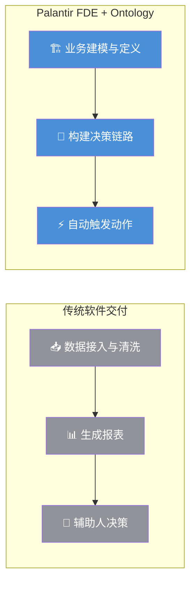
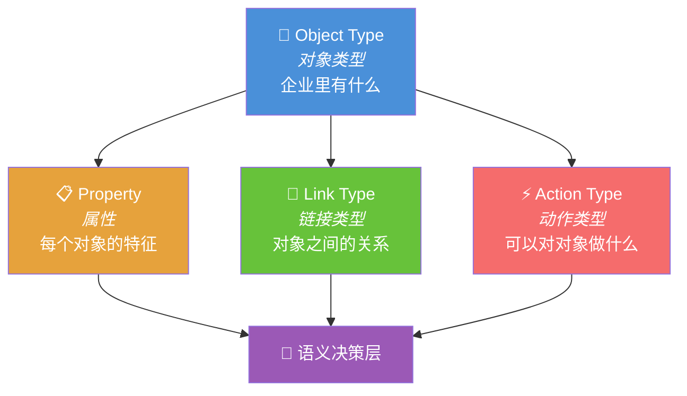
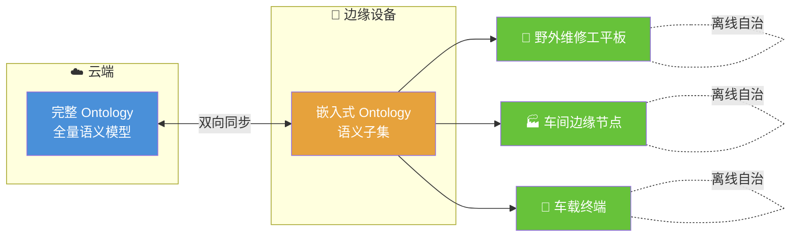
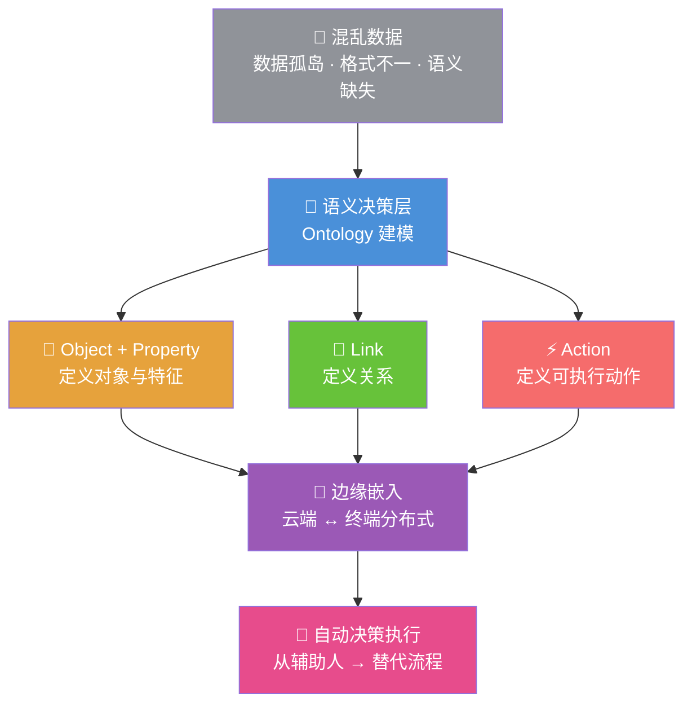

# Palantir的技术基石：Ontology 解析

> [!abstract] 总览
> Palantir FDE 之所以能快速落地，并非因为 AI 有多聪明，而是因为它站在一个强大的技术底座之上 —— **Ontology**。它在企业混乱的数据之上，构建了一个统一的**语义决策层**，让机器和人能真正理解业务，从而实现高效决策。

---

## 逻辑记忆框架

> [!tip] 记忆口诀
> **「对象 → 属性 → 链接 → 动作 → 决策」**
> 先定义**有什么**（对象），再描述**长什么样**（属性），然后理清**彼此关系**（链接），接着规定**能做什么**（动作），最终实现**自动决策**。五步闭环，层层递进。

### 速览对照表

| 层级 | 核心概念 | 一句话 | 业务类比 |
|:---:|---------|-------|---------|
| 1️⃣ | Object Type | 企业中"有什么" | 组织架构图里的岗位 |
| 2️⃣ | Property | 每个对象的特征 | 员工表里的字段 |
| 3️⃣ | Link Type | 对象之间的关系 | 组织架构里的汇报线 |
| 4️⃣ | Action Type | 可以对对象做什么 | HR 系统里的"审批""调岗" |
| 5️⃣ | Decision | 自动触发的决策链路 | 满足条件自动执行 |

---

## 两种截然不同的系统构建思路

> 面对企业内部混乱的数据孤岛，传统软件和 Palantir 采取了完全不同的策略。

| 对比维度 | ❌ 传统软件交付 | ✅ Palantir FDE + Ontology |
|:---:|---|---|
| 核心任务 | 数据接入与清洗 | 业务建模与定义 |
| 工作方式 | 先铺管道，再想怎么用 | 先定义问题，再吸附数据 |
| 最终目标 | 生成报表，辅助人决策 | 构建决策链路，自动触发动作 |
| 本质区别 | 数据查询 | 决策执行 |

---

## Ontology 的四大核心组件

> Ontology 通过四个核心概念，将企业业务逻辑抽象为一个可操作的数字世界。

| 核心组件 | 定义 | 业务举例 |
|---------|------|---------|
| **Object Type** 🧩 | 定义企业中有什么 | "设备"、"产线"、"订单" |
| **Property** 📋 | 定义每个对象的特征 | 设备的"型号"、"状态"、"上次维护时间" |
| **Link Type** 🔗 | 定义对象之间的关系 | "设备属于某条产线"、"订单关联某台设备" |
| **Action Type** ⚡ | 定义可以对对象做什么 | "关闭设备"、"修改订单状态" |

> [!example] 现实映射
> - **Object**：工厂里的每一台 CNC 机床是一个对象
> - **Property**：每台机床有"运行状态"、"累计加工时长"、"最近一次维保日期"
> - **Link**：机床 → 属于 → 产线 A；机床 → 加工 → 订单 #20260613
> - **Action**：当"累计加工时长"超过阈值 → 自动触发"停机维保"动作

---

## 从云端到边缘：嵌入式 Ontology

> Ontology 的强大之处在于其分布式架构，能将企业的数字孪生延伸到离线设备，如野外维修工的平板。

| 方案对比 | ❌ 传统离线方案 | ✅ Embedded Ontology |
|:---:|---|---|
| 原理 | 预先下载数据到本地缓存 | 在设备上部署完整的语义子集 |
| 操作 | 离线操作写本地缓存，联网后同步 | 所有操作直接在本地 Ontology 上运行 |
| 同步 | 联网后合并数据，易冲突 | 联网后自动同步，设备是自治节点 |
| 本质 | 缓存优化 | 分布式数据架构 |

---

## 为什么中国出不了 Palantir？

> 国内的数据中台与 Palantir 的 Ontology 在目标和方法论上存在根本差异。

| 对比维度 | ❌ 国内数据中台 | ✅ Palantir Ontology |
|:---:|---|---|
| 核心目标 | 解决数据可视化问题 | 解决业务决策问题 |
| 方法论 | "搬家"：把数据接进来，供人查看 | "装修"：把业务逻辑抽象为可复用的语义模型 |
| 用户体验 | 你告诉我要什么数据，我给你接 | 你告诉我要解决什么问题，我自动搞定 |

> [!success] 核心启示
> 数据中台解决的是 **"看得到"** 的问题，Ontology 解决的是 **"做得出决策"** 的问题。前者是数据仓库的升级版，后者是业务操作系统的雏形。

> [!question]- 展开思考
> **Q1：国内数据中台为什么没有走向决策？**
> 国内数据中台的定位是"数据基础设施"，核心 KPI 是数据接入量和报表产出量。它天然止步于"供人查看"，因为要走向决策，需要深入理解业务逻辑 —— 而这恰恰是 Palantir 花了 20 年积累的行业 know-how。
>
> **Q2：国内有没有可能出现类似 Palantir 的公司？**
> 有可能，但路径不同。国内的优势在于行业龙头（如华为、比亚迪）有足够深的业务场景和数据积累，更可能从内部孵化出"行业 Ontology"，而非出现一家独立的第三方平台公司。
>
> **Q3：Ontology 模式对 AI Agent 的意义是什么？**
> AI Agent 需要"理解世界"才能"自主行动"。Ontology 恰好提供了这个语义地基 —— 没有它，Agent 只是在调用 API；有了它，Agent 才真正"理解"业务对象之间的关系和约束。

---

## 全文总结

---

## 一句话带走

FDE 的成功，是 Palantir 用 20 年时间为混乱的真实世界打下的**语义地基**。它证明了：在 AI 时代，强大的模型只是上层建筑，而能将企业业务逻辑抽象为可复用、可执行的语义模型，才是真正的护城河。
