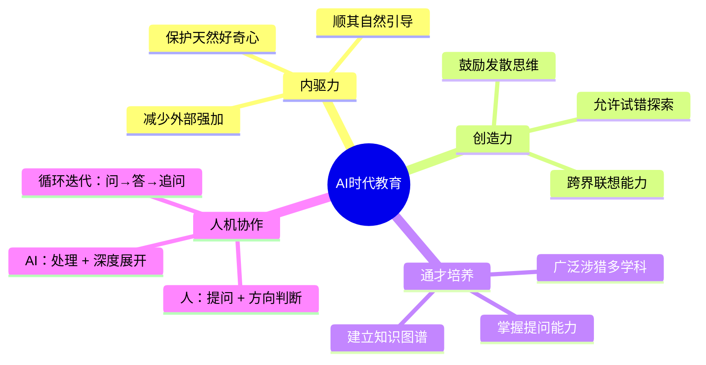
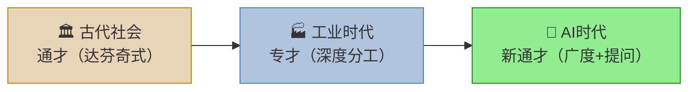
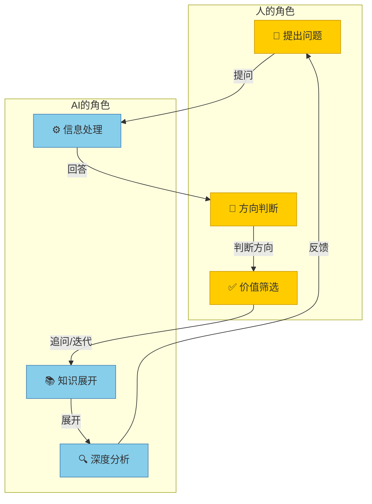

# AI负责处理和展开，形成一种新的人机协作模式

> 💡 **核心观点**：AI时代，教育应着重培养孩子的**内驱力**和**创造力**，让他们成为能提出好问题的"通才"——人负责提问与方向，AI负责处理与展开。

---

## 🧠 逻辑记忆：一图理解核心框架



---

## 一、培养内驱力与创造力

| 维度 | 传统教育 | AI时代教育 |
|------|---------|-----------|
| **驱动力** | 外部要求（考试、分数） | 内在驱动（好奇心、兴趣） |
| **创造力** | 标准化答案，路径唯一 | 鼓励多元解法，允许试错 |
| **知识获取** | 教师单向传授 | 自主提问，AI辅助探索 |
| **评价方式** | 单一考试分数 | 综合能力 + 提问质量 |

### 核心要点

- **核心目标**：教育应更多地培养孩子的内驱力，减少外部强加的要求
- **保护兴趣**：顺其自然地保护和引导孩子的创造力与兴趣，让他们对事物产生天然的好奇

---

## 二、从专才到通才：教育内容的转变

### 📊 知识结构的演变



### 转变逻辑链

```
广泛涉猎 ──→ 知识图谱"星星点点" ──→ 遇到新事物能提出好问题 ──→ 利用AI深入探索
```

| 能力层级 | 具体内容 | 作用 |
|---------|---------|------|
| **第1层：广博** | 对多个领域"略知一二" | 建立跨领域知识网络 |
| **第2层：连接** | 让知识图谱"星星点点"互联 | 在不同领域间发现关联 |
| **第3层：提问** | 面对新事物能提出正确问题 | 精准定位AI可助力的方向 |
| **第4层：迭代** | 利用AI进行深入探索 | 从问题出发快速扩展认知 |

---

## 三、"通才"的历史回归

### 📊 三个时代的"人才模型"对比

| 时代 | 人才模型 | 核心能力 | 代表人物/特征 |
|------|---------|---------|-------------|
| 🏛️ 古代 | **通才** | 跨领域博闻强识 | 达芬奇（艺术+科学+工程） |
| 🏭 近现代 | **专才** | 单一领域深度精通 | 学科细分、职业专业化 |
| 🤖 AI时代 | **新通才** | 广度 + 提问力 + 判断力 | 能驾驭AI的"提问动物" |

> 🔑 **关键洞察**：AI时代的"新通才"≠ 古代的"什么都懂"，而是**"知道什么值得问"** + **能借助AI把专业问题展开"**。

---

## 四、新型人机协作模式

### 🔄 协作流程图



### 协作分工一览

| | 人（通才） | AI |
|---|---------|-----|
| **核心动作** | 提问、判断、筛选 | 处理、展开、分析 |
| **不可替代性** | 直觉、价值观、创造力 | 海量知识、速度、规模 |
| **协作方式** | 发起 → 评判 → 再发起 | 响应 → 展开 → 等待评判 |

---

## 📝 个人行动启发

- [ ] 审视自己/孩子的学习：内驱力 vs 外部驱动的比例是多少？
- [ ] 有意识地拓展知识广度：每月接触1个新领域的入门知识
- [ ] 练习"提问能力"：面对新事物先问3个好问题，再搜索答案
- [ ] 尝试与AI协作解决跨领域问题，体验"人提问+AI展开"的模式

---

## 🔗 相关笔记

- [[2026-06-14 AI负责处理和展开，形成一种新的人机协作模式]]
- [[2026-06-14 企业级大模型落地为何困难]]
