# 📚 2026-06-14 知识汇总

> 本日 7 篇笔记，横跨 **AI 产业洞察、个人成长心法、教育哲学** 三大领域。以下从「产业 → 协作 → 个人」三个维度层层收束，提炼核心框架与经典金句。

---

## 🧭 全景导航图

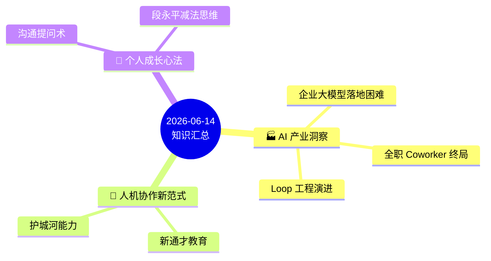

---

## 一、🏭 AI 产业洞察（三篇）

### 1.1 企业级大模型落地为何困难

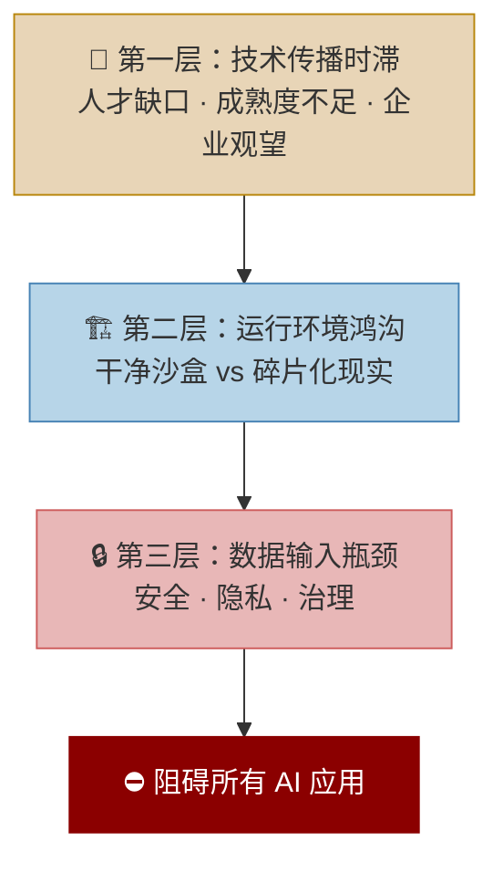

| 真实案例 | 对应困境 |
|:---|:---|
| Samsung 代码泄露 | 数据安全 → 全面禁用 AI |
| Air Canada 机器人诉讼 | AI 输出不可回退 → 法律追责 |
| Goldman Sachs 报告 | 实质性收益推迟至 2026–2027 |

> 💎 **金句**
> - **"不是模型不够强，而是组织没准备好。"**
> - **"现在是打地基的阶段，而非摘果子的阶段。"**
> - **六字方针：慢基建，快验证。**

📎 → [[2026-06-14 企业级大模型落地为何困难]]

---

### 1.2 全职 Coworker — AI 的终局形态

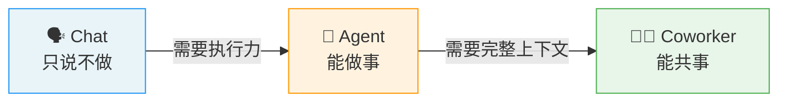

| 巨头 | 布局特点 | 核心优势 |
|:---|:---|:---|
| **Claude** | 聊天→代码→全员，完整链路 | 战略最清晰 |
| **腾讯** | CodeBuddy + WorkBuddy | 微信生态 |
| **字节** | 豆包/剪映/火山引擎 | 产品最丰富，但⚠️分散 |

> 💎 **金句**
> - **"AI 的进化终点不是 Agent，而是 Coworker。"**
> - **"用户要的不是执行命令的工具，而是能闭环、能共事的伙伴。"**
> - **"关键词不是更聪明，而是能共事。"**

📎 → [[2026-06-14 全职Coworker]]

---

### 1.3 Loop 工程 — AI 编程的终极形态

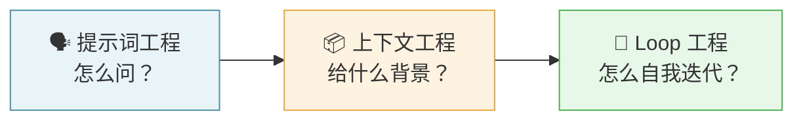

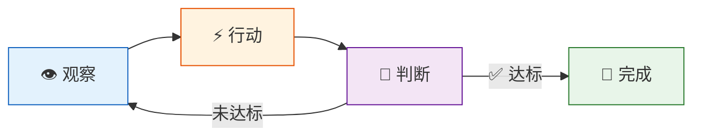

**核心挑战**：「完成」标准缺失 → 过度修复 / 虚假完成

| 新角色 | 核心职责 | 价值趋势 |
|:---|:---|:---:|
| 🎯 目标工程师 | 模糊需求 → 可量化目标 | 📈📈 暴涨 |
| 📋 评估工程师 | 制定 AI 成果验收标准 | 📈 上升 |

> 💎 **金句**
> - **"最大的挑战不是让 AI 更聪明，而是让 AI 知道什么时候该停下来。"**
> - **"写代码的能力在贬值，定义写什么代码的能力在暴涨。"**
> - **"最稀缺的资源不是 AI 的算力，而是人类的判断力。"**
> - **"Loop 工程表面是技术问题，本质是更清晰的人类思维。"**

📎 → [[2026-06-14 Loop工程：定义与运行机制]]

---

## 二、🤝 人机协作新范式（两篇）

### 2.1 新通才教育 — 人提问，AI 展开

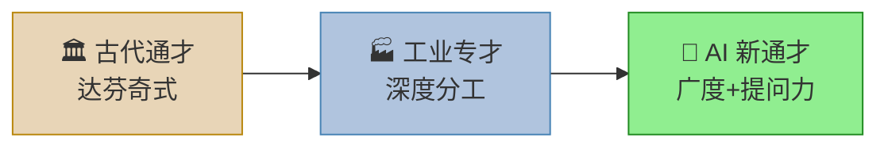

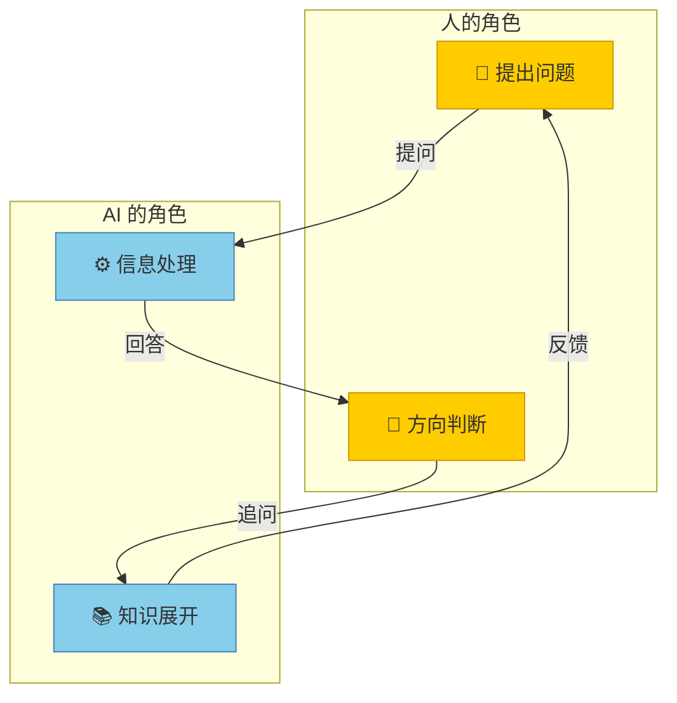

> 💎 **金句**
> - **"AI 时代的新通才 ≠ 什么都懂，而是知道什么值得问。"**
> - **"教育应培养内驱力，减少外部强加的要求。"**

📎 → [[2026-06-14 AI负责处理和展开，形成一种新的人机协作模式]]

---

### 2.2 未来护城河 — 看似"没用"的能力

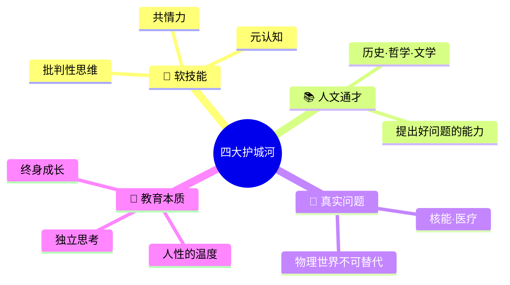

| 岗位类型 | AI 替代风险 | 原因 |
|:---|:---:|:---|
| 🔴 单一技能型 | 高 | 任务标准化 |
| 🟡 专业技能型 | 中 | 需人把关方向 |
| 🟢 多元组合型 | 低 | 多领域+人际判断 |

> 💎 **金句**
> - **"AI 越强大，人类独有的软技能就越稀缺、越值钱。这是能力倒挂。"**
> - **"提出好问题的能力，比给出正确答案的能力更值钱。"**
> - **"未来的赢家，不是最懂 AI 技术的人，而是会做一个有灵性、会思考、有血有肉的人。"**

📎 → [[2026-06-14 一些看似 没用 但实则是未来 护城河]]

---

## 三、🧠 个人成长心法（两篇）

### 3.1 社交和职场沟通 — 提问的力量

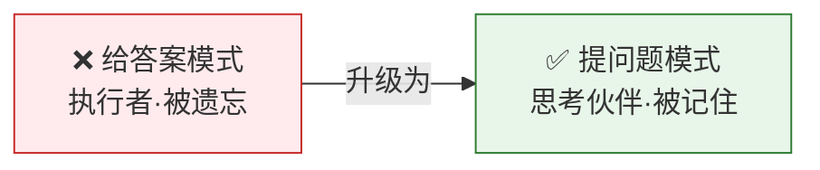

**W-H-W 提问框架**：

| 框架 | 含义 | 示例 |
|:---:|:---|:---|
| **W**hy not | 挑战假设 | "为什么没尝试这个方向？" |
| **H**ow might | 打开可能性 | "如果资源翻倍，方案会怎么变？" |
| **W**hat if | 引入变量 | "如果用户量增长 10 倍呢？" |

> 💎 **金句**
> - **"一个好问题，胜过十个漂亮话。"**
> - **"在一个人人都有答案的时代，提出好问题，就是你最稀缺的社交货币。"**
> - **"认知差距越大，你的外行视角越有价值。"**
> - **"信息是廉价的。唯一不可替代的，是你观察世界的独特角度。"**

📎 → [[2026-06-14 社交和职场沟通的技巧]]

---

### 3.2 段永平的成功心法 — 减法思维

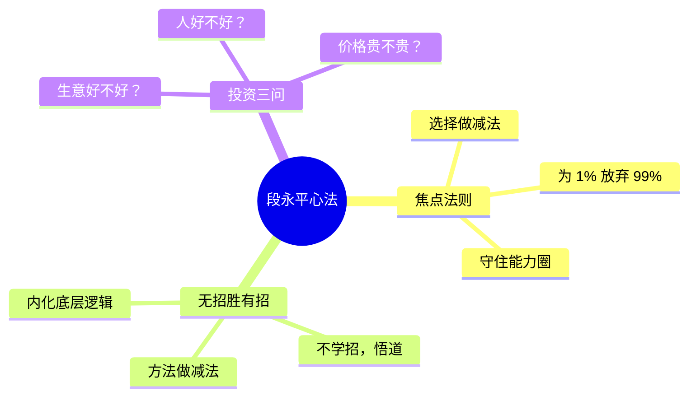

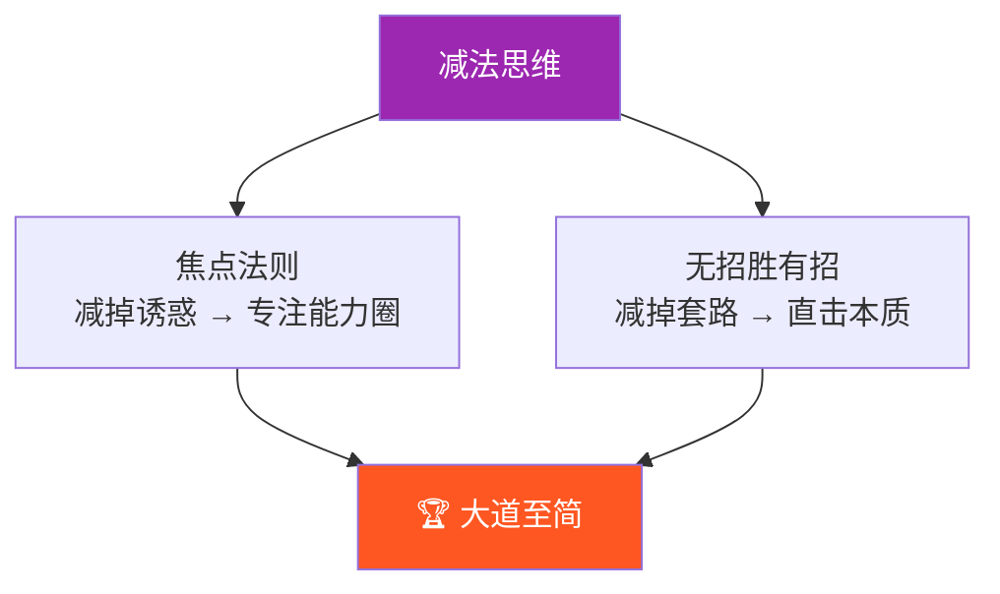

> 💎 **金句**
> - **"在选择上极度专注，在方法上回归本质。"**
> - **"拥有的越少，才能越强大。"**
> - **"一辈子只待在自己的能力圈里。"**
> - **生意好不好？人好不好？价格贵不贵？——三问定乾坤。**

📎 → [[2026-06-14 段永平的成功心法：两大核心法则]]

---

## 四、🔗 全日知识脉络 · 一图串联

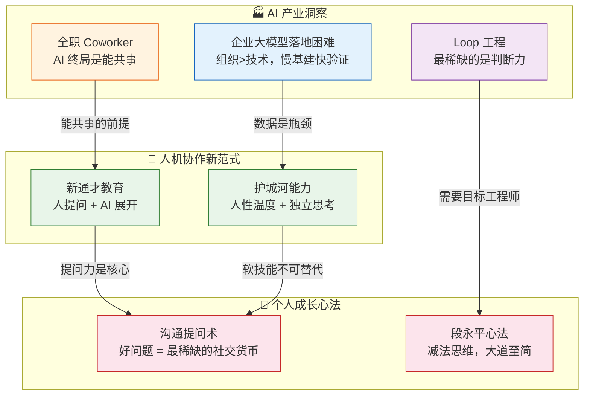

---

## ⭐ 全日十大金句 · 精华浓缩

| # | 金句 | 来源 |
|:---:|:---|:---|
| 1 | **"最稀缺的资源不是 AI 的算力，而是人类的判断力。"** | Loop 工程 |
| 2 | **"在一个人人都有答案的时代，提出好问题，就是你最稀缺的社交货币。"** | 沟通技巧 |
| 3 | **"AI 的进化终点不是 Agent，而是 Coworker。"** | 全职 Coworker |
| 4 | **"拥有的越少，才能越强大。"** | 段永平心法 |
| 5 | **"未来的赢家，不是最懂 AI 的人，而是会做一个有灵性、有血有肉的人。"** | 护城河能力 |
| 6 | **"现在的地基阶段，而非摘果子的阶段。"** | 企业 AI 落地 |
| 7 | **"写代码的能力在贬值，定义写什么代码的能力在暴涨。"** | Loop 工程 |
| 8 | **"AI 越强大，人类独有的软技能就越稀缺、越值钱。"** | 护城河能力 |
| 9 | **"认知差距越大，你的外行视角越有价值。"** | 沟通技巧 |
| 10 | **"AI 时代的新通才，是知道什么值得问的人。"** | 新通才教育 |

---

## 🎯 一句话总结这一天

> **AI 时代的核心竞争力，不在于掌握多少技术，而在于能否把模糊变清晰——清晰地提问、清晰地定义目标、清晰地判断价值。人的判断力、提问力和人性温度，才是最深的护城河。**

---

## 📎 全部笔记索引

| 笔记 | 领域 | 关键词 |
|:---|:---:|:---|
| [[2026-06-14 企业级大模型落地为何困难]] | AI 产业 | 三层困境 · 数据瓶颈 · 慢基建快验证 |
| [[2026-06-14 全职Coworker]] | AI 产业 | Chat→Agent→Coworker · 能共事 |
| [[2026-06-14 Loop工程：定义与运行机制]] | AI 产业 | 观察→行动→判断 · 目标工程师 |
| [[2026-06-14 AI负责处理和展开，形成一种新的人机协作模式]] | 人机协作 | 新通才 · 提问力 · 内驱力 |
| [[2026-06-14 一些看似 没用 但实则是未来 护城河]] | 人机协作 | 软技能 · 人文素养 · 能力倒挂 |
| [[2026-06-14 社交和职场沟通的技巧]] | 个人成长 | 提问框架 · 社交货币 |
| [[2026-06-14 段永平的成功心法：两大核心法则]] | 个人成长 | 焦点法则 · 减法思维 · 大道至简 |
