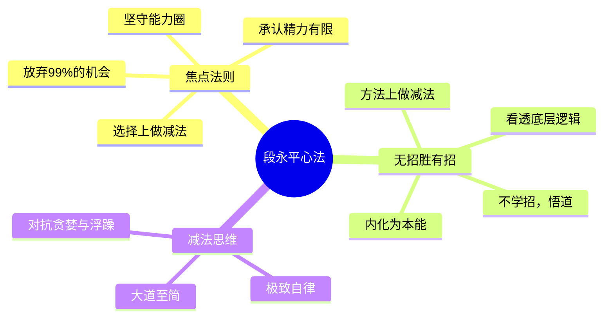
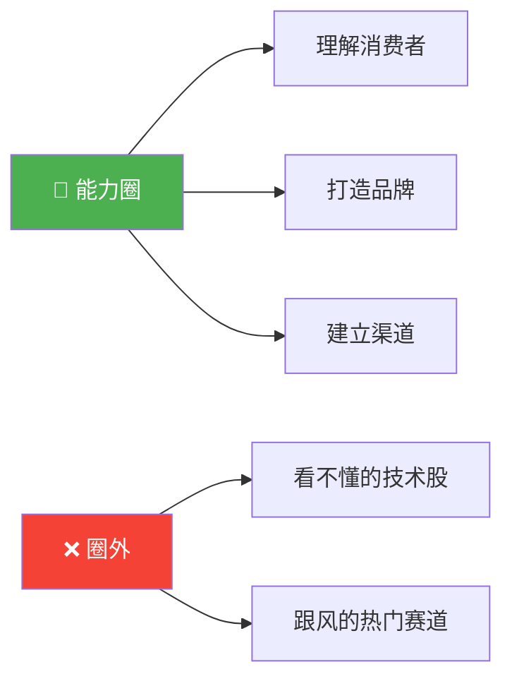
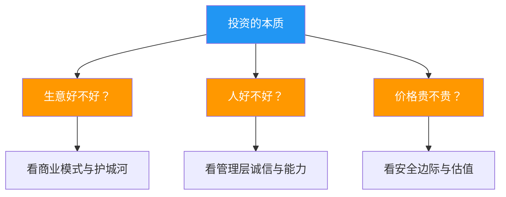
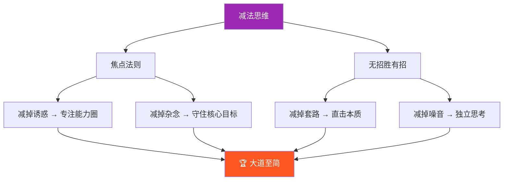

# 段永平的成功心法：两大核心法则

> 视频深入解读了段永平在 2013 年北大演讲中提出的两大核心思想：**焦点法则**与**无招胜有招**。这并非简单的成功学鸡汤，而是他一生经营与投资的总纲。其精髓在于通过"减法思维"，回归本质，化繁为简。

---

## 🧠 核心框架图

---

## 一、焦点法则：在选择上做减法

焦点法则的核心是主动承认个人精力有限，必须为了最重要的 1%，放弃 99% 看似不错的机会。这是一个**欲望问题**，而非能力问题。

### 📊 加法思维 vs 减法思维

| 对比维度 | ❌ 加法思维（人性） | ✅ 减法思维（段永平） |
| :--- | :--- | :--- |
| **行为模式** | 贪多、怕错过、爱跟风 | 主动放弃、极度专注 |
| **结果** | 精力分散，什么都做但不精 | 单点极致，形成核心竞争力 |
| **典型案例** | 松下：业务线过长，品牌模糊 | 索尼：聚焦音视频，成为行业王者 |

> 💡 焦点法则并非指一辈子只做一个行业，而是**一辈子只待在自己的能力圈里**。段永平的核心能力是"理解消费者、打造品牌、建立渠道"，因此他能看懂苹果和茅台，也能拒绝看不懂的科技股。

### 🔍 能力圈示意

---

## 二、无招胜有招：在方法上做减法

"无招胜有招"强调企业和个人的成功不靠花哨的招式或技巧，而在于将最根本的规律刻进骨子里。

### 📊 学"招" vs 悟"道"

| 对比维度 | ❌ 学"招"（术） | ✅ 悟"道"（本质） |
| :--- | :--- | :--- |
| **关注点** | 学习别人的经验、技巧、套路 | 看透事物背后的底层逻辑 |
| **结果** | 被招式迷惑，生搬硬套，沦为花拳绣腿 | 内化于心，形成本能，达到"无招"境界 |

> 🎯 投资的本质是什么？段永平的答案是：**生意好不好、人好不好、价格贵不贵**。他从不依赖复杂的估值模型，因为他看透了投资的本质。

### 📐 投资本质三问

---

## 三、减法思维：贯穿始终的核心

无论是焦点法则还是无招胜有招，其背后都是一种强大的"减法思维"。

### 📊 减法思维全景图

| 维度 | 减掉什么 | 留下什么 |
| :--- | :--- | :--- |
| **焦点法则** | 不重要的事、不在能力圈的事、诱惑和杂念 | 极度专注，只做最重要的 1% |
| **无招胜有招** | 没用的套路、花哨的技巧、别人的经验和噪音 | 回归本质，内化底层逻辑 |

> 这种思维方式需要**极致的自律和耐心**，以对抗人性的贪婪与浮躁。

### 🔄 减法思维逻辑链

---

## 四、一句话带走

段永平的成功心法看似简单，实则是绝大多数人一辈子都学不会的"大道至简"。它要求我们：

> **在选择上极度专注，在方法上回归本质。**

最终，**拥有的越少，才能越强大**。

---

## 📝 逻辑记忆卡片

| 关键词 | 核心要义 | 一句话记忆 |
| :--- | :--- | :--- |
| **焦点法则** | 在选择上做减法 | 为 1% 放弃 99%，守住能力圈 |
| **无招胜有招** | 在方法上做减法 | 不学招、只悟道，看透本质 |
| **减法思维** | 贯穿始终的底层逻辑 | 减掉一切多余，留下最核心的 |
| **投资三问** | 投资的终极判断 | 生意、人、价格——三问定乾坤 |
