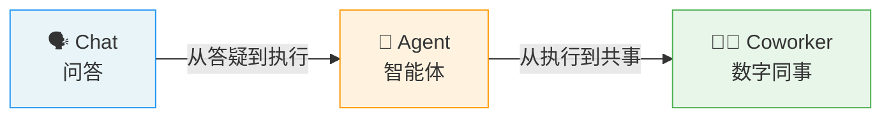
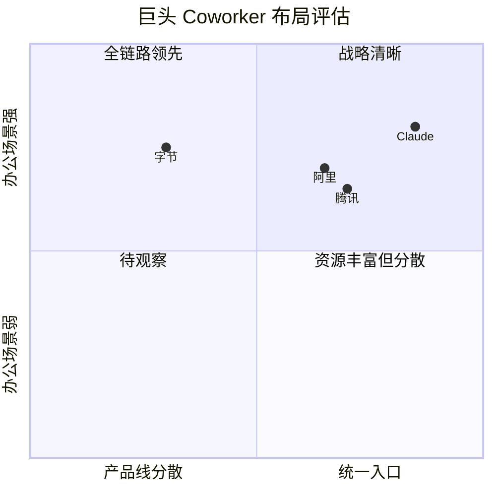

# 全职 Coworker — AI 的终局形态

> [!abstract] 一句话总结
> AI 的进化终点不是 Agent，而是 **Coworker（数字同事）**。用户要的不是执行命令的工具，而是能闭环、能共事的伙伴。

---

## 核心演进路径



---

## 三阶段详解

### 阶段一：🗣️ Chat 问答

| 维度 | 说明 |
|------|------|
| **核心能力** | 回答问题，提供方法和步骤 |
| **致命局限** | 只动嘴不动手 🚫 无法产生真正的业务价值 |
| **类比** | 像一个只会给建议的顾问，不帮你干活 |

### 阶段二：🤖 Agent 执行

| 维度 | 说明 |
|------|------|
| **核心能力** | 直接帮用户完成任务 |
| **技术核心** | 自主规划 → 调用工具 → 迭代验证 → 结果闭环 |
| **关键突破** | 将代码仓库换成文档、测试流程换成审批，即可处理日常办公 |
| **类比** | 像一个能干活的实习生，但只专注单一任务 |

> [!tip] 关键转折
> Agent 为 Coworker 奠定了基础 — 当「执行能力」被验证后，下一步自然是让 AI 获得**完整的工作上下文**。

### 阶段三：👨‍💼 Coworker 数字同事

| 维度 | 说明 |
|------|------|
| **核心能力** | 连接邮件、浏览器、日历、项目进度等，获取完整上下文 |
| **对话转变** | 不再是「答疑」，而是「交付结果」— 提出目标，自动完成 |
| **本质区别** | 从工具 → 同事，能闭环、能协作、能主动推进 |

---

## 巨头布局对比



| 厂商 | 核心产品 | 布局特点 | 优势 | 挑战 |
|------|----------|----------|------|------|
| **Anthropic (Claude)** | Claude Chat + Code + Teams | 聊天→代码→全员协同，完整链路 | 战略最清晰，产品一体化 | 企业客户覆盖 |
| **腾讯** | CodeBuddy + WorkBuddy | 逐步打造统一智能办公入口 | 微信生态 + 企业微信基础 | 产品整合进度 |
| **阿里** | Qoder | 直接落地办公场景 | 路径明确，钉钉生态 | 技术品牌认知 |
| **字节** | 豆包 / 剪映 / 火山引擎 | 全行业最豪华牌面 | 产品矩阵丰富、用户量大 | ⚠️ 业务线分散独立，缺乏统一入口 |

---

## 🧠 逻辑记忆框架

### 「1-2-3-4」记忆法

| 数字 | 记忆锚点 | 内容 |
|------|----------|------|
| **1 个终局** | Coworker | AI 的终点是数字同事，不是 Agent |
| **2 个转变** | 答疑→交付，工具→同事 | 对话模式和产品定位的双重升级 |
| **3 个阶段** | Chat → Agent → Coworker | 问答 → 执行 → 共事 |
| **4 大玩家** | Claude / 腾讯 / 阿里 / 字节 | 统一入口 vs 百花齐放 |

### 因果链记忆

```
Chat 只说不做（痛点）
  ↓ 需要执行力
Agent 能做事（突破）
  ↓ 需要上下文
Coworker 能共事（终局）
  ↓ 需要整合力
巨头抢入口（竞争）
```

### 关键词触发记忆

| 触发词 | 联想 |
|--------|------|
| 只动嘴 → | Chat 阶段 |
| 自主规划 + 调用工具 → | Agent 阶段 |
| 邮件 + 日历 + 上下文 → | Coworker 阶段 |
| 最豪华的牌 + 分散 → | 字节 |
| 完整链路 → | Claude |

---

> [!important] 核心洞察
> 未来两年，所有 AI 产品的分水岭：**能否成为用户的全职 Coworker**。
> 关键词不是「更聪明」，而是「能共事」。
