> [!quote] 核心命题
> AI编程正从「提示词工程」演进到「Loop工程」——最大的挑战不是让AI更聪明，而是让AI知道**什么时候该停下来**。

---

## 一、演进路径：从对话到闭环

**核心观点**：AI编程工具（Claude Code、Cursor、OpenClaw 等）的发展，正不约而同地收敛到 **Loop工程** 这一目标。

### 📊 三阶段对比表

| 维度 | 提示词工程 | 上下文工程 | Loop工程 |
|:---:|:---:|:---:|:---:|
| **核心问题** | 怎么问？ | 给什么背景？ | 怎么自我迭代？ |
| **关注对象** | 单次输入 | 信息组织 | 反馈循环 |
| **AI角色** | 被动回答 | 有据回答 | 自主行动 |
| **典型工具** | ChatGPT | RAG / 知识库 | Agent 框架 |
| **隐喻** | 🗣️ 问一问 | 📖 查资料 | 🔄 干一干、查一查 |
| **局限性** | 一次性交互 | 缺乏判断力 | 缺乏「完成」标准 |

> [!tip] 一句话记忆
> 提示词工程 → 问得对；上下文工程 → 给得全；Loop工程 → 转得起来、停得下来。

---

## 二、Loop工程：定义与运行机制

**定义**：设计一个能够 **自我观察 → 自我行动 → 自我判断** 的循环，让 AI Agent 接收到任务后，能自主迭代直至完成。

> 结构灵感来源于 Kubernetes 的 **调协循环（Reconciliation Loop）**：声明期望状态 → 对比实际状态 → 执行修正 → 持续循环。

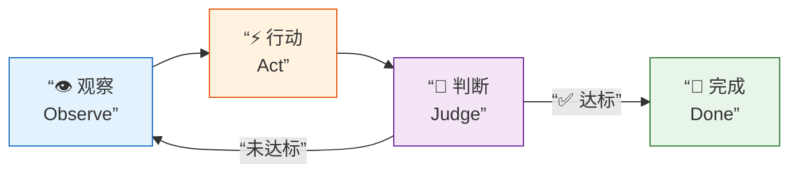

### 关键要素拆解

| 要素 | 含义 | 类比 |
|:---:|:---|:---:|
| **观察** | 感知当前系统/代码状态 | 看仪表盘 |
| **行动** | 执行修改/操作 | 转动方向盘 |
| **判断** | 对比目标，评估是否达标 | 导航判断偏航 |
| **终止条件** | 明确的「完成」定义 | 到达目的地 🏁 |

---

## 三、核心挑战：「完成」标准缺失

**瓶颈**：落地AI智能体时，最大的难题在于如何定义任务的 **”完成”标准**。

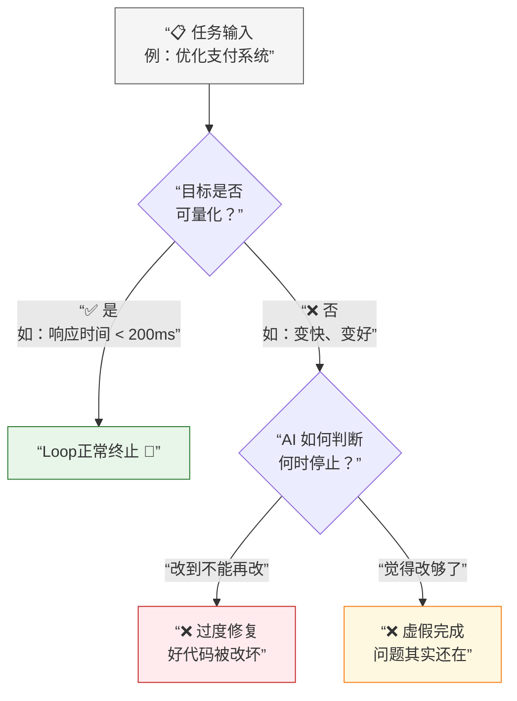

### 📊 三种结果对比

| 场景 | 根因 | 后果 | 示例 |
|:---:|:---:|:---:|:---|
| ✅ **正确完成** | 目标可量化，终止条件明确 | 系统改善，符合预期 | “将接口 P99 延迟从 500ms 降至 200ms” |
| ❌ **过度修复** | 无终止条件，持续迭代 | 改了没问题的代码，引入新Bug | 重构了正常运行的模块导致回归 |
| ❌ **虚假完成** | 目标模糊，AI”自我满足” | 声称完成，实际指标未变 | “已优化代码结构” 但性能未提升 |

> [!warning] 警示
> **没有明确终止条件 = 没有可靠结果。** 这不是技术能力问题，而是**目标定义**问题。

---

## 四、未来展望：新角色的诞生

> [!important] 核心结论
> 未来真正值钱的不是会写提示词的人，而是能将**业务需求**翻译成**机器可判定目标**的人。

### 📊 角色演变对比

| 角色 | 核心职责 | 关键能力 | 稀缺程度 | 价值趋势 |
|:---:|:---|:---|:---:|:---:|
| 🗣️ 提示词工程师 | 编写有效的提示词 | 语言表达、模型理解 | ⭐ 逐渐普及 | ➡️ 趋稳 |
| 🎯 目标工程师 | 将模糊需求转化为可衡量目标 | 业务理解、指标拆解 | ⭐⭐⭐ 极度稀缺 | 📈 强上升 |
| 📋 评估工程师 | 为AI成果制定评估与验收标准 | 质量标准、测试设计 | ⭐⭐ 高度稀缺 | 📈 上升 |

### 角色关系图

---

## 五、逻辑记忆：一页全景图

> [!tip] 逻辑记忆链
> 将全文核心概念串联为一条因果链，形成结构化记忆。

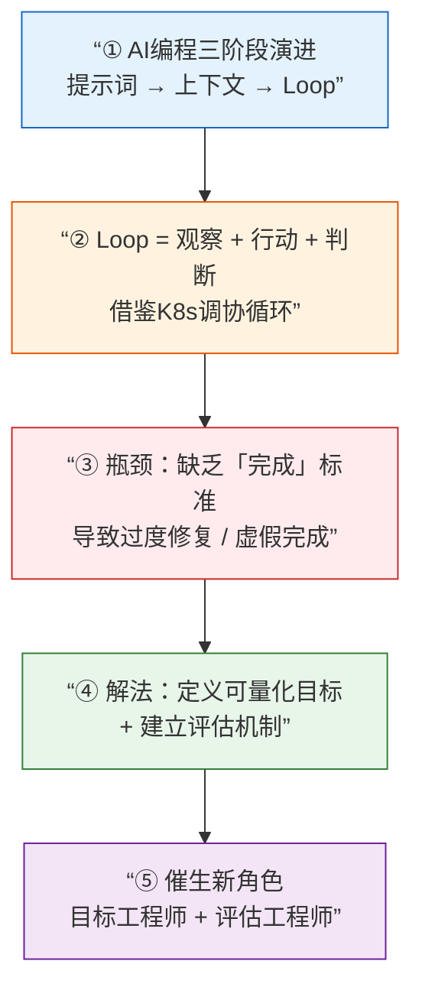

**🧠 五步因果链**：

| 步骤 | 关键概念 | 记忆锚点 |
|:---:|:---|:---:|
| ① | 演进：问得对 → 给得全 → 转得起来 | **三次跃迁** |
| ② | Loop = 观察 + 行动 + 判断 | **三步循环** |
| ③ | 瓶颈：不知何时停 → 两种失败 | **一个卡点** |
| ④ | 解法：可量化目标 + 评估机制 | **两把钥匙** |
| ⑤ | 新角色：目标工程师 + 评估工程师 | **两类新人** |

---

## 六、正在发生的案例

> [!abstract] 本章定位
> 理论不是空中楼阁。以下案例全部来自 **2024–2026 年真实发生的事件**，精确对应前文每一个核心论点。

### 📊 案例全景映射表

| 案例 | 发生时间 | 对应理论 | 核心教训 |
|:---|:---:|:---:|:---|
| 🤖 Devin 的兴衰 | 2024.03–至今 | §三 虚假完成 | 演示≠落地，缺乏终止条件就缺乏信任 |
| 🏗️ SWE-bench 评测 | 2024–2026 持续 | §三 可量化目标 | 用测试用例定义「完成」是目前最优解 |
| 💻 Cursor Background Agent | 2025.05 | §二 Loop运行机制 | 从建议者→执行者的范式跃迁 |
| 🧠 Claude Code 的 Agentic 模式 | 2025–2026 | §二 + §三 | 观察-行动-判断循环的工程实践 |
| 🏭 Factory AI / Codegen | 2025–2026 | §四 目标工程师 | 创业公司押注「目标定义」赛道 |
| 🎵 Karpathy「Vibe Coding」 | 2025.02 | §一 演进路径 | 提示词工程的天花板，引出 Loop 需求 |

---

### 案例 1：Devin — 从「第一个AI工程师」到信任危机 🤖

> **对应理论**：§三「完成」标准缺失 → 虚假完成

**时间线**：

| 时间 | 事件 |
|:---:|:---|
| 2024.03 | Cognition Labs 发布 Devin，号称「全球首个 AI 软件工程师」 |
| 2024.03–06 | 演示视频引发轰动，但社区质疑 Demo 经过精心挑选 |
| 2024.07–12 | 真实用户反馈：复杂任务完成率低，经常出现「虚假完成」 |
| 2025–2026 | 转型为企业级工具，强调人类监督和人机协作 |

**为什么是典型案例？**

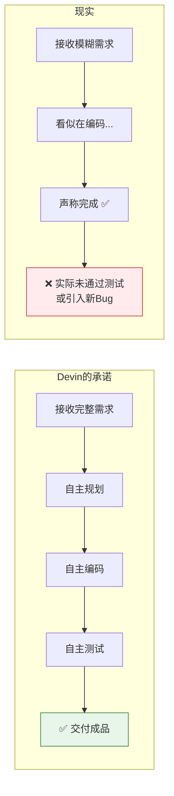

> [!warning] 教训
> Devin 的困境完美验证了本文核心论点：**AI不缺编码能力，缺的是知道「我做完了没」的判断机制。** 没有可量化目标，Demo可以很好看，但落地一定是灾难。

---

### 案例 2：SWE-bench — 用测试用例定义「完成」 🏗️

> **对应理论**：§三 正确完成的前提 = 可量化目标

**背景**：普林斯顿大学推出的基准测试，从真实 GitHub Issue 中抽取任务，用 **单元测试通过率** 作为唯一的「完成」标准。

**启示**：

| 维度 | SWE-bench 的做法 | 对应本文理论 |
|:---|:---|:---|
| **目标定义** | 每个任务绑定具体的测试用例 | ✅ 可量化目标 = 可执行的测试 |
| **终止条件** | 所有测试通过 → 停止 | ✅ 明确的终止条件 |
| **评估标准** | Pass Rate（通过率），非主观判断 | ✅ 客观评估，非AI自我评估 |
| **局限** | 只能处理有明确测试的任务 | ⚠️ 真实世界很多任务没有现成测试 |

> [!tip] 关键洞察
> SWE-bench 证明了：**「完成」标准的最佳载体是可执行的自动化测试。** 但这也暴露了 Loop 工程的根本矛盾——真实世界中，大量业务需求（"优化用户体验""提升系统可维护性"）无法直接转化为测试用例。这正是 §四「目标工程师」角色如此稀缺的原因。

---

### 案例 3：Cursor Background Agent — 从建议者到执行者 💻

> **对应理论**：§一 演进路径（提示词→上下文→Loop）/ §二 Loop运行机制

**范式跃迁**：

| 阶段 | 产品形态 | AI角色 | 人类角色 | 对应理论 |
|:---:|:---|:---:|:---:|:---:|
| **Copilot时代** | 代码补全、Tab推荐 | 打字助手 | 主导者 | §一 提示词工程 |
| **Chat时代** | 对话式生成代码 | 咨询顾问 | 决策+执行者 | §一→§二 上下文工程 |
| **Agent时代** | Cursor Background Agent | 自主开发者 | 需求定义+验收者 | §二 Loop工程 |

**Cursor Agent 的 Loop 结构**：

> [!note] 实践观察
> Cursor Agent 的终止条件通常是**任务描述中的具体指令**（"给这个函数加错误处理""把这个组件从 JS 迁移到 TS"）。当任务足够具体时，Loop 工作良好；当任务模糊时（"优化这个项目"），Agent 就会陷入无目的修改——**完美复现了 §三 的三种失败场景**。

---

### 案例 4：Claude Code — Agentic 编码的工程实践 🧠

> **对应理论**：§二 Loop运行机制 + §三 核心挑战

**Claude Code 的三层 Loop 架构**：

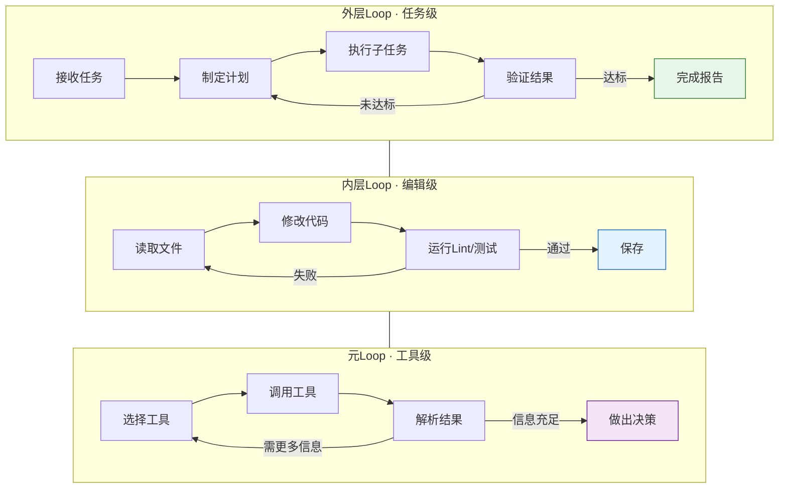

| Loop 层级 | 循环内容 | 终止条件 |
|:---:|:---|:---|
| **元Loop** | 工具调用循环（读文件/搜索/执行命令） | 收集到足够信息 |
| **内层Loop** | 代码编辑循环（修改→测试→修复） | 测试/Lint 全部通过 |
| **外层Loop** | 任务执行循环（计划→执行→验证） | 用户需求全部满足 |

> [!important] 工程启示
> Claude Code 的设计表明：**Loop 工程不是单一循环，而是多层嵌套循环。** 每一层都需要自己的「终止条件」，而这正是最难的——尤其是外层Loop，它的终止条件直接取决于「需求有多清晰」。

---

### 案例 5：Karpathy「Vibe Coding」 — 提示词工程的天花板 🎵

> **对应理论**：§一 演进路径 / §四 新角色

**事件**：2025年2月，Andrej Karpathy（前 OpenAI/Tesla AI 负责人）提出 **"Vibe Coding"（氛围编程）** 概念：

> *"你完全沉浸在氛围中，拥抱指数级发展，忘掉代码的存在。"*

| 维度 | Vibe Coding | Loop 工程 |
|:---:|:---|:---:|
| **核心理念** | 用自然语言描述想法，AI生成一切 | 构建闭环系统，AI自主迭代 |
| **人的角色** | 指挥者（说想要什么） | 架构者（定义目标和判断标准） |
| **适用场景** | 原型、个人项目、快速验证 | 生产系统、团队协作、持续维护 |
| **天花板** | 🚫 无法处理复杂、长期、多约束的任务 | ✅ 理论上的终极方案 |
| **瓶颈** | 🚫 仍然依赖「人」在每轮做判断 | ⚠️ 需要「目标工程师」定义终止条件 |

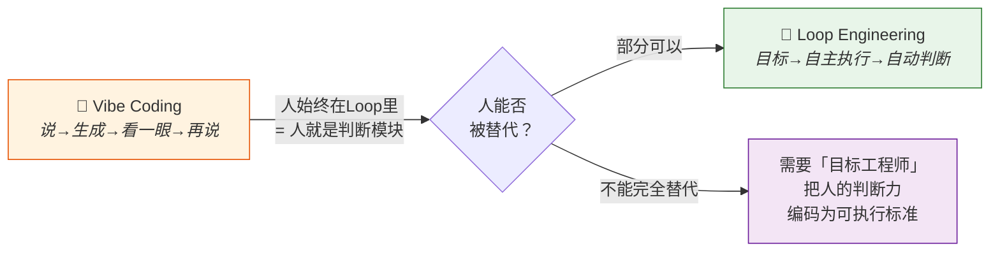

> [!tip] 深层关联
> Vibe Coding 是 **Loop 工程的「人类在环」版本**——人充当了判断模块。Loop 工程的终极目标，就是把人这个判断模块**逐步外化**为可机器执行的标准。而这恰恰是「目标工程师」的工作。

---

### 案例 6：Factory AI — 押注「目标定义」赛道 🏭

> **对应理论**：§四 目标工程师 / §三 核心挑战

**Factory AI** 是一家 2025 年成立的 AI 编码创业公司，其核心理念直接对应本文论点：

| Factory AI 的实践 | 对应本文理论 |
|:---|:---|
| 提出 "Autonomous Code Generation"（自主代码生成） | §二 Loop 工程 |
| 强调 "Specification-Driven"（规格驱动） | §三 可量化目标 = 可执行规格 |
| 核心产品是 "Code Droid"（代码机器人） | §二 观察-行动-判断循环 |
| 融资重点：目标定义能力，而非模型能力 | §四 目标工程师的价值 |

> [!note] 行业信号
> 当一家 AI 编码公司的**核心差异化不是模型能力，而是「如何定义目标」**时——这本身就是对本文核心论点最强有力的市场验证。

---

## 七、最高级思考问答 · 全文终极总结

> [!abstract] 本章定位
> 以 **层层递进的 7 个终极问答**，将全文从「是什么→为什么→怎么办→去哪里」完整串联。这不只是复习，而是**站在更高维度重新审视全文**。

---

### Q1 · 本质追问：为什么是这三个阶段？背后的驱动力是什么？

> 对应：§一 演进路径

**追问**：为什么是「提示词→上下文→Loop」，而不是别的顺序？

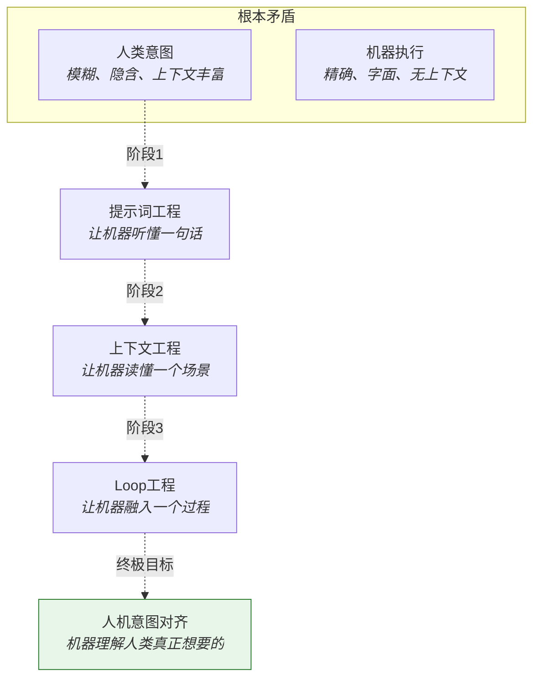

**回答**：这三个阶段的本质，是 **人机意图对齐的深度递进**——

| 阶段 | 对齐的深度 | 类比 |
|:---:|:---|:---:|
| 提示词工程 | 对齐一句话（你说什么，我做什么） | 🗣️ 传话筒 |
| 上下文工程 | 对齐一个场景（你在哪，你需要什么） | 📖 顾问 |
| Loop工程 | 对齐一个过程（你的目标是什么，我帮你持续逼近） | 🔄 合伙人 |

**一句话答案**：演进的驱动力是**人类想让机器理解得越来越深**，从「字面」到「语境」到「意图」。

---

### Q2 · 哲学追问：「完成」为什么这么难定义？

> 对应：§三 核心挑战

**追问**：人类自己也不总是知道「什么时候算完成」，为什么AI就特别需要？

**回答**：因为人类有**隐性判断力**，而AI没有。

| 判断类型 | 人类 | AI |
|:---:|:---:|:---:|
| **显性标准**（测试通过、数字达标） | ✅ 能做 | ✅ 能做 |
| **隐性标准**（"感觉对了""差不多就行"） | ✅ 凭直觉 | ❌ 完全不能 |
| **元判断**（"这件事本身还需不需要做"） | ✅ 能反思 | ❌ 不能 |

> [!quote] 深层洞察
> **「完成」之所以难，不是因为任务难，而是因为「完成」本身是一个需要人类价值观参与的概念。** AI只能执行，不能判断"值不值得"。所以 Loop 工程的终极挑战，不是技术问题，而是**哲学问题**：我们能否把人类的价值观编码为机器可执行的规则？

---

### Q3 · 实践追问：我现在就能用 Loop 工程吗？

> 对应：§二 运行机制 + §三 核心挑战

**追问**：作为一个普通开发者，我今天能做什么？

**回答**：遵循 **"从具体到抽象"的三级落地法**——

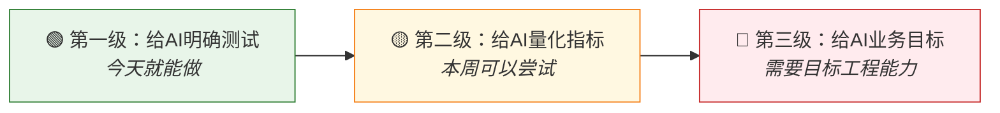

| 级别 | 做法 | 示例 | 效果 |
|:---:|:---|:---|:---:|
| 🟢 第一级 | 给AI具体的测试用例 | "写一个函数，通过这些测试" | Loop稳定，完成率高 |
| 🟡 第二级 | 给AI量化指标 | "将这段代码的覆盖率从60%提升到90%" | Loop基本可控 |
| 🔴 第三级 | 给AI业务目标 | "优化用户注册流程的转化率" | 需要人工拆解+评估 |

> [!tip] 行动建议
> **从今天开始，每次给AI任务时，额外写一条「我怎么知道你做完了」的标准。** 这一条标准，就是 Loop 工程的种子。

---

### Q4 · 角色追问：我会被替代吗？

> 对应：§四 新角色

**追问**：如果AI能自主编程，程序员还有价值吗？

**回答**：不是没价值，是**价值的锚点变了**。

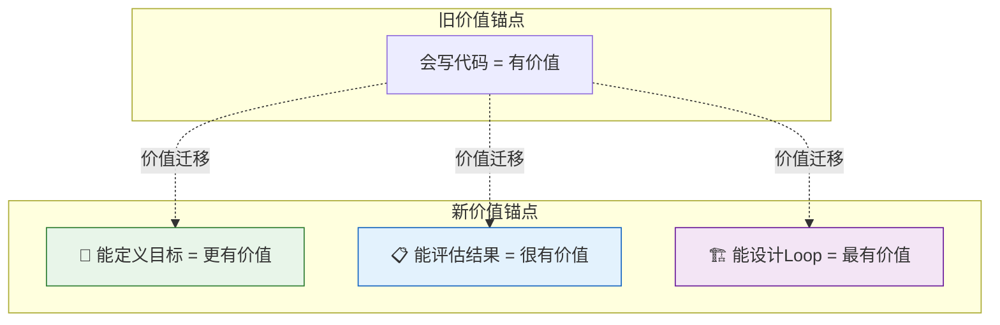

| 能力层 | 旧时代价值 | 新时代价值 | 变化 |
|:---:|:---:|:---:|:---:|
| 写代码 | ⭐⭐⭐⭐⭐ | ⭐⭐ | 📉 贬值 |
| 读代码/审查代码 | ⭐⭐⭐ | ⭐⭐⭐⭐ | 📈 升值 |
| 定义目标/拆解需求 | ⭐⭐ | ⭐⭐⭐⭐⭐ | 📈📈 暴涨 |
| 设计评估标准 | ⭐ | ⭐⭐⭐⭐⭐ | 📈📈 暴涨 |
| 设计 Loop 系统 | 不存在 | ⭐⭐⭐⭐⭐ | 🆕 新赛道 |

**一句话答案**：**写代码的能力在贬值，定义「写什么代码」的能力在暴涨。**

---

### Q5 · 终局追问：Loop 工程的终局是什么？

> 对应：§五 逻辑记忆 + §四 展望

**追问**：如果 Loop 工程发展到极致，会怎样？

**回答**：存在三种可能的终局——

| 终局 | 描述 | 概率 | 含义 |
|:---:|:---|:---:|:---|
| 🌤️ **协同进化** | 人类定义目标，AI执行闭环，评估工程师把关质量 | 最高 | 人类角色升级，不消失 |
| 🌥️ **目标坍缩** | AI 接管目标定义，人类退化为"审批者" | 中等 | 人类失去对软件的深度理解 |
| 🌩️ **对齐突破** | AI 能自主理解人类意图并定义合理目标 | 最低（当前） | Loop 工程被超越，进入新范式 |

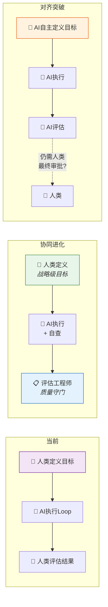

> [!note] 现实判断
> 以当前AI的能力，**「协同进化」是最可能的终局**。人类不会被替代，但**需要的技能会发生根本性转变**——从"能做什么"变成"能定义什么目标"和"能判断什么结果是好的"。

---

### Q6 · 反直觉追问：Loop 工程最大的敌人是什么？

> 对应：全文所有理论的综合反思

**追问**：阻碍 Loop 工程落地的最大障碍不是技术吗？

**回答**：不是。**最大的敌人是「模糊性惯性」。**

| 层面 | 模糊性惯性的表现 | 后果 |
|:---:|:---|:---:|
| **需求层** | 产品经理写"优化体验"而非"注册步骤从5步减到3步" | AI不知道做什么 |
| **工程层** | 团队没有写测试的习惯 | AI没有终止条件 |
| **文化层** | "差不多就行"的心智模式 | 整个组织缺乏精确目标思维 |
| **教育层** | 学校教育强调"写出代码"而非"定义问题" | 人才结构与需求错配 |

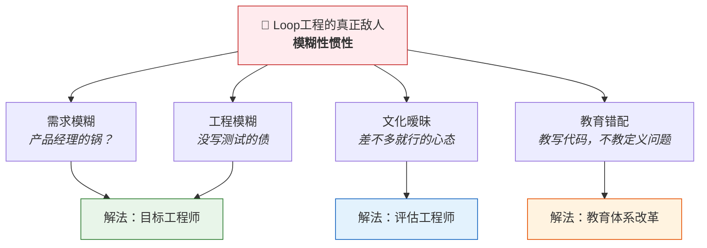

> [!important] 最深刻的洞察
> Loop 工程表面是技术问题，本质是**组织能力和思维方式的挑战**。它要求的不是更好的AI模型，而是**更清晰的人类思维**。

---

### Q7 · 终极追问：一句话总结这一切？

**回答**：

> [!quote] 全文终极总结
> **AI编程的演进，本质上是一场「清晰度革命」——**
> 从「模糊地问」到「清楚地给上下文」再到「精确地定义目标与完成标准」。
> 在这场革命中，**最稀缺的资源不是AI的算力，而是人类的判断力**。
> 能把模糊变清晰的人，就是新时代最有价值的人。

---

## 八、全文总结 · 一页速览

### 📊 全文知识体系总表

| 章节 | 核心论点 | 关键概念 | 一句话精华 |
|:---:|:---|:---|:---|
| §一 演进路径 | AI编程经历三个阶段 | 提示词→上下文→Loop | 问得对→给得全→转得起来 |
| §二 Loop机制 | Loop = 观察+行动+判断 | 调协循环、多层嵌套 | 干一干、查一查、到了就停 |
| §三 核心挑战 | 「完成」标准缺失 | 过度修复、虚假完成 | 不知何时停 = 没有可靠结果 |
| §四 新角色 | 目标/评估工程师崛起 | 需求翻译、验收标准 | 定义目标比写代码更值钱 |
| §五 逻辑记忆 | 五步因果链 | 3-3-1-2-2 记忆锚点 | 三次跃迁→三步循环→一个卡点→两把钥匙→两类新人 |
| §六 真实案例 | 6个案例全验证 | Devin、SWE-bench、Cursor等 | 理论已在现实中反复上演 |
| §七 深度问答 | 7层追问触达本质 | 意图对齐、模糊性惯性 | 最稀缺的不是算力，是判断力 |

### 🧠 逻辑记忆总链（终极版）

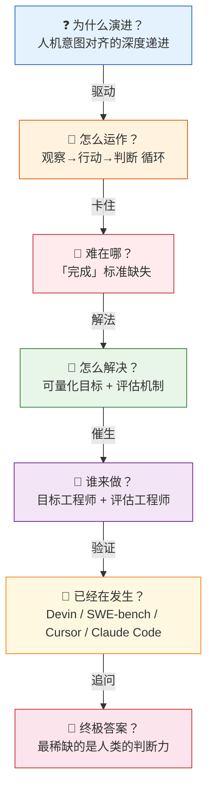

> [!success] 🧠 全篇记忆口诀
> **三阶演进对齐深，三步循环转不停。**
> **一个卡点何时停，两把钥匙定与评。**
> **两类新人翻译清，六个案例证已行。**
> **七问追到根底处——算力不贵判断明。**

---

## 参考

- Kubernetes 调协循环（Reconciliation Loop）— Loop工程的结构灵感来源
- AI编程工具趋势：Claude Code、Cursor、OpenClaw 等向 Agent 闭环方向收敛
- Devin（Cognition Labs）— 首个"AI软件工程师"产品的兴衰历程
- SWE-bench（Princeton NLP）— 用测试用例定义AI编码任务「完成」标准的学术基准
- Cursor Background Agent（2025.05）— AI编码工具从建议者到执行者的范式跃迁
- Andrej Karpathy "Vibe Coding"（2025.02）— 提示词工程天花板的概念化表述
- Factory AI — 以「规格驱动」为核心差异化的AI编码创业公司