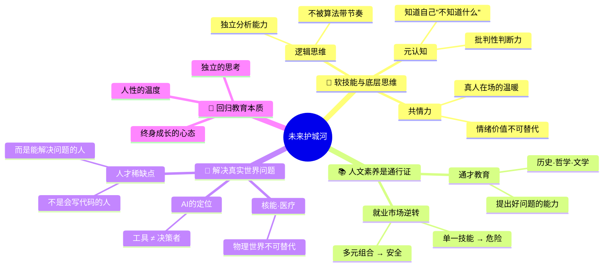
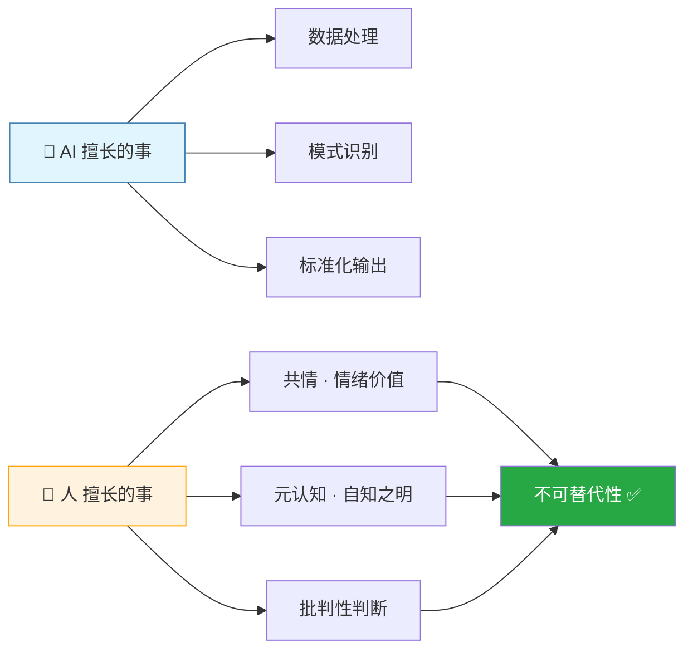
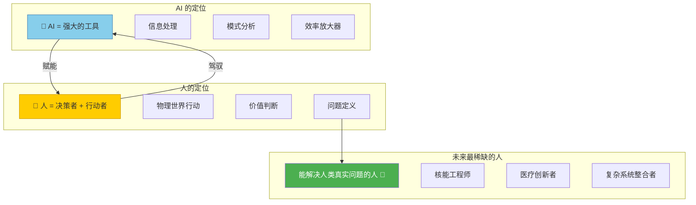
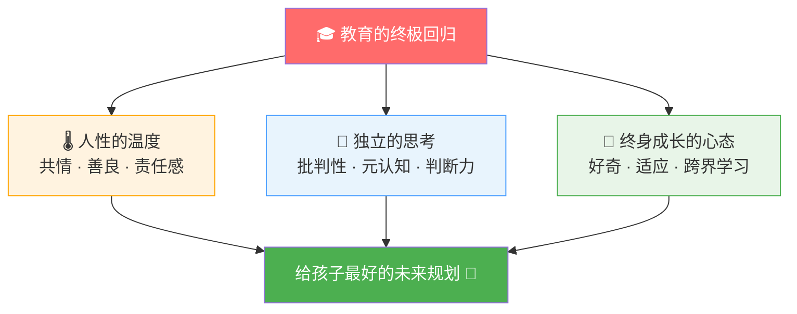
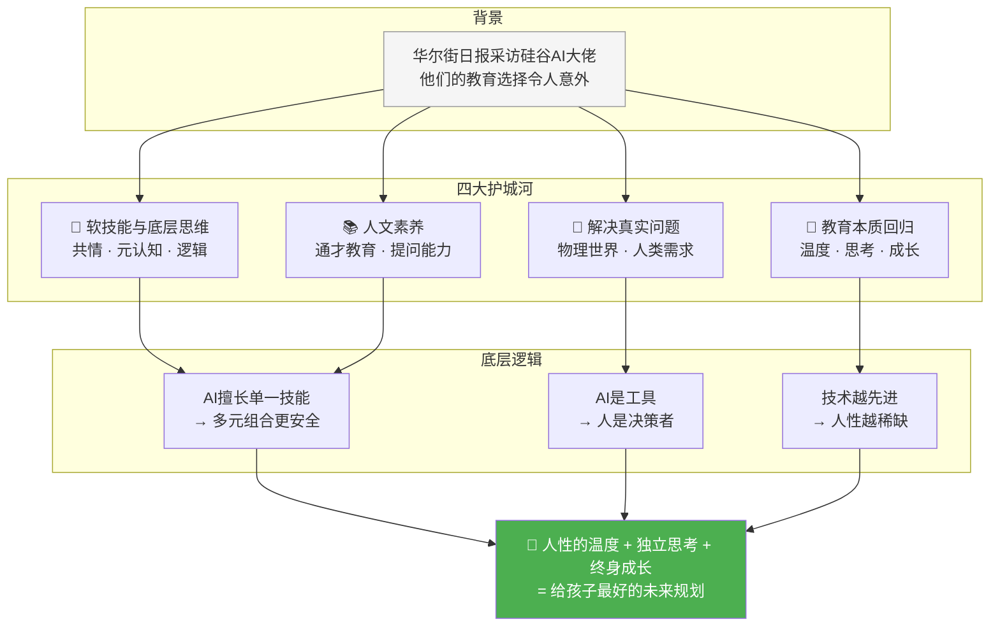

# 一些看似"没用"但实则是未来"护城河"的能力

> [!abstract] 核心论点
> 亲手制造AI焦虑的硅谷大佬们，反而没有让孩子学AI——他们将培养重点放在了一些看似"没用"但实则是未来"护城河"的能力上。**人性、人文素养、解决真实问题的能力**，才是孩子最硬的底牌。

---

## 🧠 逻辑记忆：一图掌握核心框架



### 🗝️ 记忆口诀

```
四大护城河 → "软·文·实·本"
  软技能（共情 + 元认知 + 逻辑）
  人文通才（提问力 + 跨域广度）
  真实问题（物理世界 + 人类需求）
  教育本质（温度 + 思考 + 成长）
```

---

## 一、核心：软技能与底层思维

### 谁在说？

| 人物 | 身份 | 核心观点 | 关键词 |
|------|------|---------|--------|
| **Dario Amodei** | Anthropic 联合创始人 | 共情、善良、责任感等软技能不可替代——AI无法提供情绪价值和真人在场的温暖 | 共情力 · 人性温度 |
| **Peter Lee** | 微软首席科学家 | 元认知、批判性思维、逻辑思维等底层能力，是人类判断力的核心，AI难以模仿 | 元认知 · 判断力 |

### 为什么软技能是护城河？



> [!tip] 关键洞察
> AI越强大，**人类独有的软技能**就越稀缺、越值钱。这是"能力倒挂"——技术越强，人性能力越重要。

---

## 二、趋势：人文素养是通行证

### 谁在说？

| 人物 | 身份 | 核心观点 |
|------|------|---------|
| **Ethan Mollick** | 沃顿商学院教授 | 通才教育（历史、哲学、文学）比以往任何时候都更重要——未来与AI的交互全靠人说话，需要有深度的人文素养才能向AI提出好问题 |

### 就业市场正在发生逆转

```mermaid
graph TD
    subgraph 过去：专才安全
        P1["🔧 专精一门手艺"] --> P2["✅ 稳定的职业"]
    end

    subgraph 现在：通才更安全
        N1["📚 多元能力组合"] --> N2["✅ 安全区"]
        N3["🤖 AI擅长单一技能工作"] --> N4["❌ 专才工作被替代"]
    end

    P2 -.->|"时代变了"| N4

    style P1 fill:#b0c4de,stroke:#4682b4
    style P2 fill:#4caf50,color:#fff
    style N1 fill:#fff3e0,stroke:#ffa500
    style N2 fill:#4caf50,color:#fff
    style N3 fill:#e1f5fe,stroke:#4682b4
    style N4 fill:#f44336,color:#fff
```

### AI时代就业安全矩阵

| 岗位类型 | 代表职业 | AI替代风险 | 原因 |
|---------|---------|:---------:|------|
| 🔴 **单一技能型** | 初级翻译、数据录入 | 高 | 任务标准化，AI效率远超人类 |
| 🟡 **专业技能型** | 程序员、设计师 | 中 | AI辅助效率翻倍，但需要人来把关方向 |
| 🟢 **多元组合型** | 律师、医生、产品经理 | 低 | 需要多领域知识 + 人际判断 + 复杂决策 |
| 🟢 **人文创造型** | 战略规划、哲学研究、艺术指导 | 低 | 需要深度人文素养和原创性思维 |

> [!important] 关键洞察
> 与AI的交互全靠人说话。**提出好问题的能力**比**给出正确答案的能力**更值钱——这正是人文素养的核心。
> 
> 参见：[[2026-06-14 AI负责处理和展开，形成一种新的人机协作模式]]

---

## 三、应用：解决真实世界问题

### 谁在说？

| 人物 | 身份 | 核心观点 |
|------|------|---------|
| **Ankit Singh** | PAID.AI 创始人 | 为孩子指明核能和医疗（癌症治疗）等赛道——未来最缺的不是会写代码的人，而是能解决人类真实问题的人 |

### AI定位与人才稀缺点



> [!note] AI无法替代的部分
> AI是强大的工具，但无法替代人类在**物理世界**中解决实际问题的能力——这是"最后一公里"的人类优势。

---

## 四、结论：回归教育的本质

### 三个核心认知转变

| # | 旧认知 | 新认知 |
|:-:|-------|-------|
| 1 | 学AI技术 = 未来安全 | **人性素养**才是未来安全 |
| 2 | 专才 > 通才 | **多元组合的通才**更安全 |
| 3 | 技术前沿 = 教育方向 | 技术前沿 → 回归**教育本质** |



> [!success] 一句话总结
> 未来的赢家，不是最懂AI技术的人，而是**会做一个有灵性、会思考、有血有肉的人**。

---

## 📊 全篇逻辑总览



---

## 🔗 与相关笔记的连接

| 相关笔记 | 与本笔记的关联点 |
|---------|---------------|
| [[2026-06-14 AI负责处理和展开，形成一种新的人机协作模式]] | "新通才"概念高度呼应：人提问 + AI展开；通才教育是本笔记的核心论点 |
| [[2026-06-14 "一年内为自己改命"的12条法则]] | 规则6"深度通才"= 跨领域理解 + 整合资源 + 创造新组合，与本笔记"多元能力组合更安全"一致 |
| [[2026-06-09 如何让努力真正有回报]] | "跨界阅读"打造差异化思维壁垒，正是本笔记"人文素养是通行证"的实践路径 |
| [[2026-06-10 AI尚未完全取代人类的过渡时期]] | 穷育 vs 富育的本质区别：富育强调系统思维、资源整合——与本笔记"软技能是护城河"一致 |
| [[2026-06-06 把护城河建在模型层之外]] | 商业版护城河理论：护城河不在模型（技术），而在品牌、信任、行业Know-how——与"人性温度"逻辑相通 |
| [[2026-06-13 将企业业务逻辑抽象为可复用、可执行的语义模型，才是真正的护城河]] | 企业级护城河 = 理解业务的人 > 技术本身，印证"能解决真实问题的人"比"会写代码的人"更稀缺 |

---

## 📝 个人行动启发

- [ ] 反思自己/孩子的学习：每天有多少时间在训练"软技能"vs "硬技能"？
- [ ] 有意识地拓展人文素养：每月接触一本哲学/历史/文学类书籍
- [ ] 练习"提问能力"：面对新事物先问3个好问题，再搜索答案
- [ ] 关注真实世界问题：选择一个人类真实需求（能源/医疗/教育），深入了解
- [ ] 培养元认知：每天5分钟复盘——"我今天有没有在逃避思考什么？"
