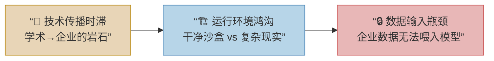
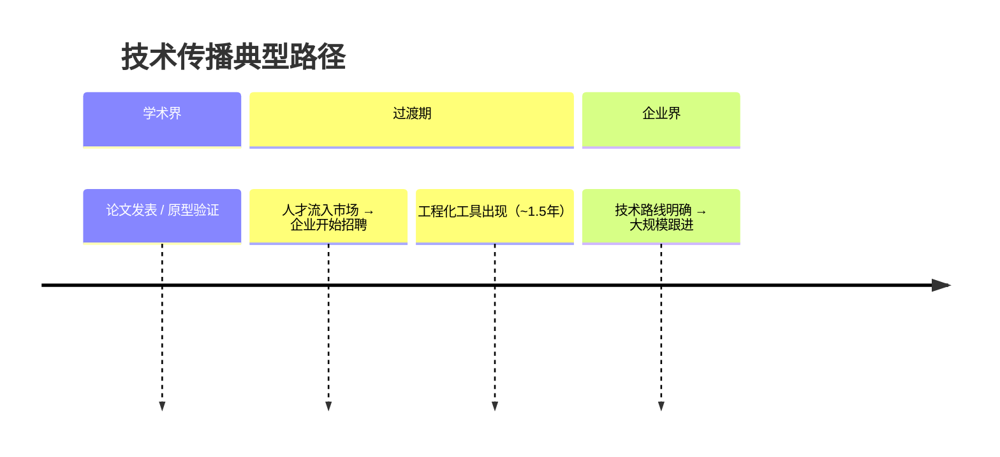
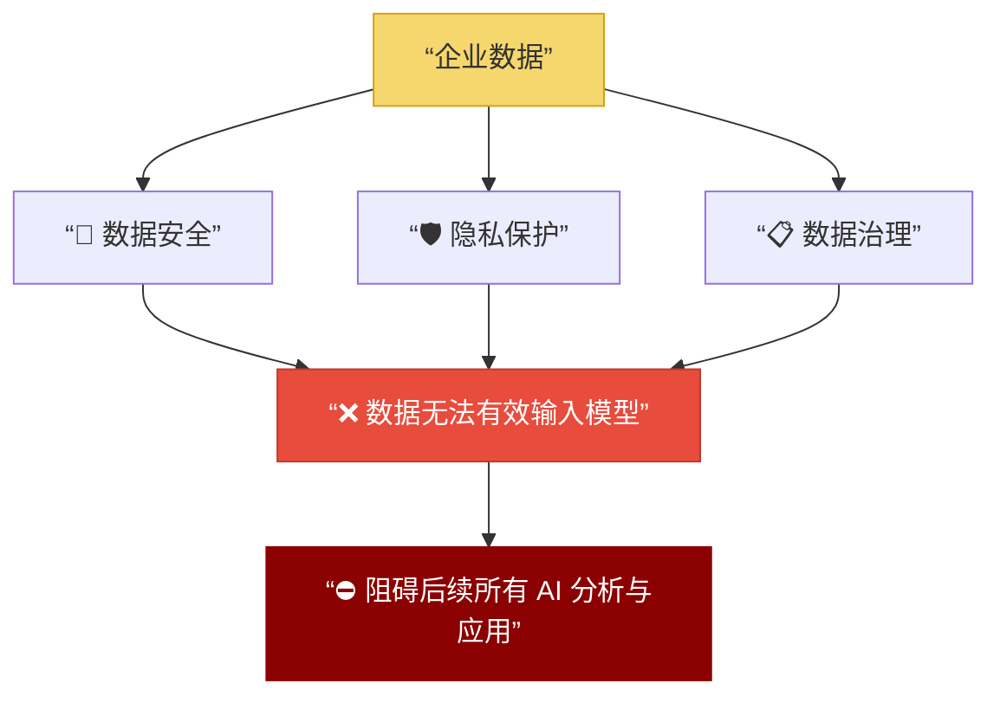
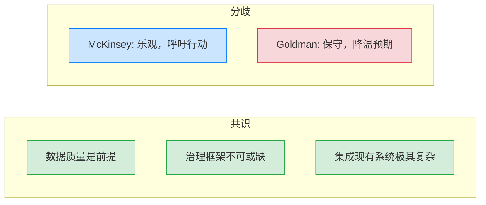
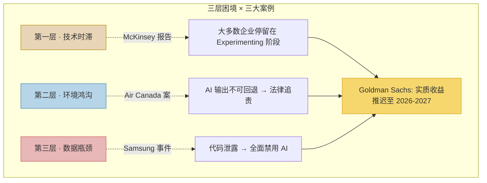

# 企业级大模型落地为何困难？

> [!abstract] 核心观点
> 企业 AI 转型面临的最大挑战**并非技术本身**，而是复杂的**组织和环境壁垒**。以下从三个层层递进的维度展开剖析。



---

## 一、技术传播的时滞：学术与企业的”岩石”

新技术从学术研究到企业应用存在**天然的时间差**，如同地质层中的岩石，阻挡着技术快速渗透。

| 阻滞因素 | 说明 |
| :--- | :--- |
| 👤 **人才缺口** | 企业需招聘掌握前沿技术的人才，但市场供给有限，存在招聘周期 |
| 🔧 **技术成熟度** | 许多大模型工程化应用（如 Claude Code）才发展约 **1.5 年**，仍是全新方向，技术路线有待完善 |
| 👀 **企业观望** | 当学术研究遇瓶颈、技术路线明确后，企业才会大规模跟进；此前常处于观望状态 |



---

## 二、运行环境的鸿沟：干净沙盒 vs 复杂现实

Claude Code 等产品与企业 Agent 运行的环境**截然不同**，导致其在企业中难以直接复用。

> [!tip] 任务执行流程（Harris）
> 所有大厂都在优化 AI **接收指令 → 完成任务** 的中间流程，即如何调度工具、处理上下文和错误兜底。

### 环境对比

| 维度 | 🟢 产品环境 | 🔴 企业环境 |
| :--- | :--- | :--- |
| **工具链** | 完整、确定，所有命令可用 | 往往不完善，甚至缺少完整 API 文档 |
| **一致性** | 干净、统一、唯一 | 碎片化、异构、历史遗留 |
| **任务定义** | 边界清晰，输入输出明确 | 充满模糊性，难以形式化 |

### 反馈机制对比

| 维度 | 🟢 产品环境 | 🔴 企业环境 |
| :--- | :--- | :--- |
| **反馈速度** | 毫秒级响应 | 周期长，往往需人工审核 |
| **反馈质量** | 准确、可量化（对错及原因） | 无明确量化标准（如”合理即可”） |
| **容错能力** | 可快速试错修复 | 一旦输出盖章便无法回退 |

> [!warning] 关键矛盾
> 模型无法理解”合理即可”这类模糊标准，也无法在不可回退的流程中试错。

---

## 三、落地的最大瓶颈：无法输入的企业数据

> [!important] 核心瓶颈
> 相比工具和标准缺失，企业 AI 落地面临的**最大问题**是数据无法有效输入模型。

这涉及以下关键领域，它们构成了后续所有分析和应用的前提与基础：



---

## 总结：三层递进逻辑

| 层次 | 问题 | 关键词 |
| :---: | :--- | :--- |
| **第一层** | 技术传播时滞 | 人才、成熟度、观望 |
| **第二层** | 运行环境鸿沟 | 工具链、模糊性、反馈 |
| **第三层** | 数据输入瓶颈 | 安全、隐私、治理 |

> [!question] 延伸思考
> 除了数据问题，你认为还有哪些阻碍企业 AI 转型的因素？是**技术成本**、**人才短缺**还是**组织架构**的限制呢？

---

## 正在发生的真实案例

> [!note] 以下案例印证了上文三层困境并非理论推演，而是当下企业正在经历的现实。

### 案例 ① Samsung 代码泄露事件 —— 数据安全的"第一道伤疤"

2023 年 4 月，Samsung 工程师将**包含敏感源代码**的机密文本粘贴到 ChatGPT 中用于调试，导致核心商业数据外泄至 OpenAI 服务器。事件后 Samsung 紧急**全面禁用 generative AI 工具**，并在数周内制定内部 AI 使用规范。

| 对应困境层 | 映射分析 |
| :---: | :--- |
| **第三层 · 数据瓶颈** | 企业核心数据一旦"喂入"外部模型，即面临泄露风险，且**不可撤回** |
| **第二层 · 环境鸿沟** | 缺乏受控的企业级 AI 运行环境，员工只能"裸奔"使用消费级产品 |

> [!quote] 启示
> 数据安全不是"未来要考虑的问题"，而是**已经在发生的事故**。没有企业级隔离环境，每一次 AI 调用都是一次赌博。

---

### 案例 ② Air Canada 聊天机器人诉讼 —— 不可回退的输出

2024 年 2 月，加拿大 Air Canada 的客服聊天机器人向乘客提供了**错误的退票退款政策**，乘客据此购票后遭受损失。法庭裁定：**机器人说的话 = 公司说的话**，Air Canada 需承担赔偿责任。

| 对应困境层 | 映射分析 |
| :---: | :--- |
| **第二层 · 反馈机制** | 产品环境输出可毫秒级回滚，但面对客户的输出**一旦发出即具法律效力** |
| **第二层 · 模糊性** | 模型无法理解"合理即可"等政策边界，给出错误"确定性"答案 |

> [!quote] 启示
> 在企业场景中，AI 输出的"幻觉"不只是技术问题——它是**法律责任问题**。这正是文中"输出盖章便无法回退"的真实写照。

---

### 案例 ③ McKinsey & Goldman Sachs 报告共识 —— 行业级验证

| 报告来源 | 发布时间 | 核心结论 |
| :--- | :---: | :--- |
| [McKinsey: Multi-agent Systems](https://www.cio.com/article/3612480/mckinsey-multi-agent-systems-are-the-next-frontier-of-generative-ai.html) | 2025.03 | 企业需**重建核心技术、运营模型、人才体系和治理架构**才能实现规模化价值 |
| [Goldman Sachs: From Hype to Reality](https://www.goldmansachs.com/intelligence/page-from/top-of-mind/ai-agents-from-hype-to-reality.html) | 2025.05 | 企业 AI Agent 的**实质性生产力提升**预计推迟到 **2026–2027 年**， adoption 远比消费端缓慢 |

**两份报告的共识与分歧：**



> [!tip] McKinsey 五级成熟度模型
> `Exploring → Experimenting → Formalizing → Optimizing → Transforming`
> 当前**大多数企业处于第 2–3 级**（Experimenting / Formalizing），距离规模化落地仍有显著差距。

---

### 案例全景映射



---

## 最高级思考：五个灵魂之问

> [!abstract] 全文总结 · 顶层思考
> 以下五个问答从"是什么 → 为什么 → 怎么办"构成完整的认知闭环，帮助读者将全文内容压缩为**可永久记忆的思维模型**。

---

### Q1：企业 AI 落地的真正难题到底是什么？

> [!answer]- 点击展开思考
> **不是模型不够强，而是组织没准备好。**
> 
> 技术本身已进入"工程化爆发期"，但企业需要的是**人才到位、环境就绪、数据打通**三位一体。任何一块短板都会让整个转型停滞。这本质上是一个**系统工程问题**，而非纯技术问题。

---

### Q2：为什么"干净沙盒"的成功经验无法复制到企业？

> [!answer]- 点击展开思考
> **因为"干净"本身就是产品最大的奢侈品。**
> 
> Claude Code 等产品运行在工具链完整、反馈即时、结果可量化的真空中。而企业环境的本质特征是**模糊性**——工具不全、标准缺失、输出不可撤回。将真空中的经验直接搬到现实中，就像拿赛车去跑越野赛。

---

### Q3：为什么说数据问题是"终极瓶颈"？

> [!answer]- 点击展开思考
> **因为数据是 AI 的"燃料"，而企业数据同时被三把锁锁住：安全、隐私、治理。**
> 
> 没有燃料，再强的引擎也转不动。更关键的是，这三把锁不是技术问题，而是**制度问题**——涉及合规、法律、组织架构。这意味着即使技术突破，制度瓶颈仍会长期存在。

---

### Q4：行业数据告诉我们什么？

> [!answer]- 点击展开思考
> **Goldman Sachs 的冷静判断值得重视：实质性收益要到 2026–2027 年。**
> 
> McKinsey 的成熟度模型则给出路径：大多数企业仍在"实验期"（第 2–3 级）。两个报告共同指向一个结论——**现在是"打地基"的阶段，而非"摘果子"的阶段**。急于求成只会重蹈 PoC 陷阱。

---

### Q5：作为决策者，现在应该怎么做？

> [!answer]- 点击展开思考
> 
> ```mermaid
> graph LR
>     A["🏗️ 建环境"] --> B["🔐 通数据"]
>     B --> C["👤 育人才"]
>     C --> D["📋 立治理"]
>     D --> E["🚀 小场景验证"]
>     E --> F["📈 规模化推广"]
>     style A fill:#d4edda,stroke:#28a745,color:#333
>     style F fill:#cce5ff,stroke:#007bff,color:#333
> ```
> 
> **六字方针：慢基建，快验证。**
> 
> 1. **建环境**：搭建企业级受控 AI 沙盒，杜绝"裸奔"使用消费级工具
> 2. **通数据**：优先解决数据治理和安全分级，为后续应用铺路
> 3. **育人才**：引入或培养"AI + 业务"复合型人才，弥合技术传播时滞
> 4. **立治理**：建立 AI 输出审核机制和容错框架，避免 Air Canada 式法律风险
> 5. **小场景验证**：从高价值、低风险场景切入（如内部知识库问答），积累信任
> 6. **规模化推广**：在前五步验证成功后，再逐步扩展到核心业务流程

---

> [!success] 一页纸总结
> | 维度 | 核心洞察 |
> | :--- | :--- |
> | **本质** | 企业 AI 落地是**组织工程问题**，不是技术瓶颈 |
> | **现状** | 大多数企业仍在**实验期**，距规模化 2–3 年 |
> | **风险** | 数据安全、法律追责、环境不适配已在**真实发生** |
> | **路径** | 慢基建、快验证；先环境 → 再数据 → 后规模 |
> | **终局** | 2026–2027 年是**分水岭**，准备充分的企业将率先突围 |