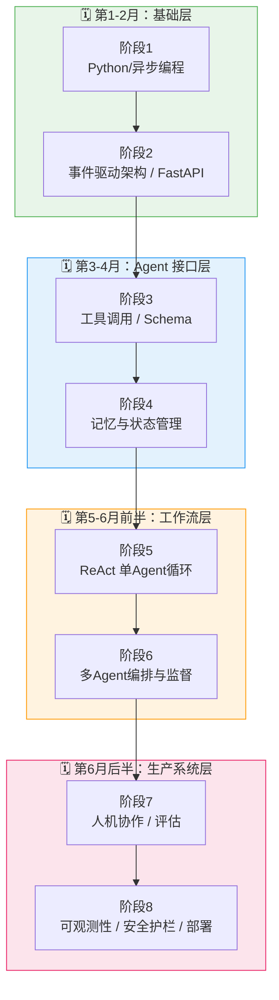
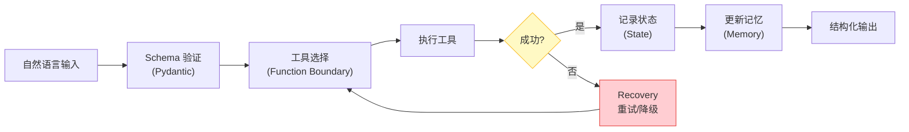
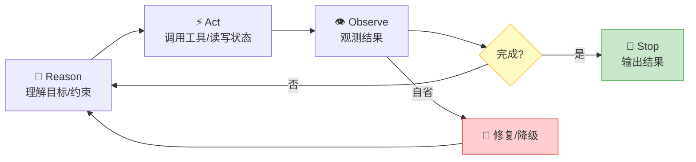
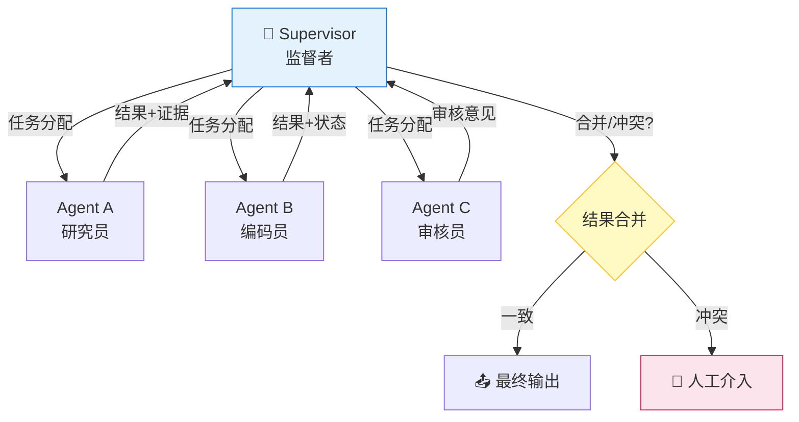
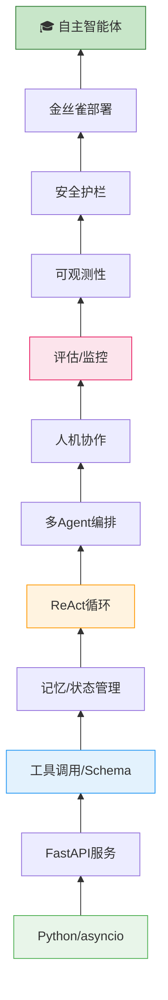

# 6个月 Agent 工程师学习路线图

> 核心观点：成为合格的 Agent 工程师，需要的不是速成，而是通过一系列扎实的工程实践，逐步掌握从基础编程到系统设计、部署和维护的全流程。6个月 = 12个阶段，每阶段约2周，各有明确目标与可交付成果。

---

## 一、学习的三个层次

| 层次 | 描述 | 典型表现 | 局限 |
|------|------|----------|------|
| L1：看教程 | 被动接收知识 | 看完视频觉得"我懂了" | 无法独立解决问题 |
| L2：跑Demo | 跟着示例操作 | 能运行现成项目 | 遇到真实场景无法应对 |
| **L3：工程实践** | **主动构建系统** | **处理失败、延迟、成本、状态** | **无 — 真正工程能力的起点** |

> 真正的工程能力：将模型从"会回答"推进到"能稳定完成任务"，需要处理 **失败、延迟、成本、状态** 等现实问题。

---

## 二、6个月学习全景图

### 架构总览



### 12阶段总览表

| 月份 | 层次 | 阶段 | 核心主题 | 关键交付 |
|------|------|------|----------|----------|
| 第1月 | **基础层** | 1 | Python异步编程 | asyncio + FastAPI 服务 |
| 第1月 | 基础层 | 2 | 事件驱动架构 | 并发服务接入多模型/API |
| 第2月 | **Agent接口层** | 3 | Schema与工具调用 | 类型化、可审计的动作链 |
| 第2月 | Agent接口层 | 4 | 记忆与状态管理 | 跨会话状态持久化 |
| 第3月 | **工作流层** | 5 | 单Agent ReAct循环 | 自管理收敛的Agent |
| 第3月 | 工作流层 | 6 | 多Agent编排 | Supervisor + 消息传递 |
| 第4月 | **生产系统层** | 7 | 人机协作与风险控制 | 审计痕迹 + 人工介入机制 |
| 第4月 | 生产系统层 | 8 | 评估与监控 | 自动化评估框架 |
| 第5月 | 生产系统层（深化） | 9 | 可观测性 | Tracing + 成本仪表盘 |
| 第5月 | 生产系统层（深化） | 10 | 安全护栏 | 注入防御 + 沙箱执行 |
| 第6月 | **毕业冲刺** | 11 | 金丝雀部署 | 灰度发布 + A/B对比 |
| 第6月 | 毕业冲刺 | 12 | 自主智能体发布 | 架构文档 + 演示视频 + 代码仓库 |

---

## 三、各阶段详解

### 🟢 基础层（第1-2月）

#### 阶段1：Python异步编程基础

**目标：** 掌握Python和异步编程基础，理解事件驱动架构。

| 知识点 | 要求 |
|--------|------|
| `asyncio` | 任务管理、取消、超时控制 |
| `FastAPI` | 服务封装、错误处理机制 |
| 并发模型 | 理解协程、事件循环、任务调度 |

**交付：** 完成一个 FastAPI 服务，接入 2个模型 + 3个外部API，能在并发请求下解释：超时、重试、成本、认知负载、失败原因。

---

#### 阶段2：事件驱动架构与FastAPI服务

**目标：** 深入理解事件驱动架构，构建可靠的异步服务。

| 知识点 | 要求 |
|--------|------|
| 事件驱动 | 发布/订阅模式、事件总线 |
| 错误处理 | 重试策略、熔断、降级 |
| 服务编排 | 多服务间异步通信 |

**交付：** 将阶段1服务升级为事件驱动架构，实现事件驱动的Agent任务调度。

---

### 🔵 Agent接口层（第2-3月）

#### 阶段3：Agent接口与真实世界

**目标：** 让模型能够通过接口进入真实世界——工具调用、读写状态、处理错误和恢复任务。

| 关键环节 | 说明 |
|----------|------|
| **Schema** | 使用 Pydantic 将自然语言输入/输出验证为可检查的数据结构 |
| **Function Boundary** | 定义工具时明确：参数、权限、幂等性、失败语义 |
| **Recovery** | 设计重试、参数修复及降级路径，处理工具失效 |
| **Memory** | 管理短期上下文、长期向量召回、上下文压缩 |
| **State Management** | 实现跨会话同步、任务进度恢复 |

**交付：** 每一个动作都有类型、可审计、有恢复路径。



---

#### 阶段4：记忆与状态管理

**目标：** 构建完整的记忆系统，支撑Agent跨会话、跨任务的状态持久化。

| 记忆类型 | 说明 | 实现方式 |
|----------|------|----------|
| 短期记忆 | 当前对话上下文 | 滑动窗口 / 摘要压缩 |
| 长期记忆 | 历史知识召回 | 向量数据库 (Chroma/Pinecone) |
| 工作记忆 | 当前任务进度 | 结构化状态存储 (Redis/DB) |
| 情景记忆 | 过往任务经验 | 日志 + 经验索引 |

**交付：** 实现完整的记忆管理模块，支持上下文压缩、跨会话恢复、向量检索。

---

### 🟠 工作流层（第4-5月前半）

#### 阶段5：单Agent工作流与收敛（ReAct循环）

**目标：** 构建能自我管理、收敛的单Agent系统。

**核心循环：** `Reason → Act → Observe → Stop`

| 步骤 | 任务 | 关键要求 |
|------|------|----------|
| **Reason** | 理解任务目标、约束、缺失信息 | 先思考再行动，不盲目调用模型 |
| **Act** | 调用工具、读写状态 | 产生可追踪的结果 |
| **Observe** | 观测执行结果 | 判断完成 or 需下一步 |
| **Stop** | 触发停止条件 | 避免无限循环，有最大步数限制 |

**交付四大件：**
1. ✅ ReAct 循环实现
2. ✅ 计划与执行分离
3. ✅ 自省触发修复或停止
4. ✅ 失败时降级路径



---

#### 阶段6：多Agent编排与协作

**目标：** 设计多Agent系统，引入监督者、消息传递和冲突解决机制。

| 核心问题 | 说明 |
|----------|------|
| **Supervisor** | 监督者负责：拆分任务、分配责任、判断合并时机 |
| **Message Passing** | 消息必须携带：目标、证据、状态、版本、下一步需求 |
| **Conflict Resolution** | 定义协议处理Agent间意见冲突（如升级至人工介入） |

**交付：** 明确各Agent职责，建立干净的消息传输机制和明确的停止协议。



---

### 🔴 生产系统层（第5-6月）

#### 阶段7：人机协作与风险控制

**目标：** 将人纳入系统，作为产品设计和风险控制的重要环节。

**系统需主动判断人工介入的时机：**

| 触发条件 | 示例 |
|----------|------|
| 模型置信度低 | 模型输出不确定、多次重试仍失败 |
| 结果冲突 | 多个Agent给出矛盾结论 |
| 动作不可逆 | 删除数据、发起付款、发送消息 |
| 任务超预算/超时 | Token消耗超标、执行时间过长 |
| 合规/安全风险 | 检测到敏感操作、违反策略 |

**交付：** 完整审计痕迹——谁批准、输入、工具调用、输出、版本等信息全部记录。

---

#### 阶段8：评估、监控与部署

**目标：** 通过评估和监控提升Agent系统质量，实现安全部署。

**四层质量体系：**

| 层次 | 内容 | 工具/方法 |
|------|------|-----------|
| **Evaluation** | 自动化评估框架 | LM评估、回归测试、基准测试集 |
| **Tracing** | 追踪每次模型和工具调用 | LangSmith、Phoenix、OpenTelemetry |
| **Cost/Token/延迟** | 关键指标仪表盘 | 失败率、重置率、P99延迟 |
| **Guard Rails** | 限制损失范围 | 提示词注入防御、输出过滤、沙箱执行 |

**部署策略：**

| 策略        | 说明                                   |
| --------- | ------------------------------------ |
| 批处理 vs 实时 | 理解对成本和延迟的影响                          |
| 缓存        | 相似请求复用，降低Token消耗                     |
| 并发上限      | 控制同时运行的Agent数量                       |
| **金丝雀发布** | 少量任务走新Agent → 对比成功率/成本/延迟 → 决定是否全量切换 |

```mermaid
graph LR
    subgraph 四层质量体系 
        E[ 📊 Evaluation<br/>自动化评估 ]
        T[ 🔍 Tracing<br/>调用追踪 ]
        C[ 💰 Cost监控<br/>Token/延迟 ]
        G[ 🛡 Guard Rails<br/>安全护栏 ]
    end

    E --> T --> C --> G

    subgraph  部署流水线 
        DEV[ 开发环境 ] --> CANARY[ 🐤 金丝雀<br>5%流量 ]
        CANARY --> |对比指标| DECISION 成功率<br>成本可控
        DECISION -->|是| PROD[  全量发布 ]
        DECISION -->|否| DEV

    style G fill:#FFCDD2,stroke:#E53935
    style DECISION fill:#FFF9C4,stroke:#FBC02D
    style PROD fill:#C8E6C9,stroke:#4CAF50
```

---

#### 阶段9：可观测性体系搭建（逻辑推演）

**目标：** 建立端到端的可观测性，让Agent系统的行为透明可查。

| 维度 | 实现方式 |
|------|----------|
| 日志 | 结构化日志 (JSON)，关联 trace_id |
| 指标 | 请求量、成功率、P50/P99延迟、Token用量 |
| 链路追踪 | 每次调用的完整链路：输入→推理→工具→输出 |
| 告警 | 失败率突增、延迟飙升、成本异常时自动告警 |

**交付：** 搭建完整的监控面板，覆盖所有Agent的核心链路。

---

#### 阶段10：安全护栏与防御体系（逻辑推演）

**目标：** 构建多层防御，限制Agent系统在出错时的损失范围。

| 防御层 | 措施 |
|--------|------|
| 输入层 | Prompt注入检测、输入校验、敏感信息脱敏 |
| 执行层 | 工具调用沙箱、权限最小化、操作频率限制 |
| 输出层 | 防御性输出过滤、内容安全审查 |
| 系统层 | 预算上限、超时熔断、操作白名单 |

**交付：** 实现完整的安全护栏模块，通过注入攻击和异常场景测试。

---

#### 阶段11：金丝雀部署与发布策略（逻辑推演）

**目标：** 掌握生产级部署流程，安全地将Agent系统推上线。

| 步骤 | 操作 | 关注指标 |
|------|------|----------|
| 1. 灰度发布 | 5%流量导入新Agent | 错误率、延迟 |
| 2. 对比分析 | A/B对比新旧Agent | 成功率、成本、用户满意度 |
| 3. 逐步扩大 | 25% → 50% → 100% | 各项指标稳定性 |
| 4. 回滚准备 | 保留旧版本快速回退能力 | 回滚时间 < 5分钟 |

**交付：** 完成一次完整的金丝雀发布流程，产出对比分析报告。

---

#### 阶段12：毕业项目——发布自主智能体

**目标：** 综合运用6个月所学，发布一个真实可运行的自主智能体。

| 交付物 | 要求 |
|--------|------|
| 🖥 可运行的Agent系统 | 真实场景、真实用户、真实数据 |
| 📄 架构文档 | 系统设计图、技术选型说明、部署方案 |
| 🎥 录制演示视频 | 完整展示系统运行过程 |
| 💻 代码仓库 | GitLab/GitHub 公开仓库，代码规范、测试覆盖 |

---

## 四、知识依赖关系



---

## 五、关键术语速查

| 术语 | 英文 | 含义 |
|------|------|------|
| ReAct循环 | Reason + Act | 推理→行动→观察→停止的核心循环 |
| 幂等性 | Idempotency | 同一操作执行多次结果与执行一次相同 |
| Schema验证 | Schema Validation | 用Pydantic等工具将自然语言输出转为结构化数据 |
| 金丝雀发布 | Canary Release | 先用少量流量测试新版本，再逐步扩大 |
| 人机协作 | Human-in-the-Loop | 将人纳入Agent决策流程的关键节点 |
| 安全护栏 | Guard Rails | 限制Agent行为边界的防御机制 |
| 可观测性 | Observability | 通过日志、指标、追踪了解系统内部状态 |
| Supervisor | Supervisor Agent | 负责协调多个Agent的监督者角色 |

---

> [!tip] 学习建议
> - 每阶段严格2周，不贪快，**交付物**是检验学习效果的唯一标准
> - 从阶段3开始，每个Agent动作都必须**可审计、有恢复路径**
> - 阶段7之后，所有设计都要考虑**人在回路中**的位置
> - 最终项目的关键是**真实可运行**，而不是功能多复杂
