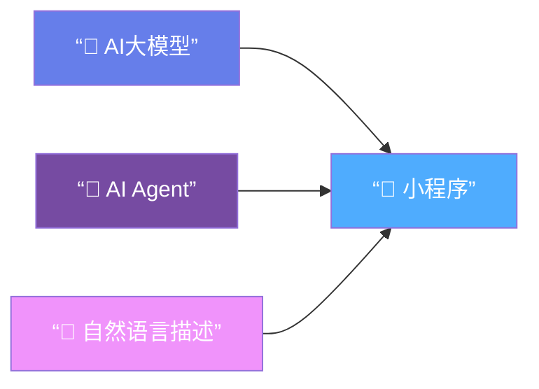
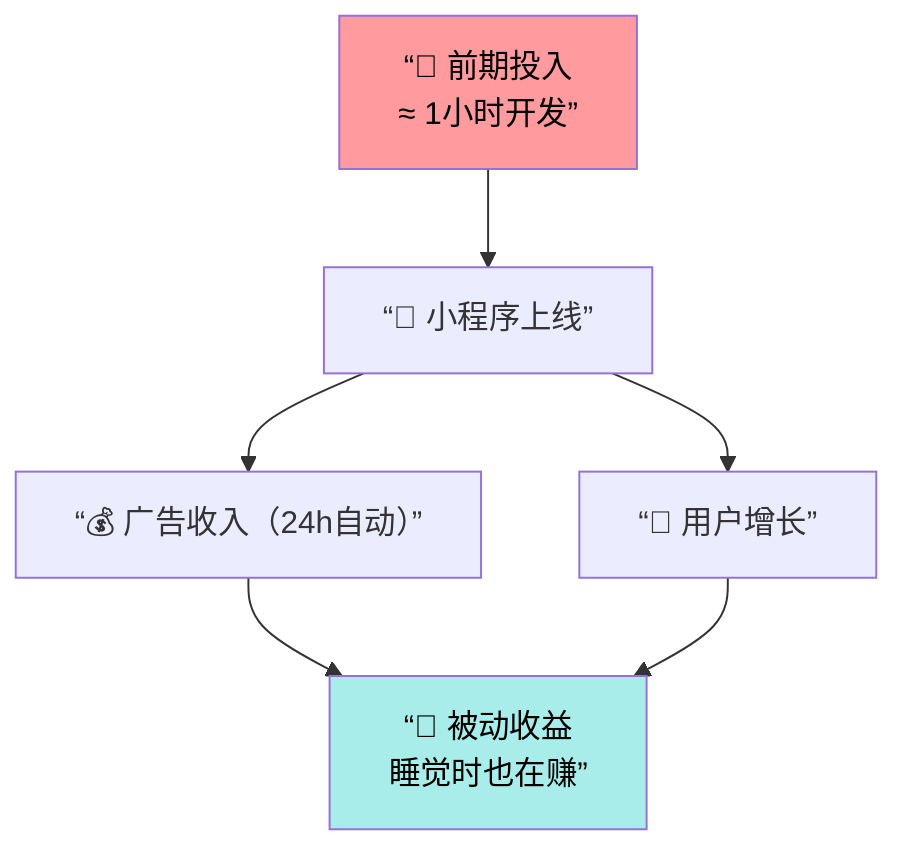
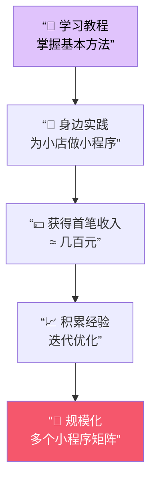
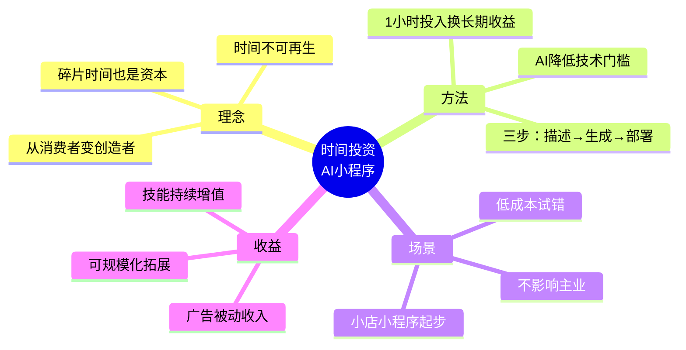
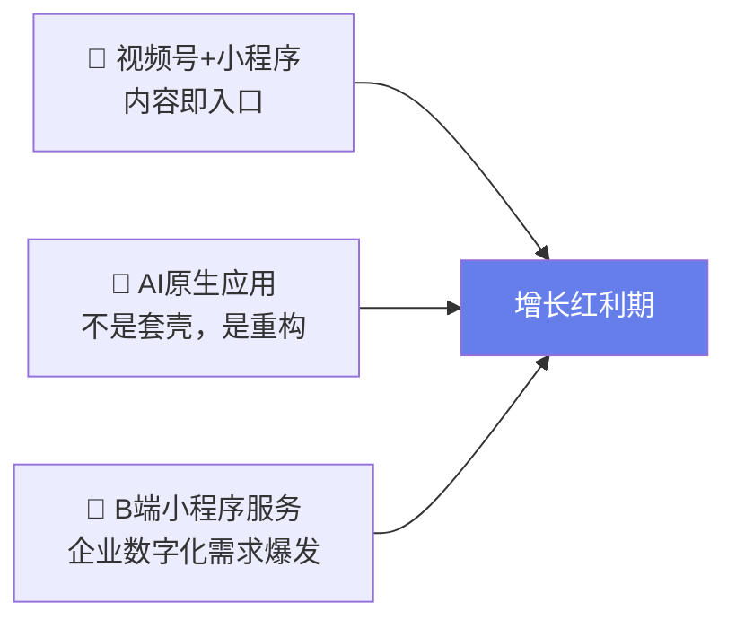

# 用AI开发小程序：普通人的时间投资指南

> [!abstract] 核心观点
> 时间是普通人最宝贵的资源。通过投资时间（而非消耗时间），利用AI技术开发小程序，即使零编程基础，也能将碎片时间转化为持续增值的被动收入资产。

---

## 一、核心理念：投资时间，而非消耗

### 时间 vs 金钱的本质差异

| 维度 | 💰 金钱 | ⏳ 时间 |
|------|---------|---------|
| 可再生性 | ✅ 可以再赚 | ❌ 逝去即永失 |
| 每日总量 | 理论上无限 | 固定24小时 |
| 有效可用时间 | — | 通常仅1~2小时碎片 |
| 投资回报 | 有风险，可能亏损 | 投入自身成长，只赚不赔 |

### 两种时间使用方式对比

| 对比项 | ❌ 消耗时间 | ✅ 投资时间 |
|--------|------------|------------|
| 典型行为 | 刷短视频、打游戏、无目的浏览 | 学习AI工具、开发小程序、积累技能 |
| 短期感受 | 即时快感、放松 | 略有挑战、需要专注 |
| 长期结果 | 个人成长 ≈ 0 | 技能↑ 资产↑ 收入↑ |
| 时间属性 | 纯支出，花完即无 | 变资本，持续增值 |

> [!tip] 思维转换
> 每天只需 **1小时碎片时间**，从”消费者”转变为”创造者”，让时间成为你的增值资本。

---

## 二、实现路径：用AI开发小程序

### 为什么现在门槛大幅降低？



> 过去：需要专业程序员 → 数月开发 → 数万元成本
> 现在：**会打字 + 清晰描述需求 = 就能做出来**

### 三步操作流程


| 步骤 | 操作 | 你需要做的 | AI帮你做的 |
|------|------|-----------|-----------|
| ① | 提出需求 | 用自然语言描述功能 | 理解你的意图 |
| ② | 生成代码 | 审核并微调 | 自动编写完整代码 |
| ③ | 复制部署 | 复制、粘贴、保存 | 提供运行指导 |

### 收益模型：时间杠杆效应



---

## 三、适用场景：低风险副业

### 副业可行性分析

| 维度 | 评估 | 说明 |
|------|------|------|
| 主业影响 | 🟢 零影响 | 利用晚上、周末碎片时间 |
| 启动资金 | 🟢 几乎为零 | AI工具 + 时间即可 |
| 技术门槛 | 🟢 极低 | 会打字、能描述需求 |
| 试错成本 | 🟢 极低 | 失败仅损失少量时间 |
| 收入天花板 | 🟡 可拓展 | 从几百元 → 持续被动收入 |

### 推荐起步路径



---

## 四、作者经历与转化

| 阶段 | 内容 |
|------|------|
| 起点 | 普通大学生，零编程基础 |
| 过程 | 通过AI工具自学，成功开发并上线小程序 |
| 成果 | 将经验整理为系统化教程（定价 **29.9元**） |
| 获取方式 | 评论区互动 → 获取试看版 |

---

## 五、总结：一张图看懂全貌



---

## 六、正在发生的真实案例

### 案例矩阵：从国内到海外

| 案例 | 背景 | AI工具 | 成果 | 核心启示 |
|------|------|--------|------|----------|
| 🇨🇳 **工具类小程序矩阵** | 个人开发者，白天上班 | Cursor + 通义千问 | 业余时间开发5个工具小程序，广告月入 **8000~15000元** | 不追爆款，追数量密度 |
| 🇨🇳 **AI头像/文案助手** | 大学生，零编程基础 | Claude + 微信小程序 | 上线3个月，日均UV 2000+，会员订阅月入 **5000~10000元** | 抓住"美"和"懒"的刚需 |
| 🇨🇳 **本地小店点单系统** | 副业开发者，周末接单 | AI生成代码 + 手动微调 | 每家收费300~800元，服务20+家店铺，累计收入 **1万+** | 线下市场蓝海，信任>技术 |
| 🌍 **Pieter Levels（Levelsio）** | 独立开发者鼻祖 | AI辅助全栈开发 | PhotoAI/NomadList等产品，单人年收入 **$2M+** | 一个人 = 一家公司的范式标杆 |
| 🌍 **AI Wrapper 独立开发者群体** | 全球Indie Hacker | Cursor / v0 / Bolt | 大量开发者48小时内上线产品，MRR从$0到$10K+ **仅用数周** | AI将"想法→产品"周期从月压缩到天 |

### 三个值得关注的趋势（2025~2026）



| 趋势 | 现状 | 机会窗口 |
|------|------|----------|
| 视频号+小程序联动 | 微信生态内闭环，流量扶持中 | 🟢 **当前最佳**——类似2019年的抖音 |
| AI原生小程序 | 不是"旧功能+AI"，而是用AI重新定义交互 | 🟢 技术红利期，先行者优势明显 |
| B端小程序定制 | 中小企业数字化刚起步，愿付费 | 🟡 需要销售能力，但客单价高 |

---

## 七、终极思考问答：全文深度总结

> [!faq]- ❓ Q1：这篇文章本质上在说什么？
> **表面**是教你用AI做小程序赚钱。
> **本质**是在讨论一个更深层的命题——**普通人如何夺回对自己时间的定价权。**
> 当你的时间只能"卖"一次（打工），你是被动的；当你的时间能被"复制"无限次（产品化），你就自由了。AI只是让这个转化门槛降到了历史最低点。

> [!faq]- ❓ Q2：为什么说"投资时间"比"投资金钱"更重要？
> 因为金钱的边际效用递减，而时间的边际效用**可以递增**——
> 你今天花1小时学会用AI，明天用AI花1小时做出产品，后天产品自己跑……
> 这就是**复利效应**。时间投资的核心不是"省时间"，而是让每一单位时间的产出**指数级增长**。
> > 💡 公式：**时间价值 = 可复用性 × 杠杆率**。写代码给AI帮你写，复用性↑；小程序24小时运行，杠杆率↑。

> [!faq]- ❓ Q3：AI真的能让"零基础"的人也能开发吗？门槛降低的边界在哪？
> **能，但有边界。**
> - ✅ AI已解决的：代码编写、UI生成、Bug修复、文档撰写
> - ❌ AI尚未解决的：**需求判断、用户洞察、商业嗅觉、持续运营**
> 真正稀缺的不再是"会写代码"，而是**"知道该写什么"**。技术门槛降低了，但认知门槛没变——甚至更重要了。
> > 💡 未来竞争力排序：**审美 > 产品感 > 提问能力 > 编程能力**

> [!faq]- ❓ Q4：被动收入真的是"睡后收入"那么美好吗？
> **不完全是。** 需要拆开看——
>
> | 阶段 | 真实状态 | 时间线 |
> |------|---------|--------|
> | 冷启动 | 几乎没有收入，不断调试 | 1~4周 |
> | 增长期 | 小额收入，需持续优化 | 1~3个月 |
> | 稳定期 | 被动收入逐渐覆盖维护成本 | 3~6个月 |
> | 规模期 | 多产品矩阵，真正的睡后收入 | 6个月+ |
>
> 所谓"被动"，是**前期极度主动**换来的。没有任何被动收入不需要第一推动力。
> > 💡 更准确的表述：**"先主动到极致，再被动到极致。"**

> [!faq]- ❓ Q5：如果今天只能做一件事来开始，应该做什么？
> **不要先学技术，先去找一个"痛点"。**
>
> ```mermaid
> flowchart TD
>     A["🔍 观察身边人的抱怨\n'这个好麻烦''要是有个XX就好了'"] --> B["💡 记录3个以上痛点"]
>     B --> C["🤖 用AI验证：能不能做一个小程序解决它？"]
>     C --> D{"能解决？"}
>     D -->|是| E["🚀 48小时内做出MVP"]
>     D -->|否| A
>     E --> F["📢 让10个人试用"]
>     F --> G{"有人用？"}
>     G -->|是| H["📈 迭代优化，上线运营"]
>     G -->|否| A
> ```
> 记住：**先验证需求，再投入时间。** 失败的成本应该只是"一个晚上"，而不是"三个月"。

> [!faq]- ❓ Q6：站在更高维度看，这件事意味着什么？
> 我们正经历一场**"创造力平权"运动**——
>
> | 时代 | 谁能创造？ | 创造的工具 | 创造的结果 |
> |------|-----------|-----------|-----------|
> | 农业时代 | 极少数工匠 | 手工 | 稀缺品 |
> | 工业时代 | 有资本的人 | 机器+工人 | 标准化商品 |
> | 互联网时代 | 有技术的人 | 代码 | 软件产品 |
> | **AI时代（现在）** | **任何人** | **自然语言** | **一切** |
>
> 当"会说话"就等于"会编程"，创造的权力从精英手中分散到了每一个普通人。
> **这不是一个副业教程，这是一个时代的入场券。**
> > 💡 终极问题不是"我要不要做"，而是——**"5年后回头看，我有没有后悔今天没有开始？"**

---

## 八、一句话总结

> [!success] 🧭 全文精华
> **用最便宜的成本（时间×AI），去做一件可以无限复制的事（产品化），
> 然后把"一次投入"变成"持续回报"——这就是普通人能抓住的最好的时代红利。**