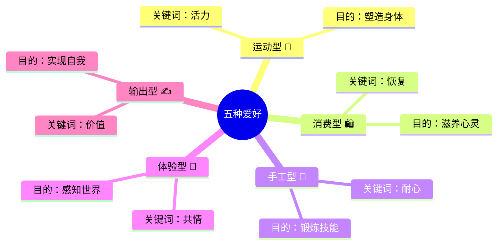
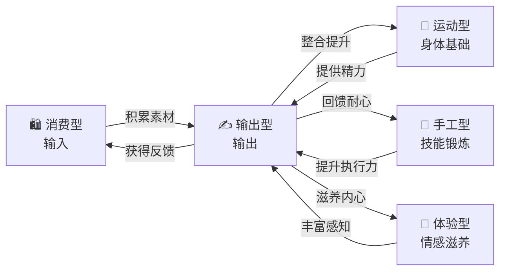
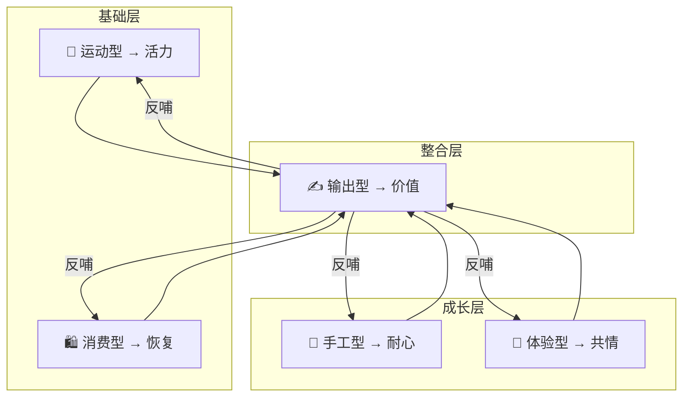

# 一个人应该建立的五种爱好

> [!quote] 核心观点
> 爱好不是简单的娱乐，而是**有明确目的的活动**，帮助我们在身体、心智和情感上得到锻炼与成长。

## 逻辑记忆框架

> [!tip] 记忆口诀：**"运消手工，体输"** → 谐音：**"运行消遣，手输体系"**
> 想象你**运行**一套**消遣**系统，用手**输**出一个完整的**体系**。

## 总览表

| 爱好类型 | 核心关键词 | 代表活动 | 主要目的 | 作用维度 |
|:---:|:---:|---|---|:---:|
| 🏃 运动型 | **活力** | 爬山、徒步、跑步、羽毛球 | 塑造健康与精力 | 身体 |
| 🛍️ 消费型 | **恢复** | 购物、抓娃娃、喝奶茶、盲盒 | 从疲惫中恢复精神 | 情绪 |
| 🧩 手工型 | **耐心** | 做饭、化妆、画画、拼乐高、搓麻将 | 锻炼耐心与自律 | 技能 |
| 🌸 体验型 | **共情** | 养花、书法、cosplay、养宠物 | 培养感知与共情 | 情感 |
| ✍️ 输出型 | **价值** | 讲课、写文章、拍视频 | 整合碎片，输出价值 | 心智 |

---

## 一、运动型爱好 🏃 — 塑造健康与活力

**核心活动：** 爬山、徒步、跑步、打羽毛球等持续的身体运动。

**主要益处：**
- 保持身体健康，精力充沛
- 开阔视野，接触大自然
- 扩大世界观，减少内心的烦恼

> [!note] 一句话记忆
> **运动 = 给身体充电** — 身体有活力，世界才更大。

---

## 二、消费型爱好 🛍️ — 体验"无用之用"

**核心活动：** 购物、抓娃娃、喝奶茶、抽盲盒等看似"无用"的日常消费行为。

**主要益处：**
- 这些活动是"**救命的**"，帮助人从工作和学习的疲惫中恢复
- 体现"**无用之用**"的哲学 — 看似没有价值的事情，实则是支撑精神的重要力量

> [!note] 一句话记忆
> **消费 = 给情绪松绑** — 允许自己"浪费"，才能持续前行。

---

## 三、手工型爱好 🧩 — 锻炼耐心与技能

**核心活动：** 做饭、化妆、画画、拼乐高、搓麻将等需要动手完成的事情。

**主要益处：**
- **做饭是最重要的** — 体现一个人是否具备耐心、责任和自律
- 做好一顿饭需要**统筹规划、管理时间**，全面锻炼个人能力

> [!note] 一句话记忆
> **手工 = 给大脑练兵** — 双手在动，能力在长。

---

## 四、体验型爱好 🌸 — 培养共情与感知

**核心活动：** 养花、书法、cosplay、养小动物等沉浸式体验。

**主要益处：**
- 养花能提醒人**开窗透气、多接触阳光**，从而改善心情
- 这种爱好是一种"**交换**" — 在照顾花草的同时，也是在照顾自己的内心

> [!note] 一句话记忆
> **体验 = 给心灵开窗** — 照顾外物，即照顾自己。

---

## 五、输出型爱好 ✍️ — 实现自我价值

**核心活动：** 讲课、写文章、拍视频等（与消费型相反，是输出而非输入）。

**主要益处：**
- 将头脑中的**碎片化想法整合**并进行输出，提升综合实力
- 从单纯的**知识输入**转变为**有价值的内容输出**

> [!note] 一句话记忆
> **输出 = 给思想出口** — 输入是积累，输出才是成长。

---

## 输入与输出的闭环

> [!summary] 核心洞察
> 五种爱好构成一个**完整的成长闭环**：
> - **运动**提供身体基础，**消费**提供情绪恢复
> - **手工**锻炼执行能力，**体验**丰富内心感知
> - **输出**将一切整合，实现从"吸收"到"创造"的飞跃

---

## 2026 实时案例

> [!info] 说明
> 以下案例均为当下真实发生的现象，帮助你将理论与现实连接，加深记忆。

### 🏃 运动型 — 当下案例

| 案例 | 关键洞察 |
|---|---|
| **City Walk 持续升温** → 2026年各大城市涌现大量"城市徒步路线"，年轻人用脚步丈量城市 | 运动不一定是高强度，**行走本身就是力量** |
| **AI 健身教练普及** → Keep、Apple Fitness 等用 AI 实时纠正动作，居家运动体验飞跃 | 科技降低运动门槛，**关键是你愿不愿意动** |
| **2026 世界杯年效应** → 全球足球热情高涨，带动跑步、踢球等运动参与率飙升 | 大事件是天然的**运动启动器** |

> [!example] 代表人物
> **何同学** — 在高强度创作之余坚持跑步，公开分享"跑步是我最重要的思考时间"，印证了运动对创造力的正反馈。

---

### 🛍️ 消费型 — 当下案例

| 案例 | 关键洞察 |
|---|---|
| **泡泡玛特全球化爆发** → 2026年海外门店排队成常态，LABUBU成为全球顶流IP | "无用"的玩具承载了**巨大的情感价值** |
| **谷子经济（Goods）席卷Z世代** → 买吧唧、收集周边成为年轻人的"精神补给站" | 消费型爱好的本质是**给自己一个开心的理由** |
| **奶茶出海与文化输出** → 霸王茶姬、喜茶在全球扩张，"喝一杯"成为仪式感的象征 | 小消费里有**大仪式感** |

> [!example] 现象观察
> **"多巴胺消费"** 成为2026年热词 — 人们不再为功能买单，而是为**一瞬间的快乐**买单。这正是"无用之用"的最佳注脚。

---

### 🧩 手工型 — 当下案例

| 案例 | 关键洞察 |
|---|---|
| **预制菜反思潮** → 2026年越来越多年轻人拒绝预制菜，回归自己做饭，"做饭博主"持续霸榜 | 做饭不只是技能，更是**对生活的掌控感** |
| **乐高联名文化** → 乐高×漫威、乐高×故宫等联名款持续火爆，成年人拼乐高成为解压方式 | 手工爱好不分年龄，**动手即冥想** |
| **陶艺/手工皮具体验店爆发** → 周末去手作工坊成为都市人新社交方式 | 手工型爱好正在替代**传统聚餐**成为社交新载体 |

> [!example] 代表现象
> **"下班做饭疗愈"** 在小红书成为热门标签 — 年轻人分享"切菜的声音、锅气升腾的瞬间，比任何冥想App都治愈"。做饭从家务升维为**精神修复仪式**。

---

### 🌸 体验型 — 当下案例

| 案例 | 关键洞察 |
|---|---|
| **宠物经济突破万亿** → 2026年中国宠物市场规模持续攀升，"毛孩子"成为年轻人的精神寄托 | 养宠物的本质是**学习无条件的爱** |
| **阳台种菜/养花热潮** → 城市公寓里的"一米花园"成为生活方式新趋势 | 照顾植物的过程，就是**练习 patience（耐心）** |
| **沉浸式戏剧/体验展走红** → 《不眠之夜》式沉浸体验在各大城市落地，观众成为故事的一部分 | 体验型爱好的核心是**从旁观者变成参与者** |

> [!example] 深度洞察
> **"电子宠物"到"真实生命"** — 2026年出现一股"反数字化"潮流：年轻人从养蛙旅行回归到养真猫真狗，从屏幕上的花回归到阳台上的绿植。**真实的触感，无法被替代。**

---

### ✍️ 输出型 — 当下案例

| 案例 | 关键洞察 |
|---|---|
| **AI辅助创作爆发** → 用AI辅助写文章、做视频、生成播客，个人创作者的产出效率提升10倍 | AI是**放大器**，但内容灵魂仍来自人的思考 |
| **播客持续井喷** → 2026年中文播客数量翻倍，普通人通过声音输出观点、建立影响力 | 输出不只是写作，**每种形式都是思想的容器** |
| **"学习vlog"成为品类** → 在B站/小红书分享学习过程本身成为一种输出，带动百万人一起学习 | 输出可以是**过程本身**，不必是完美成品 |

> [!example] 代表人物
> **罗翔** — 从法学教授到B站顶流，用"输出倒逼输入"的方式让法律知识走进千万人。他的成功印证：**输出是最高效的学习方式**。

---

## 最高级思考问答 🧠

> [!abstract] 使用方法
> 以下问答分为**三个思维层级**，建议在阅读完全部内容后，逐层思考。能回答到第三层，说明你真正内化了这套体系。

### 🔵 第一层：理解层 — 知道"是什么"

**Q1：为什么是"五种"而不是三种或十种？**

> [!hint]- 点击思考
> 五种对应人的五个核心维度：**身体、情绪、技能、情感、心智**。少了有缺口，多了有冗余。这不是随意分类，而是对**人的完整性**的精准映射。

**Q2：消费型爱好会不会让人变得更浮躁？**

> [!hint]- 点击思考
> 关键在于**"有意识地消费"** vs **"无意识地沉迷"**。喝一杯奶茶是仪式，刷三小时购物软件是逃避。区别在于：你在**主动恢复**，还是**被动麻痹**。

**Q3：五种爱好必须同时拥有吗？**

> [!hint]- 点击思考
> 不需要。不同人生阶段侧重不同。20岁可能重运动和体验，30岁可能重手工和输出。**重要的是知道自己在哪个维度缺失**，然后有意识地补充。

---

### 🟡 第二层：分析层 — 理解"为什么"

**Q4：为什么输出型被放在最高位？它真的比其他四种更重要吗？**

> [!hint]- 点击思考
> 输出型不是"更重要"，而是**整合者**。它强制你把运动中的感悟、消费中的体验、手工中的技能、体验中的共情，**全部串联成有价值的东西**。没有输出，其他四种可能永远停留在"感觉"层面，无法升维为"认知"。这就是费曼学习法的本质：**你能讲出来，才是真的懂了**。

**Q5：AI时代，哪种爱好最不会被替代？**

> [!hint]- 点击思考
> **体验型和运动型**。AI可以帮你写文章（输出）、帮你规划购物（消费）、甚至用机器人做饭（手工），但AI**无法替你跑步时的心跳**，**无法替你摸到猫咪时的温暖**。越底层、越身体性的爱好，越不可替代。

**Q6：如果一个人完全没有爱好，应该从哪种开始？**

> [!hint]- 点击思考
> **运动型**。原因很简单：它是所有爱好的**基础设施**。没有体力和精力，其他爱好都难以持续。而且运动型爱好的**启动成本最低** — 出门跑步，零门槛。一旦身体动起来，多巴胺分泌，你会自然地想要探索其他类型。

---

### 🔴 第三层：创造层 — 思考"怎么用"

**Q7：如何用这套体系设计自己的一周？**

> [!hint]- 点击思考
>
> | 时间段 | 爱好类型 | 具体安排示例 |
> |---|---|---|
> | 工作日早晨 | 🏃 运动型 | 跑步30分钟 / 跳绳 |
> | 工作日午休 | 🛍️ 消费型 | 逛10分钟有趣的小店 / 一杯奶茶 |
> | 工作日晚间 | 🧩 手工型 | 做一顿晚饭 / 拼30分钟乐高 |
> | 周末上午 | 🌸 体验型 | 浇花、遛狗、逛展 |
> | 周末下午 | ✍️ 输出型 | 写一篇周记 / 录一段播客 |
>
> **核心原则**：不需要每天五种都覆盖，但**一周内至少触达3种以上**。

**Q8：五种爱好之间如何产生"复利效应"？**

> [!hint]- 点击思考
> 最高级的玩法是让爱好**互相喂养**：
> - 跑步时观察城市 → 成为**写作素材**（运动 → 输出）
> - 做饭的过程拍成视频 → 变成**内容作品**（手工 → 输出）
> - 养花的心情写成日记 → 变成**情感表达**（体验 → 输出）
> - 购物的审美训练 → 提升**做饭摆盘**的品味（消费 → 手工）
>
> 当五种爱好开始**互相连接**，你就不再是"做五件事"，而是在构建一个**自我增强的成长飞轮**。

**Q9（终极之问）：爱好的终极目的是什么？**

> [!hint]- 点击思考
> 不是"变得更好"，而是**"变得完整"**。
>
> 现代社会要求我们高效、专业、聚焦 — 这让我们变成了一个个**碎片**。而五种爱好的意义，是把碎片重新拼回一个**完整的人**：
> - 身体在运动中存在 🏃
> - 情绪在消费中被看见 🛍️
> - 双手在创造中确认能力 🧩
> - 心灵在体验中感受温度 🌸
> - 思想在输出中找到意义 ✍️
>
> **爱好不是生活的点缀，而是你之所以为你的证据。**

---

## 全文总结

| 维度 | 一句话总结 | 2026关键案例 |
|---|---|---|
| 🏃 运动型 | 身体是一切的基础 | City Walk、AI健身、世界杯 |
| 🛍️ 消费型 | 允许自己"无用" | 泡泡玛特、谷子经济、多巴胺消费 |
| 🧩 手工型 | 双手在动，能力在长 | 预制菜反思、手作工坊、做饭疗愈 |
| 🌸 体验型 | 照顾外物即照顾自己 | 宠物经济万亿、阳台花园、沉浸体验 |
| ✍️ 输出型 | 输出是最高效的学习 | AI创作、播客井喷、学习vlog |

> [!success] 带走三句话
> 1. **爱好不是消遣，是自我的基础设施。**
> 2. **五种爱好，五个维度，拼出一个完整的你。**
> 3. **输出是闭环的钥匙 — 当你开始创造，一切经历都有了意义。**
