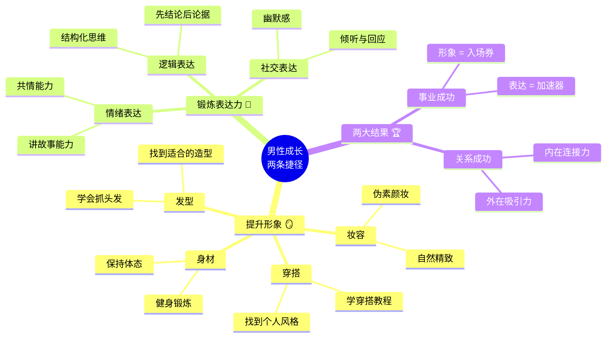
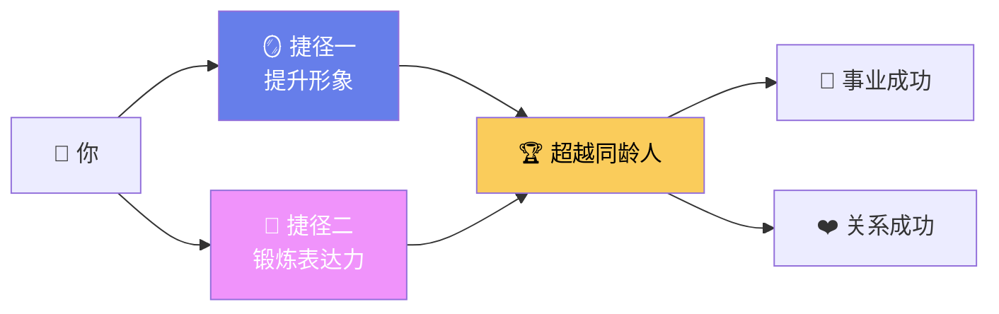
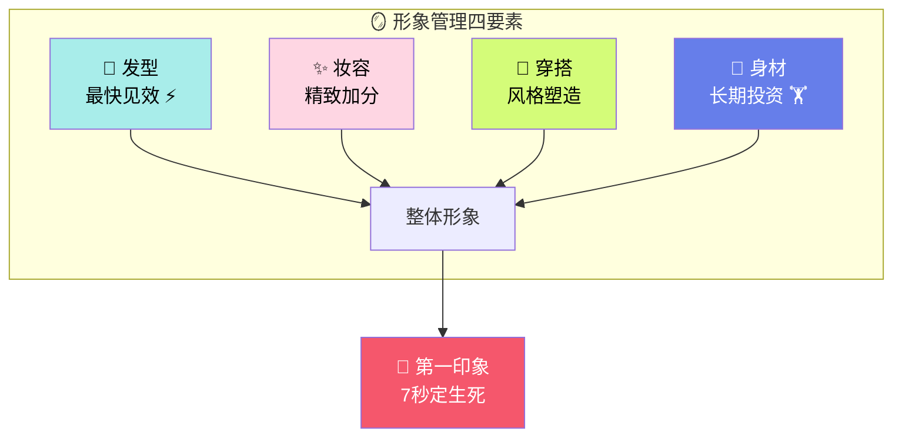
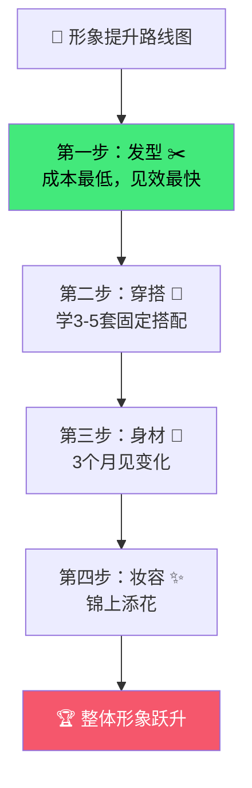
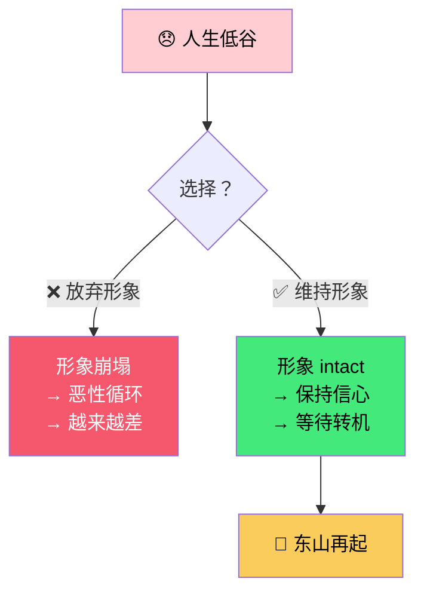
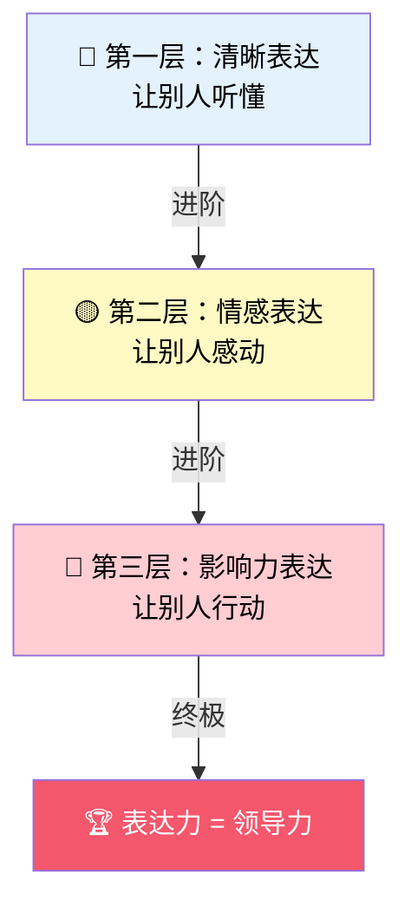
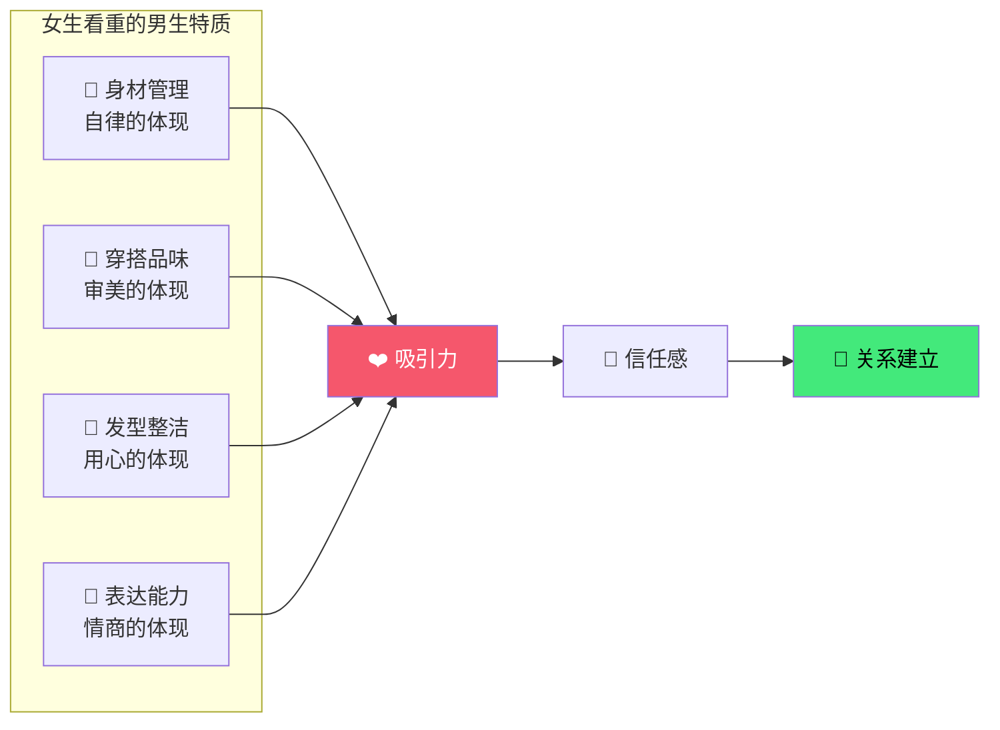
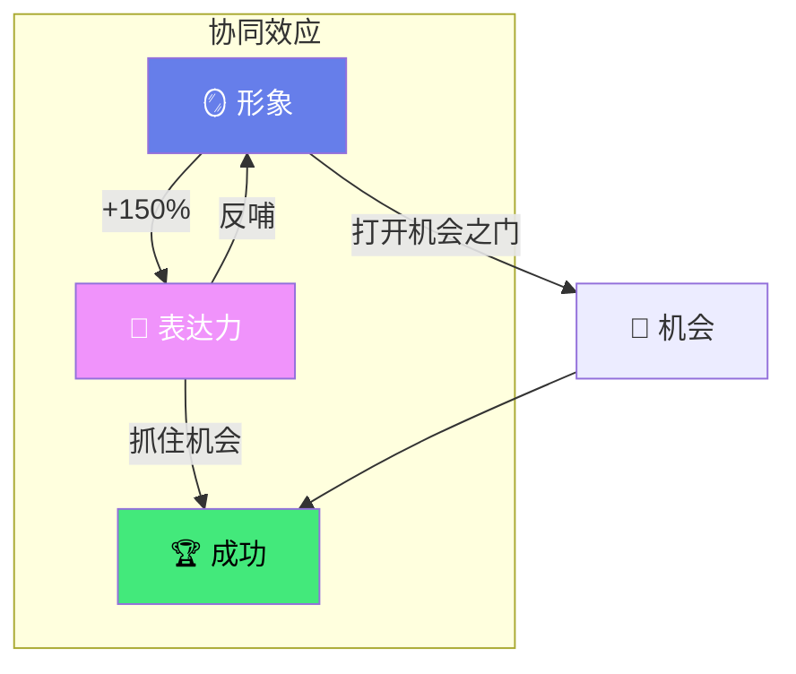
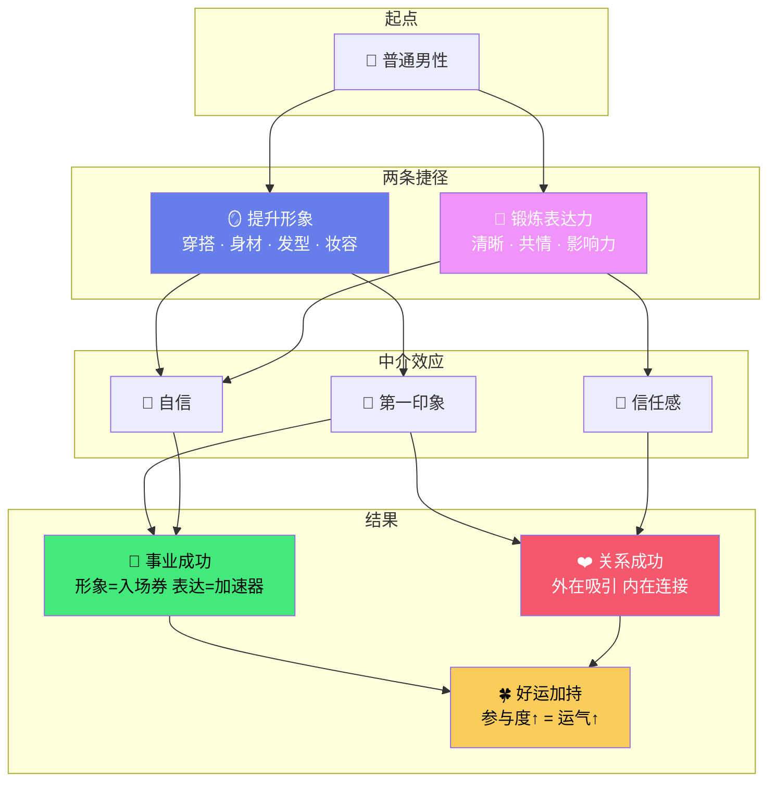

# 男性成长的两条捷径：形象 × 表达力

> [!abstract] 核心观点
> 男性人生最高效的"捷径"，就是拼尽全力做好两件事：**提升形象**和**锻炼表达力**。这两件事的成本极低，但回报极高——它们决定了别人是否愿意给你一次机会。

---

## 逻辑记忆框架



> [!tip] 记忆口诀：**"形表"** → 谐音：**"行表"**
> 想象一块**行**走的手**表**——形象是你的表面（表盘），表达力是你的走时（内在机芯）。两者兼备，人生才能**准时到达**。

---

## 总览表

| 维度 | 🪞 提升形象 | 🎤 锻炼表达力 |
|:---:|:---:|:---:|
| **核心关键词** | **外在吸引力** | **内在影响力** |
| **投入门槛** | 低（学习+自律） | 低（练习+反思） |
| **见效周期** | 1~3个月 | 3~6个月 |
| **影响范围** | 第一印象、社交、恋爱 | 职场晋升、人脉、领导力 |
| **共同作用** | 🏆 让你被看见 | 🏆 让你被记住 |

---

## 一、人生的两条捷径

视频开篇提出，男性人生的捷径在于拼尽全力做好两件事：**提升形象**和**锻炼表达力**。



> [!note] 底层逻辑
> 当今社会，人们普遍**"先敬罗衣后敬人"**。形象决定了别人是否愿意了解你，表达力决定了别人是否愿意追随你。

---

## 二、如何提升形象

### 形象管理四要素

| 要素 | 具体方法 | 投入程度 | 见效速度 | 影响力 |
|:---:|---|:---:|:---:|:---:|
| 👔 **穿搭** | 学习穿搭教程，挑选合适衣服，建立个人风格 | ⭐⭐ | 🟢 快 | ⭐⭐⭐⭐ |
| 💪 **身材** | 健身锻炼，保持健康体态 | ⭐⭐⭐ | 🟡 中 | ⭐⭐⭐⭐⭐ |
| 💇 **发型** | 学会抓头发，找到适合的造型 | ⭐ | 🟢 快 | ⭐⭐⭐ |
| ✨ **妆容** | 伪素颜妆，自然精致的修饰 | ⭐⭐ | 🟢 快 | ⭐⭐⭐ |



### 形象提升的优先级建议



> [!tip] 实用建议
> 如果精力有限，**优先做发型和穿搭**——这两项投入最少、见效最快，能在1~2周内带来明显变化。

---

## 三、形象是事业的基础

视频认为，虽然事业很重要，但没有一个好的形象，别人根本不想了解你的事业。


| 阶段 | 没有形象管理 | 有形象管理 | 差距 |
|------|------------|------------|:---:|
| 初次见面 | 被忽略，无存在感 | 被注意，留下好印象 | 🔥 天壤之别 |
| 职场社交 | 能力被低估 | 能力被高估 | 📈 2~3倍 |
| 商业谈判 | 不被信任 | 天然信任感 | 💰 直接影响成交 |
| 日常运气 | 机会绕道而行 | 机会主动靠近 | 🍀 参与度↑ = 运气↑ |

> [!quote] 核心洞察
> **形象是社会参与度的体现。参与度高，运气就会更好。** 不是你不够优秀，而是别人根本没给你展示优秀的机会。

---

## 四、南怀瑾的故事：困境中的形象管理

视频引用了南怀瑾儿子的采访，指出南怀瑾本人非常在意自己的形象，尤其是在**倒霉的时候**，认为这是翻身的关键。



> [!quote] 南怀瑾的智慧
> **越是倒霉的时候，越要在意自己的形象。**
> 因为形象不仅是他人的印象，更是**自己对自己的态度**。当你在最低谷依然保持体面，你就保留了翻身的种子。

| 情境 | 普通人的反应 | 南怀瑾的做法 | 结果差异 |
|------|------------|------------|:---:|
| 失业 | 蓬头垢面，自我放弃 | 依然整洁，保持气场 | 更快找到新机会 |
| 创业失败 | 不修边幅，消极社交 | 维持形象，积极面对 | 更容易获得投资 |
| 感情受挫 | 自暴自弃 | 保持状态 | 更快走出阴影 |

---

## 五、表达力的力量

> [!note] 视频补充
> 表达力是第二条捷径，它决定了你能否将自己的价值**传递**给他人。形象让人愿意靠近你，表达力让人愿意追随你。

### 表达力三层次



| 层次 | 核心能力 | 典型表现 | 适用场景 |
|:---:|---|---|---|
| 🔵 **清晰表达** | 逻辑清晰、条理分明 | 先结论后论据，结构化表达 | 工作汇报、技术沟通 |
| 🟡 **情感表达** | 共情、讲故事 | 用故事打动人，制造情感共鸣 | 演讲、社交、恋爱 |
| 🔴 **影响力表达** | 说服、激励 | 让人愿意追随、行动 | 领导力、谈判、销售 |

---

## 六、两性关系中的形象吸引力

在恋爱和相亲中，女生更看重男生的**外貌和身材**，而不是金钱。一个干净、帅气的形象比任何财富都更能赢得女性的青睐。



| 吸引因素 | 权重 | 可控性 | 投入产出比 |
|:---:|:---:|:---:|:---:|
| 💪 身材 | ⭐⭐⭐⭐⭐ | ✅ 高度可控 | 📈 极高 |
| 👔 穿搭 | ⭐⭐⭐⭐ | ✅ 高度可控 | 📈 极高 |
| 💇 发型 | ⭐⭐⭐ | ✅ 高度可控 | 📈 高 |
| 🎤 幽默感/表达 | ⭐⭐⭐⭐ | 🟡 需要练习 | 📈 高 |
| 💰 金钱 | ⭐⭐ | ❌ 短期难改变 | 📉 低（初期） |

> [!tip] 核心洞察
> 形象管理是一种**"低成本、高回报"**的投资——你不需要成为模特，只需要比周围人**好一点点**，就能在人群中脱颖而出。

---

## 七、形象 × 表达力：协同效应



| 组合 | 形象差 + 表达差 | 形象好 + 表达差 | 形象差 + 表达好 | 形象好 + 表达好 |
|:---:|:---:|:---:|:---:|:---:|
| 第一印象 | ❌ 被忽视 | ✅ 被注意 | 🟡 有争议 | 🏆 被惊艳 |
| 深入接触 | ❌ 失望 | ❌ 可惜 | ✅ 反转 | 🏆 持续惊艳 |
| 长期发展 | 🔻 下降通道 | ➡️ 停滞 | 📈 上升通道 | 🚀 指数增长 |

> [!success] 最优策略
> **先提升形象（见效快），再修炼表达力（持续精进）。** 形象是"入场券"，表达力是"加速器"——两者缺一不可，但形象是第一步。

---

## 八、终极思考问答：全文深度总结

> [!faq]- ❓ Q1：为什么是"形象"和"表达力"这两件事？
> 因为这两件事分别对应了人际交往的**两个关键阶段**：
> - **形象** → 决定别人是否**注意到你**（0→1）
> - **表达力** → 决定别人是否**记住你、追随你**（1→100）
> 一个解决"被看见"的问题，一个解决"被认可"的问题。其他捷径（如金钱、人脉）门槛太高，而这两件事**几乎零成本启动**。

> [!faq]- ❓ Q2："先敬罗衣后敬人"是不是一种肤浅的社会现象？
> **不是肤浅，是人类的高效筛选机制。**
> 
> | 视角 | 解读 |
> |------|------|
> | 批判视角 | "以貌取人"不对，应该看内在 |
> | 现实视角 | 7秒内形成第一印象，这是进化决定的 |
> | 策略视角 | 既然规则如此，**利用规则**比抱怨规则更明智 |
>
> 💡 形象不是伪装，而是**你对自己的尊重**的外在体现。

> [!faq]- ❓ Q3：南怀瑾"越倒霉越要注意形象"的智慧，本质是什么？
> 本质是**"信号理论"**——
> 当你在低谷依然保持体面，你向外界传递了一个强烈信号：**"我没有被打倒"**。
> 这个信号会带来：
> - 他人的信任（"他看起来还有能力"）
> - 自己的信心（"我还保持着标准"）
> - 机会的靠近（"这个人值得帮助"）
>
> > 💡 **形象不是给别人看的，是给自己"撑住"的。**

> [!faq]- ❓ Q4：形象管理和"虚荣"有什么区别？
> | 维度 | 虚荣 | 形象管理 |
> |------|------|---------|
> | 目的 | 炫耀、攀比 | 尊重自己、尊重他人 |
> | 投入 | 超出能力的消费 | 合理范围内的优化 |
> | 内在状态 | 焦虑、不安全感 | 自信、从容 |
> | 可持续性 | ❌ 不可持续 | ✅ 可持续的生活方式 |
>
> 💡 **虚荣是向外证明，形象管理是向内建设。**

> [!faq]- ❓ Q5：如果只能做一件事来开始改变，应该做什么？
> **去剪一个好的发型。**
>
> ```mermaid
> flowchart TD
>     A["✂️ 剪一个好的发型"] -->|"成本"| B["30~100元"]
>     A -->|"时间"| C["1~2小时"]
>     A -->|"见效"| D["即时"]
>     A -->|"影响"| E["每天照镜子都在提醒你<br/>你值得更好"]
>     E --> F["💪 开始健身"]
>     F --> G["👔 学习穿搭"]
>     G --> H["🎤 练习表达"]
>     H --> I["🏆 整体蜕变"]
>
>     style A fill:#43e97b,color:#000
>     style I fill:#f5576c,color:#fff
> ```
>
> 记住：**改变从最小、最快见效的行动开始。** 一个发型，就是你蜕变的起点。

> [!faq]- ❓ Q6：站在更高维度看，这件事意味着什么？
> 形象和表达力，本质上是**"自我管理能力"**的外化。
>
> | 层面 | 本质 |
> |------|------|
> | 身体层 | 自律——我能管理自己的身体 |
> | 认知层 | 学习——我能提升自己的表达 |
> | 社交层 | 尊重——我对自己负责，也对他人负责 |
> | 哲学层 | 存在——我选择以最好的状态**存在于这个世界** |
>
> > 💡 这不是关于"外表"的讨论，这是关于**一个人是否认真对待自己的人生**的讨论。

---

## 九、一张图总结全文



---

## 十、一句话总结

> [!success] 🧭 全文精华
> **形象是入场券，表达力是加速器。**
> 在这个"先敬罗衣后敬人"的世界里，拼尽全力做好这两件事——
> 不需要天赋，不需要金钱，只需要**对自己认真一点**。
> 这就是男性成长最快的捷径。
