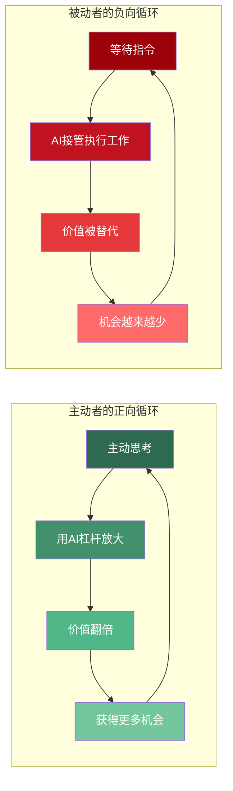
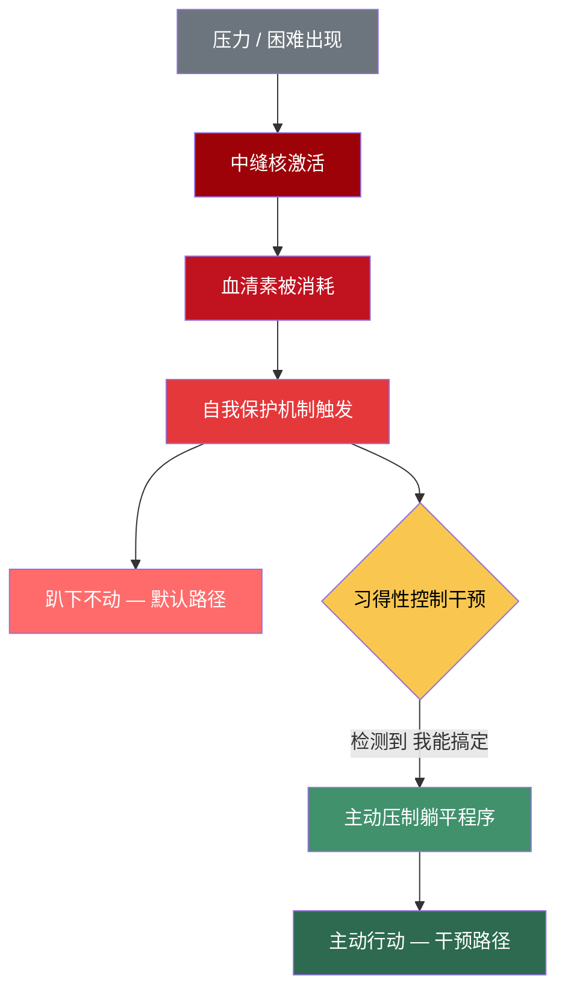
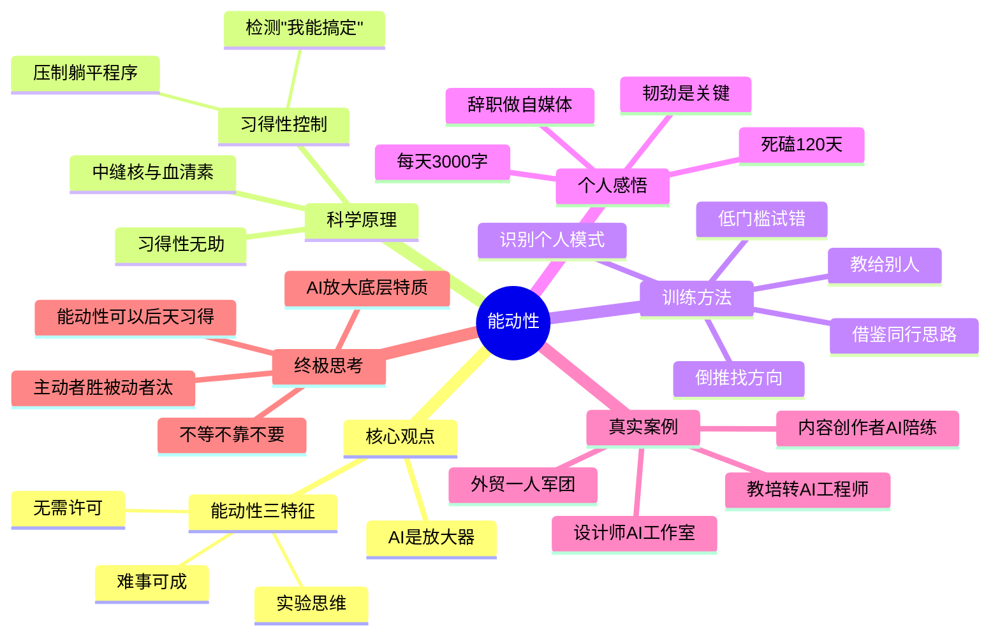

# AI时代的生存技能：能动性

> 在AI时代，真正决定个体命运的不是技术能力，而是**能动性**——一种无需许可、主动出击、把失败当数据的人格特质。AI是放大器，它会放大你的底层特质：被动者被替代，主动者被赋能。

这个视频介绍了AI时代背景下，个人生存和赚钱的核心技能——能动性。视频引用了油管博主Dankoe的观点，指出AI是放大器，会放大个体的底层特质。内容详细阐述了如何通过神经科学和心理学实验理解"被动"是大脑的出厂设置，并提供了一套完整的、可落地的训练方法，帮助观众从被动转向主动，在AI时代抓住机会。

---

## 一、核心观点：AI时代的生存法则

**颠覆认知**：AI时代最重要的能力并非技术，而是人的**能动性**。

**AI角色**：AI是**放大器**，而非淘汰器。它会接管所有"等待执行"的工作，放大并替代被动者的价值，同时也会放大主动思考者的能力，使其价值翻倍。

**能动性定义**：Dankoe给出了三个特征：

1. 无需他人许可直接去干
2. 把生活视作一场大型实验，失败是"实验数据"
3. 坚信难事可成，不随波逐流

> [!quote] 核心洞察
> AI是放大器，而非淘汰器。它不会淘汰人，但会淘汰**被动的人**。

### AI放大器效应



### 被动者 vs 主动者对比

| 维度     | 被动者      | 主动者      |
| ------ | -------- | -------- |
| 面对AI态度 | 恐惧被替代    | 视为杠杆工具   |
| 遇到困难   | 等待他人指示   | 主动寻找解决方案 |
| 失败认知   | 证明自己不行   | 收集实验数据   |
| 成长方式   | 学习现成技巧   | 构建个人方法论  |
| 最终结果   | 被AI放大并替代 | 被AI放大并赋能 |

---

## 二、科学原理：为什么我们会"被动"

**习得性无助**：最初由心理学家**塞利格曼**提出，认为人会因长期失败和打击而放弃挣扎，即使有机会也不再尝试。

**核心真相**：数十年后，塞利格曼修正了自己的理论，指出**被动是大脑的出厂默认设置**。

**神经机制**：当面对压力和困难时，大脑中的"**中缝核**"会消耗**血清素**，触发自我保护机制，导致"趴下不动"的默认反应。

> [!warning] 关键认知
> 被动不是性格缺陷，而是大脑的**出厂设置**。每个人都需要刻意训练才能克服这个默认程序。

**后天习得**：我们需要练习的是"**习得性控制**"，即训练大脑在面对困难时，能够检测到"这事我能搞定"，并主动发出信号去压制躺平的默认程序。

### 习得性无助的神经机制



---

## 三、训练方法：从0到1练就能动性

Dankoe在文章最后给出了一套0基础可落地的训练方法，视频中整理为**5个步骤**：

1. **倒推找方向**：从自己"不要什么"（如不想继续当前工作、不想被人安排）倒推出一个可以移动的方向。

2. **借别人的经验成长**：学习优秀同行的**思路**，而非具体工具和技巧，避免闭门造车。

3. **低门槛试错**：不存在"完美的准备"，要先开局再优化，通过大量尝试缩小搜索范围，找到适合自己的路。

4. **识别模式**：在行动中复盘，识别自己的**高效时段**和**天然优势**，总结出独属于自己的方法论，这就是核心壁垒。

5. **把你的方法教给别人**：只有当你能将学到的方法深入浅出地讲清楚，并帮助到他人时，才算是真正掌握了该能力。

> [!tip] 核心洞察
> 训练能动性的本质不是"变得更努力"，而是**重建大脑对困难的响应模式**——从"趴下不动"变为"主动出击"。

### 训练方法一览

| 步骤 | 方法 | 核心行动 | 目标 |
|------|------|----------|------|
| 1 | 倒推找方向 | 从"不要什么"倒推方向 | 找到可移动的起点 |
| 2 | 借别人的经验成长 | 学思路而非工具 | 避免闭门造车 |
| 3 | 低门槛试错 | 先开局再优化 | 缩小搜索范围 |
| 4 | 识别模式 | 复盘高效时段与优势 | 构建个人方法论 |
| 5 | 教给别人 | 深入浅出讲清楚 | 验证真正掌握 |

---

## 四、个人感悟：从打工到自媒体的转变

视频作者分享了自己的经历，他在**2016年辞职**，从一个被动接受任务的打工者，转变为一名**自媒体创作者**。他通过每天坚持写满**3000字**，死磕了**120多天**，才最终写出第一篇爆款文章，赚到人生第一桶金。

他认为，这份**主动死磕目标的韧劲**，正是在AI时代取得成功的关键。

---



---

## 五、正在发生的真实案例（2024-2026）

> 不是故事，是**此刻正在发生的事**。以下案例印证了"能动性"并非鸡汤，而是AI时代已经被验证的生存策略。

### 案例一：独立设计师——从"怕被AI替代"到"一人AI工作室"

| 维度 | 详情 |
|------|------|
| 主角 | 28岁平面设计师，四线城市广告公司 |
| 转折触发 | 2024年初，公司引入Midjourney，老板暗示"AI能做你的活" |
| 核心动作 | 没有等公司培训，**主动**花3个月系统性吃透5款AI设计工具，研究Prompt工程 |
| 关键跃迁 | 2024年底辞职，在小红书发布"AI Before/After"对比图，接到第一批电商客户 |
| 现状 | 2025年"一人AI工作室"月入稳定**5万+**，正在搭建AI设计课程 |
| 关键洞察 | AI没有替代她——她**主动站在AI上**，替代了原来5人团队的产能 |

### 案例二：外贸业务员——从"等公司分配客户"到"AI一人军团"

| 维度 | 详情 |
|------|------|
| 主角 | 32岁传统外贸业务员，深圳 |
| 转折触发 | 2024年公司裁员，同事都在投简历，他决定**用AI自己干** |
| 核心动作 | 用ChatGPT做市场调研和产品描述，用AI翻译工具做多语言内容，用AI生成产品视频 |
| 关键跃迁 | 第一个月就拿下3个海外客户，AI辅助下产能是原来**5倍** |
| 现状 | 2025年月收入翻3倍，不再依赖任何平台，客户主动找上门 |
| 关键洞察 | 不是AI替代了外贸岗位，而是**一个有能动性的人 + AI**替代了一整个团队 |

### 案例三：35岁教培转型者——用AI辅助学习，6个月跨入AI工程领域

| 维度 | 详情 |
|------|------|
| 主角 | 35岁前教培从业者，非技术背景 |
| 转折触发 | 2023年双减后转型多次受挫，意识到"被动等机会"永远不会成功 |
| 核心动作 | 每天2小时用AI辅助学习编程，遇到不懂就问AI，**把每个困难当"实验数据"** |
| 关键跃迁 | 3个月完成第一个项目（用LangChain搭建企业知识库），6个月拿到AI应用开发offer |
| 现状 | 2025年任某AI公司应用工程师，月薪从教培的8000→**3万** |
| 关键洞察 | 学习的壁垒不在智力，在于**你是否愿意主动跨过去**。AI加速了学习，但前提是你先动起来 |

### 案例四：内容创作者——把AI当"陪练"而非"代笔"

| 维度 | 详情 |
|------|------|
| 主角 | 自媒体博主，2024年初开始用AI辅助写作 |
| 核心动作 | 用AI做头脑风暴和逻辑校验，**但坚持自己写初稿**。每篇3000字初稿让AI挑逻辑漏洞、补数据支撑、提供标题方案 |
| 关键跃迁 | 内容质量显著提升，半年内粉丝增长速度是之前的**3倍**，广告报价翻2倍 |
| 关键洞察 | 核心认知："AI是**最好的陪练**，不是代笔。你越主动打磨，自己越强；让AI代写，自己反而退化。" |

### 四大案例的共性规律

| 共性 | 设计师 | 外贸业务员 | 教培转型者 | 内容创作者 |
|------|--------|-----------|-----------|-----------|
| **面对AI态度** | 主动学习而非恐惧 | 当作杠杆而非威胁 | 当作学习加速器 | 当作陪练而非代笔 |
| **核心行动** | 系统性吃透工具 | 全流程AI化 | 每天2小时刻意学习 | AI辅助+坚持手写 |
| **失败认知** | 前3个月无收入=试错 | 第一周零询盘=数据 | 学不会=暂时没学会 | 初稿差=还有优化空间 |
| **能动性体现** | 不等公司培训 | 不等公司安排 | 不等"准备好"再转行 | 不等AI写完再发布 |

---

## 六、最高级思考问答：全文深度总结

> 以下 **8 组问答**是全文的认知压缩，层层递进。能回答这些问题，说明你真正理解了"能动性"这套思维体系。

### 🔵 第一层：理解层 —— 知道"是什么"

> [!faq]- ❓ Q1：AI时代最重要的能力为什么不是技术，而是能动性？
> **技术是工具，能动性是使用工具的驱动力。**
> 
> AI在快速降低所有技术门槛——不会编程可以用Cursor，不会设计可以用Midjourney，不会写作可以用Claude。当"会用技术"不再是壁垒时，真正的差异在于：**谁在主动发现问题、主动尝试、主动坚持**。技术可以被AI替代，但"想要去做"的主动性无法被替代。
> 
> > 🧠 **记忆锚点**：AI替代的是"怎么做"，替代不了"为什么要做"和"敢不敢去做"。

> [!faq]- ❓ Q2：为什么说"AI是放大器"而不是"淘汰器"？
> **因为AI放大的不是技能，而是人的底层特质。**
> 
> | 场景 | 被动者 | 主动者 |
> |------|--------|--------|
> | 同一段AI代码 | 复制粘贴交差 | 理解逻辑后改进优化 |
> | 同一篇AI文章 | 直接发布 | 加入个人观点和经验 |
> | 同一个AI工具 | 只会基础功能 | 探索高级用法并分享 |
> 
> 同样的AI工具，在不同人手里结果天壤之别。差别不在工具，在**使用工具的人**。
> 
> > 🧠 **记忆锚点**：AI放大的是你的**底层操作系统**——被动者被放大为"更高效的被动"，主动者被放大为"更强的主动"。

---

### 🟡 第二层：分析层 —— 理解"为什么"

> [!faq]- ❓ Q3：被动是一种性格缺陷吗？可以改变吗？
> **不是性格缺陷，是大脑的出厂设置。可以改变，但需要刻意训练。**
> 
> 塞利格曼的研究揭示了两层真相：
> 1. **第一层**（习得性无助）：长期失败让人放弃——这是后天习得的
> 2. **第二层**（更深的真相）：即使没有失败经历，大脑也**默认选择躺平**——因为中缝核在消耗血清素后触发自我保护
> 
> 好消息是：通过训练"**习得性控制**"，你可以让大脑在面对困难时检测到"这事我能搞定"，主动压制躺平程序。
> 
> > 🧠 **记忆锚点**：被动是**默认程序**，不是**命运**。你可以重新编程。

> [!faq]- ❓ Q4：为什么很多人"懂了道理"却依然改变不了？
> **因为"懂"只发生在大脑皮层，而"改变"需要重写深层的神经回路。**
> 
> ```mermaid
> graph LR
>     A[听懂道理] -->|只到皮层| B[知道但做不到]
>     C[行动中获得成功体验] -->|到达深层| D[真正改变行为]
>     
>     style A fill:#9d0208,color:#fff
>     style B fill:#c1121f,color:#fff
>     style C fill:#2d6a4f,color:#fff
>     style D fill:#40916c,color:#fff
> ```
> 
> 这也是为什么Dankoe的训练方法**第一步就是"去做"**，而不是"去学"。只有行动中的成功体验，才能让大脑真正相信"我能搞定"。
> 
> > 🧠 **记忆锚点**：改变的路径不是"学→懂→做"，而是"**做→小赢→信→持续做**"。

> [!faq]- ❓ Q5：AI时代，能动性为什么变得更加重要？
> **因为AI正在同时做两件事：降低执行门槛 + 放大主动者的优势。**
> 
> - **门槛降低** → 更多人能做 → 竞争更激烈 → 只有主动者能脱颖而出
> - **优势放大** → 主动者用AI做到10倍产出 → 被动者被AI替代 → **两极分化加剧**
> 
> 等待"准备好了"再行动的人，在AI时代会被淘汰得更快——因为AI在持续加速，窗口期越来越短。
> 
> > 🧠 **记忆锚点**：AI时代的竞争公式：**成果 = 能动性 × AI杠杆**。能动性为零，杠杆再大也是零。

---

### 🔴 第三层：创造层 —— 思考"怎么用"

> [!faq]- ❓ Q6：普通人如何开始训练能动性？最小的一步是什么？
> **从"倒推法"开始：想想你"不要什么"，然后今天就做一件小事。**
> 
> Dankoe的5步训练法，最小起步路径：
> 
> | 今天就能做 | 具体动作 |
> |-----------|---------|
> | 倒推找方向 | 写下3个"我不想要的"，反推出1个方向 |
> | 低门槛试错 | 花30分钟做一个最小尝试（写一篇、录一段、发一条） |
> | 识别模式 | 记录今天什么时候效率最高、做什么最投入 |
> 
> **不需要辞职、不需要学新技术、不需要"完美的计划"**——只需要今天比昨天多主动一步。
> 
> > 🧠 **记忆锚点**：能动性不是天赋，是**肌肉**。越练越强，不练就萎缩。

> [!faq]- ❓ Q7：面对失败时，如何从"我不行"切换到"这是数据"？
> **把"我失败了"这句话，替换成"我获得了一条数据"。**
> 
> 这不是鸡汤，是认知重构的具体技术：
> 
> | 被动者的内心对话 | 主动者的内心对话 |
> |-----------------|-----------------|
> | "我又失败了" | "排除了一种不行的方法" |
> | "我不适合做这个" | "这个方法不适合，换一个试试" |
> | "别人比我强多了" | "他的方法可以借鉴哪些？" |
> | "再等等，还没准备好" | "先开始，边做边调整" |
> 
> 视频作者的经历就是最好证明：写满3000字、死磕120天才出第一篇爆款。前119篇不是失败，是**119条数据**。
> 
> > 🧠 **记忆锚点**：失败 ≠ 你不行。失败 = **你离"行"又近了一步**。

> [!faq]- ❓ Q8：能动性的终极本质是什么？
> **不等、不靠、不要——把人生变成一场大型实验。**
> 
> - **不等**：不等"完美时机"，不等"准备好"，不等别人许可
> - **不靠**：不靠公司安排，不靠运气降临，不靠别人拉你一把
> - **不要**：不抱怨环境，不羡慕别人，不停留在"想要"的阶段
> 
> AI是放大器，它放大的是你的底层特质。你是一个**主动的人**，AI让你价值翻倍；你是一个**被动的人**，AI让你加速被淘汰。
> 
> 这个差别，不在智商，不在学历，不在年龄——在于你是否愿意**主动迈出那一步**，把生活看作一场大型实验，把每一次挫折都当作"实验数据"。
> 
> > 🧠 **记忆锚点**：一句话概括全文——**AI不会淘汰人，但会淘汰被动的人。能动性，是你唯一的护城河。**
