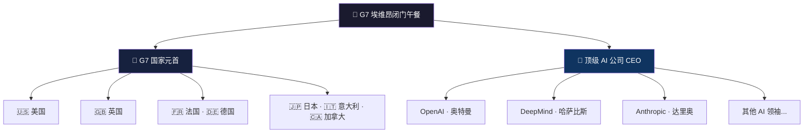
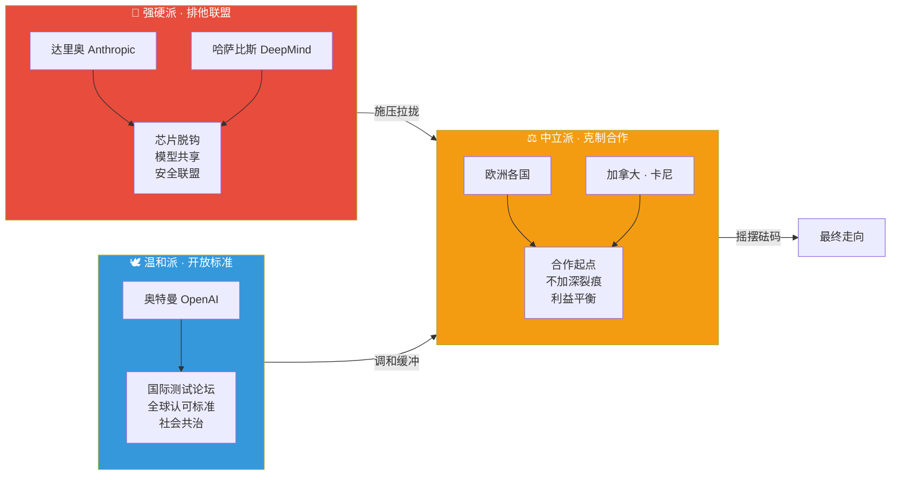
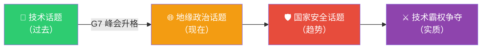
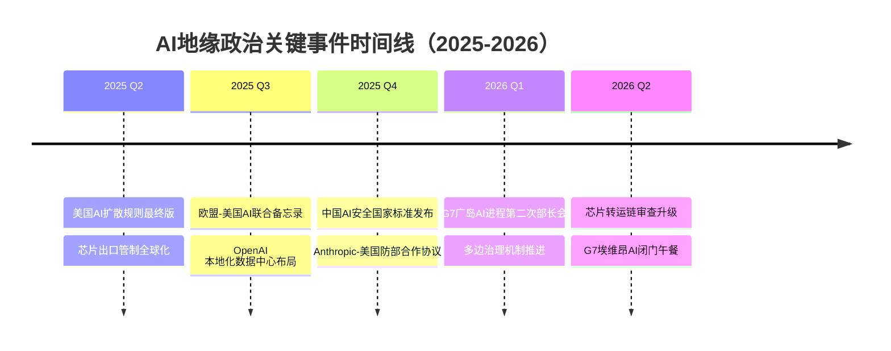
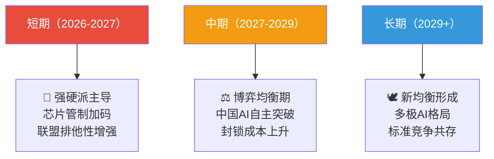
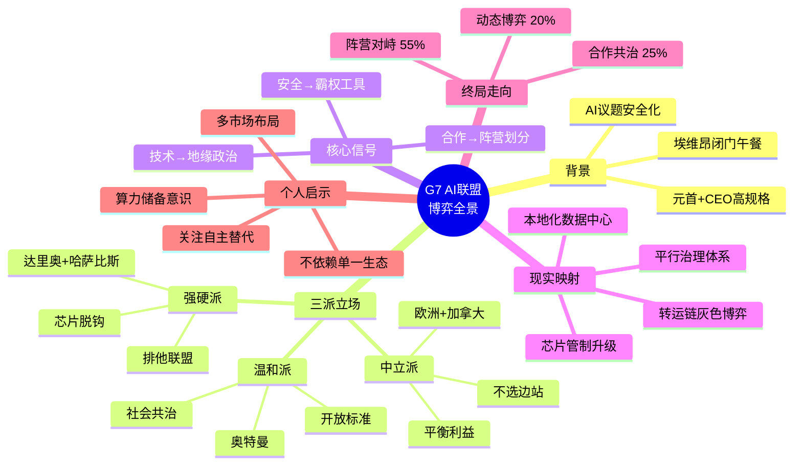

# G7"终极AI联盟"：一场披着安全外衣的技术霸权博弈

> G7在埃维昂峰会上将AI议题从技术话题正式升格为**地缘政治和国家安全话题**。表面是合作防风险，内核是争夺技术霸权——AI正在成为21世纪大国博弈的核心筹码。

---

## 一、会议背景：G7与AI午餐

| 要素 | 内容 |
|------|------|
| **会议地点** | 法国埃维昂（Évian-les-Bains），历史悠久的国际会议举办地 |
| **会议形式** | 长达2.5小时的**闭门工作午餐** |
| **核心议题** | "如何让AI安全、快速、有效地落地" |
| **参会规格** | G7国家元首 + 十余位全球顶级AI公司CEO |
| **关键人物** | OpenAI CEO 奥特曼、Google DeepMind CEO 哈萨比斯、Anthropic CEO 达里奥·阿莫迪等 |

---

## 二、三方立场全景对比

### 立场对比表

| 维度 | 🦅 强硬派（排他联盟） | 🕊️ 温和派（开放标准） | ⚖️ 中立派（克制合作） |
|------|----------------------|----------------------|----------------------|
| **代表人物** | 达里奥（Anthropic）、哈萨比斯（DeepMind） | 奥特曼（OpenAI） | 欧洲各国、加拿大总理卡尼 |
| **核心主张** | 将中国排除在AI联盟之外 | 建立国际测试论坛与全球标准 | 合作起点，不加深裂痕 |
| **对华态度** | 🚫 明确排除，芯片贸易脱钩 | 🤝 不应完全排除 | 😐 谨慎平衡 |
| **关注重点** | 芯片、模型共享、网络安全、反恐 | 民主治理、社会参与 | 经济稳定、外交平衡 |
| **本质诉求** | 技术霸权护城河 | 规则制定主导权 | 利益最大化、风险最小化 |
| **关键词** | 排他、安全、控制 | 开放、标准、民主 | 平衡、务实、过渡 |

### 三派博弈关系图

---

## 三、核心信号深度解读

### 信号本质：AI议题的范式转换

### 两层内核剖析

| 层面 | 表面主张 | 深层意图 |
|------|---------|---------|
| **防范风险（有实际价值）** | 建立测试标准、共享安全信息 | 防范AI失控、网络攻击等跨国灾难性风险 |
| **争夺霸权（隐藏内核）** | 排他性联盟、芯片贸易管控 | 将合作作为旗号，针对特定对手进行技术封锁 |

> **关键判断**：会议真正的关键信号**并非达成了某项协议**，而是AI议题已正式从技术话题转变为地缘政治工具。

---

## 四、2026年正在发生的现实案例

### 案例矩阵

| 时间 | 事件 | 对应立场 | 实质影响 |
|------|------|---------|---------|
| 2025.05 | 美国商务部发布「AI扩散规则」最终版，对全球实施三级芯片出口管制 | 🦅 强硬派 | 将AI芯片出口管制从"小院高墙"升级为全球性分级管控体系 |
| 2025.07 | 欧盟与美国签署AI联合研发备忘录，但明确保留对华合作空间 | ⚖️ 中立派 | 跨大西洋AI合作框架初步成型，但欧盟保留战略自主 |
| 2025.09 | OpenAI 宣布在日本、欧洲设立本地化推理数据中心 | 🕊️ 温和派 | 以基础设施本地化替代完全封锁，走"技术在地化"路线 |
| 2025.12 | 中国发布《生成式AI服务安全规范》国家标准，建立自主安全评估体系 | 🔴 对手回应 | 形成与西方平行的AI治理体系，"AI阵营化"趋势加速 |
| 2026.01 | Anthropic 与美国国防部签署AI安全合作协议，Model Access审查机制落地 | 🦅 强硬派 | 前沿模型公司与国家安全体系深度绑定 |
| 2026.03 | G7 广岛AI进程第二次部长级会议，讨论国际AI评估机构框架 | 🕊️ 温和派 | 多边治理机制缓慢推进，但缺乏强制约束力 |
| 2026.05 | 英伟达H200芯片被曝通过第三国转运至受限地区，美国加强转运链审查 | ⚔️ 灰色地带 | 技术封锁与市场需求之间的博弈持续升级 |
| 2026.06 | G7 埃维昂峰会AI闭门午餐（本笔记主题事件） | 🦅⚖️🕊️ 三方交锋 | AI正式成为G7核心地缘政治议题 |

### 案例趋势图

---

## 五、高级思考问答（全文总结）

### ❓ Q1：G7"AI联盟"的本质是什么？

**答**：本质是**技术霸权的制度化**。G7试图将自身在算力、模型、人才上的先发优势，通过"安全合作"的外衣，固化为排他性的制度壁垒。这不是一个技术联盟，而是一个**以AI为武器的地缘政治同盟**——类似于冷战时期的"巴统"（COCOM）对社会主义阵营的技术封锁，只不过战场从军事技术转移到了AI。

---

### ❓ Q2：三派立场谁最终会占上风？

**答**：短期内，**强硬派掌握议程设置权**——因为芯片和算力的瓶颈使"卡脖子"成为最有效的杠杆。但中长期看：

**关键变量**：中国AI自主突破的速度。如果中国能在2-3年内在先进制程和基础模型上取得实质性突破，排他联盟的意义将大幅削弱——因为封锁的对象将不再"稀缺"。

---

### ❓ Q3：这场博弈对普通人和企业意味着什么？

**答**：

| 影响层面 | 具体影响 | 应对策略 |
|---------|---------|---------|
| **开发者** | 开源模型可能受管制，API访问分级 | 掌握多模型适配能力，不依赖单一生态 |
| **AI创业公司** | 融资环境受地缘立场影响 | 明确市场定位（内循环 vs 全球化） |
| **普通用户** | 不同地区可用的AI服务差异化加剧 | 关注本地化替代方案 |
| **供应链企业** | 芯片和算力成本波动加大 | 提前布局算力储备和替代方案 |

---

### ❓ Q4：「AI安全」是真实需求还是政治工具？

**答**：**两者兼有，但比例正在失衡。**

- **真实需求面**：AI失控风险、深度伪造、自主武器等威胁确实存在，国际合作有其合理性
- **政治工具面**：当"安全"的定义权被少数国家垄断时，它就成了排除异己的万能借口
- **危险信号**：如果"AI安全"的讨论**只针对特定国家**而不约束自身行为（如美国的AI军事化应用），那么它已彻底工具化

---

### ❓ Q5：终局推演——两种未来的概率评估

| 未来情景 | 概率 | 描述 |
|---------|------|------|
| 🌍 **合作共治** | ~25% | 各国放下偏见，建立真正包容的AI治理框架，共同防范灾难性风险 |
| ⚔️ **阵营对峙** | ~55% | AI世界分裂为以美国为首和以中国为首的两个平行体系，标准互不兼容 |
| 🔄 **动态博弈** | ~20% | 没有明确的阵营划分，各国根据自身利益在不同议题上灵活结盟 |

---

## 六、逻辑记忆框架

---

## 七、一句话总结

> **G7埃维昂AI午餐的真正遗产，不是一份协议或一个机构，而是一个标志性转折——AI从此不再是工程师的问题，而是大国的问题。对于每一个AI从业者和关注者来说，理解这场博弈的底层逻辑，就是在为自己的未来绘制航海图。**
